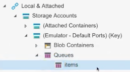
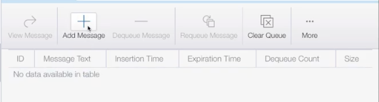

A message queue is a software component that's used to handle messaging between processes, threads, or applications. A queue can store a message, and _workers_ can fetch the message when it's a good time. 

In the cloud, message queues can generate events with a payload. A service like Azure Functions can listen to such a message and run its code when a message is published.

## Work with message queues

For an Azure function to be able to consume a message from a message queue, it needs a trigger and possibly a binding.

An Azure function needs to listen to a specific queue so that its code is triggered when a new message is published on that queue. To set up a trigger, you need to provide the proper credentials so the trigger code knows how to connect to the message queue. You create an entry in the _function.json_ file for the function that's listening to the queue. In the `bindings` element, specify these properties on an entry:

| Property   |Value  |
|------------|---------|
| `name`       | A name that you can refer to in code |
| `type `      | `queueTrigger` |
| `direction`  | `in` |
| `queueName`  | What the queue is called
| `connection` | A configuration variable in _local.settings.json_ |

An example entry can be defined like this:

```json
{
    "name": "myQueueItem",
    "type": "queueTrigger",
    "direction": "in",
    "queueName": "messages-incoming",
    "connection": "AzureWebJobsStorage"
  }
```

If this queue lives on a storage account, the `AzureWebJobsStorage` value is the value of the connection string.

You don't strictly need a binding when consuming a message from a queue. However, if you want to write to a queue, you need an output binding. With such a binding, you get a reference to the intended queue.

> [!NOTE]
> Currently, only output bindings are supported for queues.

## Develop locally

As a developer, you want short feedback cycles. You also want to ensure that your developer experience is as close as possible to a production environment. A way to attain both of these objectives is by using a queue emulator. 

A queue emulator allows you to simulate real queue messages that your Azure function will respond to. To use the emulator:

1. Install the emulator. Search for **Azurite** in Visual Studio Code or [download the Azurite extension](https://marketplace.visualstudio.com/items?itemName=Azurite.azurite&azure-portal=true).
1. To use the emulator functionality, start it by selecting **Azure: Start Queue Service** on the command palette. 

   Running this command starts a listener called Azure Storage Explorer that another application can pick up on. Storage Explorer is a client application that lets you browse through your cloud resources and use emulator functionality.
1. [Download Azure Storage Explorer](https://azure.microsoft.com/features/storage-explorer/?azure-portal=true). Then open the application, and you'll see the following indication that the emulator is working:

   

1. Create a queue on the emulator. You'll use this queue as part of configuring the function endpoint. By right-clicking the queue element, you can create a new queue.

1. To ensure that your Functions app uses the emulator, you need to set the connection string correctly. Open _local.settings.json_, locate the `AzureWebJobsStorage` element, and give it the value `"UseDevelopmentStorage=true"`.

   > [!NOTE]
   > Remember to set this property differently as you move to the cloud. It should point to an actual resource on Azure when in production.

## Build the function

You now have a local emulator set up, and it has a queue on it. You've also configured your project to point to the local emulator. Now you need to create a function to handle a queue trigger.

### Create a function endpoint

You're ready to create a function that can handle incoming queue messages. Create a folder for your function and name it, for example, `queueTrigger`. Then create a _function.json_ file and give it the following content:

```json
{
  "bindings": [{
    "name" "queueItem",
    "type": "queueTrigger",
    "direction": "in",
    "queueName" : "items",
    "connection": "AzureWebJobsStorage"
  }]
}
```

The value of the `name` element is important, because you'll refer to it later in your code to parse incoming data from the queue. It needs to be of type `queueTrigger` so that the queue triggers it when there's a new message. 

The `queueName` element uniquely identifies which queue you're interacting with. Whatever you enter here needs to match what you call the queue in the emulator or what you later call your actual queue in Azure. 

The `connection` element points to the value of the `AzureWebJobsStorage` element in _local.settings.json_.

## Handle a queue message

To handle an incoming queue message, you need to write code that can parse out the message that you need. At that point, you can decide what to do next. For example, you might start a web request, put that message on another queue, or send the message to a database.

### Set up a route

You need a route to handle incoming requests. Azure Functions will handle requests to a queue at the root. When you set up a route as follows, your request will be invoked as `http://localhost:<port>/queueTrigger`:

   ```go
   http.HandleFunc("/queueTrigger", handleQueueTrigger)
   ```

### Decode a request

When the queue message is sent to you, it has this shape:

```json
{
  "Data": {
    "queueItem": "your message"
  },
  "Metadata": {
    "DequeueCount": 1,
    "ExpirationTime": "2019-10-16T17:58:31+00:00",
    "Id": "800ae4b3-bdd2-4c08-badd-f08e5a34b865",
    "InsertionTime": "2019-10-09T17:58:31+00:00",
    "NextVisibleTime": "2019-10-09T18:08:32+00:00",
    "PopReceipt": "AgAAAAMAAAAAAAAAAgtnj8x+1QE=",
    "sys": {
      "MethodName": "QueueTrigger",
      "UtcNow": "2019-10-09T17:58:32.2205399Z",
      "RandGuid": "24ad4c06-24ad-4e5b-8294-3da9714877e9"
    }
  }
}
```

As part of decoding that incoming request, you need a helper structure that models the preceding message. It should look like this:

```go
type InvokeRequest {
   Data map[string]json.RawMessage
   Metadata map[string]interface{}
}
```

Start writing code to take that incoming request and decode it:

```go
func handleQueueTrigger(w http.ResponseWrite, r *http.Request) {
   var invokeRequest InvokeRequest
   d := json.NewDecoder(r.Body)
   d.Decode(&invokeRequest)
}
```

Now you're at a point where the request has been decoded, but you need to parse out the queue message itself.

### Parse a queue message

After the request is decoded, your queue message can be retrieved from the request on the `Data` property. You also need to refer to the message by the `name` property value that you set up in the _function.json_ file. The code for retrieving the message is a one-liner like this:

```go
invokeRequest.Data["queueItem"]
```

Because you need to be able to read this message in clear text, you'll use a JSON library and parse it. The JSON library will use an `Unmarshal()` method that takes two parameters: the message to be parsed and the variable to place the parsed message on. So your code needs to look like this:

```go
var parsedMessage string
json.Unmarshal(invokeRequest.Data["queueItem"], &parsedMessage)
```

At this point, `parsedMessage` contains your message. If you want to print it to the console, use the following code:

```go
fmt.Println(parsedMessage) // your message
```

> [!NOTE]
> If your message is something more advanced than a string, then `parsedMessage` needs to have a structure that matches the shape of what `queueMessage` is pointing to.

## Trigger a message

To test your application, you can use Azure Storage Explorer. On the right pane of the tool, select the **Add Message** button to create a message on the queue.



If you have your Functions app and it's running at this point, it will trigger the binding and your code will be invoked.
