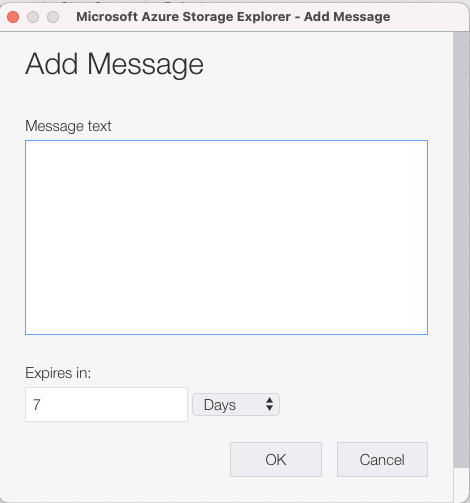
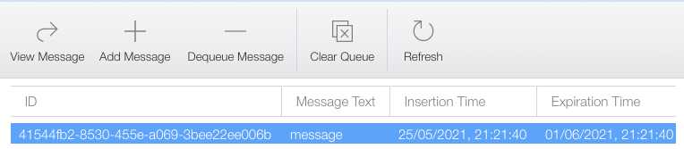

In this exercise, you'll extend your application with a route that can trigger on a message in a message queue.

> [!NOTE]
> Before you start this exercise, make sure that you've [downloaded the Azurite extension](https://marketplace.visualstudio.com/items?itemName=Azurite.azurite&azure-portal=true), [downloaded Azure Storage Explorer](https://azure.microsoft.com/features/storage-explorer/?azure-portal=true), and [downloaded Azure Functions Core Tools](/azure/azure-functions/functions-run-local?tabs=macos%2Ccsharp%2Cbash#v2&azure-portal=true).

## Scaffold the app

For this exercise, we'll start on a new Azure Functions app. Create a new directory and place yourself in it.

1. Select **View** > **Command Palette**.
1. Select **Azure Functions: Create New Project**.
1. Select a folder, usually your current folder.
1. In **Select a language**, select **Custom Handler**.
1. In **Select a template for your first function**, select **HttpTrigger**.
1. Give the app a name, such as **queueTrigger**.
1. Select an authorization level of **anonymous**. You can change that later if you want.

1. At the root, create a file named _server.go_. Your project should now have the following files:

   ```output
   queueTrigger/
     function.json
   .funcignore
   .gitignore
   host.json
   local.settings.json
   proxies.json
   server.go 
   ```

1. Go to the _function.json_ file in the `queueTrigger` directory. Find the first binding entry in the `type` element:

   ```json
   {
      "authLevel": "anonymous",
      "type": "httpTrigger",
      "direction": "in",
      "name": "req",
      "methods": [
        "get",
        "post"
      ]
    }
   ```

   Change that binding entry to this configuration:

   ```json
   {
      "name": "queueItem",
      "type": "queueTrigger",
      "direction": "in",
      "queueName" : "items",
      "connection": "AzureWebJobsStorage"
   }
   ```

   In this step, you set the `name` property. You'll refer to it later in code. You also changed the trigger type to `queueTrigger`, which makes it possible to listen to queue messages. 
   
   The `queueName` value points out a specific queue. When you run the emulator later, you'll create a queue with such a name. 
   
   Finally, you pointed out a variable in _local.settings.json_ that will contain the connection string to the queue.

## Create the app

At this point, you have an app skeleton. You're now ready to add code that can handle incoming queue messages.

1. Open the _server.go_ file and add the following code:

   ```go
   package main

   import (
     "encoding/json",
     "fmt"
     "io/ioutil"
     "log"
     "net/http"
     "os"
   )

   func queueHandler(w http.ResponseWriter, r *http.Request) {
   }

   func main() {
     customHandlerPort, exists := os.LookupEnv("FUNCTIONS_CUSTOMHANDLER_PORT")
     if !exists {
       customHandlerPort = "8080"
     }
     mux := http.NewServeMux()
     mux.HandleFunc("/queueTrigger", queueHandler)
     fmt.Println("Go server Listening on: ", customHandlerPort)
     log.Fatal(http.ListenAndServe(":"+customHandlerPort, mux))
   }
   ```

   You now have a route set up at `/queueTrigger`. 

1. Find the import section and add the following structs under it:

   ```go
   type InvokeRequest struct {
     Data     map[string]json.RawMessage
     Metadata map[string]interface{}
   }
   ```

1. Find the `queueHandler()` method and add update it in the following way:

   ```go
   func queueHandler(w http.ResponseWriter, r *http.Request) {
     var invokeRequest InvokeRequest

     d := json.NewDecoder(r.Body)
     d.Decode(&invokeRequest)

     var reqData map[string]interface{}
     json.Unmarshal(invokeRequest.Data["queueItem"], &reqData)
   }
   ```

   The code first reads the body from incoming response stream and decodes it:

   ```go
   var invokeRequest InvokeRequest

   d := json.NewDecoder(r.Body)
   d.Decode(&invokeRequest)
   ```

   Then the message itself is dug out with a call to `Unmarshal()`:

   ```go
   var parsedMessage string
   json.Unmarshal(invokeRequest.Data["queueItem"], &parsedMessage)
   ```

   Now that you have the message, let's print it out.

1. Add the following code:

   ```go
   fmt.Println(parsedMessage) // your message
   ```

   Your code is now all written, but you need to configure your project so you can test it.

1. In the _host.json_ file, find the `defaultExecutablePath` element and give it a value of `./server`.

   > [!NOTE]
   > For Windows, you would use a value of `.\server.exe`. 

1. Build the _server.go_ file by running `go build` at the project root:

   ```bash
   go build server.go
   ```

## Configure the environment

The next step is to configure your environment. Because you're developing locally, you need to set it up so that you can talk to an emulated message queue.

1. In the _local.settings.json_ file, find an element in `Values` called `AzureWebJobsStorage` (or add it if it's missing). Give it the value `UseDevelopmentStorage=true`. Your JSON entry should look like this:

   ```json
   "AzureWebJobsStorage" : "UseDevelopmentStorage=true"
   ```

1. Start the Azurite extension by opening the command palette (**View** > **Command Palette**) and then selecting **Azurite: Start Queue Service**.

   > [!NOTE]
   > This step will create some local files in your project.

1. Open Azure Storage Explorer. On the left side, the contents of the emulator are visible.

1. Right-click the **Queues** node and select the option to create a new queue. Give it the name **items**.

   

   > [!NOTE]
   > You can name the queue what you want. However, you're about to configure your _function.json_ file. Whatever you name the queue here needs to go into _function.json_.

1. Locate _function.json_ under the `queueTrigger` directory. Ensure that the `bindings` array has the following entry:

    ```json
    {
       "name": "queueItem",
       "type": "queueTrigger",
       "direction": "in",
       "queueName" : "items",
       "connection": "AzureWebJobsStorage"
     }
    ```

    The `queueName` property has the same name as the queue that you created in Azure Storage Explorer. The `connection` property points to the value that you set up in _local.settings.json_. 
    
    The `name` property has the value `queueItem`. Your Go code uses this value to parse out the queue message.

## Run the app

At this point, everything is set up. All you need to do is run the app, start Azure Storage Explorer, and create a queue message. Your code should be able to consume that message.

1. From a terminal, run the `func start` command in the project root:

   ```bash
   func start
   ```

1. In Visual Studio Code, open the command palette and run **Azurite: Start Queue Service**.

1. Start Azure Storage Explorer, if it's not already started.
1. In Azure Storage Explorer, select **Add Message**:

   

1. In the dialog that appears, enter **message** and select **OK**. You now see the details of the message that you created.

   

1. In Visual Studio Code, your function should now be running. In the terminal, you should now see **message** printed as the last row.

   Your function was able to consume the queue message and write out its content.

Congratulations! You built an Azure function in Go that can trigger on a queue message. You also parsed that message. 

What you do with an incoming message is up to you. For example, you can store it in a database or maybe send it as the payload in a web request.
