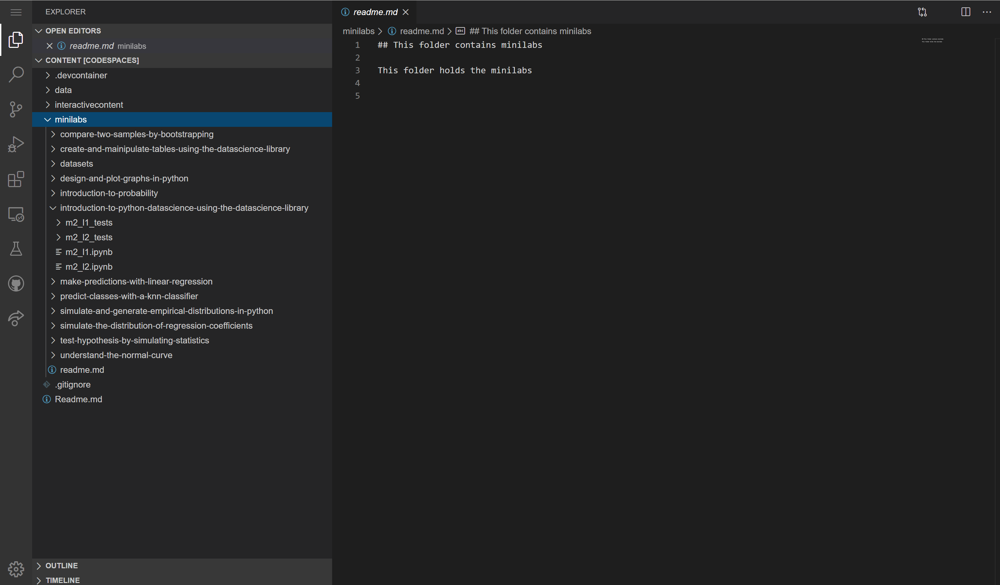

> [!NOTE]
> You'll need to set up your Online Visual Studio Codespaces environment to access and interact with these mini labs. You can find instructions in the setup unit at the beginning of the module.

For convenience, you can launch your VS Codespaces environment by clicking the link below:

Open [Visual Studio Codespaces](https://online.visualstudio.com/environments)

In your online Visual Studio Codespaces environment, you'll find "mini lab" Jupyter notebooks. These labs let you apply the concepts that you've learned from this module. You can code your solutions in the notebook directly and receive real-time feedback from our autograder by running the corresponding grader cells.

To access the mini labs for this module, you'll need to:

- Launch your Online Visual Studio Codespaces Environment
- Open your Workspace and click the "minilabs" directory
- Click the corresponding module directory and you should see all the mini labs available for this module

Here is what the mini-lab should look like in your virtual environment:

