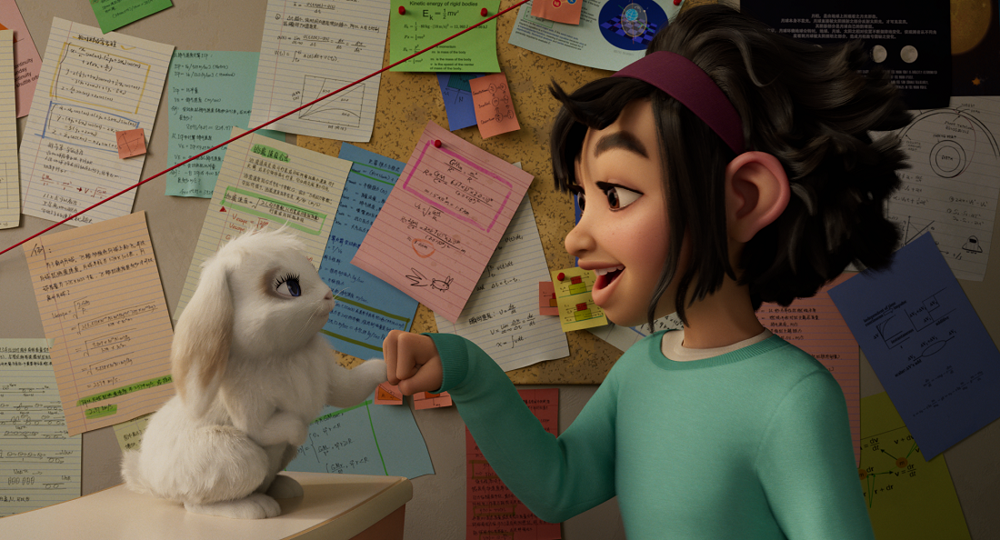

Resourceful and Creative. Fei Fei, from the new movie [Over the Moon](https://www.netflix.com/title/80214236), exhibits resourcefulness and creativity as she seeks to help her father remember the story of Chang'e and everlasting true love. In the film, Fei Fei uses her STEM skills, determination, and passion to fly to the Moon, and it's her friends, and the love they have for her, that helps her get home. 

While Fei Fei didn't jump into AI during her journey to the moon, her dedication was certainly inspired by wanting to help people, in particular, her family. As she struggles to make sense of love, life, and the legends she heard as a child, she creates a way to address her problems head on, with the help of her buddy Bungee of course.

In this module, you will choose an animal, could be your pet, and you will train a custom vision AI to be able to identify your pet in an image. All without needing to know how to code!

Remember, while you can use technical skills to build almost anything, the ultimate goal should always be to help people. Designing technology to help people is something Microsoft is passionate about, *especially* when it applies to artificial intelligence. We focus on [AI for Good](https://www.microsoft.com/en-us/ai/ai-for-good) and want to encourage you to start your AI journey always thinking about how you can help improve our world.

This module is a part of a multi-modal approach to learning, meaning you can also follow along with a video tutorial on the [Learn with Dr G Learn TV video series](https://aka.ms/LearnWithDrG).

## Learning Objectives

In this module, you will learn how to: 

- Create a good dataset of images for training AIs 
- Train a custom vision AI on a particular animal
- Test the model you trained
- Ensure ethical practices throughout AI development

## Prerequisites

None