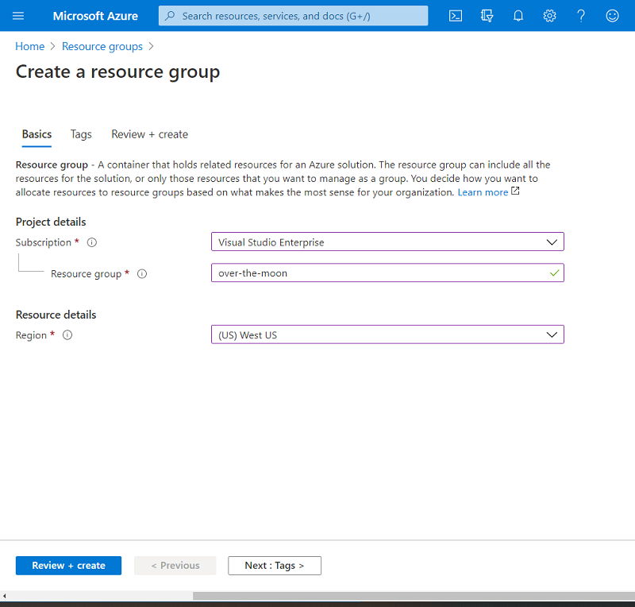
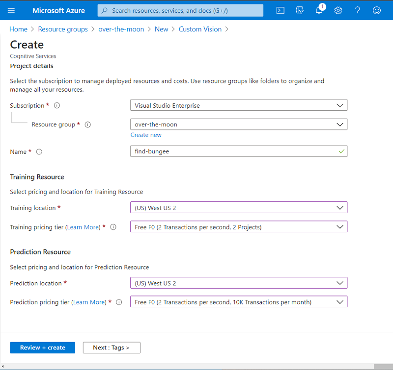
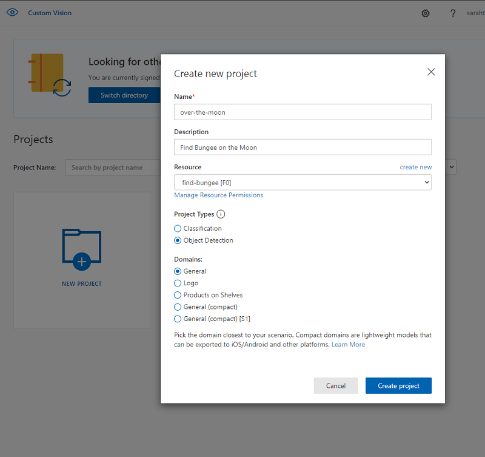
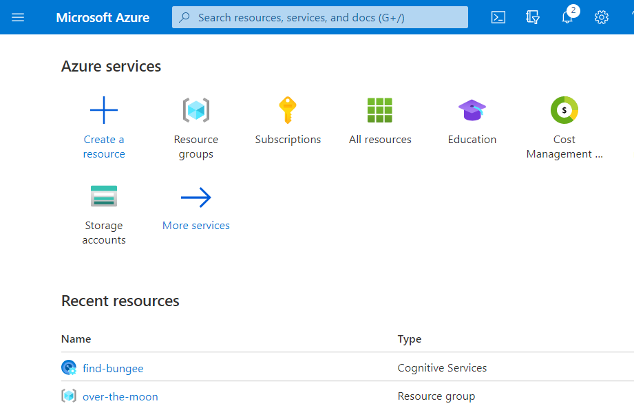
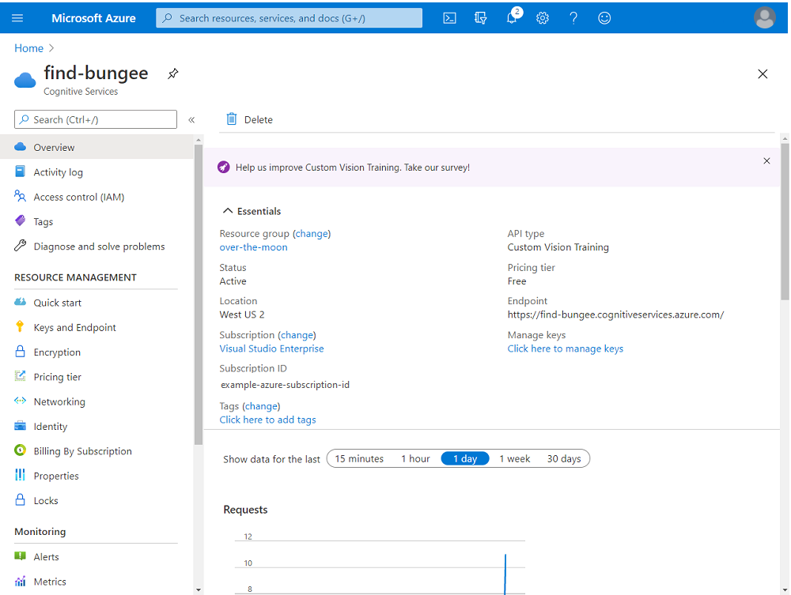
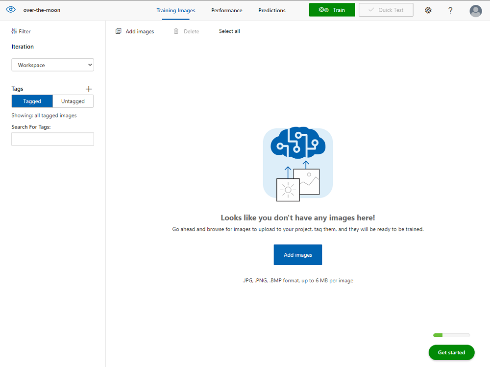

In this module, you're going to use [Azure Custom Vision](https://azure.microsoft.com/services/cognitive-services/computer-vision/), part of the Cognitive Services suite, to detect your favorite animal in an image. Before we jump into training AI, we need to setup our work environment. In this case, your work environment will be all in the browser on Azure!

## Sign up for Azure

To use Azure Custom Vision, you will need an Azure account. But don't worry! This is a quick process and there free trials you can use to try it out! If you get stuck at any point, be sure to check out the [Create an Azure account](https://docs.microsoft.com/learn/modules/create-an-azure-account/) Learn module, which also gives an overview of Azure pricing.

If you haven't used Azure before, you can sign up for a [free trial](https://azure.microsoft.com/free/) which gives you free services (including Custom Vision) and a free credit to use some paid services in the first month!

If you are a student, you can sign up for a [student free trial of Azure](https://azure.microsoft.com/free/students/) *without* having to put in a credit card. Similar to the regular free trial, this gives you free services and a free credit to use in the first *year*!

## Create your Resource Group

The best way to experiment with Azure is to create a resource group that will be easy to keep track of. Resource groups are basically ways of connecting services that you are using together. If you create a resource group for this module, then when you're done you can delete the entire resource group and ensure you don't accidentally leave an AI running and get charged.

To get started creating a resource group, follow these steps:
1. Go to [https://portal.azure.com/](https://portal.azure.com/)
2. Sign in to Azure if you're not signed in already
3. In the top search bar, search for "Resource Group"
4. Click Add
5. Choose your subscription, give the resource group a name, and choose the region closest to you
6. Click Review + create
7. Click Create

You can go to your resource group now. If you ever lose your resource group, you can find it by searching "Resource Group" in the top search bar again and then click on the resource group.

## Create your Custom Vision Resource

The only resource you will need for this module is a Custom Vision resource. Azure has made it easy to get everything you need to use Custom Vision AI. By just creating this one resource you will be able to upload images, train your image classification model, and test the model without having to write a single line of code! And don't worry, if you don't know what training and testing a model means, we will get into that in the next unit!

To create a Custom Vision resource, follow these steps:
1. From your "over-the-moon" resource group, click Add
2. Search for "Custom Vision"
3. Click Create 
4. Choose your subscription, give your resource a name, choose the region closest to you for both training and predicting, and choose the free tier for both training and predicting
5. Click Review + create
6. Click Create

When deployment is done, click Go to resource. 

If you ever lose your Custom Vision resource, you can find it by searching "Resource Group" int he top search bar, clicking on the resource group, and clicking on the Custom Vision resource. 

## Creating a Project on the Custom Vision Portal

Now that you have the Azure resources to run the Artificial Intelligence, we can create a project on the Custom Vision Portal. Head to [https://www.customvision.ai/](https://www.customvision.ai/) and sign in with your same Azure credentials. If this is your first time visiting, you may have to accept the Terms of Service.

To get started with your project, follow these steps:
1. Click New Project
3. Give your project a name and description
4. Ensure the Custom Vision resource that you made earlier is selected
5. Choose Object Detection for the Project Type
6. Choose General for the Domain
7. Click Create project

## Review Setup

Let's review everything we just did, because while it only felt like a few clicks to us, we have a low of powerful computers working for us right now!

Here is everything we have encountered:

### The Azure Portal

Azure is a cloud service - basically giving you compute power to run code in a secure place *not* on your computer. 

What we are doing for this module is really just a tiny portion of what Azure can do for you. If you're interested in learning more about what Azure can do for you, you can check our Azure on Microsoft Learn, there are a lot of [modules on Cognitive Services](https://docs.microsoft.com/en-us/learn/browse/?expanded=azure&products=azure-cognitive-services)!

### Custom Vision Resource

[Custom Vision on Azure](https://docs.microsoft.com/en-us/azure/cognitive-services/custom-vision-service/) is even more powerful than the bit we are going to explore in this module. If you open the resource in Azure:

You can see there are a number of resources in the menu on the left that start to hint at the complexity of the service that will be working for you as you train your AI. In this module we will stay in the Custom Vision Portal, which is basically just a front page to this resource. 

Everything that you do over in the Custom Vision Portal will be using the compute resources that you provisioned here in the Custom Vision Resource in Azure. Custom Vision also has an SDK, and just like the Portal, the calls to the SDK would be using what was provisioned on Azure as part of this resource.

If you get inspired by this module, we encourage you to check out the other [Microsoft Learn modules we have on Custom Vision](https://docs.microsoft.com/en-us/learn/browse/?expanded=azure&terms=custom%20vision).

### Custom Vision Portal

The Custom Vision Portal is basically a user interface that allows us to interact with the Custom Vision Resource without having to write code. Everything we do here gets broken down into lines of code that you could do without this interface.

When we created the project in the Custom Vision portal we were able to choose one of two classification types: Classification and Object Detection. The biggest difference is that Classification will classify an entire image and Object Detection will identify the location of a particular object from within images. For this project, we wanted Object Detection because we want to identify Bungee in images from the film. 