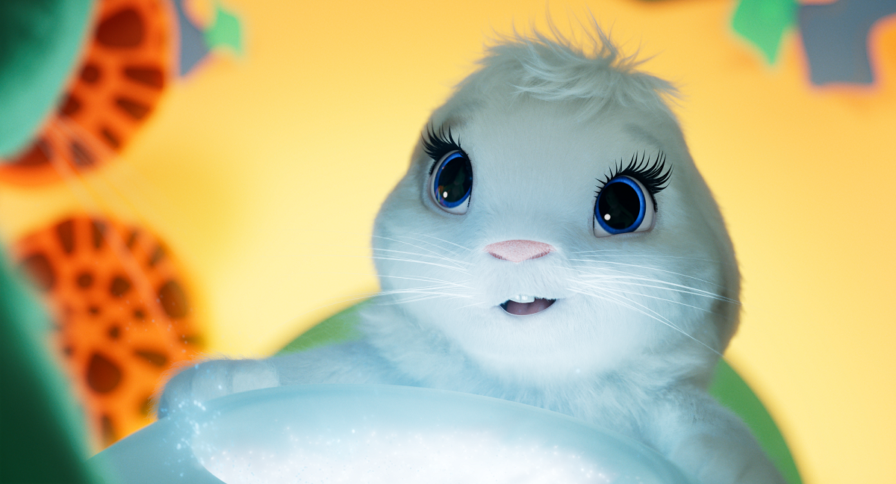
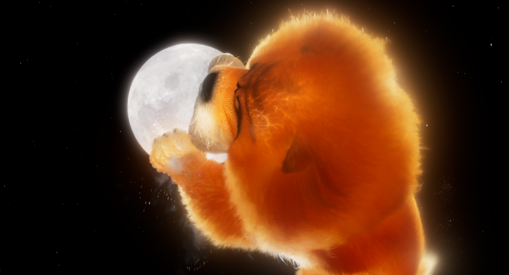

Now that you have your project ready, we should go through an overview of what we're about to do. Artificial Intelligence (AI) is exactly that - artificial. AI is basically simulated intelligence using **A LOT** of data to back it. 

Specifically looking at the Object Detection of Custom Vision AI we can break this down into two very simple steps:
1. You tell the AI where in an image an object is
2. You give the AI a picture with the object in it and it tells you where the object is

Sounds simple enough, but how does the AI know how to do that?

## Image Recognition: Color

While going into the depths of how AIs are built is beyond the scope of this module, we can start to understand how they work. Computers rely on what can be converted to data - more specifically numbers. You could imagine a computer that, when shown an image, can basically go through each pixel and tell you what color is in each location. This computer wouldn't be "intelligent", but it would be able to tell you the color of each pixel as it goes through.

Now imagine that the computer is a little smarter, and can identify the primary color that shows up in an image. With this, we can already start "teaching" (called training in AI) the computer to identify images. For example, if I showed the computer this picture of Bungee:

The computer would probably understand that pictures that are mostly white and yellow are pictures of Bungee. But then, what if we showed the computer this picture of Chang'e?

That picture also has a lot of white and yellow...so the computer would probably that that is a picture of Bungee too. 

And what if we showed the computer this picture of Bungee next to the night sky?

There is white, but no yellow at all, so the computer would probably think this is NOT a picture of Bungee.

## Image Recognition: Shape

To account for images of different objects with similar colors, or images of the same object with different colors, we've evolved AI algorithms to start to recognize lines and shapes. You can start to imagine how this was done in the beginning of AI development. A line or shape can be described as the shift in color. 

So rather than only keeping track of aggregate colors in an image, the computer would start to also take into account the position of where those colors are. If the same color is next to each other, they probably are creating a line or shape. 

This kind of analysis can be useful, for example, if we start to identify pictures of the Moon. Now we can say that a Moon is in a picture if there is a white circle, typically against a blue or black background, like this:

And if we were to show the computer this picture:

The computer would probably still recognize it because there is still a distinct white circle against a blue or black background. 

However, the computer would probably not be able to recognize this as a picture of the Moon:

Beucase it is not a complete white circle. 

## Image Recognition: Advanced AI

As you can see, the progression of artificial intelligence, specifically around image recognition, started out very simple and got more complex as more people started investing in ways to help computers figure out what they were seeing. In todays' world, and the AI that drives Azure's Custom Vision resource, image recognition takes into account a lot more than just color or shape. AIs have been trained on thousands and millions of images. They can detect subtle difference between cats and dogs, which might seem obvious to a human, but if a computer were to look at two same-sized, four-legged, brown shapes that had tails and ears...you can start to see how it's impressive that the features of a cat can be differentiated from the features of a dog. 

## Training on Specific Images

While advanced AIs are able to detect a lot of common objects (dogs vs cats, cars vs bikes, etc) work still does need to be done if you want to train an AI to recognize a *specific* object, say a specific character from a specific movie like Bungee.

That's where the Custom Vision service comes into play. This service has an AI in the background that already has some knowledge of the world, but it knows *nothing* about Bungee (or your pet). So what we're going to do is provide a lot of pictures of Bungee and tell the AI that they are Bungee. Each image that we give of Bungee gives the AI more data of characteristics that represent Bungee specifically. The more pictures of Bungee, from different angles, lighting, sizes, etc, the better the AI will become at recognizing her from within a larger image.

This is called "training" the AI. 

Next, we will test our AI to see if it was trained well. We do this by giving it images that contain Bungee that it has *never* seen before. It's *critical* that you test with pictures that the AI *hasn't* used to train, because otherwise you aren't actually testing it's ability to recognize Bungee, you're just recognizing it's ability to remember it saw that exact picture. 

This is the "predicting" step of our project and is called "testing" the AI. 

Once you have validated that the predicting of the AI is accurate enough, you can deploy your AI so that others could use it to identify objects using phones or computers! That is beyond this module, but something you should definitely try out!

NOTE: Remember when we created the Custom Vision Project in the Custom Vision Portal and it asked us what region we wanted for training and for predicting separately? That's because you might be training your AI from your house in Seattle, Washington, so you would want to use Cloud resources that are close to you so that it's fast. But you might be deploying this to your mother who lives in London, and you want her to get the predictions *fast* so you would want to use Cloud resources closer to her for predictions!