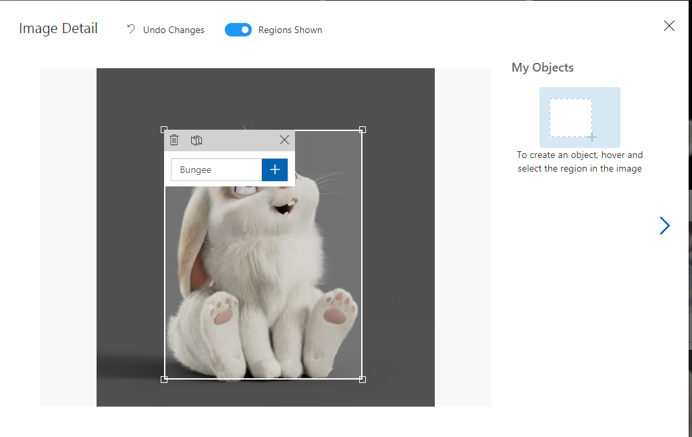
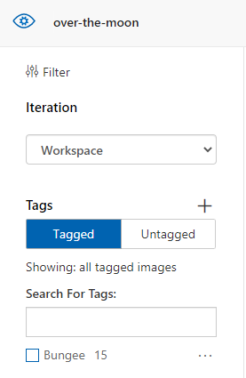

Now it's time to upload your images and train the Custom Vision service!

Make sure you have about 30 images of your object that you want to use for training, that you're signed in to the [Custom Vision Portal](https://www.customvision.ai/) and on your project page.

## Upload Your Images

For Bungee, we're going to start by uploading 15 images and see how well the Custom Vision AI can be trained on those. The images we're starting with are ones that just have Bungee but from a lot of different angles and lighting. 

To get started training your AI, follow these steps:
1. Click on Add Images
2. Choose the images that you want to use to train the AI
3. Click Upload X files - where X is the number of images you selected
4. Wait for your images to be uploaded
5. Click Done

Now you should see all of your images added into the Custom Vision Portal. 

## Tag Your Images

Now you need to tag your images. Click on one image and a window will expand with the image inside of it. Click on the image and a box will appear around the object. You can see AI already starting to work a bit here, identifying those lines and shapes we talked about in an earlier unit. Adjust the box so that it fits exactly your object. Part of the success of the AI will be how much of the box it identifies as the object, so stick to the prominate features (e.g. don't make the box super wide just because there are a few hairs outside of it).

Add the tag for your object, click the '+' icon, and then move to the next image. Tag each of the images that you uploaded.

NOTE: Notice that you can tag more than one object in each image. So if you wanted to tag multiple objects, you could do that all in one step!

Once you're dont tagging all of the images, you should see them all in the Tagged area of your project:

## Training on Your Tagged Images

Once you feel you have enough images tagged, you can click "Train" in the top right of the portal. Choose "Quick Training" for the training type for this first iteration. If you want to do Advanced Training later, you can try that out. 

You should see your first training iteration happening. Here you will also find two sliders to allow you to have more control over the training and predictions of the AI:

### Probability Threshold 

Each time the AI makes a prediction, it also provides a probability percentage. For example, it will say "I am 80% confident that this is Bungee". The probability threshold is the threshold that the confidence has to be at when training to determine if it accurately predicted. For example, if our probability threshold is 50% and the AI said that it was 45% sure the picture was Bungee and it *was* Bungee, that would not count as an accurate prediction. 

### Overlap Threshold

As you might have noticed when you were tagging your images, the AI will not only provide a percentage of confidence that the object is in image, but also a bounding box around where it thinks the object is within the photo. If this threshold is at 30%, for example, then at least 30% of the bounding box that the AI predicts contains the oibject has to be within the correct bounding box (that you created when you tagged the images).
