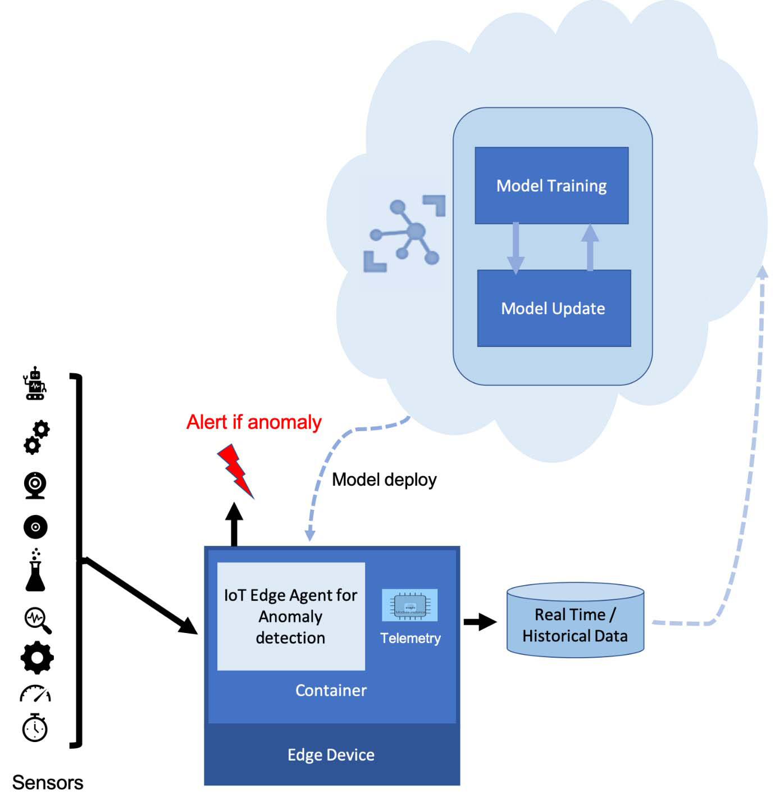

Deploying machine learning models in production presents many challenges. For instance, you need to manage dependencies across multiple environments. Each environment could also have a unique set of libraries and other resources specific to that environment. Furthermore, you may need to maintain multiple versions of models at a single time. To address these problems, you can train and deploy your models using containers – where all dependencies can be packaged in a separate container. Containers can be deployed to edge devices. Doing so allows you to work with a variety of hardware seamlessly. You can also manage your target deployment environment more effectively by using containers.  

Suppose you work as a data scientist and would like to deploy trained machine learning models in production. You're tasked to deploy a machine learning module to edge devices in a scalable way. The module should implement your business logic in an anomaly detection algorithm to an edge device. The algorithm should predict when the device fails based on simulated machine temperature data. Your algorithm should analyze the data generated by the device and label of the message is anomalous or not. You could implement this solution using a container strategy. You could train the anomaly detector in the cloud based on historical data and deploy the trained model as a container. The use of containers in this solution helps to deploy the algorithm on multiple target environments in a scalable manner.  

In this module, you'll develop a machine learning module and deploy it to a Linux device running Azure IoT Edge. Your solution will:

- Create an Azure Machine Learning module
- Push a module container to an Azure container registry
- Deploy an Azure Machine Learning module to your IoT Edge device
- View generated data

## Learning objectives

In this module, you will:
- Launch a module from Azure portal to IoT Edge using a container
- Generate simulated data from an edge device
- Verify data generated from the edge device

## Prerequisites

- Ability to use IoT Hub in Azure
- Ability to use Azure Cloud Shell
- Experience creating and managing resources using the Azure portal or Azure Cloud Shell at the beginner level
- IoT Hub
- IoT Edge device