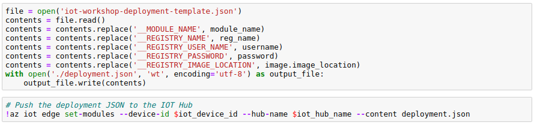

First step: 

1. Login https://notebooks.azure.com/home/projects
2. Press upload button
3. Enter Azure/ai-toolkit-iot-edge as GitHub Repository
   - You can give a memorable name to this repo but you could also use the same name
   - You can keep the repository private if you want.

4. Note that the process of importing could take some time  

5. After this stage, press run on free compute as below.

6. A new tab would be opened in the browser. Ensure that the notebook is running on free compute (as per the previous tab) to avoid charges.

7. Go to the new tab and you'll see the notebook is running with the project you just imported from the GitHub.

8. Now go to the folder **IoT Edge anomaly detection tutorial** and click on **00-anomaly-detection-tutorial.ipynb**. You'll run all the code cells step by step in the notebook. 

## Perform the following actions

**Specifying parameters**

**Loading azure iot extension**

**Login Azure**

**Setting the azure subscription**

**Checking SDK version**

**Creating machine learning workspace**

**Loading Azure ML workspace**

**Registering device to the IoT Hub**

**Getting the device connection string**

**Installing libraries**

**Loading and reading dataset**

**Loading features**

**Training the model**

**Evaluating the accuracy**

**Serializing and testing the model**

**Registering the model to the cloud**

**Writing iot_score.py file**

**Creating the docker image**

**Testing the model on Azure container Instance**

**Testing web service**

**Getting container details**

**Deploying container to the Edge device**

