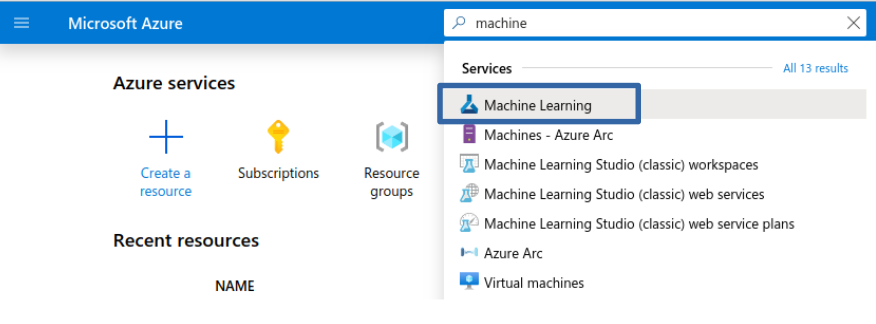
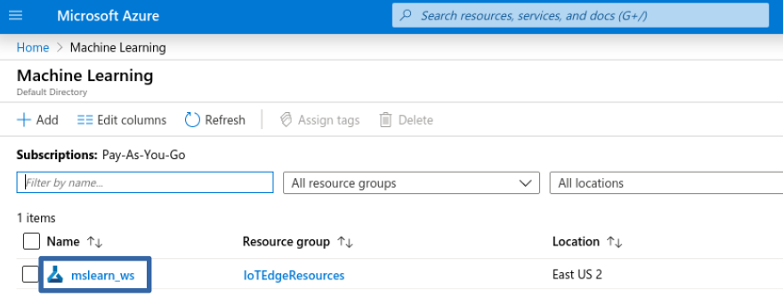
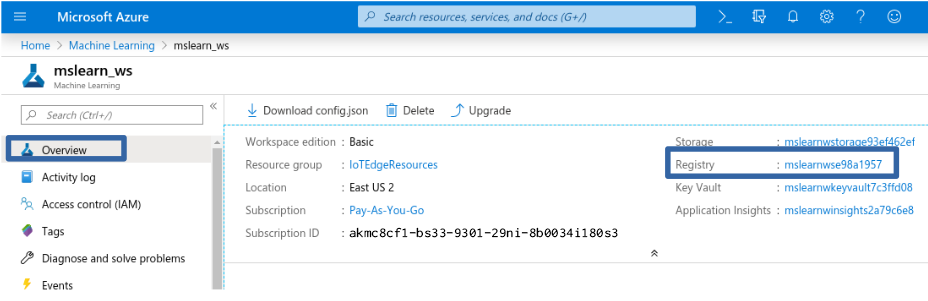
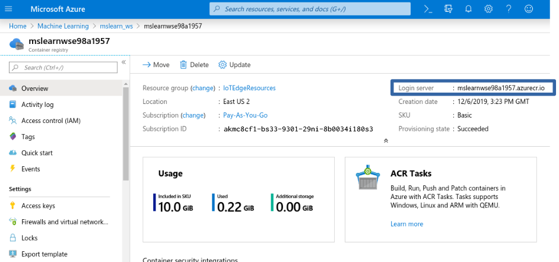
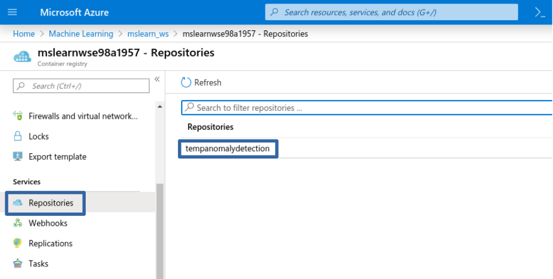
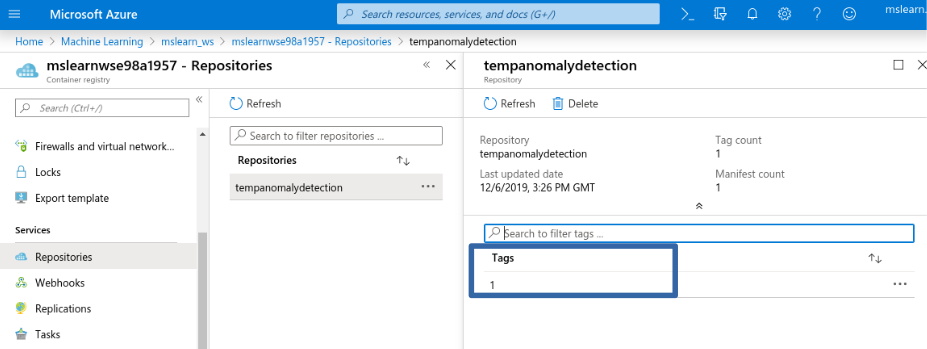
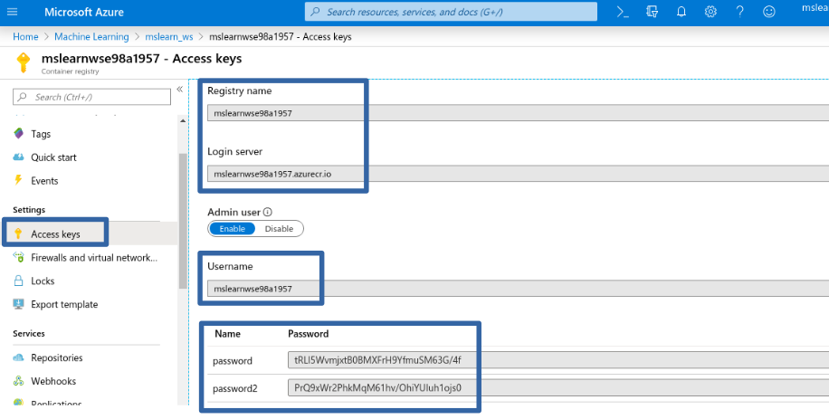

1. Go to Azure portal and navigate to machine learning workspace.

2. Click on machine learning then select your workspace you created in the notebook. 

3. When you click on the workspace, you will see **Overview** section of the ML workspace and you can see details of the workspace such as resource group, location, subscription ID, storage, registry, key vault, application insight.

4. Click on **Registry** value to get into container registry.

5. When you scroll down from the Overview section, you will see Services section and then select the **Repositories** in Services. You will see the **tempanomalydetection** repository that you created in the notebook.

6. Select tempanomalydetection. You will repository has one tag. Now that your full image path of the container in the format: **.azurecr.io/tempanomalydetection:1**. You can use the image path to deploy this container to IoT Edge devices.

7. When you scroll down from the **Overview** section, you will see **Settings** section. Select **Access Key.** 

   You will see a number of access credentials such as **Login server**, **Username**, **Password** for an admin user. These credentials can be included in the deployment manifest to give your IoT Edge device access to pull container images from the registry.

