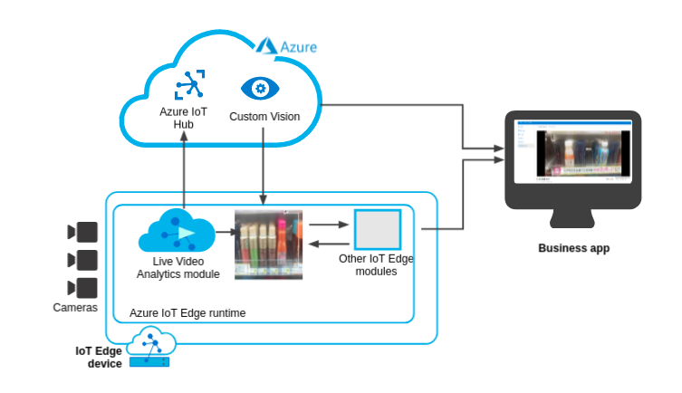

Live Video Analytics on IoT Edge is ideal for IoT solution developers looking to build capabilities such as capturing, processing, and analyzing live video from existing cameras to extract business insights in your IoT solution.

Suppose that you are responsible for building and developing solutions for retail customers. Your customer is a global retail market chain. Staffs at the stores currently perform manual inspections for restocking empty shelves. Your customer loses sales due to lack of availability (empty shelves) in retail stores. Hence, they want to implement a solution that involves real-time monitoring of a shelf using a camera.

You are interested in the use of video analytics with machine learning in retail stores. Your solution will capture the live video stream from cameras such as security cameras. Images from a video stream will be analyzed and processed to detect void spaces on the shelf with an acceptable confidence level. Hence your customer will get an alert if the shelf is empty and will be able to automate the process of manual inspection of shelves in a cost-effective manner. 

## Prerequisites
- An Azure subscription
- Ability to use Azure Cloud Shell
- Basic knowledge of Azure IoT Edge
- Basic knowledge of Custom Vision
- Basic knowledge of Live Video Analytics

## Learning objectives

In this module, you will:
- Use Live Video Analytics to build video analytics solution with Custom Vision
- Deploy a set of modules to an IoT Edge virtual machine using the installer
- Set up an application that uses the virtual device for rapid inference at the edge
- Deploy a solution that will enable you to watch images with defects through a web application
