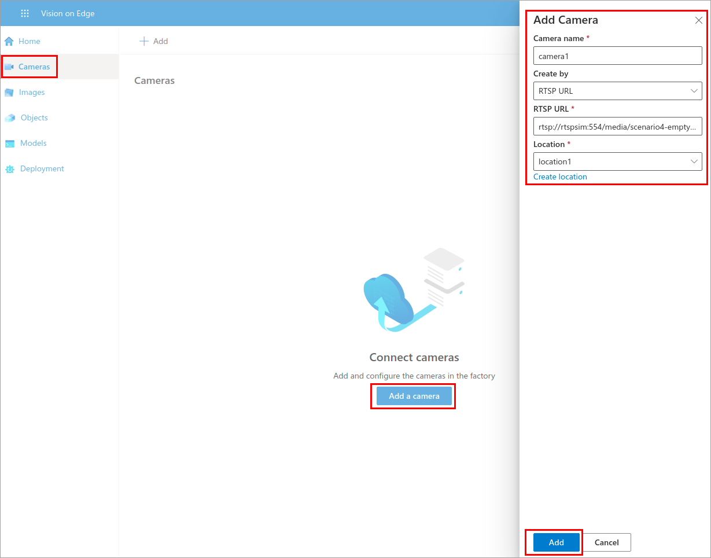
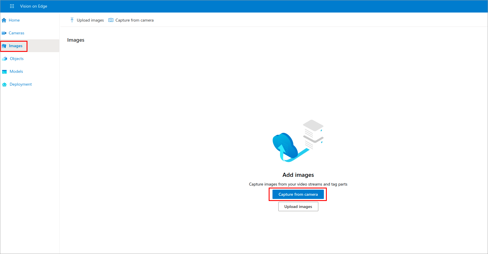
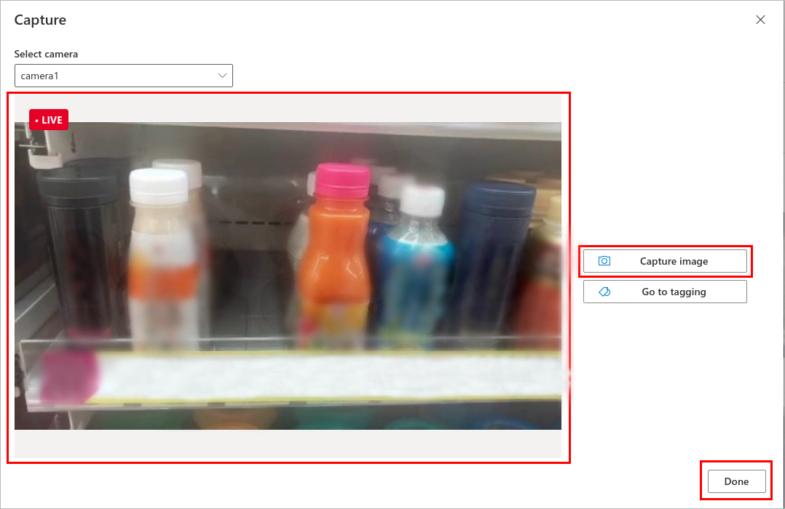
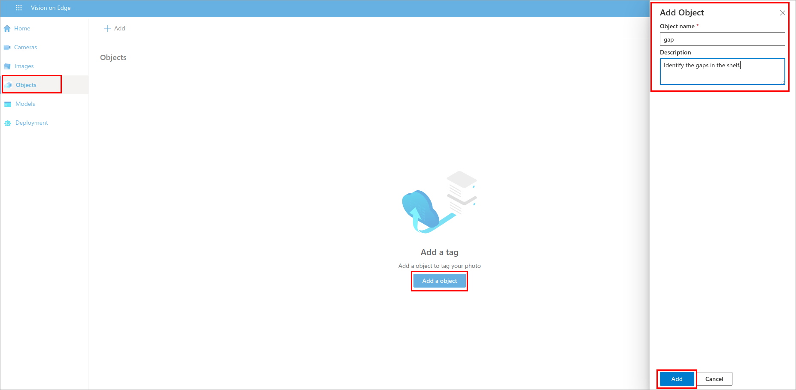
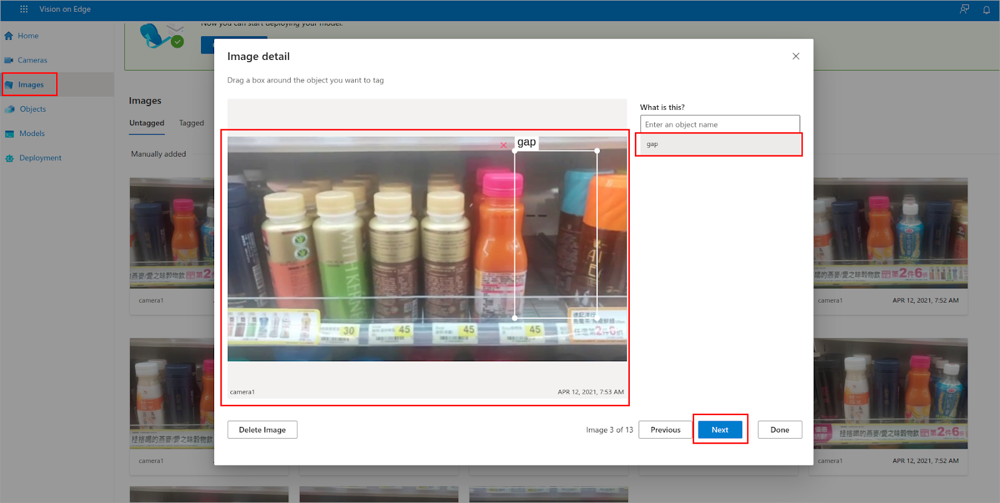
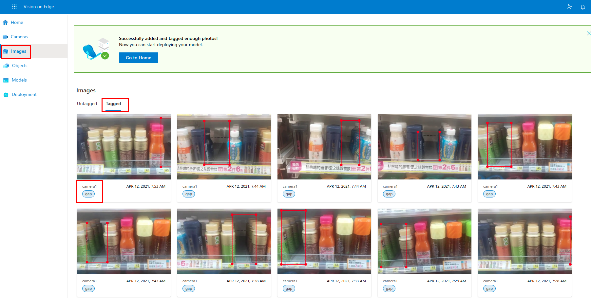
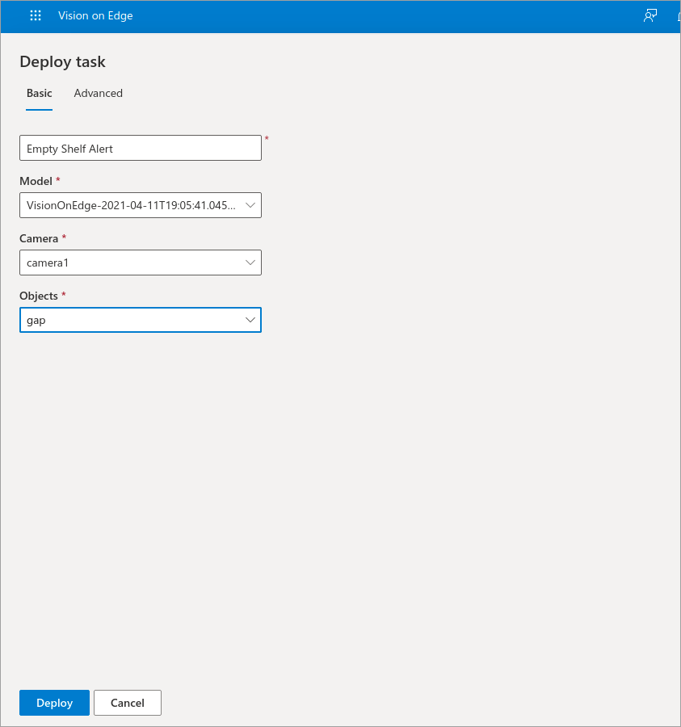

In this exercise, you'll connect to Vision on Edge solution through web application. Firstly, you'll add a camera that streams out the video. Then you'll capture images and tag objects. Finally, you'll deploy your solution, which will identify the gaps in the shelf.

## Add a camera

1. Open your browser, connect to **http://<replace_your_public_ip_address>:8181**. 

2. When you connect to Vision on Edge solution, click on **Home** page.

   

## Capture the images and tag objects

1. In this step, you'll manually capture your own images. To do that, firstly you'll add a camera.

2. Navigate to **Cameras** page and add a camera.

3. Fill the required information:

   - Camera name: Give a name to your camera
   - RTSP URL: Replace it with **rtsp://rtspsim:554/media/<replace_video_name>**
   - Location: Create a location or choose an existing one
   
   

4. To capture images from your video stream, navigate to the **Images** page and click on Capture from camera.

   

5. You'll see that the video will start to be displayed. When you see the gap on the shelf, capture the image. Continue adding more images to improve your model. It's recommended to capture at least 15 images. Click on **Done** when you finish.

      

6. Navigate to the **Objects** page and add an object to tag your image. In this example, we want to add a gap object.

   

7. Go back to **Images**. Click on one of the images and drag a box around the object(in this case, gap) you want to tag and select gap object. Repeat the same step for all images and click **Done** when you finish.

   

8. You'll see that all the images you captured are tagged with gap objects.

   

## Create a solution deployment

1. Navigate the **Deployment** page.

2. To deploy a task, fill the required information:

   - Give a name to your deployment
   - Choose Model
   - Select Camera
   - Select Objects

3. Click **Deploy**.

   

4. You'll see that the gaps will be identified in the video stream.
