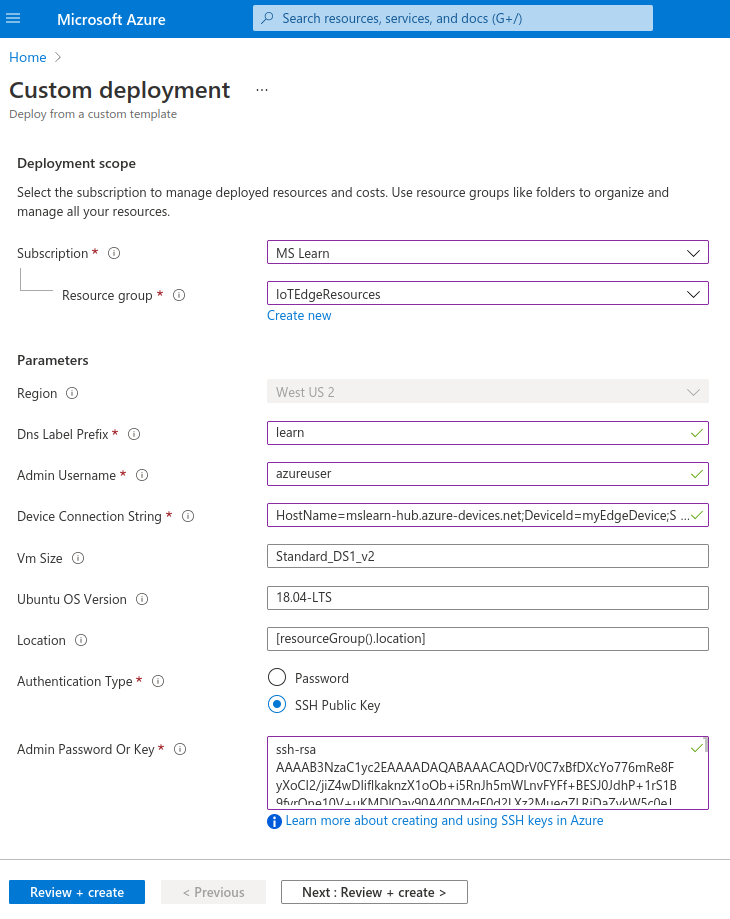
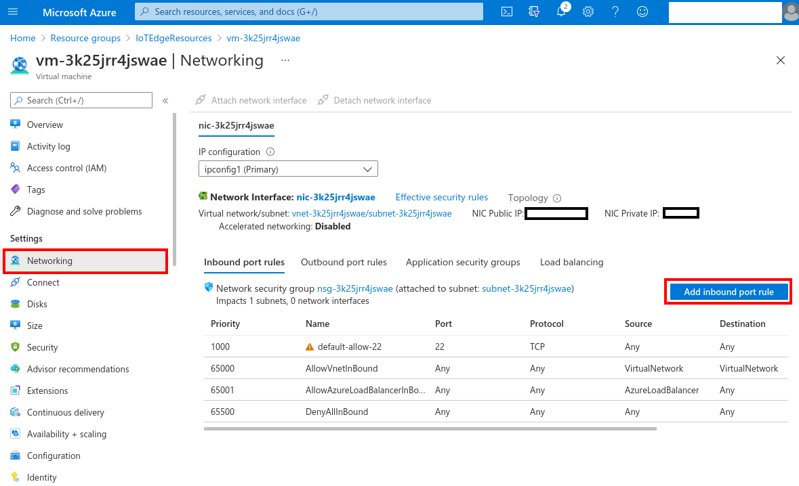
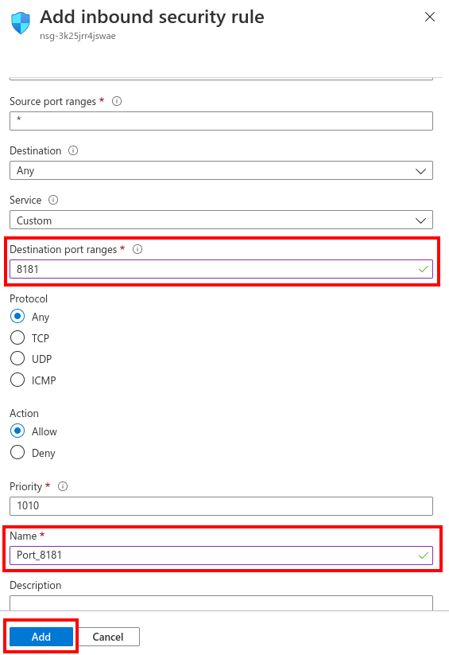
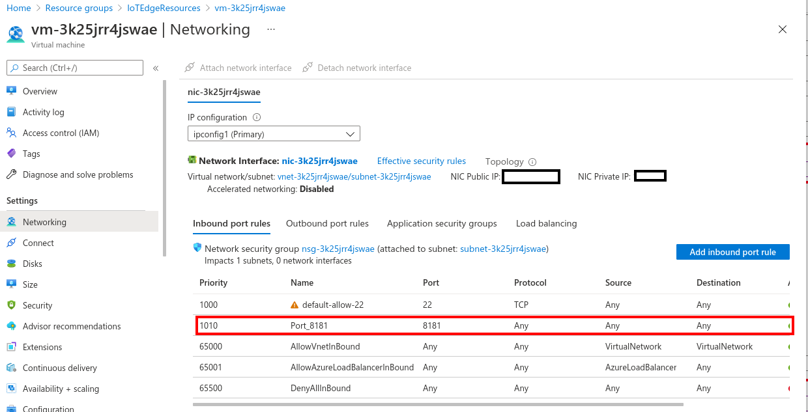

You'll perform the following steps in Azure Cloud Shell. Before you start, you need an Azure account for this learning module. If you don't have an Azure account, then create a free account. If you are a student, then sign up for a free [Azure for Students account](https://azure.microsoft.com/free/students/) (no credit card required). Otherwise, sign up for a free [Azure account](https://azure.microsoft.com/free/).

From your web browser, navigate to https://portal.azure.com and sign in.

## Create cloud resources

1. Add the Azure IoT extension to the Cloud Shell instance.

   ```
   az extension add --name azure-iot
   ```

   > [!NOTE]
   > This module uses the newest version of the Azure IoT extension, called `azure-iot`. You should only have one version installed at a time. You can use the command `az extension list` to validate the currently installed extensions. To remove the legacy version of the extension, use `az extension remove --name azure-cli-iot-ext` .


2. Create a resource group to manage all the resources you use for this module. Give a name to your resource group.

   ```
   az group create --name {resource_group_name} --location westus2
   ```

## Create an IoT hub

Create a free **F1** hub in the resource group. Replace `{hub_name}` with a unique name for your IoT hub. It might take a few minutes to create an IoT Hub.

   ```
   az iot hub create --resource-group {resource_group_name} --name {hub_name} --sku F1 --partition-count 2
   ```

   > [!NOTE]
   > If you get an error because there's already one free hub in your subscription, change the SKU to **S1**. Each subscription can only have one free IoT hub. If you get an error that the IoT Hub name isn't available, it means that someone else already has a hub with that name. Try a new name.

## Register an IoT Edge device

Register an IoT Edge device with your newly created IoT hub.

1. Create a device named **myEdgeDevice** in your hub.

   ```
   az iot hub device-identity create --device-id myEdgeDevice --edge-enabled --hub-name {hub_name}
   ```

   > [!NOTE]
   > If you get an error about iothubowner policy keys, make sure that your Cloud Shell is running the latest version of the azure-iot extension.

2. View the connection string for your device, which links your physical device with its identity in IoT Hub. It contains the name of your IoT hub, the name of your device, and then a shared key that authenticates connections between the two. We'll refer to this connection string again in the next section when you set up your IoT Edge device.

   ```
   az iot hub device-identity connection-string show --device-id myEdgeDevice --hub-name {hub_name} --output table
   ```


3. Make a note of the device connection string, which looks like:

   ```
   HostName={YourIoTHubName}.azure-devices.net;DeviceId=myEdgeDevice;SharedAccessKey={YourSharedAccessKey}
   ```

## Configure your IoT Edge device

1. You'll need to create ssh key for your deployment using Cloud Shell. The following command creates an SSH key pair using RSA encryption and a bit length of 4096:

   ```
   ssh-keygen -m PEM -t rsa -b 4096
   ```
2. You can display your public key with the following cat command, replacing ~/.ssh/id_rsa.pub with the path and filename of your public key file if needed:
   
   ```
   cat ~/.ssh/id_rsa.pub
   ```

3. A typical public key value looks like this example:

   ```
   ssh-rsa AAAAB3NzaC1yc2EAABADAQABAAACAQC1/KanayNr+Q7ogR5mKnGpKWRBQU7F3Jjhn7utdf7Z2iUFykaYx+MInSnT3XdnBRS8KhC0IP8ptbngIaNOWd6zM8hB6UrcRTlTpwk/SuGMw1Vb40xlEFphBkVEUgBolOoANIEXriAMvlDMZsgvnMFiQ12tD/u14cxy1WNEMAftey/vX3Fgp2vEq4zHXEliY/sFZLJUJzcRUI0MOfHXAuCjg/qyqqbIuTDFyfg8k0JTtyGFEMQhbXKcuP2yGx1uw0ice62LRzr8w0mszftXyMik1PnshRXbmE2xgINYg5xo/ra3mq2imwtOKJpfdtFoMiKhJmSNHBSkK7vFTeYgg0v2cQ2+vL38lcIFX4Oh+QCzvNF/AXoDVlQtVtSqfQxRVG79Zqio5p12gHFktlfV7reCBvVIhyxc2LlYUkrq4DHzkxNY5c9OGSHXSle9YsO3F1J5ip18f6gPq4xFmo6dVoJodZm9N0YMKCkZ4k1qJDESsJBk2ujDPmQQeMjJX3FnDXYYB182ZCGQzXfzlPDC29cWVgDZEXNHuYrOLmJTmYtLZ4WkdUhLLlt5XsdoKWqlWpbegyYtGZgeZNRtOOdN6ybOPJqmYFd2qRtb4sYPniGJDOGhx4VodXAjT09omhQJpE6wlZbRWDvKC55R2d/CSPHJscEiuudb+1SG2uA/oik/WQ== username@domainname
   ```

4. Click on the **Deploy** button to create a virtual machine with Azure IoT Edge runtime pre-installed (via cloud-init) using ARM template. During the runtime configuration, you provide a device connection string. This is the string that you retrieved from the Azure CLI. This string associates your physical device with the IoT Edge device identity in Azure.

   [](https://portal.azure.com/#create/Microsoft.Template/uri/https%3A%2F%2Fraw.githubusercontent.com%2Fazure%2Fiotedge-vm-deploy%2Fmaster%2FedgeDeploy.json)

5. During the runtime configuration, you provide a device connection string. This is the string that you retrieved from the Azure CLI. This string associates your physical device with the IoT Edge device identity in Azure. 

   [](../media/custom-deployment-template.png#lightbox)

   > [!NOTE]
   > Make a note of **Admin Username** as you will use it to connect to your virtual machine at the next step.

## Open network port 8181

1. Go to the "IoTEdgeResources" resource group and click on the virtual machine you created in the previous step.

2. Go to Networking and click on 'Add Inbound Port Rule'.

    [](../media/add-port-rule.png#lightbox) 
   
3. Fill out 'Destination port ranges' and 'Name.' After this, you'll see a pop-up telling you that it's creating the security rule 'Port_8181'.
  
    [](../media/create-security-rule.png#lightbox)

4. Finally, you'll see Port 8181 will be added. 

    [](../media/port-8181.png#lightbox)
