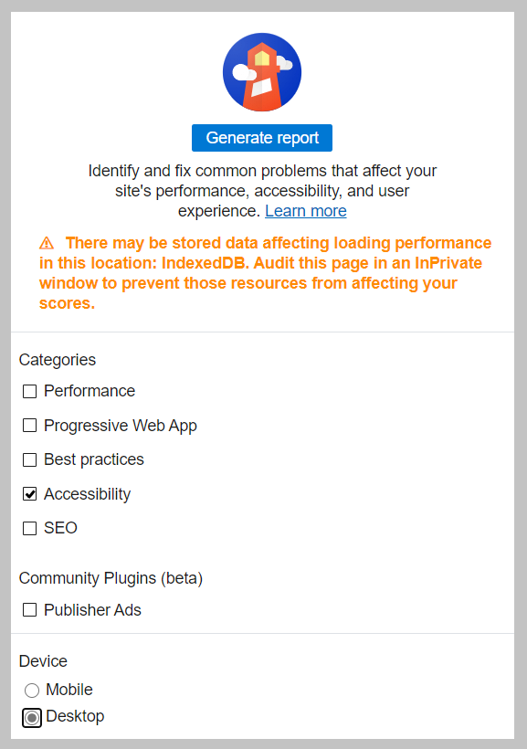
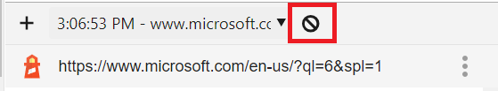

Testing your webpage in various clients and views is as important as testing it in various browsers. This testing might not be practical in all scenarios, and it can miss situations where users use a browser but might have another disability. Fortunately, there are tools that you can use as a developer to gauge the accessibility of your page.

## Contrast checkers

Someone who is color-blind might not be able to differentiate between colors, or might have difficulty working with colors that are similar to one another. The World Wide Web Consortium (W3C), the standards organization for the web, established a [rating system for color contrast](https://www.w3.org/TR/UNDERSTANDING-WCAG20/visual-audio-contrast-contrast.html).

Choosing the right colors to ensure that your page is accessible to all can be tricky to do by hand. You can use the following tools to both generate appropriate colors and test your site to ensure compliance:

- Palette generation tools:
  - [Adobe Color](https://color.adobe.com/create/color-accessibility), an interactive tool for testing color combinations
  - [Color Safe](http://colorsafe.co/), a tool for generating text colors based on a selected background color
- Compliance checkers:
  - Browser extensions to test a page:
    - [Edge: WCAG Color contrast checker](https://microsoftedge.microsoft.com/addons/detail/wcag-color-contrast-check/idahaggnlnekelhgplklhfpchbfdmkjp)
    - [Firefox: WCAG Contrast checker](https://addons.mozilla.org/firefox/addon/wcag-contrast-checker/)
    - [Chrome: Colour Contrast Checker](https://chrome.google.com/webstore/detail/colour-contrast-checker/nmmjeclfkgjdomacpcflgdkgpphpmnfe)
  - Applications:
    - [Colour Contrast Analyser (CCA)](https://www.tpgi.com/color-contrast-checker/)

## Lighthouse

Lighthouse is a tool that Google created for analyzing websites. It has become so popular that it's included in many browsers' developer tools. Lighthouse can examine a page's search engine optimization (SEO), load performance, and other best practices. Lighthouse can also analyze a page and provide a score for its current accessibility.

> [!NOTE]
> As with any automated tool, you can't rely on the score that Lighthouse provides as the sole indication of a page's accessibility. But it does provide a good starting point for identifying and remedying problems.

### Exercise: Generate a page's Lighthouse accessibility score

Test out Lighthouse in your browser. The following screenshots use [Edge](https://www.microsoft.com/edge), but you can follow the same steps in Chrome and many other browsers.

1. Open your browser and go to the [main Microsoft webpage](https://microsoft.com).
1. Select the <kbd>F12</kbd> key to open the developer tools.
1. On the top, select the chevron (**>>**) icon to open the list of hidden tabs.

   

1. Select **Lighthouse** from the list.
1. Under **Categories**, clear all items except **Accessibility**.
1. Under **Device**, select **Desktop**.

   

1. Select **Generate report**.
1. Notice the score and associated information about the page.
1. You can test other pages by selecting **Clear all** in Lighthouse, going to a different page, and then selecting **Generate report**.

   

You've now seen how to use Lighthouse, along with the accessibility information that the tool can provide.
