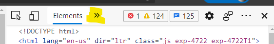
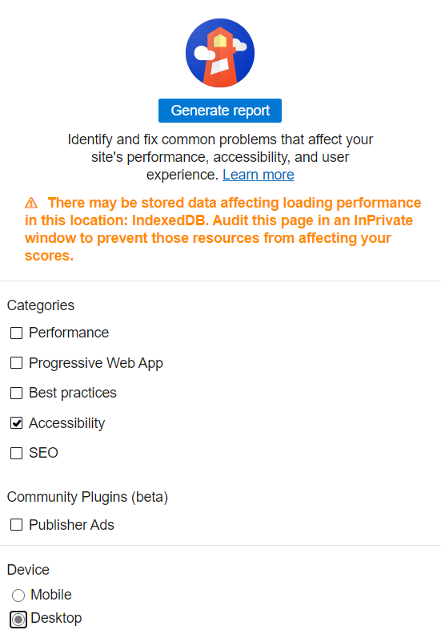
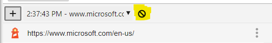

Testing your site in different clients and views is as important as testing it in different browsers. This may not be practical in all scenarios, and it can miss situations where users utilize a browser but may have another disability. Fortunately there are different tools you can use as a developer to get a sense for the accessibility of your page.

## Contrast checkers

Someone who is color-blind may not be able to differentiate between different colors, or have difficulty working with colors which are too similar to one another. The World Wide Web Consortium (W3C), the standards organization for the web, established a [rating system for color contrast](https://www.w3.org/TR/UNDERSTANDING-WCAG20/visual-audio-contrast-contrast.html).

Choosing the right colors to ensure your page is accessible to all can be tricky to do by hand. Fortunately, there are different tools available to both generate appropriate colors and test your site to ensure compliance.

- Palette generation tools
  - [Adobe Color](https://color.adobe.com/create/color-accessibility) an interactive tool for testing different color combinations
  - [Color Safe](http://colorsafe.co/), a tool for generating text colors based on a selected background color
- Compliance checkers
  - Browser extensions to test a page
    - [Edge: WCAG Color contrast checker](https://microsoftedge.microsoft.com/addons/detail/wcag-color-contrast-check/idahaggnlnekelhgplklhfpchbfdmkjp)
    - [Firefox: WCAG Contrast checker](https://addons.mozilla.org/en-US/firefox/addon/wcag-contrast-checker/)
    - [Chrome: Colour Contrast Checker](https://chrome.google.com/webstore/detail/colour-contrast-checker/nmmjeclfkgjdomacpcflgdkgpphpmnfe)
  - Applications
    - [Colour Contrast Analyser (CCA)](https://www.tpgi.com/color-contrast-checker/)

## Lighthouse

Lighthouse is a tool created by Google to analyze websites. The utility has become so popular it's included in many browsers' developer tools. Lighthouse is able to examine a page's search engine optimization (SEO), load performance, and other best practices. Lighthouse can also analyze a page and provide a score for its current accessibility.

> [!NOTE]
> Like any automated tool, the score provided by Lighthouse should not be relied upon as the sole indication of a page's accessibility. However it does provide a good starting point for identifying and remedying problems.

### Exercise: Generate a page's Lighthouse accessibility score

Test out Lighthouse in your browser. The screenshots below will utilize [Edge](https://www.microsoft.com/edge), however the same steps can be followed in Chrome and many other browsers.

1. Open your browser and navigate to [https://microsoft.com](https://microsoft.com).
1. Press <kbd>F12</kbd> to open the developer tools.
1. In the top, click the **>>** (chevron) icon to open the list of hidden tabs.

   

1. Select **Lighthouse** from the list.
1. Under **Categories**, unselect all items except **Accessibility**.
1. Under **Device**, select **Desktop**.

   

1. Select **Generate report**.
1. Notice the score and associated information about the page.
1. You can test other pages by selecting **Clear all** in Lighthouse, navigating to a different page, and then selecting **Generate report**.

   

You have now seen how to use Lighthouse, and the accessibility information the tool can provide.
