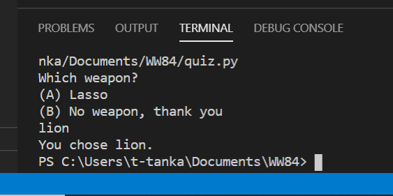
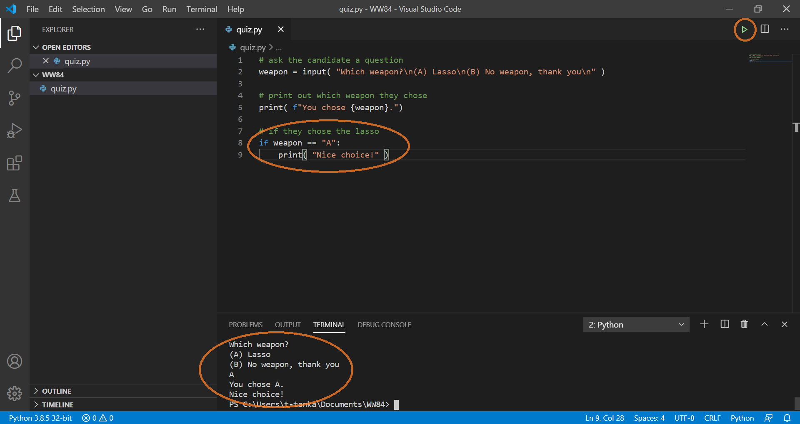

Now it's time to create the outline of your test code!


To start, you will ask five questions and have only two options for each:

1. Which weapon?
   1. Lasso
   1. No weapons
1. What's your dream job?
   1. Curator at the Smithsonian
   1. Running a business
1. What's more important?
   1. Money
   1. Love
1. What's your favorite decade?
   1. 1910s
   1. 1980s
1. What's your favorite big cat?
   1. Tiger
   1. Cheetah

We'll use these questions to determine which of the following four you are most like:

- Wonder Woman
- Barbara Minerva
- Steve Trevor
- Max Lord

## Ask the test taker for input

You probably already know how to print text to the console from the last unit in this module on Python basics, but now you have to write code to enable a human write text *back* to the program.

Python's input command is for this exact scenario; it gives back (returns) the user's answer, which you can then store in a variable.

If you have code from the Python basics unit, you can delete them if you want so that this file is only the code for the test.

> [!NOTE]
> The `\n` in the text below is putting in a new line so that the question and answer choices are each on their own line. Think of it like hitting the "return" key.

```python
# ask the candidate a question
weapon = input( "Which weapon?\n(A) Lasso\n(B) No weapon, thank you\n" )

# print out which weapon they chose
print( f"You chose {weapon}.")
```

Press the **Play** button, and you should see the question print out, along with the options. Click in the TERMINAL area and try typing A then "enter" to see what happens.

> [!div class="mx-imgBorder"]
> 

Notice that the weapon variable simply stores whatever you typed. Try typing lion instead and see what happens…

> [!div class="mx-imgBorder"]
> 

For now, let's assume the user understands that they should type either 'A' or 'B', whichever corresponds with their choice; and that they should capitalize it correctly.

Now, you can use a conditional statement to have execute commands depending on which option they chose. Add this if-statement to your program:

```python
# if they chose the lasso
if weapon == "A":
    print( "Nice choice!" )
```

Press the **Play** button and try entering A as your choice. Be sure to type in a capital A.

> [!div class="mx-imgBorder"]
> 

What do you think will happen if you choose 'B' instead? Try writing some code to see if you can account for that and then go on to the next unit to see different ways of doing it!

*WONDER WOMAN 1984 TM & © DC and WBEI. RATED PG-13*
