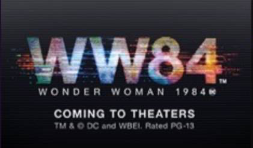

There's a secret message encoded with a location inspired by the WONDER WOMAN 1984 film. 

Crack the code by using the Python programming language and find the Easter egg in this beginner's lesson. For the best experience, make sure your local developer environment is ready with [Visual Studio Code](https://code.visualstudio.com/learn/?azure-portal=true). Follow the steps in the [Set up your Python beginner development environment with Visual Studio Code](https://docs.microsoft.com/learn/modules/python-install-vscode/?azure-portal=true) Learn module.

## Learning objectives

In this module, you'll:
- Write your first lines of Python code
- Create a function to decode a character by using a cipher
- Create a function to decode a word by using a cipher
- Discover the Easter egg hidden in this module based on the WONDER WOMAN 1984 film

## Prerequisites

- [Python installed](https://docs.microsoft.com/en-us/learn/modules/python-install-vscode/5-exercise-setup-visual-studio-code?pivots=windows?azure-portal=true)
- [Visual Studio Code with Python Extension](https://docs.microsoft.com/elearn/modules/python-install-vscode/6-exercise-write-execute-first-script?pivots=windows?azure-portal=true)

> [!Note]
> No coding experience is required to complete these lessons!

*WONDER WOMAN 1984 TM & © DC and WBEI. RATED PG-13*
