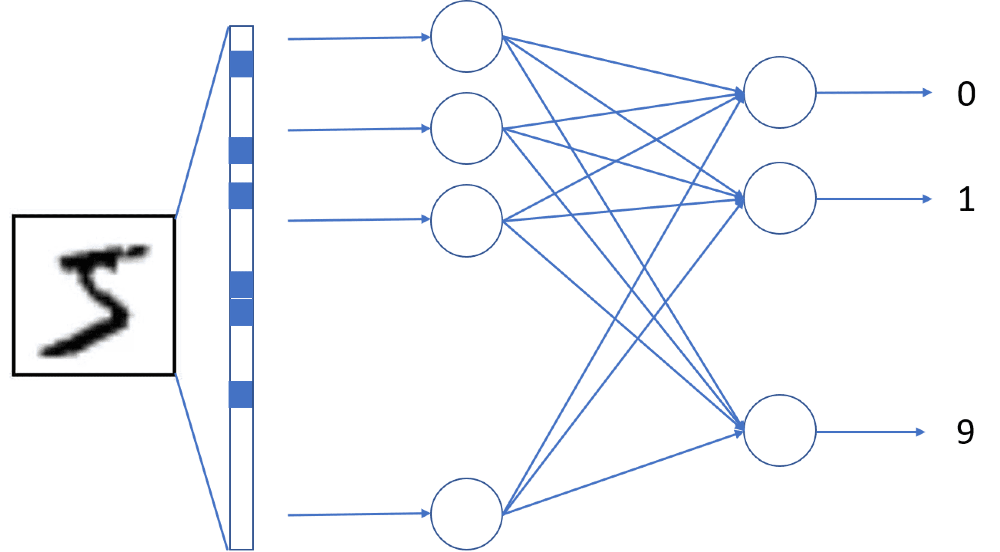
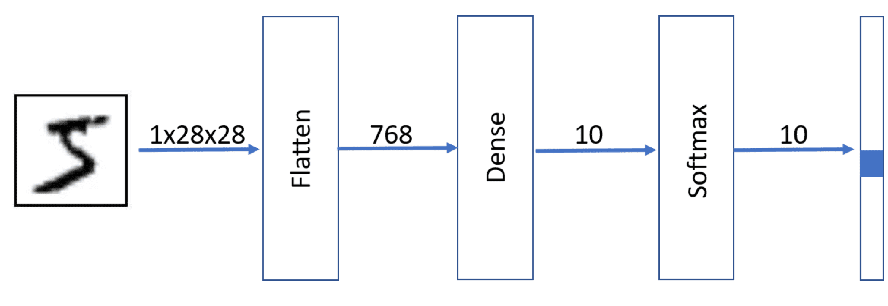

The handwritten digit recognition is a classification problem. We start with the simplest possible approach for image classification - a fully connected neural network with a single trainable layer (also called a *single-layer perceptron*; multi-layer versions are known as *multi-layer perceptrons*). First, let's start with quickly loading and normalizing the dataset, as we have done in the previous unit:

```python
import keras
import matplotlib.pyplot as plt
import numpy as np

(x_train, y_train), (x_test, y_test) = keras.datasets.mnist.load_data()
x_train = x_train.astype(np.float32) / 255.0
x_test = x_test.astype(np.float32) / 255.0
```

## Fully connected dense neural networks

A basic **neural network** consists of many **layers**. The simplest network would include just one fully connected layer, which is called **Dense** layer, with 784 inputs (one input for each pixel of the input image) and 10 outputs (one output for each class). It's called dense because it contains all possible connections between 784 inputs and 10 outputs, giving 7,840 connection weights plus 10 bias terms for a total of 7,850 trainable parameters.



However, our input data comes in the form of 28×28 matrices, while a network input needs to be a one-dimensional vector of length 784. Thus, the first layer of the network would be a `Flatten` layer that converts 28×28 pixels into a vector.

The output of the network should be 10 numbers, one for each class. Each number represents the probability that the input digit is of corresponding class. Final activation function called **Softmax** is used to make sure the output vector is normalized, that is, the sum of all values is equal to 1.



It can be defined in Keras in the following way, using `Sequential` syntax:

```python
model = keras.Sequential([
    keras.layers.Input(shape=(28, 28)),
    keras.layers.Flatten(),
    keras.layers.Dense(10, activation='softmax')
])

model.summary()
# Expected output: a model summary table showing the Flatten and Dense layers
# Total params: 7,850 (784 inputs * 10 outputs + 10 biases)
# Note: the Input and Flatten layers have zero trainable parameters
```

The `summary` method prints the architecture of the network, including its layers, output shapes, and number of parameters. The `Input` and `Flatten` layers contribute zero trainable parameters. All 7,850 parameters belong to the single `Dense` layer. The `Input` layer's `shape` parameter tells the network the expected dimensions of the input data.

## Anatomy of a dense layer

Notice that the model has 7,850 parameters. This is because the dense layer implements a linear function *y = W×x + b*, where *W* is a 784×10 weight matrix and *b* is a 10-dimensional bias vector. Each connection between an input and output neuron has a corresponding weight in *W*, and each output neuron has an additional bias term.

You can inspect these weights directly:

```python
model.layers[1].weights
# Expected output: a list containing two tensors:
# - kernel (weight matrix) of shape (784, 10)
# - bias vector of shape (10,)
```

The `weights` property returns the kernel (weight matrix) and the bias vector of the layer.

## Training the network

Before training, let's see what happens when we pass an image through an untrained network:

```python
print('Digit to be predicted: ', y_train[0])
model(np.expand_dims(x_train[0], 0))
# Expected output: the true label of the first training image (e.g., 5),
# followed by a tensor of 10 roughly equal probabilities (~0.1 each)
```

Since the network isn't yet trained, the output probabilities are roughly equal for all classes. The result is returned as a tensor.

To train the network, we first need to prepare our labels and **compile** the model.

The loss function we use, `categorical_crossentropy`, requires labels to be **one-hot encoded**, meaning each label is represented as a vector of zeros with a single one at the position of the correct class. In the next unit we'll see `sparse_categorical_crossentropy`, which accepts integer labels directly and avoids this conversion step. Let's convert our labels first:

```python
y_train_onehot = keras.utils.to_categorical(y_train)
y_test_onehot = keras.utils.to_categorical(y_test)
print("First 3 training labels:", y_train[:3])
print("One-hot-encoded version:\n", y_train_onehot[:3])
# Expected output: the first 3 integer labels (e.g., [5, 0, 4])
# and their one-hot representations as 10-element vectors
```

Now we **compile** the model, specifying the optimizer and loss function:

```python
model.compile(optimizer='sgd', loss='categorical_crossentropy')
```

The optimizer (`sgd` = Stochastic Gradient Descent) controls how the weights are adjusted during training. The loss function (`categorical_crossentropy`) measures how far the predicted probabilities are from the true one-hot labels.

To do the actual training, we call the `fit` function:

```python
model.fit(x_train, y_train_onehot)
# Expected output: one epoch of training with loss decreasing over batches
```

## Monitoring training

By default, the model trains for one **epoch** (one pass through the entire training set). To train for more epochs and monitor performance on test data, we pass `validation_data` and `epochs`:

> [!NOTE]
> In this module, we pass the test set as `validation_data` for simplicity. In practice, you should split your data into three sets (training, validation, and test) so that the test set remains unseen until final evaluation.

```python
hist = model.fit(x_train, y_train_onehot,
                 validation_data=(x_test, y_test_onehot),
                 epochs=3)
# Expected output: training and validation loss printed for each of the 3 epochs
```

The `fit` function returns a `history` object that contains training and validation metrics for each epoch, which can be used for visualization:

```python
for x in ['loss', 'val_loss']:
    plt.plot(hist.history[x])
# Expected output: a plot showing training and validation loss curves over epochs
```

## Metrics and minibatches

In addition to loss, we often want to monitor **accuracy**, the fraction of correctly classified examples:

```python
model.compile(optimizer='sgd', loss='categorical_crossentropy', metrics=['accuracy'])
hist = model.fit(x_train, y_train_onehot,
                 validation_data=(x_test, y_test_onehot),
                 epochs=3, batch_size=128)
# Expected output: training/validation loss and accuracy printed for each epoch
```

The `batch_size` parameter controls how many training examples are processed before each weight update. Rather than computing the gradient over the entire dataset, training uses **minibatches** (small subsets of the data). This allows for more frequent weight updates and efficient GPU parallelization. The batch size is one of the **hyperparameters** you can tune to improve training.

## Specifying optimizer parameters

The basic SGD optimizer can be improved by adding **momentum**, which helps accelerate gradient descent in the relevant direction and dampens oscillations:

```python
model = keras.Sequential([
    keras.layers.Input(shape=(28, 28)),
    keras.layers.Flatten(),
    keras.layers.Dense(10, activation='softmax')
])

model.compile(optimizer=keras.optimizers.SGD(momentum=0.5),
              loss='categorical_crossentropy',
              metrics=['accuracy'])

hist = model.fit(x_train, y_train_onehot,
                 validation_data=(x_test, y_test_onehot),
                 epochs=5, batch_size=64)
# Expected output: training over 5 epochs with improving accuracy,
# momentum should help the model converge faster
```

```python
for x in ['accuracy', 'val_accuracy']:
    plt.plot(hist.history[x])
# Expected output: a plot showing training and validation accuracy curves over 5 epochs
```

## Visualizing network weights

Because our network maps 784 input pixels directly to 10 output classes, we can reshape the weight matrix back into 28×28 images, one per digit class. These visualizations show what "pattern" the network has learned to look for in each class:

```python
weight_tensor = model.layers[1].weights[0].numpy().reshape(28, 28, 10)

fig, ax = plt.subplots(1, 10, figsize=(15, 4))
for i in range(10):
    ax[i].imshow(weight_tensor[:, :, i])
    ax[i].axis('off')
# Expected output: 10 images showing the learned weight patterns for digits 0-9,
# each resembling a blurry version of the corresponding digit
```

## Takeaway

With a single dense layer, we can achieve around 91% accuracy on the MNIST dataset. While this is a reasonable baseline, in the next unit we'll explore how adding more layers to the network can improve our results.
