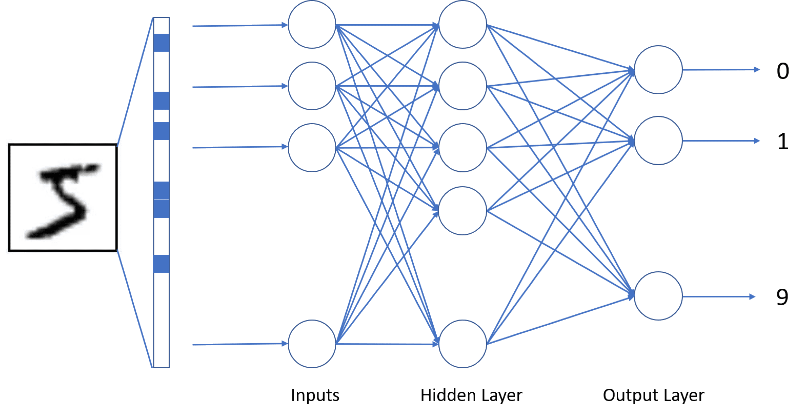
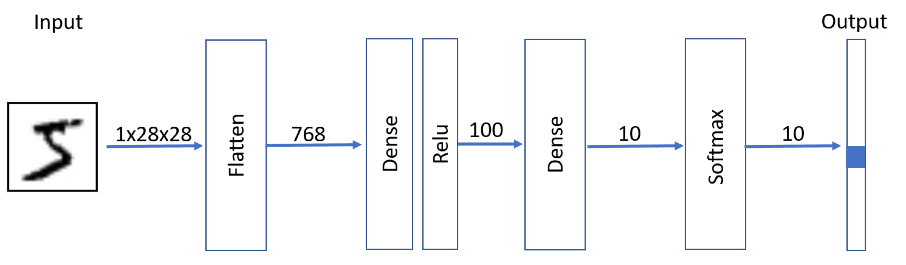

In the previous unit, we used a one-layer dense neural network to classify handwritten digits. Now let's see if adding more layers give us better performance in terms of accuracy.

Let's start by importing things and loading data:

```python
import keras
import tensorflow as tf
import matplotlib.pyplot as plt
import numpy as np

(x_train, y_train), (x_test, y_test) = keras.datasets.mnist.load_data()
x_train = x_train.astype(np.float32) / 255.0
x_test = x_test.astype(np.float32) / 255.0
```

## Multi-layer perceptron

In a multi-layer network, we add one or more **hidden layers**.



This layer contains many neurons, and adding more neurons gives us more parameters in the model, which can lead to better accuracy but also increases the risk of overfitting.

Our network layer structure looks like this:



An important thing to note here's the nonlinear activation function layer, called **ReLU**. Without a nonlinear function between layers, a multi-layer network would behave exactly like a single-layer network.

```python
def plot_function(f, name=''):
    plt.plot(range(-10, 10), [f(tf.constant(x, dtype=tf.float32)) for x in range(-10, 10)])
    plt.title(name)

plt.subplot(121)
plot_function(tf.nn.relu, 'ReLU')
plt.subplot(122)
plot_function(tf.nn.sigmoid, 'Sigmoid')
# Expected output: Two side-by-side plots showing the ReLU and Sigmoid activation functions
```

## Another way of defining a model

Our network can be defined in Keras in the following way. We modify the approach by initializing the `model` object first, and then adding all layers one by one:

```python
model = keras.Sequential()
model.add(keras.layers.Input(shape=(28, 28)))
model.add(keras.layers.Flatten())
model.add(keras.layers.Dense(100))     # 784 inputs, 100 outputs
model.add(keras.layers.ReLU())         # Activation Function
model.add(keras.layers.Dense(10))      # 100 inputs, 10 outputs
model.summary()
# Expected output: Model summary showing a Flatten layer, Dense(100), ReLU, and Dense(10)
```

## Sparse categorical crossentropy with softmax

You have probably noticed that we didn't use **softmax** as the activation function after the last layer. Keras allows us to combine the activation function together with the loss function, which means we just need to make sure to specify `from_logits=True` when defining the loss function in `compile`.

Also, in most cases when we have a multi-class classification, our dataset contains the number of the class, which we then convert to one-hot encoding. However, this uses extra memory, and we can in fact define the loss function in such a way that it expects the **number of the class**, instead of the corresponding one-hot vector. This loss function is called **sparse categorical cross-entropy**.

```python
model.compile(
    optimizer='adam',
    loss=keras.losses.SparseCategoricalCrossentropy(from_logits=True),
    metrics=['accuracy']
)
```

Here we use the **Adam** optimizer, a popular choice that adapts the learning rate during training. We also switch to `SparseCategoricalCrossentropy` with `from_logits=True`, which accepts integer class labels directly (avoiding the one-hot encoding step we used in the previous unit) and combines the softmax activation with the loss computation for better numerical stability.

> [!NOTE]
> Because we omitted softmax from the output layer and used `from_logits=True`, the model outputs raw **logits** (unnormalized scores), not probabilities. During training, the loss function handles the softmax internally. At **inference time**, if you need probabilities, apply softmax explicitly and then take the argmax to get the predicted class:
> ```python
> probs = tf.nn.softmax(model.predict(x))
> predicted_class = tf.argmax(probs, axis=1)
> ```

Let's fit the model and make sure it gives good results:

```python
hist = model.fit(x_train, y_train, validation_data=(x_test, y_test), epochs=5)
# Expected output: Training for 5 epochs showing loss and accuracy for training and validation sets
```

```python
for x in ['accuracy', 'val_accuracy']:
    plt.plot(hist.history[x])
# Expected output: A plot showing training and validation accuracy over epochs
```

## Overfitting

> **Overfitting** is a very important concept to understand. It means that our model fits the training data very well, but does not generalize well on unseen data.

You may notice that training accuracy keeps improving over epochs, but validation accuracy may start to drop at some point. This is a sign of overfitting.

What you can do to overcome overfitting:

- Make the model less powerful
- Increase the number of training examples
- Stop training as soon as validation accuracy starts dropping (**early stopping**)
- Apply **regularization** techniques such as **Dropout** (randomly disabling neurons during training) or **L2 weight decay** (penalizing large weights)
- Use **data augmentation** to artificially increase the diversity of training data

## Shorter model definitions

In many cases a model consists of multiple layers, and activation functions in between those layers. We can simplify the model definition by specifying the activation function directly in the `Dense` layer:

```python
model = keras.Sequential()
model.add(keras.layers.Input(shape=(28, 28)))
model.add(keras.layers.Flatten())
model.add(keras.layers.Dense(100, activation='relu'))
model.add(keras.layers.Dense(10, activation=None))
model.summary()
# Expected output: Model summary equivalent to the previous model, but defined more concisely
```

Here, `activation=None` (the default for `Dense` layers) means the output layer applies no activation function. The output layer returns raw linear outputs (logits). This mirrors the earlier model definition, where the final `Dense(10)` layer also had no activation function. `ReLU` was only applied after the hidden layer. As you can see, this model is equivalent to the one above, but the definition looks neater.

## Takeaway

Multi-layer networks can achieve higher accuracy than a single-layer perceptron, however, they aren't perfect for computer vision tasks. In images, there are some structural patterns that can help us classify an object regardless of its position in the image, but perceptrons don't allow us to extract those patterns and look for them selectively. In the next unit, we'll focus on a special type of neural network that can be used effectively for computer vision tasks.
