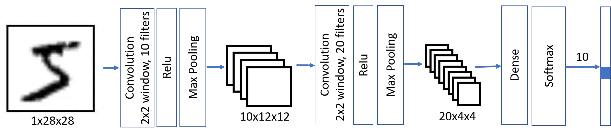

In the previous unit we learned how to define a generic multi-layered neural network. In this unit we'll learn about **Convolutional Neural Networks (CNNs)**, which are designed for computer vision.

Computer vision is different from generic classification, because when we're trying to find a certain object in the picture, we're scanning the image looking for some specific **patterns** and their combinations. For example, when looking for a cat, we first may look for horizontal lines, which can form whiskers, and then certain combination of whiskers can tell us that it's actually a picture of a cat. The position and presence of certain patterns are important. To extract patterns, we'll use the notion of **convolutional filters**.

But first, let us load all dependencies and define the helper functions we'll use:

```python
import keras
import tensorflow as tf
import matplotlib.pyplot as plt
import numpy as np


def plot_convolution(data, t, title=''):
    t = tf.constant(t, dtype=tf.float32)
    t = tf.reshape(t, [*t.shape, 1, 1])
    fig, ax = plt.subplots(len(data), 2)
    fig.suptitle(title, fontsize=16)
    for i in range(len(data)):
        d = tf.reshape(tf.constant(data[i], dtype=tf.float32), [1, *data[i].shape, 1])
        ax[i][0].imshow(data[i])
        ax[i][1].imshow(tf.nn.conv2d(d, t, [1, 1, 1, 1], 'SAME')[0, ..., 0])


def plot_results(hist):
    plt.figure(figsize=(12, 4))
    plt.subplot(1, 2, 1)
    plt.plot(hist.history['accuracy'], label='Training acc')
    plt.plot(hist.history['val_accuracy'], label='Validation acc')
    plt.legend()
    plt.subplot(1, 2, 2)
    plt.plot(hist.history['loss'], label='Training loss')
    plt.plot(hist.history['val_loss'], label='Validation loss')
    plt.legend()


def display_dataset(dataset, labels=None, n=10, classes=None):
    fig, ax = plt.subplots(1, n)
    for i in range(n):
        ax[i].imshow(dataset[i])
        ax[i].axis('off')
        if labels is not None:
            # Handle both scalar labels (e.g. MNIST) and array labels (e.g. CIFAR-10)
            lbl = int(labels[i][0]) if np.ndim(labels[i]) > 0 else int(labels[i])
            ax[i].set_title(classes[lbl] if classes is not None else str(lbl))
```

Now let's load the MNIST dataset:

```python
(x_train, y_train), (x_test, y_test) = keras.datasets.mnist.load_data()
x_train = x_train.astype(np.float32) / 255.0
x_test = x_test.astype(np.float32) / 255.0
```

## Convolutional filters

Convolutional filters are small windows that run over each pixel of the image and compute weighted average of the neighboring pixels. They're defined by matrices of weight coefficients. Let's see the examples of applying two different convolutional filters over our MNIST handwritten digits:

```python
plot_convolution(x_train[:5], [[-1., 0., 1.], [-1., 0., 1.], [-1., 0., 1.]], 'Vertical edge filter')
plot_convolution(x_train[:5], [[-1., -1., -1.], [0., 0., 0.], [1., 1., 1.]], 'Horizontal edge filter')
# Expected output: Two sets of images showing original digits alongside the result of applying vertical and horizontal edge filters
```

First filter is called a **vertical edge filter**, and it's defined by the following matrix:
$$
\left(
    \begin{matrix}
     -1 & 0 & 1 \\
     -1 & 0 & 1 \\
     -1 & 0 & 1 \\
    \end{matrix}
\right)
$$
When this filter slides over a relatively uniform region of pixels, the weighted sum produced by the convolution is close to 0, because the positive and negative weights cancel out. When it encounters a vertical edge (where pixel intensities change sharply from left to right), the convolution produces a large positive or negative value. That's why in the images above you can see vertical edges highlighted by high and low values, while horizontal edges are smoothed out.

An opposite thing happens when we apply horizontal edge filter - horizontal lines are amplified, and vertical are averaged out.

In classical computer vision, multiple filters were applied to the image to generate features, which then were used by machine learning algorithm to build a classifier. In deep learning we construct networks that **learn** the best convolutional filters to solve classification problem on its own.

To do that, we introduce **convolutional layers**.

## Convolutional layers

Convolutional layers are defined using `Conv2D` class. We need to specify the following:

- `filters` - number of filters to use. We'll use 9 different filters, which will give the network plenty of opportunities to explore which filters work best for our scenario.
- `kernel_size` is the size of the sliding window. Usually 3x3 or 5x5 filters are used.

The simplest CNN contains only one convolutional layer. Given the input size 28x28, after applying nine 5x5 filters we'll end up with a tensor of 24x24x9. The spatial dimension is smaller because the default `padding='valid'` means no padding is added, and there are only 24 positions where a sliding window of size 5 can fit within 28 pixels (28 − 5 + 1 = 24). Using `padding='same'` would preserve the spatial dimensions by adding zero-padding around the input.

After the convolution, we flatten the 24×24×9 tensor into a single vector of size 5184, then add a dense layer to produce 10 classes. The `relu` activation function is applied after the convolutional layer to introduce nonlinearity.

```python
model = keras.Sequential([
    keras.layers.Input(shape=(28, 28, 1)),
    keras.layers.Conv2D(filters=9, kernel_size=(5, 5), activation='relu'),
    keras.layers.Flatten(),
    keras.layers.Dense(10)
])

model.compile(loss=keras.losses.SparseCategoricalCrossentropy(from_logits=True), metrics=['accuracy'])

model.summary()
# Expected output: Model summary showing a Conv2D layer, Flatten, and Dense(10) with ~52k parameters
```

You can see that this network contains around 52k trainable parameters (234 in the convolutional layer + 51,850 in the dense layer), compared to around 80k in fully connected multi-layered networks. Convolutional networks generalize better, which allows us to achieve good results on smaller datasets.

> [!NOTE]
> In most of the practical cases, we want to apply convolutional layers to color images. Thus, `Conv2D` layer expects the input to be of the shape $H\times W\times C$, where $H$ and $W$ are height and width of the image, and $C$ is the number of color channels. For grayscale images, we need the same shape with $C=1$.

We need to reshape our data before starting training:

```python
x_train_c = np.expand_dims(x_train, 3)
x_test_c = np.expand_dims(x_test, 3)
hist = model.fit(x_train_c, y_train, validation_data=(x_test_c, y_test), epochs=3)
# Expected output: Training for 3 epochs showing loss and accuracy for training and validation sets
```

```python
plot_results(hist)
# Expected output: Plots showing training and validation accuracy and loss over 3 epochs
```

As you can see, we're able to achieve higher accuracy with fewer epochs compared to the fully connected networks from the previous unit. However, the training itself requires more resources, and may be slower on non-GPU computers.

## Visualizing convolutional layers

We can also visualize the weights of our trained convolutional layers to try to make some more sense of what is going on:

```python
fig, ax = plt.subplots(1, 9)
l = model.layers[0].weights[0]
for i in range(9):
    ax[i].imshow(l[..., 0, i])
    ax[i].axis('off')
# Expected output: 9 small images showing the learned 5x5 convolutional filter weights
```

You can see that some of those filters look like they can recognize some oblique strokes, while others look random.

## Multi-layered CNNs and pooling layers

First, the convolutional layers look for primitive patterns, such as horizontal or vertical lines. We can apply further convolutional layers on top of them to look for higher-level patterns, such as primitive shapes. Then more convolutional layers can combine those shapes into some parts of the picture, up to the final object that we're trying to classify.

When doing so, we may also apply one trick: reducing the spatial size of the image. Once we have detected there's a horizontal stroke within sliding 3x3 window, it isn't so important at which exact pixel it occurred. Thus we can "scale down" the size of the image, which is done using one of the **pooling layers**:

- **Average Pooling** takes a sliding window (for example, 2x2 pixels) and computes an average of values within the window
- **Max Pooling** replaces the window with the maximum value. The idea behind max pooling is to detect a presence of a certain pattern within the sliding window.

Thus, in a typical CNN there would be several convolutional layers, with pooling layers in between them to decrease dimensions of the image. We would also increase the number of filters, because as patterns become more advanced - there are more possible interesting combinations that we need to be looking for.



This architecture is also called **pyramid architecture** because of decreasing spatial dimensions and increasing feature/filters dimensions.

```python
model = keras.Sequential([
    keras.layers.Input(shape=(28, 28, 1)),
    keras.layers.Conv2D(filters=10, kernel_size=(5, 5), activation='relu'),
    keras.layers.MaxPooling2D(),
    keras.layers.Conv2D(filters=20, kernel_size=(5, 5), activation='relu'),
    keras.layers.MaxPooling2D(),
    keras.layers.Flatten(),
    keras.layers.Dense(10)
])

model.compile(loss=keras.losses.SparseCategoricalCrossentropy(from_logits=True), metrics=['accuracy'])

model.summary()
# Expected output: Model summary showing Conv2D, MaxPooling, Conv2D, MaxPooling, Flatten, Dense with ~8.5k parameters
```

Notice that the number of trainable parameters (~8.5K) is dramatically smaller than in the previous cases. This happens because convolutional layers in general have few parameters, and dimensionality of the image before applying final dense layer is reduced.

```python
hist = model.fit(x_train_c, y_train, validation_data=(x_test_c, y_test), epochs=3)
# Expected output: Training for 3 epochs showing loss and accuracy for training and validation sets
```

```python
plot_results(hist)
# Expected output: Plots showing training and validation accuracy and loss over 3 epochs
```

Observe that we're able to achieve a higher accuracy with more than one layer, and it needs a smaller number of epochs. It means that a more sophisticated network architecture needs less data to figure out what is going on, and to extract generic patterns from our images. However, each epoch involves more computation due to the additional convolutional operations, so training is faster with a GPU.

## Playing with real images from the CIFAR-10 dataset

While our handwritten digit recognition problem may seem like a toy problem, we're now ready to do something more serious. Let's explore a more advanced dataset of pictures of different objects, called [CIFAR-10](https://www.cs.toronto.edu/~kriz/cifar.html). It contains 60k 32x32 images, divided into 10 classes.

> [!NOTE]
> From this point on, we reload `x_train`, `y_train`, `x_test`, and `y_test` with the CIFAR-10 dataset, replacing the MNIST data used earlier in this unit. The expanded-dims variables `x_train_c` and `x_test_c` are no longer needed.

```python
(x_train, y_train), (x_test, y_test) = keras.datasets.cifar10.load_data()
x_train = x_train.astype(np.float32) / 255.0
x_test = x_test.astype(np.float32) / 255.0
classes = ('plane', 'car', 'bird', 'cat',
           'deer', 'dog', 'frog', 'horse', 'ship', 'truck')
```

```python
display_dataset(x_train, y_train, classes=classes)
# Expected output: A row of 10 CIFAR-10 images with their class labels
```

A classic CNN architecture is [LeNet](https://en.wikipedia.org/wiki/LeNet), proposed by *Yann LeCun* originally for handwritten digit recognition. Let's adapt it for CIFAR-10. It follows the same principles as we have outlined above, the main difference being 3 input color channels instead of 1.

```python
model = keras.Sequential([
    keras.layers.Input(shape=(32, 32, 3)),
    keras.layers.Conv2D(filters=6, kernel_size=5, strides=1, activation='relu'),
    keras.layers.MaxPooling2D(pool_size=2, strides=2),
    keras.layers.Conv2D(filters=16, kernel_size=5, strides=1, activation='relu'),
    keras.layers.MaxPooling2D(pool_size=2, strides=2),
    keras.layers.Flatten(),
    keras.layers.Dense(120, activation='relu'),
    keras.layers.Dense(84, activation='relu'),
    keras.layers.Dense(10)
])

model.summary()
# Expected output: Model summary showing the LeNet architecture with Conv2D, MaxPooling, Dense layers
```

Training this network properly takes a significant amount of time and should be done on GPU-enabled compute.

```python
model.compile(optimizer='adam', loss=keras.losses.SparseCategoricalCrossentropy(from_logits=True), metrics=['accuracy'])
hist = model.fit(x_train, y_train, validation_data=(x_test, y_test), epochs=10)
# Expected output: Training for 10 epochs showing loss and accuracy for training and validation sets
```

```python
plot_results(hist)
# Expected output: Plots showing training and validation accuracy and loss over 10 epochs
```

The accuracy that we have been able to achieve with only a few epochs of training is just ok. Remember that our problem is significantly more difficult than MNIST digit classification. Getting above 60% accuracy is a good accomplishment in such a short training time, though state-of-the-art models can achieve over 95% on CIFAR-10 using deeper architectures, data augmentation, and longer training.

## Takeaways

In this unit, we learned the main concept behind computer vision neural networks - convolutional networks. Real-life architectures that power image classification, object detection, and even image generation networks are all based on CNNs, just with more layers and some additional training tricks.
