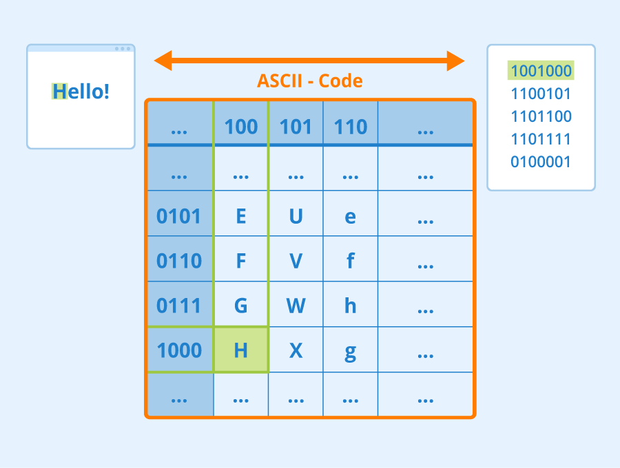
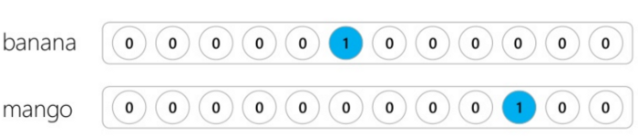

If we want to solve Natural Language Processing (NLP) tasks with neural networks, we need some way to represent text as tensors. Computers already represent characters as numbers that map to letters on your screen using encodings such as ASCII or UTF-8.



We understand what each letter **represents**, and how all characters come together to form the words of a sentence. However, computers don't have such an understanding, and neural networks have to learn the meaning of the sentence during training.

We can use different approaches when representing text:

- **Character-level representation**, where we represent text by treating each character as a number. Given that we have $C$ different characters in our text corpus, the word *Hello* could be represented by a tensor with shape $C \times 5$. Each letter would correspond to a tensor in one-hot encoding.
- **Word-level representation**, in which we create a **vocabulary** of all words in our text, and then represent words using one-hot encoding. This approach is better than character-level representation because each letter by itself doesn't have much meaning. By using higher-level semantic concepts - words - we simplify the task for the neural network. However, given a large dictionary size, we need to deal with high-dimensional sparse tensors.

## Text classification task

In this module, we start with a simple text classification task based on the **[AG_NEWS](http://www.di.unipi.it/~gulli/AG_corpus_of_news_articles.html)** dataset, originally introduced by Zhang et al. (2015) in [*Character-level Convolutional Networks for Text Classification*](https://papers.nips.cc/paper/2015/hash/250cf8b51c773f3f8dc8b4be867a9a02-Abstract.html): we classify news headlines into one of four categories: World, Sports, Business, and Sci/Tech. To load the dataset, we use the **[TensorFlow Datasets](https://www.tensorflow.org/datasets)** API. You can do this with the following code:

```python
import tensorflow as tf
import keras
import tensorflow_datasets as tfds

# In this tutorial, we will be training a lot of models. In order to use GPU memory cautiously,
# we will set tensorflow option to grow GPU memory allocation when required.
physical_devices = tf.config.list_physical_devices('GPU') 
if len(physical_devices)>0:
    tf.config.set_memory_growth(physical_devices[0], True)

dataset = tfds.load('ag_news_subset')
```

We can now access the training and test portions of the dataset by using `dataset['train']` and `dataset['test']` respectively by running the following code:

```python
ds_train = dataset['train']
ds_test = dataset['test']

print(f"Length of train dataset = {len(ds_train)}")
print(f"Length of test dataset = {len(ds_test)}")
```

We can use the following code to print the first five news headlines from our dataset:

```python
classes = ['World', 'Sports', 'Business', 'Sci/Tech']

for i,x in zip(range(5),ds_train):
    print(f"{x['label']} ({classes[x['label']]}) -> {x['title']} {x['description']}")
```

Running this code produces the following output:

```
3 (Sci/Tech) -> b'AMD Debuts Dual-Core Opteron Processor' b'AMD #39;s new dual-core Opteron chip is designed mainly for corporate computing applications, including databases, Web services, and financial transactions.'
1 (Sports) -> b"Wood's Suspension Upheld (Reuters)" b'Reuters - Major League Baseball\\Monday announced a decision on the appeal filed by Chicago Cubs\\pitcher Kerry Wood regarding a suspension stemming from an\\incident earlier this season.'
2 (Business) -> b'Bush reform may have blue states seeing red' b'President Bush #39;s  quot;revenue-neutral quot; tax reform needs losers to balance its winners, and people claiming the federal deduction for state and local taxes may be in administration planners #39; sights, news reports say.'
3 (Sci/Tech) -> b"'Halt science decline in schools'" b'Britain will run out of leading scientists unless science education is improved, says Professor Colin Pillinger.'
1 (Sports) -> b'Gerrard leaves practice' b'London, England (Sports Network) - England midfielder Steven Gerrard injured his groin late in Thursday #39;s training session, but is hopeful he will be ready for Saturday #39;s World Cup qualifier against Austria.'
```

## Text vectorization

Now we need to convert text into **numbers** that can be represented as tensors. If we want word-level representation, we need to do two things:

- Use a **tokenizer** to split text into **tokens**.
- Build a **vocabulary** of those tokens.

Both of those steps can be handled using the **TextVectorization** layer. Let's instantiate the vectorizer object, and then call the `adapt` method to go through all text and build a vocabulary.

### Limiting vocabulary size

In the AG News dataset example, the vocabulary size is rather large, more than 100k words. Generally speaking, we don't need words that are rarely present in the text as only a few sentences have them, and the model won't learn from them. Thus, it makes sense to limit the vocabulary size to a smaller number by passing the `max_tokens` argument to the vectorizer constructor using the following code:

```python
vocab_size = 50000
vectorizer = keras.layers.TextVectorization(max_tokens=vocab_size)
vectorizer.adapt(ds_train.take(500).map(lambda x: x['title']+' '+x['description']))
```

> [!NOTE]
> We're using only subset of the whole dataset to build a vocabulary. We do it to speed up the execution time and not keep you waiting. However, we're taking the risk that some of the words from the whole dataset wouldn't be included into the vocabulary, and will be ignored during training. Thus, using the whole vocabulary size and running through all dataset during `adapt` should increase the final accuracy, but not significantly.

Now we can access the actual vocabulary with the following code:

```python
vocab = vectorizer.get_vocabulary()
vocab_size = len(vocab)
print(vocab[:10])
print(f"Length of vocabulary: {vocab_size}")
```

Using the tokenizer, we can encode any text into a set of numbers:

```python
vectorizer('I love to play with my words')
```

Running this code produces the following output:

```
<tf.Tensor: shape=(7,), dtype=int64, numpy=array([ 372, 2297,    3,  312,   12, 1293, 2314])>
```

## Bag-of-words text representation

Because words represent meaning, sometimes we can figure out the meaning of a piece of text by just looking at the individual words, regardless of their order in the sentence. For example, when classifying news, words like *weather* and *snow* are likely to indicate *weather forecast*, while words like *stocks* and *dollar* would count towards *financial news*.

**Bag-of-words** (BoW) vector representation is the most simple to understand traditional vector representation. Each word is linked to a vector index, and a vector element contains the number of occurrences of each word in a given document.



> [!NOTE]
> The image shows one-hot encoded vectors for individual words. In a bag-of-words model, these per-word vectors are combined (summed or averaged) across all words in a document to produce a single document-level representation.

Below is an example of how to generate a bag-of-words representation using the scikit-learn Python library:

```python
from sklearn.feature_extraction.text import CountVectorizer
sc_vectorizer = CountVectorizer()
corpus = [
        'I like hot dogs.',
        'The dog ran fast.',
        'Its hot outside.',
    ]
sc_vectorizer.fit_transform(corpus)
sc_vectorizer.transform(['My dog likes hot dogs on a hot day.']).toarray()
```

We can also use the Keras vectorizer that we defined above, converting each word number into a one-hot encoding and adding up all those vectors:

```python
def to_bow(text):
    return tf.reduce_sum(tf.one_hot(vectorizer(text),vocab_size),axis=0)

to_bow('My dog likes hot dogs on a hot day.').numpy()
```

> [!NOTE]
> The reason the result differs from the previous example is that in the Keras example the length of the vector corresponds to the vocabulary size, which was built from the whole AG News dataset. In the scikit-learn example we built the vocabulary from the sample text on the fly.

## Training the BoW classifier

Now that we have learned how to build the bag-of-words representation of our text, let's train a classifier that uses it. First, we need to convert our dataset to a bag-of-words representation. This can be achieved by using `map` function in the following way:

```python
batch_size = 128

ds_train_bow = ds_train.map(lambda x: (to_bow(x['title']+x['description']),x['label'])).batch(batch_size)
ds_test_bow = ds_test.map(lambda x: (to_bow(x['title']+x['description']),x['label'])).batch(batch_size)
```

Now let's define a simple classifier neural network that contains one linear layer. The input size is `vocab_size`, and the output size corresponds to the number of classes (4). Because we're solving a classification task, the final activation function is **softmax**:

```python
model = keras.Sequential([
    keras.layers.Input(shape=(vocab_size,)),
    keras.layers.Dense(4,activation='softmax')
])
model.compile(loss='sparse_categorical_crossentropy',optimizer='adam',metrics=['acc'])
model.fit(ds_train_bow,validation_data=ds_test_bow)
```

## Training a classifier as one network

Because the vectorizer is also a Keras layer, we can define a network that includes it, and train it end-to-end. This way we don't need to vectorize the dataset using `map`, we can just pass the original dataset to the input of the network.

> [!NOTE]
> We would still have to apply maps to our dataset to convert fields from dictionaries (such as `title`, `description` and `label`) to tuples. However, when loading data from disk, we can build a dataset with the required structure in the first place.

In Keras 3, TensorFlow functions like `tf.one_hot` and `tf.reduce_sum` can't be applied directly to symbolic `KerasTensor` objects in Functional models. Instead, we wrap our bag-of-words logic in a custom `keras.layers.Layer`:

```python
def extract_text(x):
    return x['title']+' '+x['description']

def tupelize(x):
    return (extract_text(x),x['label'])

class BowLayer(keras.layers.Layer):
    def __init__(self, vectorizer, vocab_size, **kwargs):
        super().__init__(**kwargs)
        self.vectorizer = vectorizer
        self.vocab_size = vocab_size

    def call(self, x):
        tokens = self.vectorizer(x)
        return keras.ops.sum(keras.ops.one_hot(tokens, self.vocab_size), axis=1)

inp = keras.Input(shape=(1,),dtype=tf.string)
x = BowLayer(vectorizer, vocab_size)(inp)
out = keras.layers.Dense(4,activation='softmax')(x)
model = keras.Model(inp,out)
model.summary()

model.compile(loss='sparse_categorical_crossentropy',optimizer='adam',metrics=['acc'])
model.fit(ds_train.map(tupelize).batch(batch_size),validation_data=ds_test.map(tupelize).batch(batch_size))
```

Running this code produces the following output:

```
Model: "functional"
┏━━━━━━━━━━━━━━━━━━━━━━━━━━━━━━┳━━━━━━━━━━━━━━━━━━━━━━━━━━━┳━━━━━━━━━━━━━━━┓
┃ Layer (type)                 ┃ Output Shape              ┃       Param # ┃
┡━━━━━━━━━━━━━━━━━━━━━━━━━━━━━━╇━━━━━━━━━━━━━━━━━━━━━━━━━━━╇━━━━━━━━━━━━━━━┩
│ input_layer (InputLayer)     │ (None, 1)                 │             0 │
├──────────────────────────────┼───────────────────────────┼───────────────┤
│ bow_layer (BowLayer)         │ (None, 50000)             │             0 │
├──────────────────────────────┼───────────────────────────┼───────────────┤
│ dense (Dense)                │ (None, 4)                 │       200,004 │
└──────────────────────────────┴───────────────────────────┴───────────────┘
 Total params: 200,004 (781.27 KB)
 Trainable params: 200,004 (781.27 KB)
 Non-trainable params: 0 (0.00 B)
938/938 ━━━━━━━━━━━━━━━━━━━━ 79s 84ms/step - loss: 0.5221 - acc: 0.8804 - val_loss: 0.3447 - val_acc: 0.9024
```

## Bigrams, trigrams, and n-grams

One limitation of the bag-of-words approach is that some words are part of multi-word expressions, for example, the word 'hot dog' has a different meaning from the words 'hot' and 'dog' in other contexts. If we represent the words 'hot' and 'dog' always using the same vectors, it can confuse our model.

To address this, **n-gram representations** are often used in methods of document classification, where the frequency of each word, bi-word or tri-word is a useful feature for training classifiers. In bigram representations, for example, we'll add all word pairs to the vocabulary, in addition to original words.

Below is an example of how to generate a bigram bag of word representation using scikit-learn:

```python
bigram_vectorizer = CountVectorizer(ngram_range=(1, 2), token_pattern=r'\b\w+\b', min_df=1)
corpus = [
        'I like hot dogs.',
        'The dog ran fast.',
        'Its hot outside.',
    ]
bigram_vectorizer.fit_transform(corpus)
print("Vocabulary:\n",bigram_vectorizer.vocabulary_)
bigram_vectorizer.transform(['My dog likes hot dogs on a hot day.']).toarray()
```

The main drawback of the n-gram approach is that the vocabulary size starts to grow fast. In practice, we need to combine the n-gram representation with a dimensionality reduction technique, such as *embeddings*, which we'll discuss in the next unit.

To use an n-gram representation in our **AG News** dataset, we need to pass the `ngrams` parameter to our `TextVectorization` constructor:

```python
bigram_vectorizer = keras.layers.TextVectorization(max_tokens=vocab_size, ngrams=2)
```

The length of a bigram vocabulary is **significantly larger**, in our case it's more than 1.3 million tokens! Thus it makes sense to limit bigram tokens as well by some reasonable number.

We could use the same code to train the classifier, however, it would be memory-inefficient. In the next unit, we'll train the bigram classifier using embeddings. In the meantime, you can experiment with bigram classifier training and see if you can get higher accuracy.

## Automatically calculating BoW Vectors

In the example above we calculated BoW vectors by hand by summing the one-hot encodings of individual words. However, TensorFlow allows us to calculate BoW vectors automatically by passing the `output_mode='count'` parameter to the vectorizer constructor. This makes defining and training our model easier:

```python
model = keras.Sequential([
    keras.layers.TextVectorization(max_tokens=vocab_size,output_mode='count'),
    keras.layers.Dense(4, activation='softmax')
])
print("Training vectorizer")
model.layers[0].adapt(ds_train.take(500).map(extract_text))
model.compile(loss='sparse_categorical_crossentropy',optimizer='adam',metrics=['acc'])
model.fit(ds_train.map(tupelize).batch(batch_size),validation_data=ds_test.map(tupelize).batch(batch_size))
```

## Term frequency - inverse document frequency (TF-IDF)

In BoW representation, word occurrences are weighted using the same technique regardless of the word itself. However, it's clear that frequent words such as *a* and *in* are much less important for classification than specialized terms. In most NLP tasks some words are more relevant than others.

**TF-IDF** stands for **term frequency - inverse document frequency**. It's a variation of bag-of-words, where instead of a binary 0/1 value indicating the appearance of a word in a document, a floating-point value is used, which is related to the frequency of the word occurrence in the corpus.

More formally, the weight $w_{ij}$ of a word $i$ in the document $j$ is defined as:
$$
w_{ij} = tf_{ij}\times\log({N\over df_i})
$$

Where

- $tf_{ij}$ is the number of occurrences of $i$ in $j$, i.e. the BoW value we have seen before
- $N$ is the number of documents in the collection
- $df_i$ is the number of documents containing the word $i$ in the whole collection

The TF-IDF value $w_{ij}$ increases proportionally to the number of times a word appears in a document and is offset by the number of documents in the corpus that contains the word, which helps to adjust for the fact that some words appear more frequently than others. For example, if the word appears in *every* document in the collection, $df_i=N$, and $w_{ij}=0$, and those terms would be completely disregarded.

> [!NOTE]
> The base of the logarithm doesn't affect the relative ranking of terms. Different implementations use different bases. For example, scikit-learn uses the natural logarithm by default.

You can easily create TF-IDF vectorization of text using scikit-learn:

```python
from sklearn.feature_extraction.text import TfidfVectorizer
vectorizer = TfidfVectorizer(ngram_range=(1,2))
vectorizer.fit_transform(corpus)
vectorizer.transform(['My dog likes hot dogs on a hot day.']).toarray()
```

In Keras, the `TextVectorization` layer can automatically compute TF-IDF frequencies by passing the `output_mode='tf_idf'` parameter:

```python
model = keras.Sequential([
    keras.layers.TextVectorization(max_tokens=vocab_size,output_mode='tf_idf'),
    keras.layers.Dense(4, activation='softmax')
])
print("Training vectorizer")
model.layers[0].adapt(ds_train.take(500).map(extract_text))
model.compile(loss='sparse_categorical_crossentropy',optimizer='adam',metrics=['acc'])
model.fit(ds_train.map(tupelize).batch(batch_size),validation_data=ds_test.map(tupelize).batch(batch_size))
```

Even though TF-IDF representations provide frequency weights to different words, they're unable to represent meaning or order. As the famous linguist J. R. Firth said in 1957, "The complete meaning of a word is always contextual, and no study of meaning apart from context can be taken seriously." We learn how to capture contextual information from text using language modeling in a later unit.
