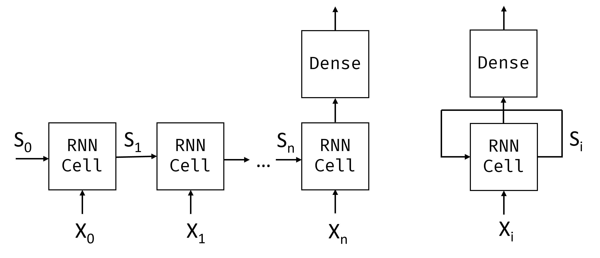

In the previous unit, we covered rich semantic representations of text. The architecture we've been using captures the aggregated meaning of words in a sentence, but it doesn't take into account the **order** of the words, because the aggregation operation that follows the embeddings removes this information from the original text. Because these models are unable to represent word ordering, they can't solve more complex or ambiguous tasks such as text generation or question answering.

To capture the meaning of a text sequence, we use a neural network architecture called **recurrent neural network**, or RNN. When using an RNN, we pass our sentence through the network one token at a time, and the network produces some **state**, which we then pass to the network again with the next token.



Given the input sequence of tokens $X_0,\dots,X_n$, the RNN creates a sequence of neural network blocks, and trains this sequence end-to-end using backpropagation. Each network block takes a pair $(X_i,S_i)$ as an input, and produces $S_{i+1}$ as a result. The final state $S_n$ or output $Y_n$ goes into a linear classifier to produce the result. All network blocks share the same weights, and are trained end-to-end using one backpropagation pass.

Because state vectors $S_0,\dots,S_n$ are passed through the network, the RNN is able to learn sequential dependencies between words. For example, when the word *not* appears somewhere in the sequence, it can learn to negate certain elements within the state vector.

Inside, each RNN cell contains two weight matrices: $W_H$ and $W_I$, and bias $b$. At each RNN step, given input $X_i$ and input state $S_i$, output state is calculated as $S_{i+1} = f(W_H\times S_i + W_I\times X_i+b)$, where $f$ is an activation function (often $\tanh$).

> [!NOTE]
> With problems like text generation or machine translation we also want to get some output value at each RNN step. In this case, there's also another matrix $W_O$, and output is calculated as $Y_i=f(W_O\times S_{i+1}+b_O)$, where $S_{i+1}$ is the updated state from the current step.

Let's see how recurrent neural networks can help us classify our news dataset with the following code:

```python
import tensorflow as tf
import keras
import tensorflow_datasets as tfds
import numpy as np

# We are going to be training pretty large models. In order not to face errors, we need
# to set tensorflow option to grow GPU memory allocation when required
physical_devices = tf.config.list_physical_devices('GPU') 
if len(physical_devices)>0:
    tf.config.set_memory_growth(physical_devices[0], True)

dataset = tfds.load('ag_news_subset')
ds_train = dataset['train']
ds_test = dataset['test']
```

When training large models, GPU memory allocation may become a problem. We also may need to experiment with different minibatch sizes, so that the data fits into our GPU memory, yet the training is fast enough. If you're running this code on your own GPU machine, you may experiment with adjusting minibatch size to speed up training.

> [!NOTE]
> Certain versions of nVidia drivers are known not to release the memory after training the model. We're running several examples in this unit, and it might cause memory to be exhausted in certain setups, especially if you're doing your own experiments. If you encounter some unusual errors when starting to train the model, you may want to restart your Python environment.

```python
batch_size = 16

embed_size = 64
```

## Simple RNN classifier

In the case of a simple RNN, each recurrent unit is a simple linear network, which takes in an input vector and state vector, and produces a new state vector. In Keras, this can be represented by the `SimpleRNN` layer.

While we can pass one-hot encoded tokens to the RNN layer directly, this isn't a good idea because of their high dimensionality. Therefore, we'll use an embedding layer to lower the dimensionality of word vectors, followed by an RNN layer, and finally a `Dense` classifier.

> [!NOTE]
> In cases where the dimensionality isn't so high, for example when using character-level tokenization, it might make sense to pass one-hot encoded tokens directly into the RNN cell.

```python
# We use a smaller vocabulary (20,000) here than in previous units because
# RNN models have more parameters per token, and a smaller vocabulary
# helps keep training time and memory usage manageable.
vocab_size = 20000

vectorizer = keras.layers.TextVectorization(max_tokens=vocab_size)

model = keras.Sequential([
    keras.Input(shape=(1,), dtype=tf.string),
    vectorizer,
    keras.layers.Embedding(vocab_size, embed_size),
    keras.layers.SimpleRNN(16),
    keras.layers.Dense(4,activation='softmax')
])

model.summary()
```

Running this code produces the following output:

```
Model: "sequential"
┏━━━━━━━━━━━━━━━━━━━━━━━━━━━━━━┳━━━━━━━━━━━━━━━━━━━━━━━━━━━┳━━━━━━━━━━━━━━━┓
┃ Layer (type)                 ┃ Output Shape              ┃       Param # ┃
┡━━━━━━━━━━━━━━━━━━━━━━━━━━━━━━╇━━━━━━━━━━━━━━━━━━━━━━━━━━━╇━━━━━━━━━━━━━━━┩
│ text_vectorization            │ (None, None)              │             0 │
│ (TextVectorization)          │                           │               │
├──────────────────────────────┼───────────────────────────┼───────────────┤
│ embedding (Embedding)        │ (None, None, 64)          │     1,280,000 │
├──────────────────────────────┼───────────────────────────┼───────────────┤
│ simple_rnn (SimpleRNN)       │ (None, 16)                │         1,296 │
├──────────────────────────────┼───────────────────────────┼───────────────┤
│ dense (Dense)                │ (None, 4)                 │            68 │
└──────────────────────────────┴───────────────────────────┴───────────────┘
 Total params: 1,281,364 (4.89 MB)
 Trainable params: 1,281,364 (4.89 MB)
 Non-trainable params: 0 (0.00 B)
```

> [!NOTE]
> We're using an untrained embedding layer here for simplicity, but for better results we can use a pretrained embedding layer using Word2Vec, as described in the previous unit. It would be a good exercise for you to adapt this code to work with pretrained embeddings.

Now let's train our RNN. RNNs in general are difficult to train, because once the RNN cells are unrolled along the sequence length, the resulting number of layers involved in backpropagation is large. Thus we need to select a smaller learning rate, and train the network on a larger dataset to produce good results. This can take quite a long time, so using a GPU is preferred.

To speed up things, we'll only train the RNN model on news titles, omitting the description. You can try training with description and see if you can get the model to train.

```python
def extract_title(x):
    return x['title']

def tupelize_title(x):
    return (extract_title(x),x['label'])

print('Training vectorizer')
vectorizer.adapt(ds_train.take(2000).map(extract_title))

model.compile(loss='sparse_categorical_crossentropy',metrics=['acc'], optimizer='adam')
model.fit(ds_train.map(tupelize_title).batch(batch_size),validation_data=ds_test.map(tupelize_title).batch(batch_size))
```

> [!NOTE]
> Accuracy is likely to be lower here, because we're training only on news titles.

## Revisiting variable sequences 

Remember that the `TextVectorization` layer will automatically pad sequences of variable length in a minibatch with pad tokens. It turns out that those tokens also take part in training, and they can complicate convergence of the model.

There are several approaches we can take to minimize the amount of padding. One of them is to reorder the dataset by sequence length and group all sequences by size. This can be done using the `tf.data.bucket_by_sequence_length` function (see [documentation](https://www.tensorflow.org/api_docs/python/tf/data/experimental/bucket_by_sequence_length)).

Another approach is to use **masking**. In Keras, some layers support additional input that shows which tokens should be taken into account when training. To incorporate masking into our model, we can either include a separate `Masking` layer ([docs](https://keras.io/api/layers/core_layers/masking/)), or we can specify the `mask_zero=True` parameter of our `Embedding` layer.

> [!NOTE]
> When using `mask_zero=True`, token index 0 is treated as padding and isn't a valid vocabulary entry. This means all vocabulary word indices are shifted by one. The `TextVectorization` layer already reserves index 0 for padding by default, so this works seamlessly when the two are used together.

```python
def extract_text(x):
    return x['title']+' '+x['description']

def tupelize(x):
    return (extract_text(x),x['label'])

model = keras.Sequential([
    keras.Input(shape=(1,), dtype=tf.string),
    vectorizer,
    keras.layers.Embedding(vocab_size,embed_size,mask_zero=True),
    keras.layers.SimpleRNN(16),
    keras.layers.Dense(4,activation='softmax')
])

model.compile(loss='sparse_categorical_crossentropy',metrics=['acc'], optimizer='adam')
model.fit(ds_train.map(tupelize).batch(batch_size),validation_data=ds_test.map(tupelize).batch(batch_size))
```

Now that we're using masking, we can train the model on the whole dataset of titles and descriptions.

## LSTM: Long short-term memory

One of the main problems of RNNs is **vanishing gradients**. RNNs can be long, and may have a hard time propagating the gradients all the way back to the first layer of the network during backpropagation. When this happens, the network can't learn relationships between distant tokens. One way to avoid this problem is to introduce **explicit state management** by using **gates**. The two most common architectures that introduce gates are **long short-term memory** (LSTM) and **gated recurrent unit** (GRU). We cover LSTMs here.


An LSTM network is organized in a manner similar to an RNN, but there are two states that are passed from layer to layer: the actual state $c$, and the hidden vector $h$. At each unit, the hidden vector $h_{t-1}$ is combined with input $x_t$, and together they control what happens to the state $c_t$ and output $h_{t}$ through **gates**. Each gate has sigmoid activation (output in the range $[0,1]$), which can be thought of as a bitwise mask when multiplied by the state vector. LSTMs have the following gates (from left to right on the picture above, following the convention from [Olah's blog](https://colah.github.io/posts/2015-08-Understanding-LSTMs/)):

- **forget gate** which determines which components of the vector $c_{t-1}$ we need to forget, and which to pass through. 
- **input gate** which determines how much information from the input vector and previous hidden vector should be incorporated into the state vector.
- **output gate** which takes the new state vector and decides which of its components will be used to produce the new hidden vector $h_t$.

The components of the state $c$ can be thought of as flags that can be switched on and off. For example, when we encounter the name *Alice* in the sequence, we guess that it refers to a woman, and raise the flag in the state that says we have a female noun in the sentence. When we further encounter the words *and Tom*, we'll raise the flag that says we have a plural noun. Thus by manipulating state we can keep track of the grammatical properties of the sentence.

While the internal structure of an LSTM cell may look complex, Keras hides this implementation inside the `LSTM` layer, so the only thing we need to do in the example above is to replace the recurrent layer:

```python
model = keras.Sequential([
    keras.Input(shape=(1,), dtype=tf.string),
    vectorizer,
    keras.layers.Embedding(vocab_size, embed_size),
    keras.layers.LSTM(8),
    keras.layers.Dense(4,activation='softmax')
])

model.compile(loss='sparse_categorical_crossentropy',metrics=['acc'], optimizer='adam')
model.fit(ds_train.map(tupelize).batch(batch_size),validation_data=ds_test.map(tupelize).batch(batch_size))
```

> [!NOTE]
> Training LSTMs is also slow, and you may not seem much increase in accuracy in the beginning of training. You may need to continue training for some time to achieve good accuracy.

## Bidirectional and multilayer RNNs

In our examples so far, the recurrent networks operate from the beginning of a sequence until the end. This feels natural to us because it follows the same direction in which we read or listen to speech. However, for scenarios, which require random access of the input sequence, it makes more sense to run the recurrent computation in both directions. RNNs that allow computations in both directions are called **bidirectional** RNNs, and they can be created by wrapping the recurrent layer with a special `Bidirectional` layer.

> [!NOTE]
> The `Bidirectional` layer makes two copies of the layer within it, and sets the `go_backwards` property of one of those copies to `True`, making it go in the opposite direction along the sequence.

Recurrent networks, unidirectional or bidirectional, capture patterns within a sequence, and store them into state vectors or return them as output. As with convolutional networks, we can build another recurrent layer following the first one to capture higher level patterns, built from lower level patterns extracted by the first layer. This leads us to the notion of a **multi-layer RNN**, which consists of two or more recurrent networks, where the output of the previous layer is passed to the next layer as input.


*Picture from [this post on multi-layer LSTMs](https://medium.com/data-science/from-a-lstm-cell-to-a-multilayer-lstm-network-with-pytorch-2899eb5696f3) by Fernando López.*

Keras makes constructing these networks an easy task, because you just need to add more recurrent layers to the model. For all layers except the last one, we need to specify `return_sequences=True` parameter, because we need the layer to return all intermediate states, and not just the final state of the recurrent computation.

The following code implements a two-layer bidirectional LSTM for our classification problem.

```python
model = keras.Sequential([
    keras.Input(shape=(1,), dtype=tf.string),
    vectorizer,
    keras.layers.Embedding(vocab_size, 128, mask_zero=True),
    keras.layers.Bidirectional(keras.layers.LSTM(64,return_sequences=True)),
    keras.layers.Bidirectional(keras.layers.LSTM(64)),    
    keras.layers.Dense(4,activation='softmax')
])

model.compile(loss='sparse_categorical_crossentropy',metrics=['acc'], optimizer='adam')
model.fit(ds_train.map(tupelize).batch(batch_size),
          validation_data=ds_test.map(tupelize).batch(batch_size))
```
