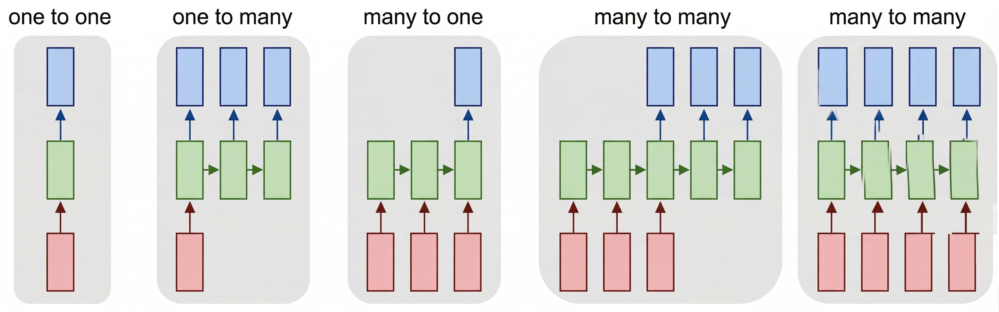
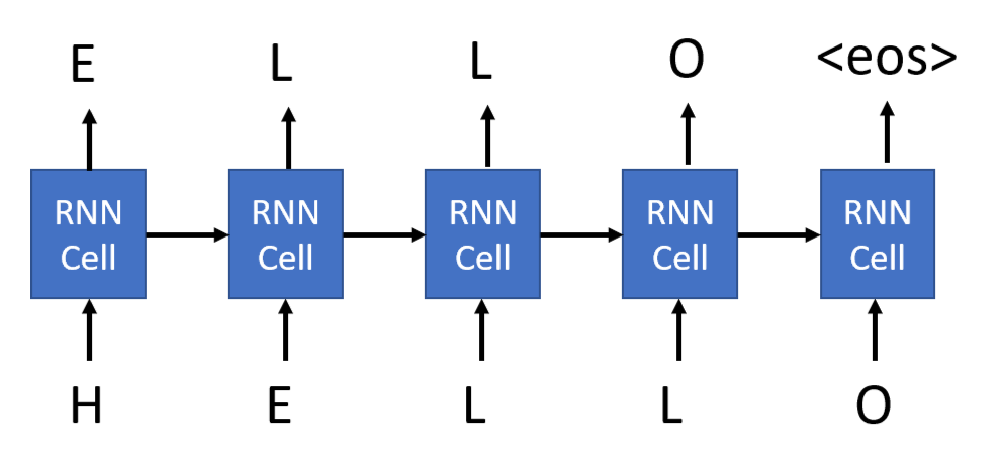

# Generative networks

Recurrent Neural Networks (RNNs) and their gated cell variants such as Long Short-Term Memory cells (LSTMs) and Gated Recurrent Units (GRUs) provide a mechanism for language modeling. RNNs can learn word ordering and make predictions for the next word in a sequence. This allows us to use RNNs for **generative tasks**, such as ordinary text generation, machine translation, and even image captioning.

In the RNN architecture we discussed in the previous unit, each RNN unit produced the next hidden state as an output. However, we could also add another output to each recurrent unit, which would allow us to output a **sequence** with the same length as the original sequence. Moreover, we could use RNN units that don't accept an input at each step, instead they take an initial state vector and produce a sequence of outputs.

This allows for different neural architectures, as is shown in the picture below:


*Image from blog post [Unreasonable Effectiveness of Recurrent Neural Networks](http://karpathy.github.io/2015/05/21/rnn-effectiveness/) by [Andrej Karpathy](http://karpathy.github.io/)*

- **One-to-one** is a traditional neural network with one input and one output.
- **One-to-many** is a generative architecture that accepts one input value, and generates a sequence of output values. For example, if we want to train an **image captioning** network that produces a textual description of a picture, we can use a picture as input, pass it through a CNN to obtain the hidden state, and then have a recurrent chain generate the caption word-by-word.
- **Many-to-one** corresponds to the RNN architectures we described in the previous unit, such as text classification.
- **Many-to-many**, or **sequence-to-sequence** corresponds to tasks such as **machine translation**, in which case the RNN first collects all the information from the input sequence into the hidden state, and then unrolls this state into the output sequence.

In this unit, we focus on simple generative models that help us generate text. For simplicity, let's build a **character-level network**, which generates text letter by letter. During training, we need to take a text corpus, and split it into letter sequences.

```python
import tensorflow as tf
import keras
import tensorflow_datasets as tfds
import numpy as np

# In this tutorial, we will be training a lot of models. In order to use GPU memory cautiously,
# we will set tensorflow option to grow GPU memory allocation when required.
physical_devices = tf.config.list_physical_devices('GPU') 
if len(physical_devices)>0:
    tf.config.set_memory_growth(physical_devices[0], True)

dataset = tfds.load('ag_news_subset')
ds_train = dataset['train']
ds_test = dataset['test']
```

## Building character vocabulary

To build a character-level generative network, we need to split the text into individual characters instead of words. The `TextVectorization` layer that we've been using can't do that directly, so we build a simple character-level tokenizer manually. You can also refer to [this official Keras example](https://keras.io/examples/generative/lstm_character_level_text_generation/) for an alternative approach.

We build our character vocabulary by scanning the training titles:

```python
def extract_text(x):
    return x['title']+' '+x['description']

def tupelize(x):
    return (extract_text(x),x['label'])

# Build character vocabulary from training titles
chars = set()
for x in ds_train:
    chars.update(x['title'].numpy().decode('utf-8'))

# Create character-to-index and index-to-character mappings
# Reserve index 0 for padding
char_to_idx = {ch: i+1 for i, ch in enumerate(sorted(chars))}
idx_to_char = {i: ch for ch, i in char_to_idx.items()}
```

We also want to use one special token to denote **end-of-sequence**, which we call `<eos>`. Let's add it manually to the vocabulary:

```python
eos_token = len(char_to_idx)+1
char_to_idx['<eos>'] = eos_token
idx_to_char[eos_token] = '<eos>'

vocab_size = eos_token + 1
```

Now, to encode text into sequences of numbers, we can write a helper function:

```python
def texts_to_sequences(texts):
    return [[char_to_idx.get(ch, 0) for ch in text] for text in texts]

texts_to_sequences(['Hello, world!'])
```

## Training a generative RNN to generate titles

Here's how we train an RNN to generate titles: on each step, we'll take one title as input, and for each input character in that title, we'll train the network to generate the next character as output:



For the last character of our sequence, we ask the network to generate the `<eos>` token.

The main difference between the generative RNN we're using here and the RNNs we've seen previously is that each cell of the generative RNN will produce an output, not just the final cell. This can be achieved by specifying the `return_sequences` parameter of the RNN cell.

Thus, during training, an input to the network would be a sequence of encoded characters of some length, and the corresponding output would be a sequence of the same length, but shifted by one element and terminated by `<eos>`. The minibatch will consist of several such sequences, and we need to use **padding** to align all sequences.

Let's create functions that transform the dataset for us. Because we want to pad sequences at the minibatch level, we'll first create the minibatches by calling `.batch()`, and then use `map` to do transformation. Here's the code for the function that does the transformation, which takes a whole minibatch as a parameter:

```python
def title_batch(x):
    x = [t.numpy().decode('utf-8') for t in x]
    z = texts_to_sequences(x)
    z = keras.utils.pad_sequences(z)
    return tf.one_hot(z,vocab_size), tf.one_hot(tf.concat([z[:,1:],tf.constant(eos_token,shape=(len(z),1))],axis=1),vocab_size)
```

A few important things that we do here:
* We first extract the actual text from the string tensor.
* `texts_to_sequences` converts the list of strings into a list of integer tensors.
* `pad_sequences` pads those tensors to their maximum length.
* We finally one-hot encode all the characters, and also do the shifting and `<eos>` appending. We'll soon see why we need one-hot-encoded characters.

However, this function is **Pythonic**. This function can't be automatically translated into the TensorFlow computational graph. If we try to pass it directly to the `Dataset.map` function, which is how we intend to use this function, we get an error. To get around this problem, we need to enclose this Pythonic call by using the `py_function` wrapper:

```python
def title_batch_fn(x):
    x = x['title']
    a,b = tf.py_function(title_batch,inp=[x],Tout=(tf.float32,tf.float32))
    a.set_shape([None, None, vocab_size])
    b.set_shape([None, None, vocab_size])
    return a,b
```

> [!NOTE]
> In Keras 3, the output of `tf.py_function` has unknown shapes by default, which causes errors with layers like `Masking` and `LSTM` that need to know the rank of the input tensor. We use `set_shape` to tell TensorFlow the expected tensor dimensions.

> [!NOTE]
> You might be wondering if instead of calling the `py_function` wrapper we could transform the dataset using standard Python functions before passing it to `fit`. While this can definitely be done, when using `Dataset.map` the data transformation pipeline is executed using TensorFlow's computational graph, which takes advantage of GPU computations and minimizes the need to pass data between CPU/GPU.

We can now build our generator network and start training. Our network can be based on any recurrent cell, which we discussed in the previous unit (simple, LSTM, or GRU). In our example, we use LSTM.

Because the network takes characters as input, the vocabulary size is small. Therefore we don't need an embedding layer. We can feed one-hot-encoded input directly into the LSTM cell. The output layer is then a `Dense` classifier that will convert the LSTM output into one-hot-encoded token numbers.

In addition, since we're dealing with variable-length sequences, we can use a `Masking` layer to create a mask that will ignore the padded part of the string. This isn't strictly needed, because we're not interested in everything that goes beyond the `<eos>` token, but we use it to get some experience with this layer type. The input shape is `(None, vocab_size)`, where `None` indicates the sequence of variable length, and the output shape is also `(None, vocab_size)`, as you can see from the `summary` printout:

```python
model = keras.Sequential([
    keras.Input(shape=(None,vocab_size)),
    keras.layers.Masking(),
    keras.layers.LSTM(128,return_sequences=True),
    keras.layers.Dense(vocab_size,activation='softmax')
])

model.summary()
model.compile(loss='categorical_crossentropy')

model.fit(ds_train.batch(8).map(title_batch_fn))
```

Running this code produces the following output:

```
Model: "sequential"
┏━━━━━━━━━━━━━━━━━━━━━━━━━━━━━━┳━━━━━━━━━━━━━━━━━━━━━━━━━━━┳━━━━━━━━━━━━━━━┓
┃ Layer (type)                 ┃ Output Shape              ┃       Param # ┃
┡━━━━━━━━━━━━━━━━━━━━━━━━━━━━━━╇━━━━━━━━━━━━━━━━━━━━━━━━━━━╇━━━━━━━━━━━━━━━┩
│ masking (Masking)            │ (None, None, 84)          │             0 │
├──────────────────────────────┼───────────────────────────┼───────────────┤
│ lstm (LSTM)                  │ (None, None, 128)         │       109,056 │
├──────────────────────────────┼───────────────────────────┼───────────────┤
│ dense (Dense)                │ (None, None, 84)          │        10,836 │
└──────────────────────────────┴───────────────────────────┴───────────────┘
 Total params: 119,892 (468.33 KB)
 Trainable params: 119,892 (468.33 KB)
 Non-trainable params: 0 (0.00 B)
15000/15000 ━━━━━━━━━━━━━━━━━━━━ 273s 18ms/step - loss: 1.5460
```

## Generating output

Now that we've trained the model, we want to use it to generate output. First of all, we need a way to decode text represented by a sequence of token numbers. We use the `idx_to_char` mapping we built earlier:

```python
def decode(x):
    return ''.join([idx_to_char.get(t,'') for t in x])
```

To do the generation, we first encode a string passed as parameter into a sequence, and then on each step we call our network to infer the next character.

The output of the network is a vector of `vocab_size` elements representing probabilities of each token, and we can find the most probably token number by using `argmax`. We then append this character to the generated list of tokens, and proceed with the generation. This process of generating one character is repeated `size` times to generate the required number of characters, and we terminate early if `eos_token` is encountered.

```python
def generate(model,size=100,start='Today '):
        chars = texts_to_sequences([start])[0]
        for i in range(size):
            out = model(tf.expand_dims(tf.one_hot(chars,vocab_size),0))[0][-1]
            nc = tf.argmax(out)
            if nc==eos_token:
                break
            chars.append(nc.numpy())
        return decode(chars)
    
generate(model)
```

## Sampling output during training

Because we don't have any useful metrics such as *accuracy*, the only way we can see that our model is getting better is by **sampling** generated strings during training. We use **callbacks** for that, which are functions that we can pass to the `fit` function, and that is called periodically during training. We can do this with the following code:

```python
sampling_callback = keras.callbacks.LambdaCallback(
  on_epoch_end = lambda batch, logs: print(generate(model))
)

model.fit(ds_train.batch(8).map(title_batch_fn),callbacks=[sampling_callback],epochs=3)
```

This example can be improved in several ways:

- **More text**. We only used titles for our task, but you can experiment with full text. Remember that RNNs aren't that great at handling long sequences, so it makes sense to either split them into shorter sentences, or to always train on a sequence of fixed length `num_chars` (say, 256). You might try to change the example above into this architecture, using the [official Keras tutorial](https://keras.io/examples/generative/lstm_character_level_text_generation/) as inspiration.
- **Multilayer LSTM**. It makes sense to try 2 or 3 layers of LSTM cells. As we mentioned in the previous unit, each layer of LSTM extracts certain patterns from the text, and in the case of a character-level generator we can expect lower LSTM levels to be responsible for extracting syllables, and higher levels to extract words and word combinations. This can be implemented by adding layers sequentially to the model.
- You might also want to experiment with **GRU units** and see which one performs better, and with **different hidden layer sizes**. A hidden layer that's too large might result in overfitting (because the network learns the exact text), and a hidden layer that's too small might not produce good results.

## Soft text generation and temperature

In the code for the `generate` function, we took the character with the highest probability as the next character in the generated text. This resulted in text that cycles between the same character sequences again and again, like in this example:

```
today of the second the company and a second the company ...
```

However, if we look at the probability distribution for the next character, it might be that there are several high probabilities that are similar. For example, when looking for the next character in the sequence '*play*', it's similarly likely that it's either space or **e** (as in the word *player*).

Therefore, it's not always the best choice to select the character with the absolute highest probability. Choosing the character with the second or third highest might still lead to meaningful text, and might avoid cycling through character sequences. Therefore, a better strategy is to **sample** characters from the probability distribution given by the network output.

This sampling can be done using the `np.multinomial` function, which implements a **multinomial distribution**. 

> [!NOTE]
> In this implementation, we apply temperature to the output probabilities (after softmax) rather than to logits (before softmax). This is mathematically equivalent to raising each probability to the power of $1/\text{temperature}$ and renormalizing. The standard convention in the literature applies temperature to logits before softmax, which can be more numerically stable for extreme temperature values. Both approaches produce equivalent results for moderate temperature values.

```python
def generate_soft(model,size=100,start='Today ',temperature=1.0):
        chars = texts_to_sequences([start])[0]
        for i in range(size):
            out = model(tf.expand_dims(tf.one_hot(chars,vocab_size),0))[0][-1]
            probs = tf.exp(tf.math.log(out)/temperature).numpy().astype(np.float64)
            probs = probs/np.sum(probs)
            nc = np.argmax(np.random.multinomial(1,probs,1))
            if nc==eos_token:
                break
            chars.append(nc)
        return decode(chars)

words = ['Today ','On Sunday ','Moscow, ','President ','Little red riding hood ']
    
for i in [0.3,0.8,1.0,1.3,1.8]:
    print(f"\n--- Temperature = {i}")
    for j in range(5):
        print(generate_soft(model,size=300,start=words[j],temperature=i))
```

Running this code generates the following output:

```
--- Temperature = 0.3
Today #39;s strong to be in Iraq line at US first profit
On Sunday DS #39; Market Shot to Expect (AP)
Moscow, SP completes street to share maker straight talks
President Sutel to Return in The Takeover Three Street (AP)
Little red riding hood for talks to hit on to start in Iraq

--- Temperature = 0.8
Today olies safel fate withdraws to leave  #39;Profit #39; smathe off the meet
On Sunday BC - Miscripys Southern dead in Iraq
Moscow, SP to up air burine with Mart oppositive, MySWilliers price stand
President Israli Wasted Predemation Retailers for Mondain Convent
Little red riding hood field skyallingnaul by buys

--- Temperature = 1.0
Today casop Symantec family start worries With Montreal evi
On Sunday DA in Loest Piofut For Afghan Minister (AP)
Moscow, S TSVRCIA Forting Have Black Chapfers #39; In Ractor
President iveshight arophis, remain from collemen shipal back (AFP)
Little red riding hood gin calp sold, not to target

--- Temperature = 1.3
Today S economy Jobs Giving 0 6 Wein trager
On Sunday cold Must 3T0-core U.S. stand of puperahinmer;'
Moscow, WA way to hope Mitran's fidsnen-from strike bad
President C., Gazu Sched and Supilicibant-High Inote Found, to View: Terrent &lt;b&gt;...&lt;/b&gt;
Little red riding hood freals lower;  #39;Vioxhercen, a batte title fors 3

--- Temperature = 1.8
Today meris Blaars 35 butifyra, MusaurakifuIs Hubids
On Sunday M?
Moscow, Is Wircosts-yniuvs' ahaf bivck', F.Hffile
President Wrlfestlps Ado, 'W. Tough Wins USUsi AK Deby, \$6 - MogsuBNARTVISGAK, Passu: (Reuters)
Little red riding hood 3 U.L1jn doem'sb-love usquatefwh rave miss outmufl
```

The **temperature** parameter allows us to indicate how strongly we should choose higher probability characters over lower probability ones. If the temperature is close to 0, we choose the highest probability character, and when the temperature approaches infinity then all probabilities become equal, and we randomly select the next character. In the example above we can observe that the output becomes meaningless when we increase the temperature too much, and starts cycling when we lower it closer to 0.
