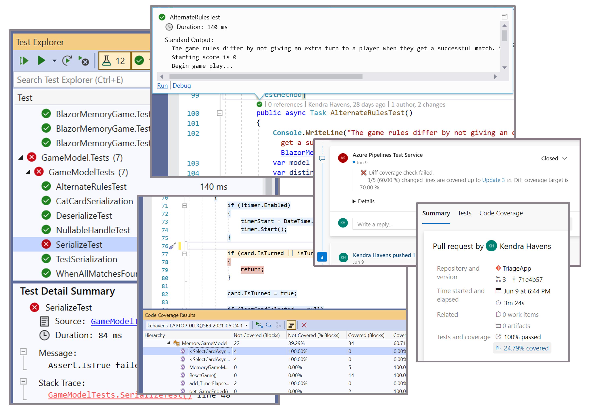

<!-- 1. Topic sentence(s) --------------------------------------------------------------------------------

    Goal: briefly orient the learner to the product; what category of problem does it solve?

    Heading: none

    Example: "Implementing a business process can be challenging because you typically need to make diverse services work together. Think about everything your company uses to store and process data: Salesforce, Microsoft 365, Oracle, Twitter, YouTube, Dropbox, Google services, Azure Cognitive Services, and so on. How do you integrate all these products? Azure Logic Apps gives you pre-built components to connect to hundreds of services. You use a graphical design tool to put the pieces together in any combination you need and Logic Apps will run your process automatically in the cloud."

    Recommended: visual like an image (preferred), table, list, etc.

    [Introduction unit guidance](https://review.docs.microsoft.com/learn-docs/docs/id-guidance-introductions?branch=master#rule-use-the-standard-module-introduction-format)
-->

# Introduction to Testing concepts

There are many reasons you may be interested in starting testing. Perhaps your manager, mentor, or professor just asked you to add tests to your code. Maybe your company is interested in improving code quality and catching bugs faster. Maybe another developer asked what your code coverage is like in a discussion on code quality. Maybe the behavior of your app is growing quickly and you need a formal way to capture and check all functionality as your project continues to scale. This learning module will cover why we test and a brief introduction to testing software best practices. We'll go over different types of testing starting at the most fundamental level, unit tests. We'll also touch on various schools of thought around testing. There are limitless testing technologies out there, but no matter your language or software stack, this guidance should help you to get a grasp of the basic concepts and help you avoid common pitfalls. If you want to get started testing right away see the [Create tests C# tutorial](../../visual-studio-test-tools/resources/design-doc.md) that dives into writing, running, and managing tests.

<!-- 2. Scenario -----------------------------------------------------------------------------------------

    Goal: Describe the real-world scenario you'll use to illustrate the product. Include 2-3 customer tasks that represent the most-common use cases for the product.

    Heading: "## Example scenario"

    Example: "Suppose you work at an athletic shoe company that is launching a new product. You sell the shoes on your website, manage your cloud-hosted advertising videos, and monitor social media to gauge reactions to the launch. The following illustration shows these processes. Notice how the tasks include both customer-facing processes like direct sales and administrative tasks like auto-archiving old videos. Here, you'll see how Logic Apps automates these types of business processes."

    Recommended: an image that visualizes the scenario

    [Scenario guidance](https://review.docs.microsoft.com/learn-docs/docs/id-guidance-scenarios)
 -->

## Example scenario

Example: "Suppose you are building a website that allows users to shop your products online and you need to start selling internationally. You have extended the phone numbers in your customer information logic to accept international numbers, but you've started getting calls form customer service that the existing numbers in your database have stopped working. It looks like your new behavior caused a bug that broke the way the domestic phone numbers were being saved to your database. Tests could have helped you catch that change in functionality earlier by making sure new functionality does not regress old functionality.
<!-- 3. Prose table-of-contents --------------------------------------------------------------------------

    Goal: List the activities the learner will do. This differs from the learning objectives. The learning objectives are "outcome focused"; that is, they describe the skills the learner will acquire as a result of consuming this content. By contrast, here you should be specific about what the learning will **do** in order to acquire those skills. The format can be either prose or bulleted-list; however, a list will yield better results when transformed into other output types such as PowerPoint.

    Heading: "## What will we be doing?"

    Example: "We’ll analyze the capabilities of Logic Apps to help you decide when to use them:
                * **Launch**: what conditions can you set to launch your app?
                * **Connect**: which services can you connect to?
                * **Branch**: what types of business logic can you add to your app?"

 -->

## What will we be doing?

We'll learn the capabilities of tests and help you decide when to use different types of tests and different schools of thought:

* **Identify**: what can testing help you achieve?**
* **Choose**: what types of tests will help you achieve your goal?
* **Exercise**: what testing schools of thought will your team follow to improve testing habits?

<!-- 4. Terminal learning objective ----------------------------------------------------------------------

    Goal: The title of an "Introduction to (product)" module tells our customers that this is a good place to start their learning. This helps our customers find the right content quickly. The trade-off is that the title does not reflect the terminal learning objective of the module. Here, you explain that this module teaches the 'evaluate' task. To do this, you:
        - Start with your 'evaluate' learning objective
        - Make it a complete sentence if it's not already
        - Use plain language so it sounds conversational
        - Include the lead-in shown below ("By the end...")

    Heading: "## What is the main goal?"

    Example: "By the end of this session, you'll be able to decide whether Logic Apps is a good choice to automate your business processes."

 -->

## What is the main goal?

By the end of this session, you'll be able to evaluate how testing can improve your code quality.

<!-- Do **not** include any other content like learning objectives, prerequisites, unit summary, "next unit" lead-in, or references. -->