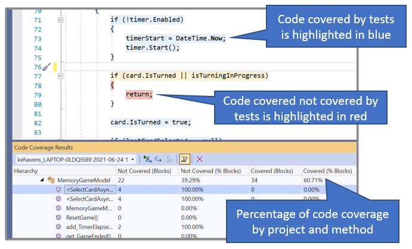

# Why We Test

<!-- 1. Topic sentence(s) --------------------------------------------------------------------------------

    Goal: state what's in this unit and how it aligns to the 'describe' learning objective.

    Pattern:
        One paragraph of 2-3 sentences:
            Sentence 1: State that this unit addresses ("how it works").
            Sentence 2: State that this unit targets this learning objective: "Describe how (features) of (product) work to (solve problem)."
            Sentence 3-4 (optional): Give the rationale ("helps you decide if it will meet your needs").
        Table-of-contents as a bulleted list (do not simply list every heading you'll have on the page, group them into about 3 high-level areas).

    Heading: none

    Example: "Here, we'll discuss how Logic Apps works behind the scenes. You'll learn about all the pieces of Logic apps and see how they fit together into an app. This knowledge will help you decide whether Logic Apps will work for you without any customization. In cases where you do need to create custom components, you'll be able to determine how difficult it will be.
        * Connectors, triggers, actions
        * Control actions
        * Logic Apps Designer"
-->
Testing can be a powerful tool to improve the quality, architecture, and overall health of a code base. You'll find many strong examples of the positive impact of testing across the software industry.

* Validating code changes and quality
* Industry examples
* Testing effects on architecture
* Code coverage and code health

## Validating code changes and quality

Any successful software tends to grow in functionality and behavior. Sometimes it can grow beyond what the first creators ever imagined in order to support more scenarios and customer requests. As functionality grows, it can become more and more difficult for a single developer to remember all the functionality it contains or keep track of how to preserve that functionality. Tests not only keep track of the different capabilities of a program, but they can also continue to check the old functionality did not break as new code is added. A fundamental purpose of testing is validating that code changes don't break existing functionality and provide a way of ensuring that newly added code will continue to work as expected even with future changes.

Tests can help catch bugs before you even check-in your code changes. It's best practice to run tests before major steps in your development cycle. This final check allows you to improve your code quality so your users don't have to report that something broke in your latest update. It's much nicer to catch bugs while you are still developing the code rather than a when you are in the middle of deploying your app or when the app is in production with customers using it!

## Industry examples

A good example of the power of testing can be found in the C# compiler itself! Millions of developers write code in C# every day. Have you ever wondered how tools can keep adding language features and releasing new language versions without breaking existing code? Tests provide a final set of hundreds of thousands of checks to make sure previous scenarios still work. There is no way one person, or even one team could remember all those scenarios. This is especially true when you consider that the C# compiler is [open source](https://github.com/dotnet/roslyn) and accepts contributions from a world-wide community of developers. The C# compiler team can accept changes from the community with confidence, in part, because of the checks that testing provides. Testing is helpful for individuals and at the team-level, allowing you to scale your product and your team as they grow.

## Testing effects on architecture

Testing can also force some architecture improvement. You can't unit test your code if it is structured as one gigantic method. Tests can help you break up all the functions of your code into more modular components. This can reduce repetition, improve stability, and even make your code easier to read and navigate. For example, if you are using the same logic in many places through out your app and then realize there is a problem with it, you'll have to find and update all the places you used it. Instead, if you use a method, you only need to update it once, because even though that method is called many times throughout your app, you only wrote the logic once in the body of the method. Testing helps you pause and consider if you are repeating the same logic multiple times and could use a method instead. It provides developers a chance to restructure code for the best re-usability and stability going forward.

## Code coverage and code health

Code coverage is a metric indicating how much of an app's production code is covered by tests. It indicates if tests actually exercise all the product code, including branching logic, method overloads, etc. Code coverage can give a basic idea of what areas need more testing. Visual Studio even has tools that can [highlight what lines are covered by tests](https://docs.microsoft.com/visualstudio/test/using-code-coverage-to-determine-how-much-code-is-being-tested) and what aren't in your editor.

Tracking the code coverage percentage overtime can give you an idea if the new code being added to your repository has tests. If new code isn't being tested, it *may* be an indication the repository is building up technical debt. While code coverage is useful, it is *not* an ultimate indication of repo health. It should only be one of many factors used to assess the health of a repo. Different code coverage engines can calculate coverage differently and many programs may appear to have low coverage, despite being well tested. For example, heavily testing certain methods that have extremely high use, and ignoring others may actually be the right thing to do for a given repo. We would not encourage every repo to try to achieve 100% code coverage because that is not a practical investment for many businesses. There is much debate if there is a universal code coverage percentage that repositories should aspire too, but we believe for now the best guidance is to judge on a case-by-case basis and not arbitrarily hold your team to a number without a deeper discussion.

<!-- - - - - - - - - - - - - - - - - - - - - - - - - - - - - - - - - - - - - - - - -->

<!-- Do not add a unit summary or references/links -->