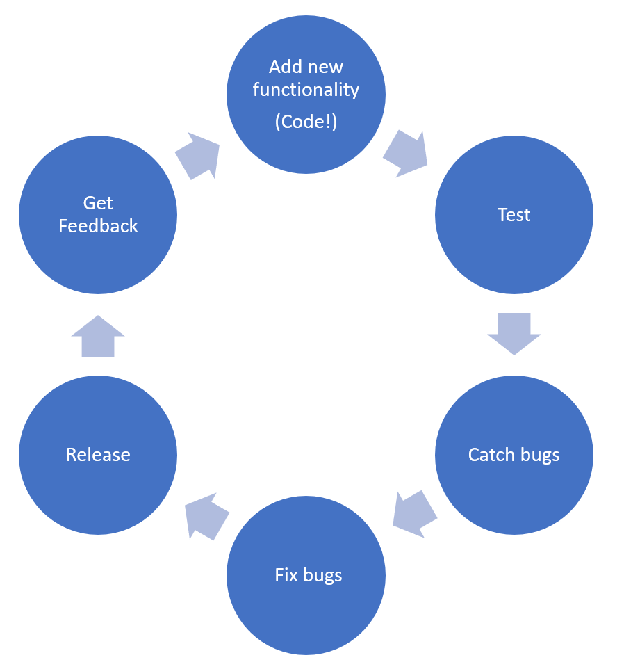
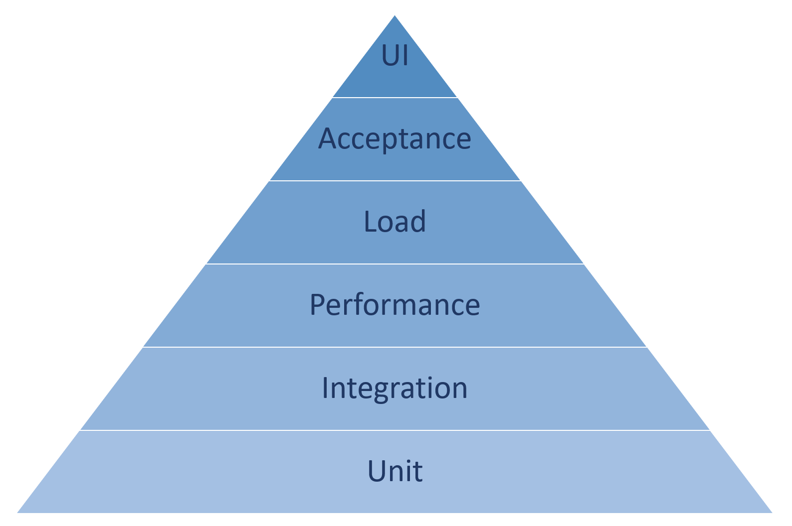

# Title

Introduction to testing concepts

## Role(s)

- developer
- student

## Level

- beginner

## Product(s)

- dotnet
- dotnet-core
- visual-studio

## Prerequisites

- Ability to write C# at the beginner level with C# concepts including writing methods and creating projects.
- Basic familiarity with debugging an app.

## Summary

Learn the common best practices, theory, and anti-patterns to avoid when writing tests.

## Learning objectives

1. Understand why we test
1. Explore different types of testing and the testing pyramid
1. Schools of thought when it comes to testing

## Chunk your content into subtasks

| Subtask | What part of the introduction scenario does this subtask satisfy? | How will you assess it: **Exercise or Knowledge check**? | Which learning objective(s) does this help meet? | Does the subtask have enough learning content to justify an entire unit? If not, which other subtask will you combine it with? |
| ---- | ---- | ---- | ---- | ---- |
| Validating code changes and quality | Why we test | Knowledge Check | 1 | No, combine with why we test |
| Industry examples | Why we test | Knowledge Check | 1 | No, combine with why we test |
| Testing effects on architecture | Why we test | Knowledge Check | 1 | No, combine with why we test |
| Code coverage and code health | Why we test | Knowledge Check | 1 | No, combine with why we test |
| Types of testing and the testing pyramid | Types of testing and the testing pyramid | Knowledge Check | 2 | Yes |
| TDD, DRY, Red/Green/Refactor, BDD | Schools of thought | Knowledge Check | 3 | No, combine with Schools of thought |
| Choose what works for you | Schools of thought | Knowledge Check | 3 | No, combine with Schools of thought |

## Outline the units

1. **Introduction**

    There are many reasons you may be interested in starting testing. Perhaps your manager, mentor, or professor just asked you to add tests to your code. Maybe your company is interested in improving code quality and catching bugs faster. Maybe another developer asked what your code coverage is like in a discussion on code quality. Maybe the behavior of your app is growing quickly and you need a formal way to capture and check all functionality as your project continues to scale. This learning module will cover why we test and a brief introduction to testing software best practices. We'll go over different types of testing starting at the most fundamental level, unit tests. We'll also touch on various schools of thought around testing. There are limitless testing technologies out there, but no matter your language or software stack, this guidance should help you to get a grasp of the basic concepts and help you avoid common pitfalls.

    If you want to get started testing right away see the [Create tests C# tutorial](../../visual-studio-test-tools/resources/design-doc.md) that dives into writing, running, and managing tests.

1. **Why we test**

    - Validating code changes and quality
        - Any successful software tends to grow in functionality and behavior. Sometimes it can grow beyond what the first creators ever imagined in order to support more scenarios and customer requests. As functionality grows, it can become more difficult for a single developer to remember all the functionality it contains or keep track of how to preserve that functionality. Tests not only keep track of the different capabilities of a program, but they can also continue to check the old functionality did not break as new code is added. A fundamental purpose of testing is validating that code changes don't break existing functionality and provide a way of ensuring that newly added code will continue to work as expected even with future changes.

        

        - Tests can help catch bugs before you even check-in your code changes. It's best practice to run tests before major steps in your development cycle. This final check allows you to improve your code quality so your users don't have to report that something broke in your latest update. It's much nicer to catch bugs while you are still developing the code rather than a when you are in the middle of deploying your app or when the app is in production with customers using it!
    - Industry examples
        - A good example of the power of testing can be found in the C# compiler itself! Millions of developers write code in C# every day. Have you ever wondered how tools can keep adding language features and releasing new language versions without breaking existing code? Tests provide a final set of hundreds of thousands of checks to make sure previous scenarios still work. There is no way one person, or even one team could remember all those scenarios. This is especially true when you consider that the C# compiler is [open source](https://github.com/dotnet/roslyn) and accepts contributions from a world-wide community of developers. The C# compiler team can accept changes from the community with confidence, in part, because of the checks that testing provides. Testing is helpful for individuals and at the team-level, allowing you to scale your product and your team as they grow.
    - Testing effects on architecture
        - Testing can also force some architecture improvement. You can't unit test your code if it is structured as one gigantic method. Tests can help you break up all the functions of your code into more modular components. This can reduce repetition, improve stability, and even make your code easier to read and navigate. For example, if you are using the same logic in many places throughout your app and then realize there is a problem with it, you'll have to find and update all the places you used it. Instead, if you use a method, you only need to update it once, because even though that method is called many times throughout your app, you only wrote the logic once in the body of the method. Testing helps you pause and consider if you are repeating the same logic multiple times and could use a method instead. It provides developers a chance to restructure code for the best re-usability and stability going forward.
    - Code Coverage and code health
        - Code coverage is a metric indicating how much of an app's production code is covered by tests. It indicates if tests actually exercise all the product code, including branching logic, method overloads, etc. Code coverage can give a basic idea of what areas need more testing. Visual Studio even has tools that can [highlight what lines are covered by tests](https://docs.microsoft.com/visualstudio/test/using-code-coverage-to-determine-how-much-code-is-being-tested) and what aren't in your editor.
        - Tracking the code coverage percentage overtime can give you an idea if the new code being added to your repository has tests. If new code isn't being tested, it *may* be an indication the repository is building up technical debt. While code coverage is useful, it is *not* an ultimate indication of repo health. It should only be one of many factors used to assess the health of a repo. Different code coverage engines can calculate coverage differently and many programs may appear to have low coverage, despite being well tested. For example, heavily testing certain methods that have extremely high use, and ignoring others may actually be the right thing to do for a given repo. We would not encourage every repo to try to achieve 100% code coverage because that is not a practical investment for many businesses. There is much debate if there is a universal code coverage percentage that repositories should aspire too, but we believe for now the best guidance is to judge on a case-by-case basis and not arbitrarily hold your team to a number without a deeper discussion.

    1. **Knowledge check**

        - Which of these is **not** a benefit of testing:
            - Tests encourage a more modular architecture.
            - **The code coverage tests provide is the ultimate indication of repo health.**
            - Tests help keep track of the different capabilities of a program.
            - Tests help large repositories built by a community avoid bugs by providing checks for both old and new behavior.

        - The correct code coverage goal in a repo is:
            - 100%
            - 70%
            - 50%
            - **There is no one true answer. Your code coverage goal depends on the repository.**

1. **Types of testing and the testing pyramid**

    - The Testing pyramid
        - The testing pyramid has been popularized over the past several years to explain the different types of testing and how common each of them are in software. You can find many different versions of the testing pyramid out there and its use is still debated, but we'll try to provide a simple and uncontroversial explanation. The base of the pyramid is made up of unit tests. These are typically the easiest tests to write, maintain as code changes, and run the fastest. For many users, unit tests are the first introduction to testing. As you climb the pyramid, the tests usually become more expensive to write, maintain, and run, but they can still provide high value though there are usually fewer of these types.

        

    - Unit
        - Unit tests are the most basic types of tests. They should be specific to one method or one function. A method can have many unit tests to cover all its functionality given a range of parameters. These are the easiest to write and also the easiest to debug because they should be the simplest way to exercise the piece of code that they test.
        - For example, let's say you have a method that parses a postal address from a string of input. Good unit tests for this method would insert many kinds of different postal addresses to make sure they were parsed correctly by the method and matched the expected result. One unit test may insert a postal address from a different country as a string. Another may insert a string that had special characters to make sure it doesn't break your parser. Unit tests should be testing small aspects of the behavior of your app so that, if the test fails, it's easy to determine what behavior failed.
    - Integration
        - Integration tests are the next step up from unit tests. They may cover multiple methods or a broader set of behavior than unit tests.
        - Going back to our postal address example, an integration test could test both the postal addresser parse and a method for calculating a shipping rate for that location. The two combined help summarize if multiple parts of your app are working together as expected.
    - Performance
        - Performance tests usually capture the time it takes certain parts of your program to execute. Performance tests are a great way to catch a code change that slows down your app. You can set timers at the beginning of tests that only complete when the test is finished executing and report a test failure if the timer was above a certain threshold.
    - Load
        - Load tests can be similar to performance testing, but focuses more on using your app at scale. How does the app hold up with 1000 users are using it? 10,000 users? Load tests help determine if your app is slowing down or throwing exceptions when under stress.
    - Acceptance
        - Acceptance tests can be tests that guide the business desired outcome. If your customer gave you a list of criteria for the app, you can write acceptance tests that only pass once all of those criteria are met. Acceptance tests are another way of integrating your spec with your code.
    - UI
        - UI tests can directly test the UI interactions of an app. This is meant to mimic an actual user clicking and interacting with your app and testing if the UI response is correct. There are many frameworks that can automate UI interactions. For example, [Playwright](https://playwright.dev/dotnet/docs/why-playwright) can automate the browser to mimic a user using your website.
        - Another type of UI testing is manual testing. Manual testing is when an actual person uses your app. Having a user test out your app before it is released has some advantages and disadvantages. It can be a slower type of testing because it can take a while to describe how to use the app to a new user and it may be difficult to repeat the exact same steps every time. The major advantage is higher confidence that the app is ready for real human customers and nothing was missed because the app was used by more than just automation.
        - A word of caution, it's easy to invest in UI tests because they can seem like the most direct representation of what users are experiencing when using your app. The industry rapidly embraced UI Tests when they first appeared on the scene for this very reason. The disadvantage was that UI also rapidly changes so all the tests you write may need consistent updates even for a small change. Be wary of writing too many UI tests that will need a high investment to keep up to date as your app grows. Many modern UI testing frameworks specifically address this ability to keep UI tests up to date, so it's good to look for platforms that also enable easier maintainability as you test.
    - Since the industry is ever evolving better ways to ensure code quality with tests there are likely many more types of tests not listed here, but these are the major ones. The testing pyramid itself may need to be re-written or re-shaped as better software practices and development technologies evolve how we think and test.

    1. **Knowledge check**

        What types of questions will test *the different types of testing*? *[(Knowledge check guidance)](/help/learn/id-guidance-knowledge-check)*

        - What is the most common type of test?
            - Integration
            - UI
            - **Unit**
            - Acceptance
        - If I want to test how my app scales with multiple users using it, what type of test am I likely to write?
            - **Load**
            - Unit
            - Integration
            - Performance

1. **Schools of thought**

    - Test Driven Development (TDD)
        - Test driven development, often referred to as TDD, is a method of directly coupling testing with every part of your day-to-day development. Developers who use TDD typically start developing by first writing a test that fails and then writing the code that makes the test pass. This means product code is more likely to get very high test coverage and the tests typically come first. Many developers find this useful to help them prioritize good architecture from the start of development and stay laser focused on each part of the functionality they need to implement. This school of thought advocates for testing not being an after-thought of development, but rather a driving force.
        - There is a type of TDD called Red/Green/Refactor that gives further order to this process: (1) Write a failing "red" test (2) Add the necessary product code to make that test pass or turn "green" (3) "refactor" now that you have the correct functionality. This pattern provides an easy guide as you get into a programming flow.
    - Behavior Driven Development
        - Behavior driven development (or BDD) is very similar to TDD, but with greater focus on using acceptance tests to guide development at a high level. You may work with your customers, business partners, or program managers to define a set of tests that list the needed criteria for the product. These tests are usually much higher-level descriptions of functionality than unit tests and are more business-oriented.
    - DRY (Don't Repeat Yourself)
        - Don't Repeat Yourself, also known as DRY, is another practice also referred to in testing. This is strong guidance to avoid repeating information and logic everywhere you can. You can do this by abstracting the information and remembering to honor one source of truth rather than maintaining multiple copies of the same data. For example, let's say you are writing unit tests for different constructors, but you are re-using many of the parameters for multiple tests. You could choose to write a test helper method that keeps all the parameter inputs in one place so they can more easily be called and modified for all of your tests. This is an example reducing duplication so you Don't Repeat Yourself.
    - Choose what works best for you!
        - Ultimately, you should choose what practices work best for you and make you the most effective programmer. That may be different for everyone since we all think and solve problems in many different ways. Don't worry if TDD is too intense or it doesn't fit your particular project. Maybe the team you are working on has better guidance on practices that work best specifically for your code base. I would encourage you to do some research and find something that is a good fit for you!

    1. **Knowledge check**

        - What does TDD stand for?
            - Test Driven Design
            - Testing Data Daily
            - **Test Driven Development**
            - Technical Data Development
        - What is the best recommended testing approach?
            - TDD
            - DRY
            - **It depends on the needs of the repo and the team!**
            - BDD

1. **Summary**

    Now you've read the conceptual overview of why we test, the different types of tests, and the schools of thought on testing. If you haven't tried the hands-on tutorial yet I suggest following the [Create tests C# tutorial](../../visual-studio-test-tools/resources/design-doc.md). You should feel a little more oriented to tackle testing in your project to improve your repository's code health. There is no one-size-fits-all testing approach, but there is plenty of advice on best practices and common pitfalls authored by the industry and you should find what best suits you, your team, your repository, and your business needs.

## Notes

 Start writing, running, and managing tests with the [Create tests C# tutorial](../../visual-studio-test-tools/resources/design-doc.md).
