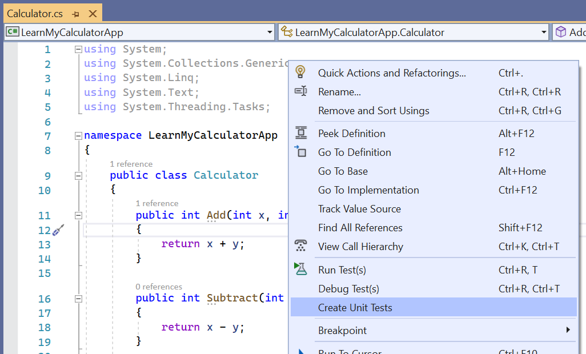
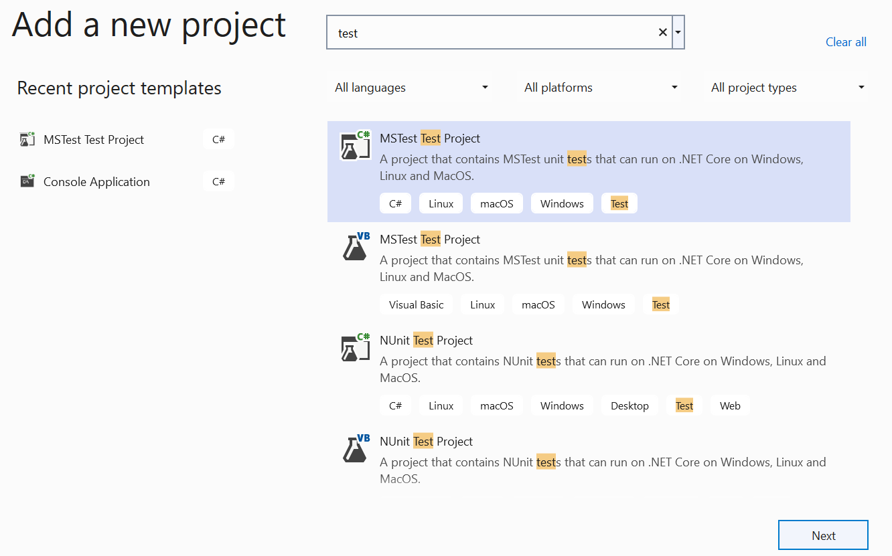
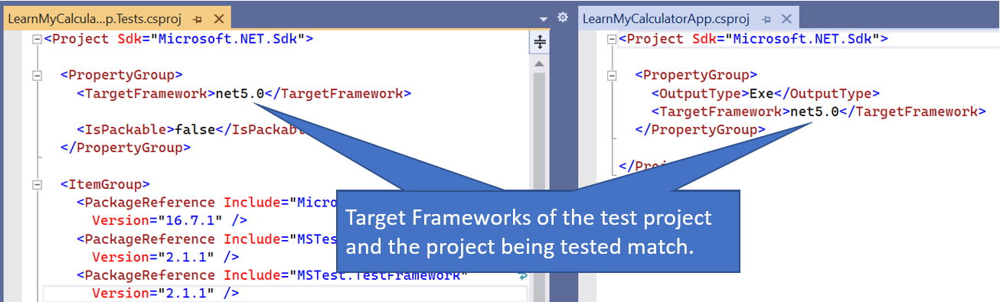
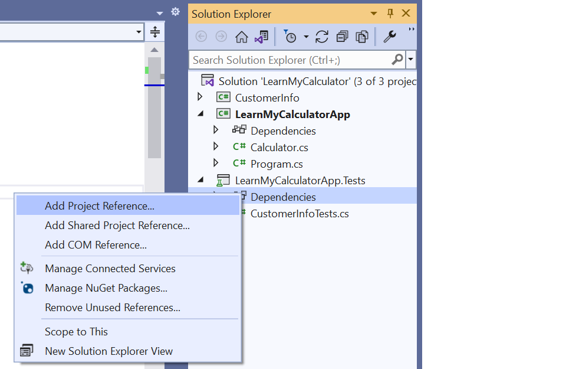
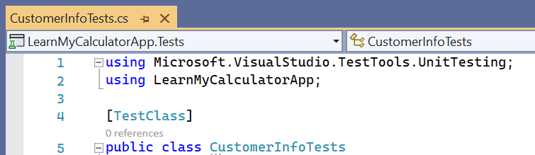

In this exercise, we'll write tests with a few basic steps:

* Setup product code to be tested
* Create a test project
* Add a reference to the product code from the test project
* Add assert statements

## Setup product code to be tested

1. Start a .NET console project called `LearnMyCalculatorApp`.
1. Add a new `Calculator.cs` with the code below.

    ```csharp
    namespace LearnMyCalculatorApp
    {
        public class Calculator
        {
            public int Add(int x, int y)
            {
                return x + y;
            }
    
            public int Subtract(int x, int y)
            {
                return x - y;
            }
    
            public int Multiply(int x, int y)
            {
                return x * y;
            }
    
            public int Divide(int x, int y)
            {
                return x / y;
            }
        }
    }
    ```

1. You can leave the Program.cs unchanged.

## Create a test project

1. The easiest way to add a test project for testing a specific method in your code is to right-click in that method and select 'Create unit tests.' This option to auto-generate test methods is available for most .NET projects, but let's describe how to manually set up test projects as well.
    

1. You can add test project templates to your solution by right-clicking on the solution in the Solution Explorer and selecting 'Add project.' Select a MSTest project template from the list. There are multiple popular test frameworks in .NET. MSTest is the built-in option for .NET produced by the .NET team.
    

1. Name the test project. There are many naming conventions that different code bases may use to indicate how the test suite is organized. Commonly, you may find names similar to `<MyAppProjectName>.Tests` for test projects.
    

1. Make sure your test is targeting the same framework as the app you would like to test.
    

## Add a reference to the product code from the test project

1. Now that you have a test project, it needs to reference the code you would like to test so you can make calls to your app from within your tests. Right-click on the test project in the Solution Explorer and select 'Add Reference.' Select the project you would like to test.
    

1. Make sure to add an import statement to the top of your C# test files so that references to any types in your product code's namespaces are resolved.

    

## Add assert statements

1. The templates come with a pre-written test. Add an assert statement to check if a type in your product code is null.

    ```csharp
    [TestMethod]
    public void CalculatorNullTest()
    {
        var calculator = new Calculator();
        Assert.IsNotNull(calculator);
    }
    ```

1. Run your test with right-click `Run Tests`. Your test should pass since the `calculator` variable is not null.
1. Add an assert statement that causes your test to fail. You can use the example below which asserts IsTrue on a false boolean.

    ```csharp
    Assert.IsTrue(false); // Will fail the test
    ```

1. Confirm your test fails by running again.

    :::image type="content" source="../media/test-run-first-test.png" alt-text="desc":::
