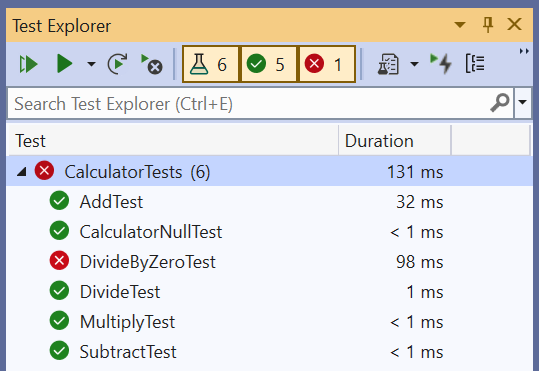
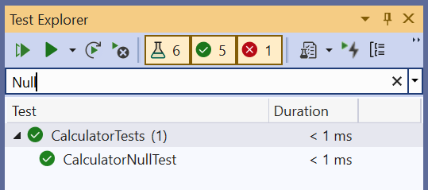
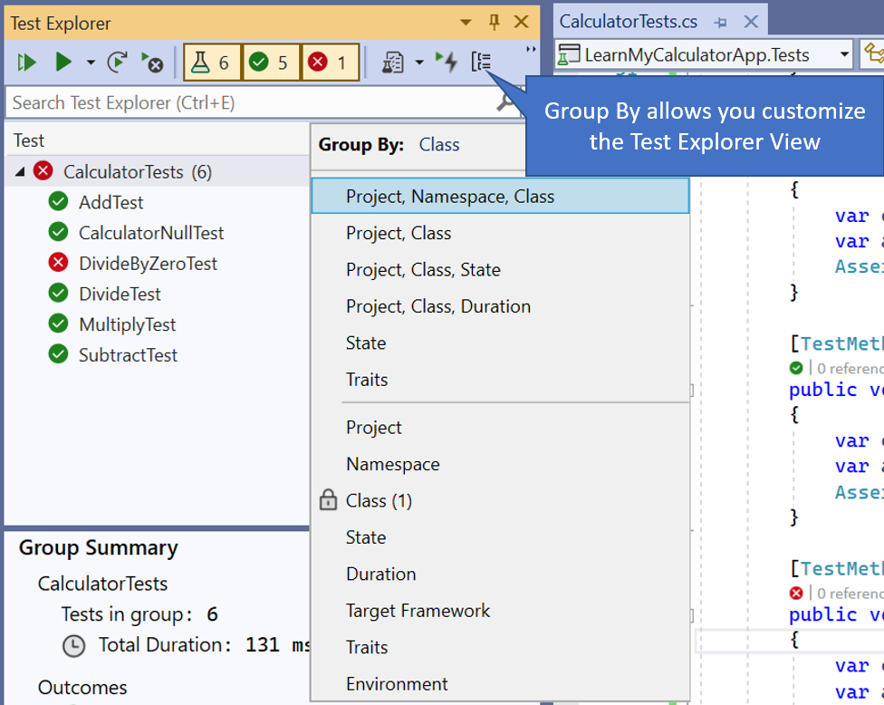
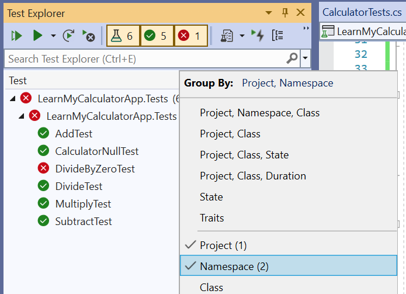
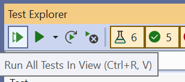
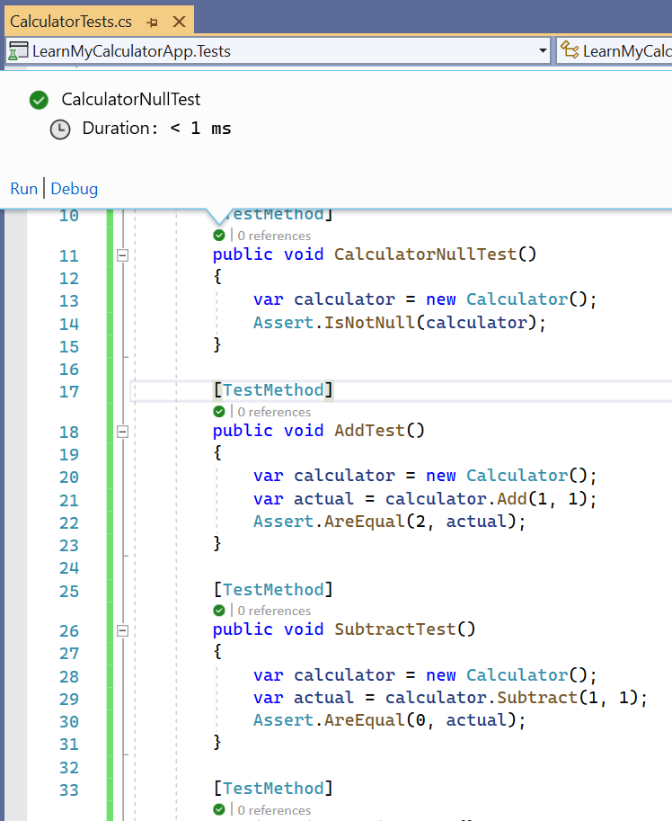
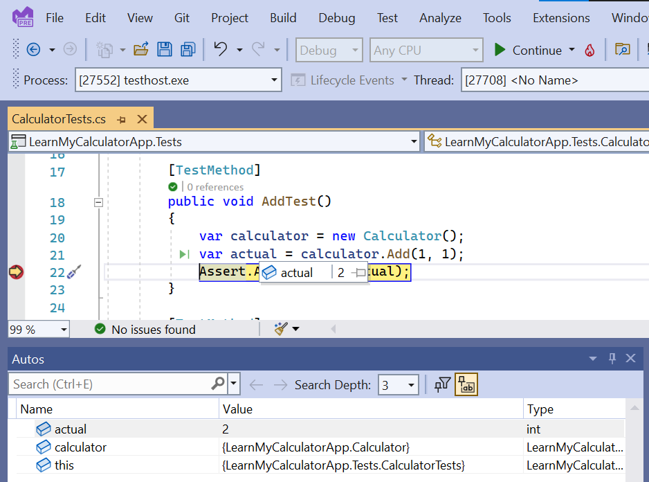

Now that you can write and run tests let's go over some of the test tools built-in to Visual Studio to help you get the most out of testing.

## View your test suite in the Test Explorer

* A test suite is any collection of tests. There are many ways you can group tests depending on what task is at hand.
* You can view a list of all your tests in the Test Explorer in Visual Studio. To open this window use the top-level "Test" menu and select "Test Explorer."

  

  

* The name of each test appears in an easily navigable list. Note you can use the search box to search for a specific test or substring.

  

* The view of tests is highly customizable to better handle navigating huge code bases with thousands (or even hundreds of thousands!) of tests. You can use buttons to filter the view by state.
* The "Group by" button lets you customize how the test groupings appear in the hierarchy. You can control what levels appear in the hierarchy and how many tiers there are.

  

* View of the Project and Namespace group by setting.

  

In the next exercise we'll delve deeper into Test Explorer functionality, but if you want a full list of capabilities of this window you can read more in the [Test Explorer docs](/visualstudio/test/run-unit-tests-with-test-explorer).

## Run test suites

* The green run button in the Test Explorer Runs All Tests.

  

* After the first test run the small CodeLens test icons now show the test result in the code editor at every test method.

  

## Debug a test

* Debugging lets you pause the application to explore variables and what is happening during the execution of your test. Debugging tests is especially helpful because you can precisely isolate which function you'd like the debugger to step through programmatically rather than manually using your app until you trigger the method you would like to test.

* Select `Debug test(s)` in the right-click context menu in order to hit a breakpoint.

  

* Just as in debugging a regular app, when you debug a test you can hover or pin variables to see there values and step through the execution of the code.

  
