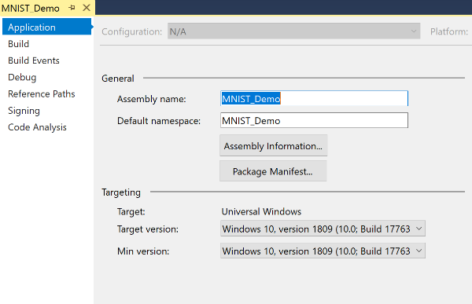
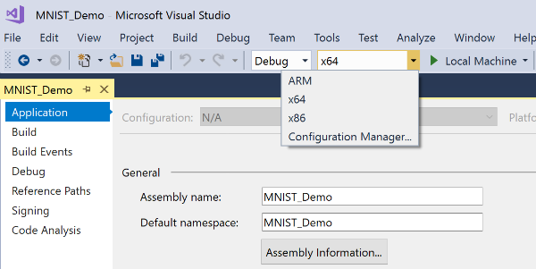
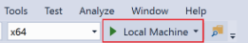
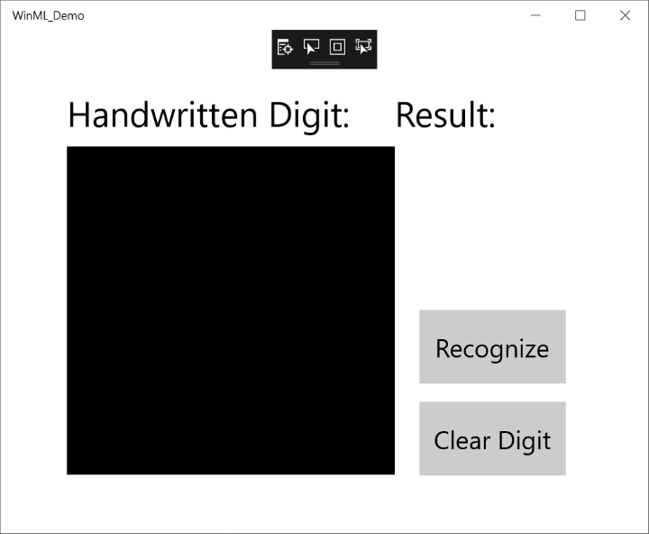
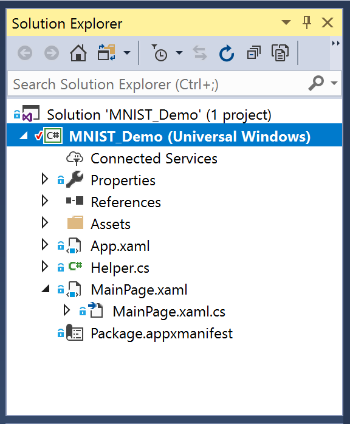

> [!NOTE]
> When the VM lab environment opens, you see a **LabUser** profile that asks for a password. To sign in, select the **Resources** tab above the instructions. Then select the **Microsoft Learn - Windows - Win10 1809** password. It autopopulates in your sign-in screen. Select the **Submit** button and return to the **Instructions** tab.
>
> :::image type="content" source="../media/vm-login.png" alt-text="Screen shot of the resources tab with lab password for sign in.":::

For this course, we provide a UWP C# template app for your use. The template already has the following XAML controls and events implemented:

- An InkCanvas to draw a numeric digit.
- Buttons to interpret the digit and clear the canvas.
- Helper routines to convert the InkCanvas output to a VideoFrame.

> [!VIDEO https://www.microsoft.com/videoplayer/embed/RE2Msj4]

### Open the UWP app template with Visual Studio
1. The UWP app template is located in the **Windows Learn** folder on the desktop of your sandboxed Windows 10 environment. 

    Inside the **Windows Learn** folder, open the **Machine-Learning** folder. Then open the **Add_Machine_Learning_to_your_UWP_App** folder. You'll find the **MNIST_Demo.sln** project solution file. Double-click to open it with Visual Studio inside the sandbox. 

2. After the Visual Studio project solution opens, select Alt+Enter to open the **Properties** window.

    On the **Application** tab, check that the **Target version** and **Min version** are set to match your Windows 10 OS and SDK. Both should be set to **Windows 10, version 1809 (10.0; Build 17763)**. Using an earlier version of Windows won't work. The required Windows ML API wasn't supported yet. To change these properties, close and reopen the project solution.

    

3. In the Visual Studio toolbar, make sure the Solution Platform is set to x64 or x86. Those platforms run the project on your local machine. Packages won't run under the ARM platform.

    

4. Now let's run the sample app project. Select the **Start Debugging** button on the toolbar, or select **F5**. 

    

    The application should build and open. It shows these things:

    * An InkCanvas where you can write a digit with your finger on a touch screen, a mouse, or a Surface Pen.
    * A **Recognize** button to interpret the number.
    * An empty label field where the interpreted digit displays as text.
    * A **Clear Digit** button to clear the InkCanvas. The **Recognize** button isn't hooked up to anything yet. So selecting it won't have any effect.

    

> [!WARNING]
> We've experienced an issue with error messages that appear the first time this sample app opens. If you receive these errors, close Visual Studio and reopen the **MNIST_Demo.sln** solution. When the solution opens, select the **Local Machine** button on the top menu bar. Or select F5 to try opening the app again. 
>
> This time, you should receive a pop-up message: **The app is already installed on this machine... if you continue... the current state will be deleted**. Select **Yes** to continue. The app should now open as expected. We're working with the VM to resolve this issue.  

### Explore the UWP app files

Close the app window, or select the **Stop Debugging** button. Then you see the files inside Visual Studio's Solution Explorer.

The project contains these main code files:

:::row:::
    :::column:::
        - `MainPage.xaml`. Defines the XAML code to create the user interface for the InkCanvas, buttons, and labels. You can add elements directly by using XAML markup. Or you can use the design tools provided by Visual Studio.
         - `MainPage.xaml.cs`. The code-behind file for `MainPage.xaml`. It's where our application code lives, including any logic and event handlers. It defines a new class called `MainPage`, which inherits from `Page` in the namespace.
         - `Helper.cs`. Helper routines to crop and convert image formats.
         - `App.xaml`. Declares resources used across the app. An example is the camera.
         - `App.xaml.cs`. The entry point for your app and the code-behind file for `App.xaml`. It contains a constructor that calls the `InitializeComponent` method. Visual Studio autogenerates the `InitializeComponent` method. Its main purpose is to initialize the elements declared in the XAML file. It also contains methods to handle activation and suspension of the app.
- `Package.appxmanifest`. A manifest file that describes your app. Examples are your app's name, description, tile, and start page, which includes a list of files that your app contains.
- A set of logo images: 
  - App logos: Square150x150Logo, start menu; Square44x44Logo, app lists; Wide310x150Logo, app highlight; and StoreLogo, in the Microsoft Store. 
  - Splash screen: SplashScreen, appears when your app starts. 
  - Lock screen: LockScreenLogo, appears on your app's lock screen. 
    :::column-end:::
    :::column:::
    
        
    :::column-end:::
:::row-end:::

We reviewed our UWP app template. Now let's use the Windows ML API and built-in Visual Studio automation to add a pretrained machine learning model to our app.
