::: zone pivot="uwp"


::: zone-end

::: zone pivot="wpf"

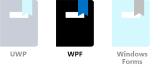

::: zone-end

::: zone pivot="windowsforms"


::: zone-end

In this unit, use the Azure Cognitive Services [Image Search](/azure/cognitive-services/bing-image-search/overview) feature to write part of an app that helps teach English as a second language. The finished app automatically provides a picture for any word within a block of text. For example, imagine that the user is reading about different types of food, and they come across a word they don't know. With this app, they can select the word **soup** and see a picture of some soup.

::: zone pivot="uwp"


::: zone-end

::: zone pivot="wpf"

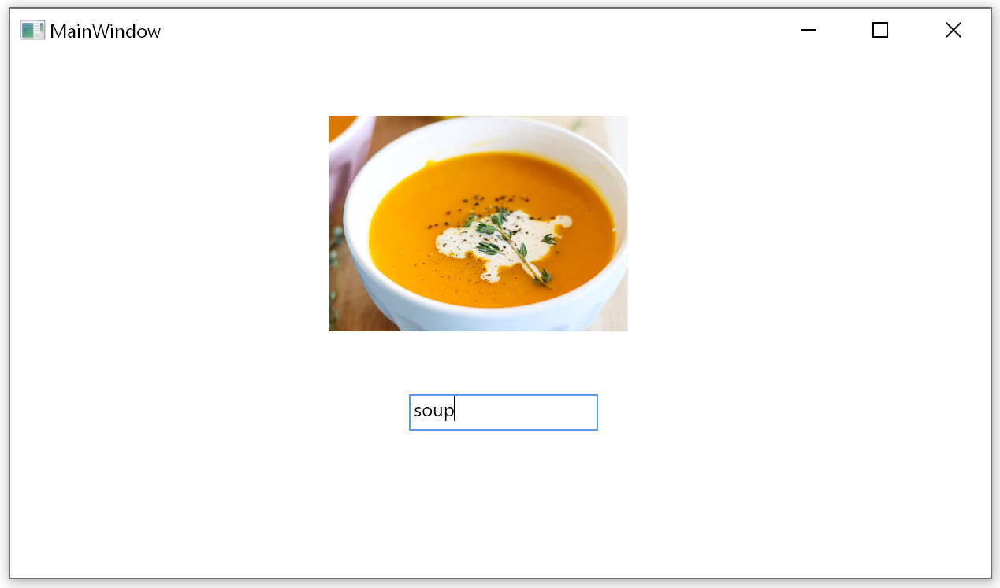

::: zone-end

::: zone pivot="windowsforms"

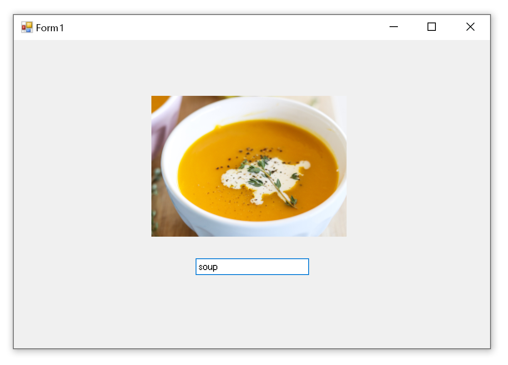

::: zone-end

Obviously, it would be challenging to create an app that contained an image of every possible type of food that could be referenced in text. That's why using Bing Image Search is a great solution.

This project covers:

- Creating a free account with Azure.
- Signing up for the Cognitive Services Image Search API.
- Creating a simple Windows app that takes words from the user, sends them to the cloud, and receives a link to an image.
- Displaying the image.

## Create an Azure account

The first step is to sign up for a free Azure account. Follow the instructions at [Create a free Azure account](https://azure.microsoft.com/free) to get started.

## Sign up for Cognitive Services

Next, sign up for a Cognitive Services account. This account is linked to your Azure account, and again, free trials are available.

After you sign up for the Bing Image Search service, you're given a unique key (a string of text, like a long password). Your app uses the key when it talks to the online service, to distinguish your app from any other app. Here's the link to sign up for access and get the key: [Bing Image Search](https://azure.microsoft.com/services/cognitive-services/bing-visual-search/).

## Create the app

We're now going to build the part of our English-language teaching app that focuses on matching text and images. You can leave the English instruction part for another time. Before we start, make sure you're running the latest version of Windows 10. Check by going to **Settings > Windows Update**.

1. Open Visual Studio and go to **File > New > Project**.

::: zone pivot="uwp"

2. Create an app of type **Visual C# / Windows Universal / Blank App (Universal Windows)** and call it **ShowMeAPicture**.

    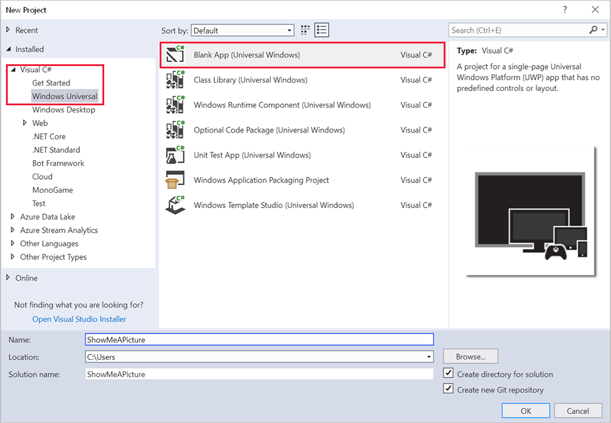

3. Make sure to select an up-to-date SDK. When the target and platform dialog appears, select these options:

    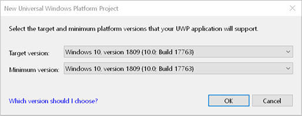

4. Now we can define our UI. The UI is simple for now, consisting of only a **TextBox** (for entering search terms) and an **Image** control (for displaying the image). You can create the UI yourself, or copy the following XAML code and paste it into `MainPage.xaml`, replacing everything that's already there:

    ```XAML
    <Page
        x:Class="ShowMeAPicture.MainPage"
        xmlns="http://schemas.microsoft.com/winfx/2006/xaml/presentation"
        xmlns:x="http://schemas.microsoft.com/winfx/2006/xaml"
        xmlns:local="using:ShowMeAPicture"
        xmlns:d="http://schemas.microsoft.com/expression/blend/2008"
        xmlns:mc="http://schemas.openxmlformats.org/markup-compatibility/2006"
        mc:Ignorable="d"
        Background="{ThemeResource ApplicationPageBackgroundThemeBrush}">
    
        <Grid>
           <Image x:Name="foundObjectImage" HorizontalAlignment="Center" Height="256" 
                Margin="0,195,0,0" VerticalAlignment="Top" Width="320"/>
            <TextBox x:Name="searchTermsTextBox" HorizontalAlignment="Left" 
                Margin="675,500,0,0" Text="" VerticalAlignment="Top" 
                PlaceholderText="Type some search terms" KeyDown="OnKeyDownHandler"/>
        </Grid>
    </Page>
    ```

    The UI should look something like this:

    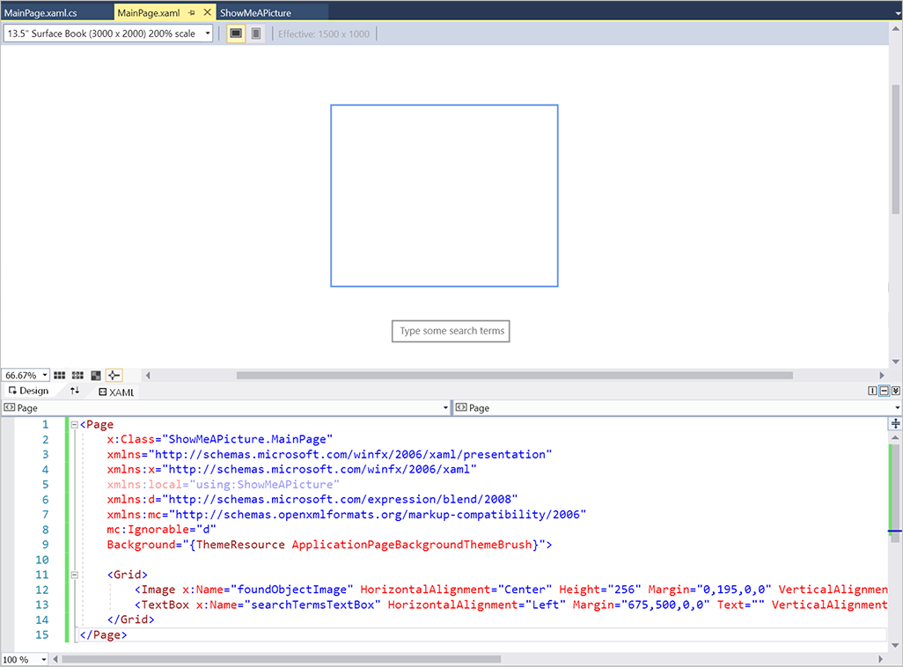

    Now we can work on the C# code in the `MainPage.xaml.cs` file that takes the text from the **TextBox**, sends it to the Azure service, and gets a link to an image in return.

5. First, we declare some important values and write the event handler that's called when the user enters text into the **TextBox**. The **SubscriptionKey** is important. You receive it when you sign up for the Cognitive Services account. If the app doesn't work, this key is probably the reason. Be sure to add your key to the following code where it says ```your key goes here```:

    ```csharp
    using System;
    using System.Collections.Generic;
    using System.IO;
    using System.Net;
    using Windows.Data.Json; 
    using Windows.UI.Xaml.Controls;
    using Windows.UI.Xaml.Input;
    using Windows.UI.Xaml.Media.Imaging; 
    
    namespace ShowMeAPicture
    {
        public sealed partial class MainPage : Page
        {
            const string SubscriptionKey = "your key goes here";
            const string UriBase = "https://api.bing.microsoft.com/v7.0/images/search";
           
            public MainPage()
            {
                this.InitializeComponent();
            }
    
            private void OnKeyDownHandler(object sender, KeyRoutedEventArgs e)
            {
                // If the user presses Enter, read the search terms and use them to find an image.
    
                if (e.Key == Windows.System.VirtualKey.Enter && 
                        searchTermsTextBox.Text.Trim().Length > 0)
                {
                    // Search for an image by using the Bing Image Search API,
                    // supplying the search term entered in the XAML text box.
                    string imageUrl = FindUrlOfImage(searchTermsTextBox.Text);
                    
                    // Display the first image found.
                    foundObjectImage.Source = new BitmapImage(new Uri(imageUrl, UriKind.Absolute));
               
                }
            }
    
            // Search code goes here.
           
        }
    }
    ```

    Next, add the C# code that calls the search API.

6. Copy the following code and paste it over the comment ```// Search code goes here``` at the end of the preceding example:

    ```csharp
            struct SearchResult
            {
                public String jsonResult;
                public Dictionary<String, String> relevantHeaders;
            }
    
            private string FindUrlOfImage(string targetString)
            {
                // Call the method that does the search.
                SearchResult result = PerformBingImageSearch(targetString);
    
                // Process the JSON response from the Bing Image Search API and get the URL of the first image returned.
                JsonObject jsonObj = JsonObject.Parse(result.jsonResult);
                JsonArray results = jsonObj.GetNamedArray("value");
                if (results.Count > 0)
                {
                    JsonObject first_result = results.GetObjectAt(0);
                    String imageUrl = first_result.GetNamedString("contentUrl");
                    return imageUrl;
                }
                else
                    return "https://learn.microsoft.com/training/windows/build-internet-connected-windows10-apps/media/imagenotfound.png";
            }
    
            static SearchResult PerformBingImageSearch(string searchTerms)
            {
                // Create the web-based query that talks to the Bing API.
                string uriQuery = UriBase + "?q=" + Uri.EscapeDataString(searchTerms);
                WebRequest request = WebRequest.Create(uriQuery);
                request.Headers["Ocp-Apim-Subscription-Key"] = SubscriptionKey;
                HttpWebResponse response = (HttpWebResponse)request.GetResponseAsync().Result;
                string json = new StreamReader(response.GetResponseStream()).ReadToEnd();
    
                // Create the result object for the return value.
                var searchResult = new SearchResult()
                {
                    jsonResult = json,
                    relevantHeaders = new Dictionary<String, String>()
                };
    
                // Extract the Bing HTTP headers.
                foreach (String header in response.Headers)
                {
                    if (header.StartsWith("BingAPIs-") || header.StartsWith("X-MSEdge-"))
                        searchResult.relevantHeaders[header] = response.Headers[header];
                }
    
                return searchResult;
            }
    ```

    Here's a summary of what this code does:
  
    - The method **PerformBingImageSearch(string searchTerms)** constructs and sends a web query that contains the URL of the Bing Image Search API, your key, and the search terms:

      ```csharp
      HttpWebResponse response = (HttpWebResponse)request.GetResponseAsync().Result;
      ```

    - The Bing Image Search API does all the hard work of finding images and then returns a response in JSON format.

    - The method **FindUrlOfImage(string targetString)** uses the Windows Runtime JSON API to decode the response and then extracts the first of several responses contained within the JSON.
  
    - The URL of the image is extracted and, finally, this code displays the image that the URL points to in the **Image** control:

      ```csharp
      foundObjectImage.Source = new BitmapImage(new Uri(imageUrl, UriKind.Absolute));
      ```

::: zone-end

::: zone pivot="wpf"

2. Create an app of type **Visual C# / WPF App (.NET Framework)** and call it **ShowMeAPicture**.

    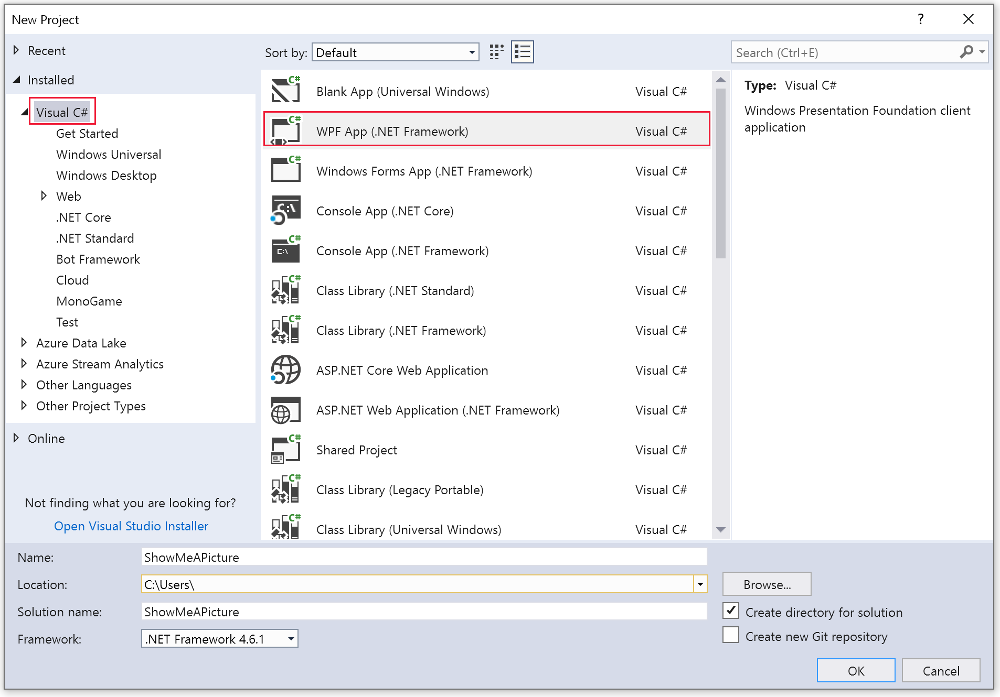

3. We need some extra code from a NuGet package to help us process the return values from the search API. Go to **Project > Manage NuGet Packages**, select **Browse**, enter **Newtonsoft.Json**, and then select **Install**.

    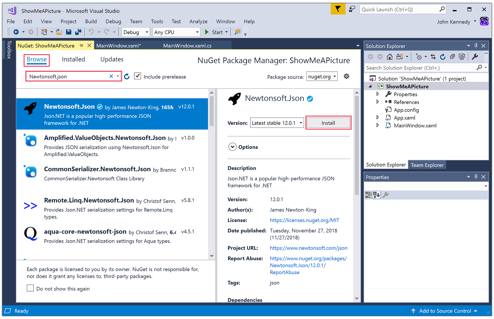

    For more information about NuGet, see the Microsoft Learn module [Getting started with Visual Studio for Windows 10 app development](/training/modules/get-started-with-visual-studio-for-windows10-app-dev/) in this learning path.

4. Now we can define our UI. The UI is simple for now, consisting of only a **TextBox** (for entering search terms) and an **Image** control (for displaying the image). You can create the UI yourself, or copy the following XAML code and paste it into `MainWindow.xaml`, replacing everything that's already there:

    ```XAML
    <Window x:Class="ShowMeAPicture.MainWindow"
            xmlns="http://schemas.microsoft.com/winfx/2006/xaml/presentation"
            xmlns:x="http://schemas.microsoft.com/winfx/2006/xaml"
            xmlns:d="http://schemas.microsoft.com/expression/blend/2008"
            xmlns:mc="http://schemas.openxmlformats.org/markup-compatibility/2006"
            xmlns:local="clr-namespace:ShowMeAPicture"
            mc:Ignorable="d"
            Title="MainWindow" Height="450" Width="800">
        <Grid>
            <TextBox x:Name="searchTermsTextBox" HorizontalAlignment="Left" Height="23" 
                Margin="253,217,0,0" TextWrapping="Wrap" VerticalAlignment="Top" 
                Width="120" KeyDown="SearchTermsTextBox_KeyDown"/>
            <Image x:Name="foundObjectImage" HorizontalAlignment="Left" Height="137" 
                Margin="202,40,0,0" VerticalAlignment="Top" Width="215"/>
        </Grid>
    </Window>
    ```

    The UI should look something like this:

    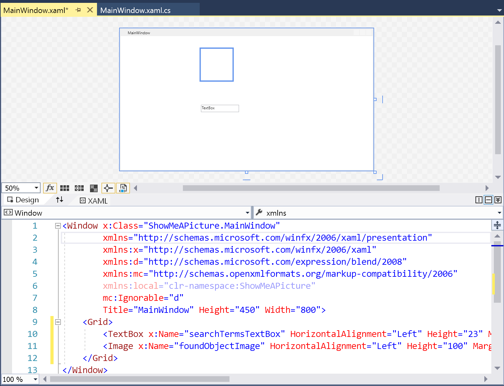

    Now we can work on the C# code in the `MainWindow.xaml.cs` file that takes the text from the **TextBox**, sends it to the Azure service, and gets a link to an image in return.

5. First we declare some important values and write the event handler that's called when the user enters text into the **TextBox**. The **SubscriptionKey** is important. You receive it when you sign up for the Cognitive Services account. If the app doesn't work, this key is probably the reason. Be sure to add your key to the following code where it says ```your key goes here```:

    ```csharp
    using System;
    using System.Collections.Generic;
    using System.Windows;
    using System.Windows.Input;
    using System.Windows.Media.Imaging;
    using System.IO;
    using System.Net;
    using Newtonsoft.Json.Linq;
  
    namespace ShowMeAPicture
    {
        /// <summary>
        /// Interaction logic for MainWindow.xaml.
        /// </summary>
        public partial class MainWindow : Window
        {
            const string SubscriptionKey = "your key goes here";
            const string UriBase = "https://api.bing.microsoft.com/v7.0/images/search";
    
            public MainWindow()
            {
                InitializeComponent();
            }
    
            private void SearchTermsTextBox_KeyDown(object sender, KeyEventArgs e)
            {
                // If there is a valid string in the text box, search for some images.
                // A valid string is any group of characters - even just one, except empty spaces.
                if (e.Key == Key.Enter && searchTermsTextBox.Text.Trim().Length > 0)
                {
                    string imageUrl = FindUrlOfImage(searchTermsTextBox.Text);
    
                    foundObjectImage.Source = new BitmapImage(new Uri(imageUrl, UriKind.Absolute));
                }
            }
    
         // Search code goes here.
        }
    }
    ```

    Now we add the C# that calls the search API.

6. Copy the following code and paste it over the comment ```// Search code goes here``` at the end of the preceding example:

    ```csharp
    struct SearchResult
            {
                public String jsonResult;
                public Dictionary<String, String> relevantHeaders;
            }
    
            private string FindUrlOfImage(string targetString)
            {
                // Call the method that does the search.
                SearchResult result = PerformBingImageSearch(targetString);
    
                // Process the JSON response from the Bing Image Search API
                // and get the URL of the first image returned.
                JObject jResult = JObject.Parse(result.jsonResult);
    
                // Extract an array of "values" (search hits) from the large object returned.
                JArray values = (JArray) jResult["value"];
    
                // Take the first value as a string and parse it into components.
                if (values.Count > 0)
                {
                    string firstResult = values[0].ToString();
                    JObject jFirst = JObject.Parse(firstResult);
    
                    // Extract the content string from the components and return it as an image URL.
                    string imageUrl = (string)jFirst["contentUrl"];
                    return imageUrl;
                }
                else
                {
                    return "https://learn.microsoft.com/training/windows/build-internet-connected-windows10-apps/media/imagenotfound.png";
                }
            }
    
            static SearchResult PerformBingImageSearch(string searchTerms)
            {
                // Create the web-based query that talks to the Bing API.
                string uriQuery = $"{UriBase}?q={Uri.EscapeDataString(searchTerms)}";
                WebRequest request = WebRequest.Create(uriQuery);
                request.Headers["Ocp-Apim-Subscription-Key"] = SubscriptionKey;
                HttpWebResponse response = (HttpWebResponse)request.GetResponseAsync().Result;
                string json = new StreamReader(response.GetResponseStream()).ReadToEnd();
    
                // Create the result object for the return value.
                var searchResult = new SearchResult()
                {
                    jsonResult = json,
                    relevantHeaders = new Dictionary<String, String>()
                };
    
                // Extract the Bing HTTP headers.
                foreach (String header in response.Headers)
                {
                    if (header.StartsWith("BingAPIs-") || header.StartsWith("X-MSEdge-"))
                    {
                        searchResult.relevantHeaders[header] = response.Headers[header];
                    }
                }
    
                return searchResult;
            }
    
    ```

    Here's a summary of what this code does:

    - The method **PerformBingImageSearch(string searchTerms)** constructs and sends a web query that contains the URL of the Bing Image Search API, your key, and the search terms:

      ```csharp
      HttpWebResponse response = (HttpWebResponse)request.GetResponseAsync().Result;
      ```
  
    - The Bing Image Search API does all the hard work of finding images and then returns a response in JSON format.
  
    - The method **FindUrlOfImage(string targetString)** uses the Newtonsoft.Json library to decode the response and then extracts the first of several responses contained within the JSON.

    - The URL of the image is extracted and, finally, this code displays the image that the URL points to in the **Image** control:

      ```csharp
      FoundObjectImage.Source = new BitmapImage(new Uri(imageUrl, UriKind.Absolute));
      ```

::: zone-end

::: zone pivot="windowsforms"

2. Create an app of type **Visual C# / Windows Forms App (.NET Framework)** and call it **ShowMeAPicture**.

    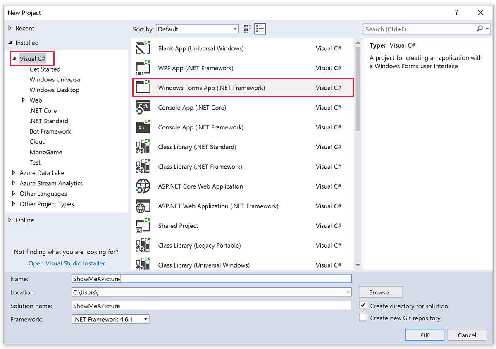

3. We need some extra code from a NuGet package to help us process the return values from the search API. Go to **Project > Manage NuGet Packages**, select **Browse**, enter **Newtonsoft.Json**, and then select **Install**.

    

    For more information about NuGet, see the Microsoft Learn module [Getting started with Visual Studio for Windows 10 app development](/training/modules/get-started-with-visual-studio-for-windows10-app-dev/) in this learning path.

4. Now we can define our UI. The UI is simple for now, consisting of only a **TextBox** (for entering search terms) and a **PictureBox** control (for displaying the image). Select **Form1.cs** and drag **TextBox** and **PictureBox** controls from the Toolbox. Name the **TextBox** control **searchTerms** and the **PictureBox** control **foundImage**.

    At this point, create an event handler to respond when the user enters text. In the **Properties** pane, select the **Events** (lightning bolt) icon, and then select the value next to the **KeyDown** event.

    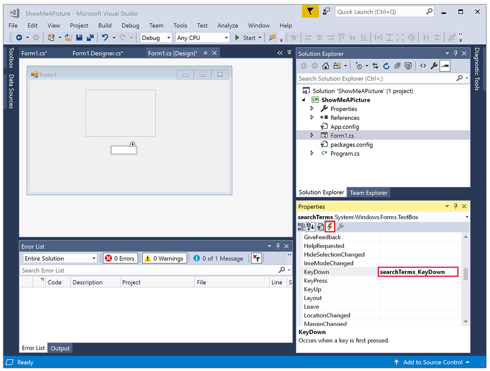

    This action creates the event handler for you, and the following method displays:

    ```csharp
    private void searchTerms_KeyDown(object sender, KeyEventArgs e)
    {
    
    }
    ```

    One more thing: set the **SizeMode** property of the **PictureBox** control to **Zoom** so that our image is resized properly.

    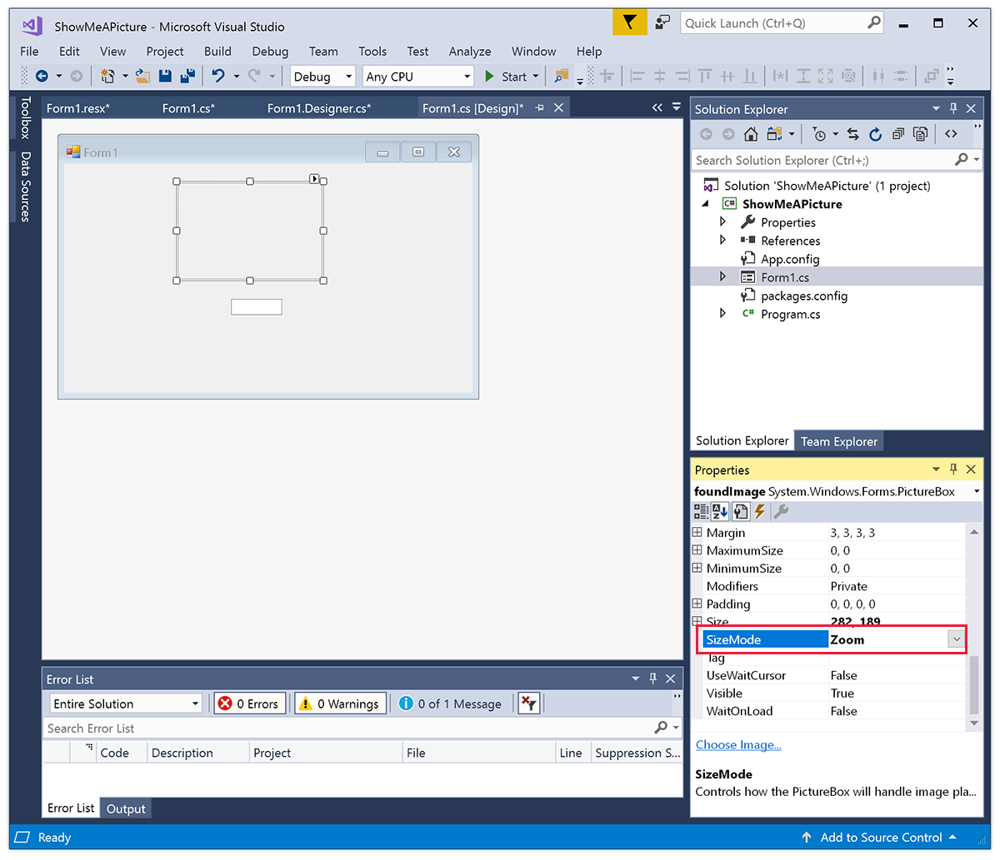

    Now we can work on the C# code that takes the text from the **TextBox**, sends it to the Azure service, and gets a link to an image in return. Select **Form1.cs**.

5. First, we declare some important values and write the event handler that is called when the user enters text into the **TextBox**. The **SubscriptionKey** is important. You receive it when you sign up for the Cognitive Services account. If the app doesn't work, this key is probably the reason. Be sure to add your key to the following code where it says ```your key goes here```. Replace the existing code in Form1.cs with the following code:

    ```csharp
    using System;
    using System.Collections.Generic;
    using System.IO;
    using System.Net;
    using System.Windows.Forms;
    using Newtonsoft.Json.Linq;
    
    namespace ShowMeAPicture
    {
        public partial class Form1 : Form
        {
            const string SubscriptionKey = "your key goes here";
            const string UriBase = "https://api.bing.microsoft.com/v7.0/images/search";
    
            public Form1()
            {
                InitializeComponent();
            }
    
         private void searchTerms_KeyDown(object sender, KeyEventArgs e)
            {
                // If there is a valid string in the text box, search for some images.
                // A valid string is any group of characters - even just one, except empty spaces.
                if (e.KeyCode == Keys.Enter && searchTerms.Text.Trim().Length > 0)
                {
                    string imageUrl = FindUrlOfImage(searchTerms.Text);
    
                    foundImage.ImageLocation = imageUrl;
                }
            }
        
        // Search code goes here.
    
    
        }
    }
    ```

    Now we add the C# code that calls the search API.

6. Copy the following code and paste it over the comment ```// Search code goes here``` at the end of the preceding example:

    ```csharp
            struct SearchResult
            {
                public String jsonResult;
                public Dictionary<String, String> relevantHeaders;
            }
    
            private string FindUrlOfImage(string targetString)
            {
                // Call the method that does the search.
                SearchResult result = PerformBingImageSearch(targetString);
    
                // Process the JSON response from the Bing Image Search API and get the URL of the first image returned.
                JObject jResult = JObject.Parse(result.jsonResult);
    
                // Extract an array of "values" (search hits) from the large object returned.
                JArray values = (JArray)jResult["value"];
    
                if (values.Count > 0)
                {
                    // Take the first value as a string and parse it into components.
                    string firstResult = values[0].ToString();
                    JObject jFirst = JObject.Parse(firstResult);
    
                    // Extract the content string from the components and return it as an image URL.
                    string imageUrl = (string)jFirst["contentUrl"];
                    return imageUrl;
                }
                else
                    return "https://learn.microsoft.com/training/windows/build-internet-connected-windows10-apps/media/imagenotfound.png";
            }
    
            static SearchResult PerformBingImageSearch(string searchTerms)
            {
                // Create the web-based query that talks to the Bing API.
                string uriQuery = $"{UriBase}?q={Uri.EscapeDataString(searchTerms)}";
                WebRequest request = WebRequest.Create(uriQuery);
                request.Headers["Ocp-Apim-Subscription-Key"] = SubscriptionKey;
                HttpWebResponse response = (HttpWebResponse)request.GetResponseAsync().Result;
                string json = new StreamReader(response.GetResponseStream()).ReadToEnd();
    
                // Create the result object for the return value.
                var searchResult = new SearchResult()
                {
                    jsonResult = json,
                    relevantHeaders = new Dictionary<String, String>()
                };
    
                // Extract the Bing HTTP headers.
                foreach (String header in response.Headers)
                {
                    if (header.StartsWith("BingAPIs-") || header.StartsWith("X-MSEdge-"))
                    {
                        searchResult.relevantHeaders[header] = response.Headers[header];
                    }
                }
    
                return searchResult;
            }
    ```

    Here's a summary of what this code does:

    - The method **PerformBingImageSearch(string searchTerms)** constructs and sends a web query that contains the URL of the Bing Image Search API, your key, and the search terms:

      ```csharp
      HttpWebResponse response = (HttpWebResponse)request.GetResponseAsync().Result;
      ```

    - The Bing Image Search API does all the hard work of finding images and then returns a response in JSON format.

    - The method **FindUrlOfImage(string targetString)** uses the Newtonsoft.Json library to decode the response and then extracts the first of several responses contained within the JSON.

    - The URL of the image is extracted and, finally, this code displays the image that the URL points to in the **PictureBox** control:

      ```csharp
      foundImage.ImageLocation = imageUrl;
      ```

::: zone-end

## What is JSON?

[JSON](https://www.wikipedia.org/wiki/JSON) is a standard format for sharing data between apps and services. It's text-based, so you can look at it in Notepad, and it contains different fields and values. Code libraries are available to help you read and write data in JSON format.

Here's a part of a typical JSON result from the image query, as plain text:

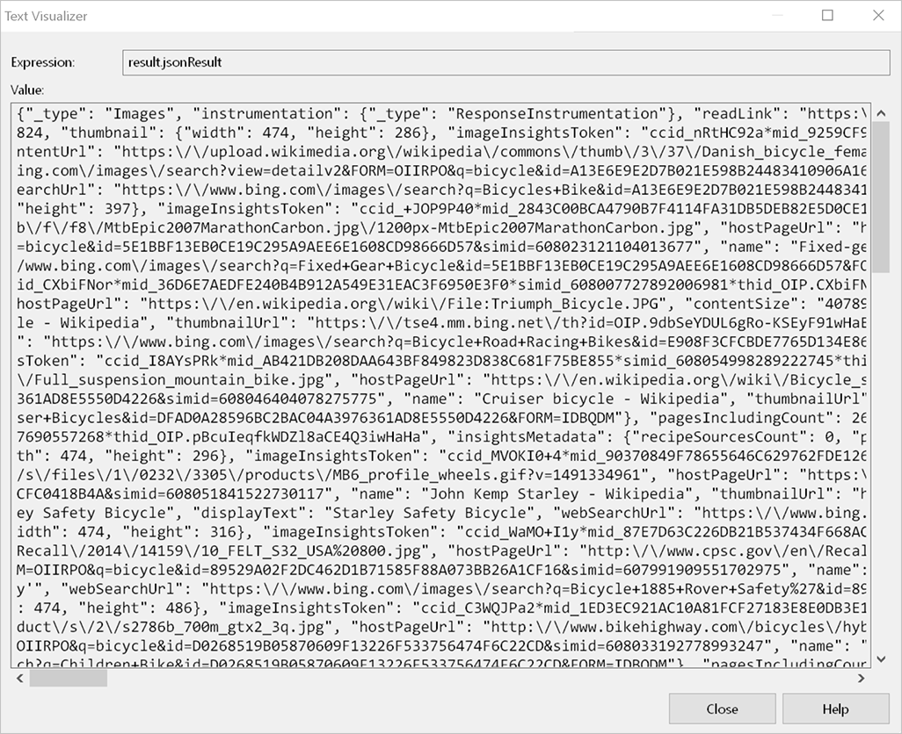

It looks a little friendlier with some JSON formatting applied:

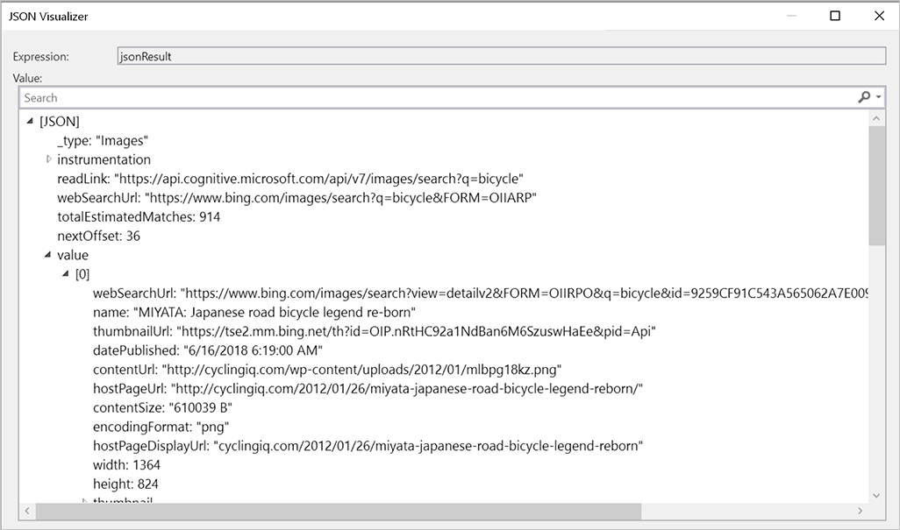

It's straightforward to process the file in this format and extract the values you need, especially if you use a code library of helper functions.

## Run it!

Select F5 to run the app. Type some text into the **TextBox** and press Enter. Hopefully you see an image!

::: zone pivot="uwp"
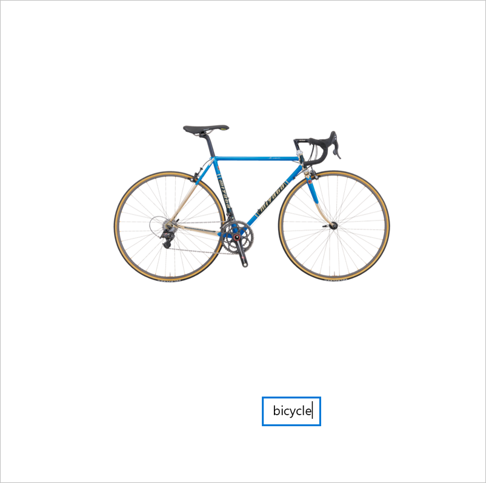
::: zone-end
::: zone pivot="wpf"
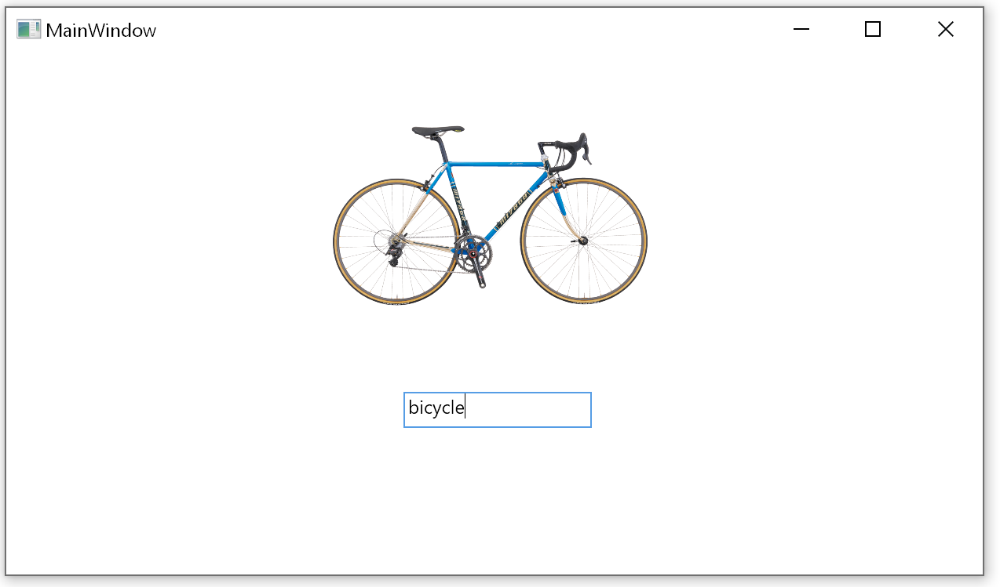
::: zone-end
::: zone pivot="windowsforms"
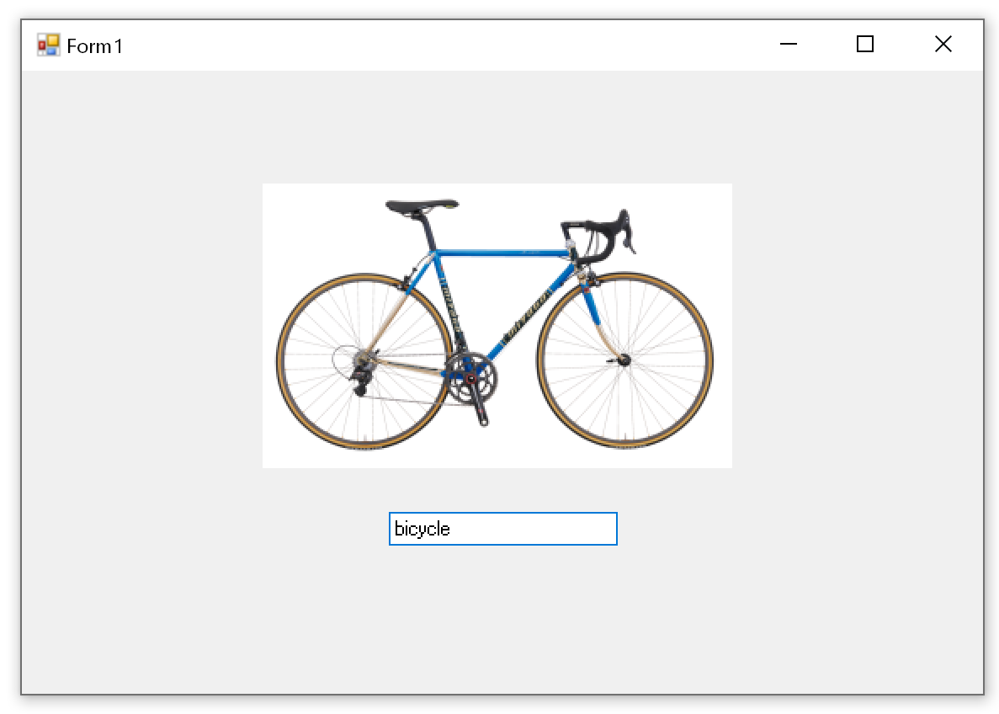
::: zone-end

Does the application crash? The most likely cause is an incorrect or missing subscription key. Another possibility is a lack of internet access. For the sake of simplicity, the example code doesn't include a check for network access.

> [!IMPORTANT]
> Never share your subscription key! If you're posting sample code to GitHub or another public site, make sure to remove your key first. If you forget, go to the Azure portal and regenerate the keys as soon as possible. In the example code in this module, we store the key in a string constant for the sake of simplicity, but we don't recommend this method for an app that you submit to the Microsoft Store. Also, in practice, third-party API keys shouldn't be stored or used directly in a client app.
