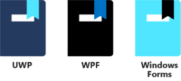

In this unit, we build a substantial sample app in one or more of the three Windows UI technologies: Windows Forms, Windows Presentation Foundation (WPF), and the Universal Windows Platform (UWP). The app downloads and displays NASA's wonderful Astronomy Picture of the Day (APOD for short) for any date since the launch of the program in 1995. The app also preserves some user settings from one session to the next. That's important because there's a limit to the number of downloads that can be done in any one day (currently it's 50). We want our app to be aware of this limit and not suddenly fail on our users. Restricting a user's access when they exceed this kind of limit is known as *throttling*. So, let's build an inspiring app that helps us avoid being throttled!

In this unit, we'll:

- Use Visual Studio 2022 to create up to three projects (Windows Forms, WPF, and UWP) that display the APOD for any date since the launch of that NASA program.
- Learn how to use the NuGet Package Manager to install a useful third-party API.
- Learn how to use a UI calendar to select a date and an image element to display a picture.
- Make an HTTP call to retrieve an image.
- Check for supported image formats and robustly handle errors.
- Save and restore UI settings to show how to make an app more user-friendly.
- Work at building a large app in testable stages, verifying that one stage works before moving to the next.
- Optionally, progress from the venerable Windows Forms, through WPF, and finally to UWP, showing how the newer technologies offer some great programming features.

Inspiring as this app is, it doesn't do everything an industrial-strength app might do. In this unit, we won't:

- Handle the case where a video is offered as the picture of the day. We just display an error message.
- Display anything for the user to look at if the network connection is taking too long.

## The APOD tutorial

::: zone pivot="windowsforms"


Windows Forms may be dated, but the tools it provides do make a neat version of this programming project.

### Create the project

In Visual Studio 2022, create a Windows Forms C# project. Give the project a meaningful name. If you're going to do the UWP or WPF versions of this tutorial too, perhaps add the technology to the name (for example, **APOD_WindowsForms**).

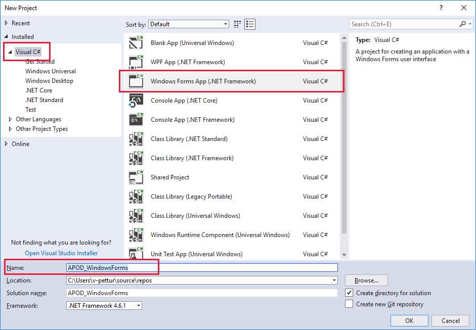

### Install the required packages

1. Reinventing the wheel isn't smart, so let's download an add-on package for Visual Studio that helps us parse the response when we make HTTP calls. An add-on is available from Newtonsoft, so go to **Tools > NuGet Package Manager > Manage NuGet Packages for Solution**. The list of installed packages displays:

    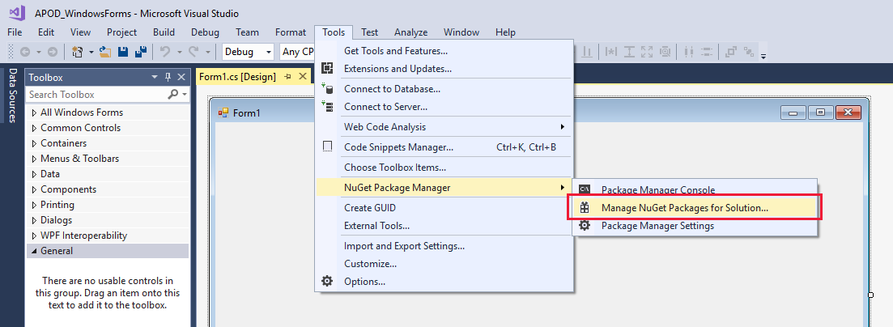

2. Select **Browse** to display the list of available packages. Select **Newtonsoft.Json** so that it's highlighted, select the check box for your project in the pane on the right, and then select **Install**.

    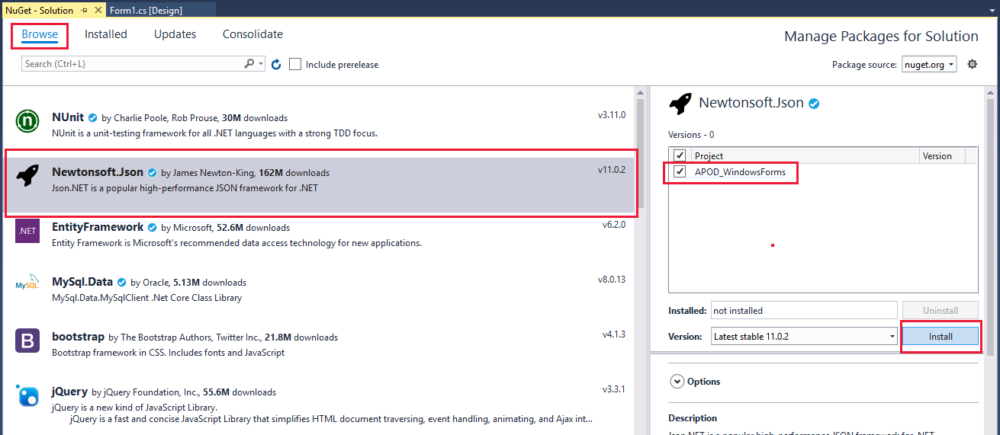

    > [!NOTE]
    > If you're going to do more HTTP programming, consider familiarizing yourself also with the **Microsoft.AspNet.WebApi 5.2.6** package. This package includes Newtonsoft.Json with a number of Microsoft ASP.NET web packages and is a great set of web resources to have at your command.

### Build the UI

The goal of this step is to lay out the UI components and give them a quick test.

1. Start by expanding the empty form until it's about 980 pixels wide and 680 pixels in height. The name of the form can remain **Form1**, but change the name of the **Text** property to something more friendly, such as **Astronomy Picture of the Day**.

2. Now add the elements to build the UI shown in the following image. First, make sure the **Toolbox** is open with **All Windows Forms** listed. Start in the upper-left corner with the **MonthCalendar** control. We're also going to use a few elements that aren't available in the **Common Controls**.

    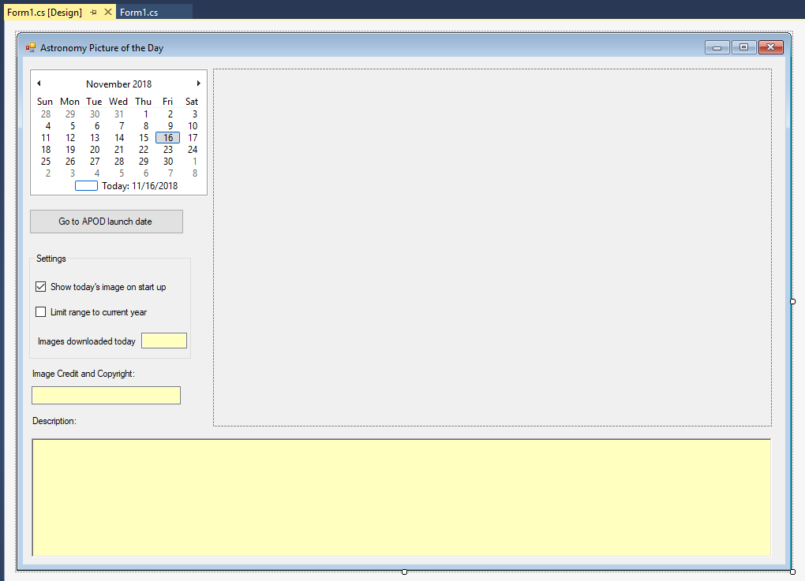

3. Name the calendar control "MonthCalendar". We're not going to set any other properties of the calendar from the **Properties** pane, but we're setting properties from within the code itself.

    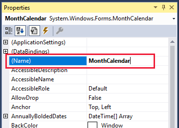

4. Below the calendar, add a **Button** control. Stretch it out so that it can take **Go to APOD launch date** as its **Text** property. Go ahead and add this text, and change the **Name** of the button to **LaunchButton**. When this button is selected, we want the calendar to jump to the day NASA started the APOD program. We aren't adding that code yet, though. Let's continue laying out the UI.

    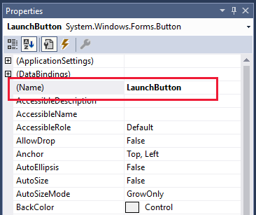
    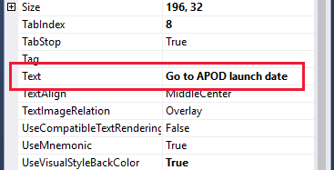

5. Below the button, add a **GroupBox** control and give it a descriptive name like **Settings**. Expand the group box so that it can take three UI elements. First drag a **CheckBox** control into the group box. Change the **Name** value of the check box to **ShowTodaysImageCheckBox**, and change its **Text** value to **Show today's image on start up**.

    > [!NOTE]
    > The purpose of this check box is to give the option _not_ to load an image when the app starts, because of the limit of 50 downloads per day of astronomy images. A user might want to run the app several times in a day without using up one of their 50i images each time the app starts. This is an example of a setting that is ideally stored in an initialization file of some sort.

6. Add a second check box like the previous one. Name it **LimitRangeCheckBox** and change its **Text** property to **Limit range to current year**. This setting is arbitrary, but the idea is to limit the range of dates available to the **MonthCalendar** to just the current year and also to store the state of this check box as an initialization setting.

7. Add the third entry to the group box: a combination of a **Label** control with the text **Images downloaded today:** and a small **TextBox** control to display the number of images already downloaded today. Give the text box the name **ImagesTodayTextBox** and set a couple of other properties on it. This text box is read-only, so let's both set the **ReadOnly** property to **true** and set a background color that hints that this text box is read only. Set the **BackColor** property to **255,255,192** (an easy change because the default RGB value is **255,255,255**. This value produces a nice, light-yellow color that works as a background for black text.

    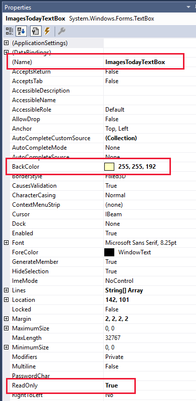

    That change completes the group box that encapsulates any settings that we might need to preserve.

8. Add another **Label** and **TextBox** combination beneath the group box. For the **Label**, make the **Text** value **Image Credit and Copyright:** and the **Name** value **ImageCopyrightTextBox**. As with the **ImagesTodayTextBox**, this text is also read-only, so again set the **ReadOnly** property to **true** and the background color to **255,255,192**. Expand the text box to about the same width as the calendar. It's important that we acknowledge the copyright of the wonderful images that we want to download and display!

9. Add another label with the text **Description:** and a text box large enough for a good paragraph, perhaps 940 pixels wide and 150 pixels in height. Text boxes are scrollable as long as the **Multiline** property is set to **True**, which is the default.

10. Finally, add a sizeable **PictureBox** element to fill up most of the real estate of your form. Around 700 pixels wide and 450 pixels high works. Change its name to **ImagePictureBox** and its border to **FixedSingle**. Also, change its **SizeMode** setting to **Zoom**, which ensures that the image is scaled to fit your picture box.

    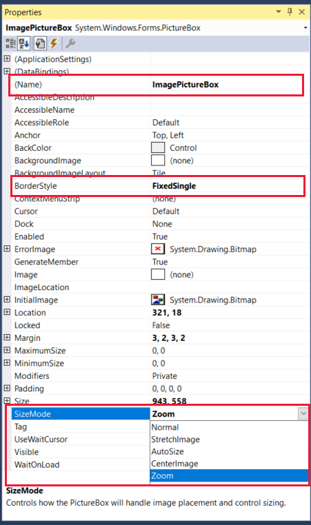

11. On the **Debug** menu, select **Start Without Debugging**. Nothing works because we have only laid out the UI elements so far, but starting the project does give us a chance to clean up its appearance before we move on. If anything in the UI looks skewed, go back to the designer and clean it up.

    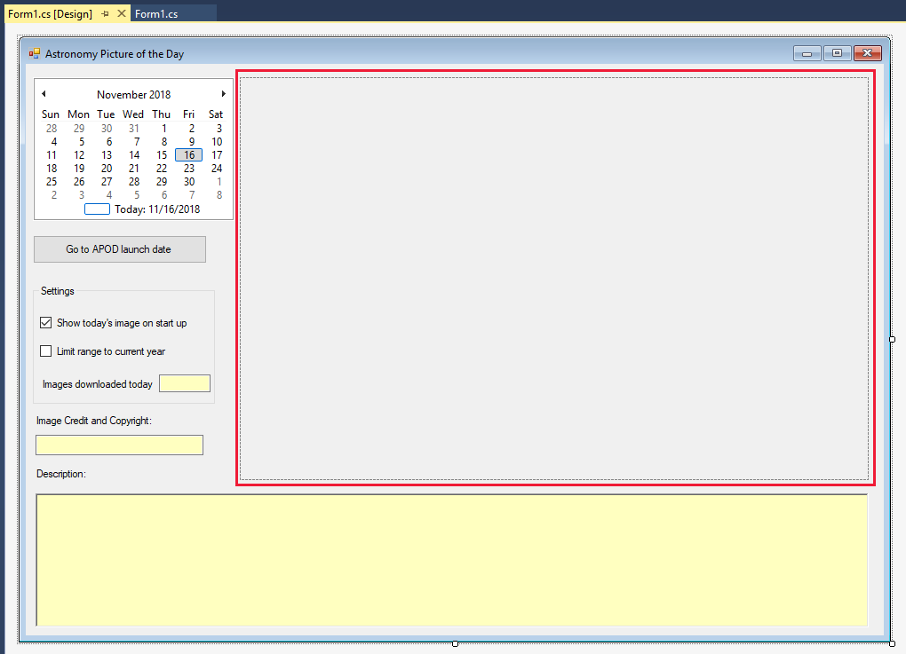

### Add code to handle the UI elements

Only a few of our UI elements need to have events associated with them. Let's work through them one by one.

1. Before we enter any events, let's add a few useful, global values. First, add the endpoint needed to call the NASA service, the launch date of the APOD program, and a count of downloaded images today. We also set a couple of defaults for the range of dates available to the calendar.

    The first section of your **Form1** class should read as follows:

    ```cs
            // The objective of the NASA API portal is to make NASA data, including imagery, eminently accessible to application developers.
            const string EndpointURL = "https://api.nasa.gov/planetary/apod";
    
            // June 16, 1995: the APOD launch date.
            DateTime launchDate = new DateTime(1995, 6, 16);
    
            // A count of images downloaded today.
            int imageCountToday;  
    
            public Form1()
            {
                InitializeComponent();
    
                // Set the maximum date to today and the minimum date to the APOD launch date.
                MonthCalendar.MaxDate = DateTime.Today;
                MonthCalendar.MinDate = launchDate;
            }
    ```

2. In the Visual Studio designer, select the button we named **LaunchButton** or, in the events for this button, select the **Click** event. Either way, the **LaunchButton_Click** method is created, and the Form1.cs code file opens to show it.

3. Insert the body of the **LaunchButton_Click** method, shown in the following example. This code sets the selected date of the calendar to the launch date of the APOD program, but first sets **LimitRangeCheckBox.Checked** to **false** to ensure that the full range of dates is available in the calendar. Setting this check box to **false** just keeps things consistent. The launch date of the program should be available only if the date range available isn't restricted to the current year.

    ```cs
            private void LaunchButton_Click(object sender, EventArgs e)
            {
                // Make sure the full range of dates is available.
                // This statement might invoke a call to LimitRangeCheckBox_CheckedChanged.
                LimitRangeCheckBox.Checked = false;
    
                // This statement will not load the first APOD image. It just sets the calendar to the APOD launch date.
                MonthCalendar.SelectionEnd = launchDate;
            }
    ```

4. Next, supply the code for the **LimitRangeCheckBox**. This code changes the range of dates available in the calendar from the full history of the APOD program to only the current year. Select the check box in the designer (or on the **CheckedChanged** event in the list of events for the check box) to add an empty method for this event. Then add the following code:

    ```cs
            private void LimitRangeCheckBox_CheckedChanged(object sender, EventArgs e)
            {
                if (LimitRangeCheckBox.Checked)
                {
                    var thisYear = new DateTime(DateTime.Today.Year, 1, 1);
                    MonthCalendar.MinDate = thisYear;              
                }
                else
                {
                    MonthCalendar.MinDate = launchDate;
                }
            }
    ```

5. The last event we need to react to is a date being selected in the **MonthCalendar**. Open the events for this control and select **DateSelected** to create the following method:

    ```cs
            private void MonthCalendar_DateSelected(object sender, DateRangeEventArgs e)
            {
    
            }
    
    ```

Before we go any further, let's test what we have done.

### 5. Test that the UI elements work

First, test that selecting the **LimitRangeCheckBox** does limit the range of dates available in the calendar correctly. Then, test that selecting a date in the calendar calls the right event. We can also check that selecting any other UI element *doesn't* fire any events!

1. On the **Debug** menu, select **Start Debugging**. When the app runs, go to the calendar and explore all the options available to you. You can select a date. You can also change months and years by selecting the top line of the calendar. Try changing to years and going back as far as you can. The range of years should stop at 1995.

    The calendar is quite an impressive UI element. It has lots of features that all work without requiring you to add any extra code. You can select date ranges by using this element too, although only selecting an individual date makes sense for this app.

2. Now select the **Limit range to current year** check box. Go back and play with the calendar, and verify that you can't go back beyond the first of the current year anymore. Next, clear that check box and ensure that you can now go back to 1995.

3. In the **MonthCalendar_DateSelected** event, set a breakpoint on the first brace ("{"). Right-click that line of code and select **Breakpoint > Insert Breakpoint** from the menu. If you did it right, a red circle appears to the left of the line number.

4. Next, select any date in the calendar. This action should stop the program at the breakpoint. Select **Continue** from the **Debug** menu when you've verified that the program has correctly halted on the event. Try it with a couple of dates, and then we're done testing our UI. Select **Stop Debugging** from the **Debug** menu.

Now we want to make something way more exciting happen when we select a date.

### Add code to download an image

1. Let's make sure that all the resources we need are available to us. Remember that we installed the Newtonsoft package, and we need to call some HTTP functions, too. Make sure the list of **using** statements at the top of the Form1.cs file includes all of the following:

    ```cs
    using System;
    using System.Net.Http;
    using System.Net.Http.Headers;
    using System.Threading.Tasks;
    using System.Windows.Forms;
    using System.IO;
    using Newtonsoft.Json.Linq;
    
    ```

2. Next, we need to do a bit of research. We know that the APOD is an image, but it can also be video (a scenario we're not going to support). However, there are quite a few image formats out there. By researching the formats available in Windows Forms, we can add a test to ensure that a downloaded image is in a supported format. Add the following method to your class. All it does is extract the file-name extension from an image URL and return true if that extension is supported.

    ```cs
            private bool IsSupportedFormat(string photoURL)
            {
                // Extract the extension and force to lowercase for comparison purposes.
                string ext = Path.GetExtension(photoURL).ToLower();
    
                // Check the extension against supported Windows Forms formats.
                return (ext == ".jpg" || ext == ".jpeg" || ext == ".png" || ext == ".gif" || ext == ".bmp" || 
                        ext == ".tif");
    
            }
    ```

3. Now we add the real meat of the program: the method to retrieve an image. This method can be complex. First, it's coded as an asynchronous **Task**. Read through the comments in the code to understand the flow, or at least to begin to understand it!

    ```cs
            private async Task RetrievePhoto()
            {
                var client = new HttpClient();           
                JObject jResult = null;
                string responseContent = null;
                string description = null;
                string photoUrl = null;
                string copyright = null;
    
                // Set the UI elements to defaults.
                ImageCopyrightTextBox.Text = "NASA";
                DescriptionTextBox.Text = "";
    
                // Build the date parameter string for the date selected, or the last date if a range is specified.
                DateTime dt = MonthCalendar.SelectionEnd;
                string dateSelected =  $"{dt.Year.ToString()}-{dt.Month.ToString("00")}-{dt.Day.ToString("00")}";            
                string URLParams = $"?date={dateSelected}&api_key=DEMO_KEY";
    
                // Populate the HTTP client appropriately.
                client.BaseAddress = new Uri(EndpointURL);
                client.DefaultRequestHeaders.Accept.Add(new MediaTypeWithQualityHeaderValue("application/json"));
    
                // The critical call: send a GET request with the appropriate parameters.
                HttpResponseMessage response = client.GetAsync(URLParams).Result;
    
                if (response.IsSuccessStatusCode)
                {
                    // Be ready to catch any data or server errors.
                    try
                    {
                        // Parse the response by using the Newtonsoft APIs.
                        responseContent = await response.Content.ReadAsStringAsync();
    
                        // Parse the response string for the details we need.
                        jResult = JObject.Parse(responseContent);
    
                        // Now get the image.
                        photoUrl = (string)jResult["url"];
                        ImagePictureBox.ImageLocation = photoUrl;
    
                        if (IsSupportedFormat(photoUrl))
                        {
                            // Get the copyright message but fill with "NASA" if no name is provided.
                            copyright = (string)jResult["copyright"];
                            if (copyright != null && copyright.Length > 0)
                            {
                                ImageCopyrightTextBox.Text = copyright;
                            }
    
                            // Populate the description text box.
                            description = (string)jResult["explanation"];
                            DescriptionTextBox.Text = description;
                        }
                        else
                        {
                           DescriptionTextBox.Text = $"Image type is not supported. URL is {photoUrl}";
                        }
                    }
                    catch (Exception ex)
                    {
                        DescriptionTextBox.Text = $"Image data is not supported. {ex.Message}";
                    }
    
                    // Keep track of our downloads in case we reach the limit.
                    ++imageCountToday;
                    ImagesTodayTextBox.Text = imageCountToday.ToString();
                }
                else
                {
                    DescriptionTextBox.Text = "We were unable to retrieve the NASA picture for that day: " +
                        $"{response.StatusCode.ToString()} {response.ReasonPhrase}";
                }
            }
    ```

4. Before we can test our app so far, we must complete the **DateSelected** method. We must add the **async** keyword to the method definition and use the **await** keyword when we make the call. In other words, even though the call is asynchronous, we're going to wait for the result before proceeding.

    ```cs
            private async void MonthCalendar_DateSelected(object sender, DateRangeEventArgs e)
            {
                await RetrievePhoto();
            }
    ```

### 7. Test that the program downloads and displays an image

This test is what we've been waiting for. Does the app download and render an image?

1. Let's just give it a try. Run the app from the **Debug** menu, or select F5.

    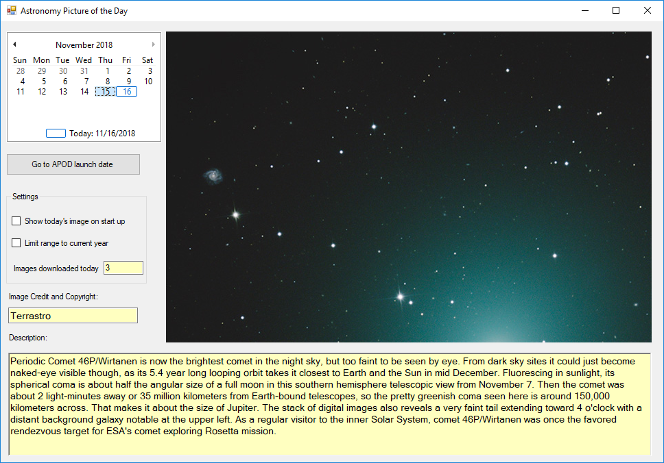

2. Does it work? Can you select dates from the calendar and render some fantastic images of space? If so,  great! If not, carefully check your code against the listings shown earlier in this unit.

### Add code to save and restore settings

The next step is a bit more mundane. We want to preserve the user's selections from one session of the app to the next. We need to create an initialization (or *init*) file. The init file is read when the app is opened, and the UI elements are set based on the file's contents before the user does anything. When the user closes the app, the current settings are saved until the next time the app runs.

Apps that don't preserve user preferences can become tedious to use after a while. It's good practice to make your apps user friendly in this way.

1. Let's think about the logic for our settings. We want to give the user the option of *not* displaying today's astronomy picture on startup, in case they have already seen it or don't want to use up one of their 50 downloads per day. So, we need to save today's date, the startup setting, and the count of images already downloaded today. We also save the setting that limits the range of dates, which we added mainly as an example of how to save and restore settings.

    The first step is to provide name strings for these four settings, so add the following code as globals for your **Form1** class:

    ```cs
            // Init file name strings, used to preserve UI values between sessions.
            const string SettingDateToday = "date today";
            const string SettingShowOnStartup = "show on startup";
            const string SettingImageCountToday = "image count today";
            const string SettingLimitRange = "limit range";
    ```

2. We also need a string to hold the path to the init file and a string to use to separate the settings into name/value pairs. So, add these globals, too:

    ```cs
            // The full path to the init file.
            string initFilePath;              
            
            // A char used to separate the name from the value in the init file.
            const char SettingDivider = ':';               
    ```

3. Let's store the init file in the same folder as the app itself. Add the following line to the **Form1()** constructor method:

    ```cs
                // The init file is stored in the same folder as the app.
                initFilePath = Path.Combine(Application.StartupPath, "init_apod.txt");
    ```

4. Let's now think about how to save these settings. We need to add an event when the app is closed. Select the form in the design view—select anywhere on the form where there's no UI element—to bring up the form properties. Select the event icon and then select the **FormClosed** event. This action adds skeletal code for an event called **Form1_FormClosed**. The only code that's needed in this event is a call to a method that writes the init file:

    ```cs
            private void Form1_FormClosed(object sender, FormClosedEventArgs e)
            {
                WriteInitFile();
            }
    ```

5. Now write that method. Using the **StreamWriter** object is helpful in this situation, and six lines are all you need for the body of the method. Note the use of the *SettingDivider* string to separate the name of a setting from its value.

    ```cs
            private void WriteInitFile()
            {
                using (var sw = new StreamWriter(initFilePath))
                {
                    // Write out today's date, to keep track of the downloads per day.
                    sw.WriteLine($"{SettingDateToday}{SettingDivider}{DateTime.Today.ToShortDateString()}");
    
                    // Write out the number of images that we've downloaded today.
                    sw.WriteLine($"{SettingImageCountToday}{SettingDivider}{imageCountToday.ToString()}");
    
                    // Write out the UI settings that we want to preserve for the next time.
                    sw.WriteLine($"{SettingShowOnStartup}{SettingDivider}{ShowTodaysImageCheckBox.Checked.ToString()}");
                    sw.WriteLine($"{SettingLimitRange}{SettingDivider}{LimitRangeCheckBox.Checked.ToString()}");
                }
            }
    ```
  
    > [!NOTE]
    > By declaring the settings strings and the divider string as globals for use in both reading and writing the settings, we avoid errors in spelling, punctuation, and spacing, and other mistakes that often cause an app to fail.

6. Test the code so far. Open the app and close it again immediately. Go to the folder that contains the app. (Hint: use the **Save File As** menu option to find the folder where your project is located.) Open the file called `init_apod.txt`. In Notepad, it should look something like this:

    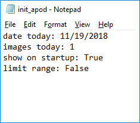

    > [!NOTE]
    > By giving our settings human-readable names, we're able to verify that the app is working correctly even though the purpose of the init file does not require that it ever be read by a human.

7. Reading the init file is a more complex operation. It's called from the **Form1** constructor, so add a line at the end of that method:

    ```cs
            public Form1()
            {
                InitializeComponent();
    
                // Set the maximum date to today, and the minimum date to the date APOD was launched.
                MonthCalendar.MaxDate = DateTime.Today;            
                MonthCalendar.MinDate = launchDate;
    
                // The init file is stored in the same folder as the application.
                initFilePath = Path.Combine(Application.StartupPath, "init_apod.txt");
    
                // Read the init file and set UI fields.
                ReadInitFile();
            }
    ```

8. Reading the init file takes a bit of work. Copy and paste the following method and read through the comments. Note how each setting string is parsed and how the appropriate UI elements are updated. There's no init file when the app runs for the first time, so we must handle the setting of initial defaults. Finally, we display the number of images downloaded today in the UI text box and trigger a date-selected event if we need to render today's image.

    ```cs
            private void ReadInitFile()
            {
                // Check that we have an init file.
                if (File.Exists(initFilePath))
                {
                    String line = null;
                    String[] part;
                    bool isToday = false;
    
                    using (var sr = new StreamReader(initFilePath))
                    {
                        while ((line = sr.ReadLine()) != null)
                        {
                            // Split the line into the part before the divider (the name) and the part after it (the value).
                            part = line.Split(SettingDivider);
    
                            // Switch on the "name" part and then process the "value" part.
                            switch (part[0])
                            {
                                // Read the date and, if it's today's date, read the number of images already downloaded today.
                                // If it's not today's date, set the number of downloads back to zero.
                                case SettingDateToday:
                                    var dt = DateTime.Parse(part[1]);
                                    if (dt.Equals(DateTime.Today))
                                    {
                                        isToday = true;
                                    }
                                    break;
    
                                case SettingImageCountToday:
    
                                    // If the last time the app was used was earlier today, the
                                    // image count stored is valid against the 50-per-day maximum.
                                    if (isToday)
                                    {
                                        imageCountToday = int.Parse(part[1]);
                                    }
                                    else
                                    {
                                        imageCountToday = 0;
                                    }
                                    break;
    
                                case SettingShowOnStartup:
                                    ShowTodaysImageCheckBox.Checked = bool.Parse(part[1]);
                                    break;
    
                                case SettingLimitRange:
    
                                    // This statement might invoke a call to LimitRangeCheckBox_CheckedChanged.
                                    LimitRangeCheckBox.Checked = bool.Parse(part[1]);
                                    break;
    
                                    // This line is for debugging purposes.
                                default:
                                    throw new Exception($"Unknown init file entry: {line}");
                            }
                        }
                    }
                }
                else
                {
                    // No init file exists yet, so set defaults.
                    imageCountToday = 0;
                    ShowTodaysImageCheckBox.Checked = true;
                    LimitRangeCheckBox.Checked = false;
                }
    
                ImagesTodayTextBox.Text = imageCountToday.ToString();
    
                // Make a call to retrieve a picture on startup, if required by the setting.
                if (ShowTodaysImageCheckBox.Checked)
                {
                    MonthCalendar_DateSelected(null, null);
                }
            }
    ```

Now, let's get back to the fun side of programming!

### Test the completed Windows Forms program

1. Build and run the completed app.

    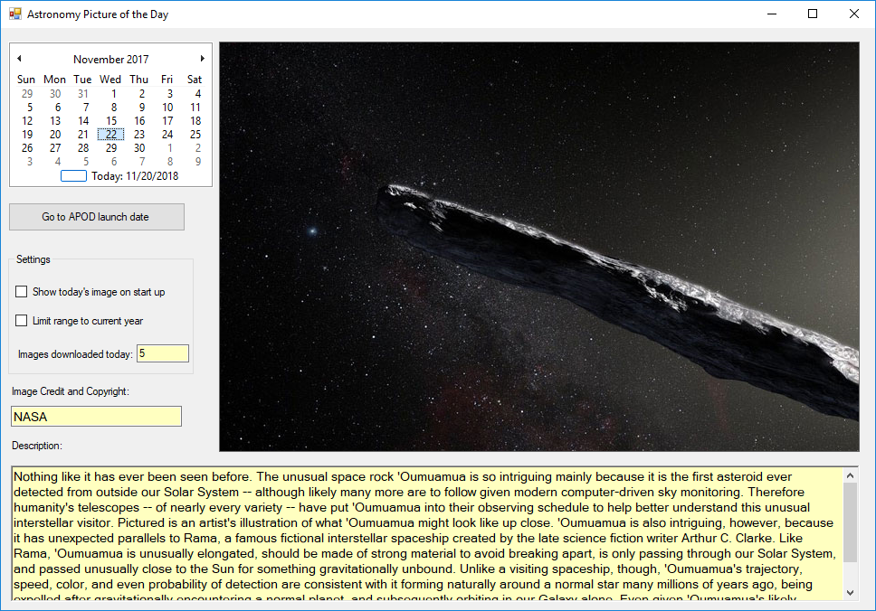

2. Change some of the settings, close the app, and run it again. Are the settings preserved correctly? Is the count of downloaded images correct?

3. Check out some of the amazing astronomy photography by selecting dates at random or perhaps dates of special meaning to you. Wonderful stuff!

    And, great job completing the tutorial.

    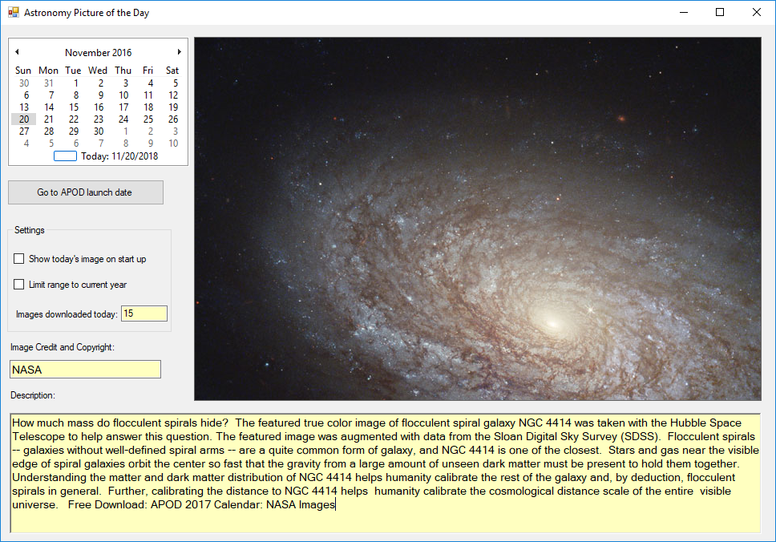

::: zone-end

::: zone pivot="wpf"


### Create the WPF project

In Visual Studio 2022, create a WPF C# project. Give the project a meaningful name, such as **APOD_WPF**.

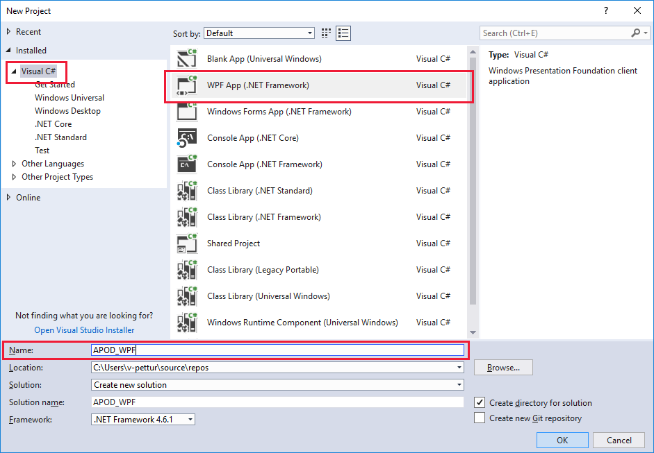

### Install required packages

1. Reinventing the wheel isn't smart, so let's download an add-on package for Visual Studio that helps us parse the response when we make HTTP calls. An add-on is available from Newtonsoft, so go to **Tools > NuGet Package Manager > Manage NuGet Packages for Solution**. The list of installed packages appears.

    

2. Select **Browse** to display the list of available packages. Select **Newtonsoft.Json** so that it's highlighted, select the check box for your project in the pane on the right, and then select **Install**.

    

### Build UI

The goal of this step is to lay out the UI components and give them a quick test. We need to construct a UI like this:

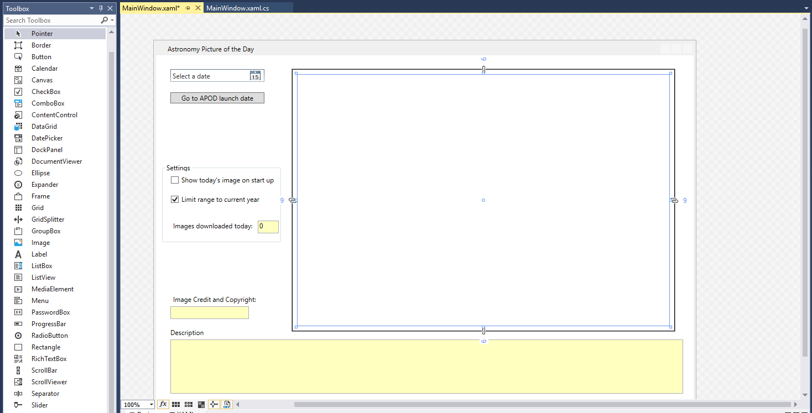

1. Start by opening the **Toolbox** and expanding **All WPF Controls**. Locate the **DatePicker** element and drag it to the upper-left portion of the designer layout. In **Properties**, change its name to **MonthCalendar**.

2. Below the date picker, add a **Button**, change its name to **LaunchButton**, and change its **Content** property (in the **Common** category) to **Go to APOD launch date**. 

3. Now add a **GroupBox** below the button. There's no need to give it a name because we don't access it, but change its **Header** property (in the **Common** category) to **Settings**. This group box contains the settings that are preserved from one session of the app to the next. Expand the group box so that it can take several lines of entries, but you don't have to be precise about it. You can align it precisely after adding the content.

4. Drag a **Grid** into the group box. With a grid, you can add multiple elements, like checkboxes, into the group box.

5. Drag a **CheckBox** into the group box, change its name to **ShowTodaysImageCheckBox**, and change its **Content** property (again in the **Common** category) to **Show today's image on start up**.

6. Drag a second **CheckBox** into the group box, change its name to **LimitRangeCheckBox**, and change its **Content** property to **Limit range to current year**.

7. Now add a **Label**. Again, there's no need for a name, but change its **Content** property to **Images downloaded today:**.

8. To the right of the label, add a small **TextBox** and name it **ImagesTodayTextBox**. This text is read-only, so in the **Text** category of the properties, select the **IsReadOnly** check box. Next, open the **Brush** category, select the **Background**, and change its blue color value to **192**. This value produces a good, contrasting, light-yellow color as background for the black text, to hint that the text box is read-only. We do the same for the other read-only text boxes that we add later.

    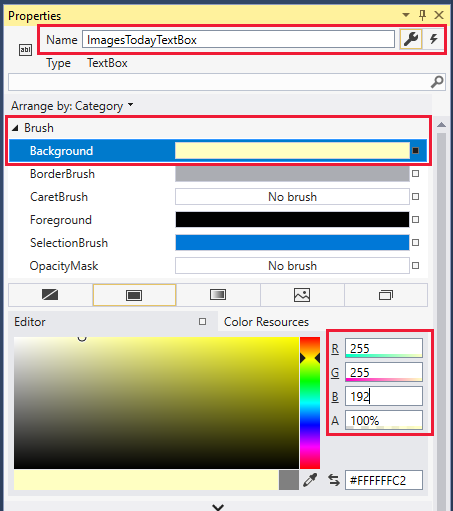

9. Adjust the alignment of the check boxes, label, and text box. Make them all fit neatly inside the group box, as in the layout shown at the start of step 3.

10. It's important to credit the downloaded images with the correct name and copyright, so add another label and text-box pair underneath the group box. Change the label **Content** to **Image Credit and Copyright:**. Name the text box **ImageCopyrightTextBox**. Expand the text box to a width that displays most credits without scrolling, perhaps to the width of the group box. Finally, repeat the read-only procedure: set the **IsReadOnly** property and change the background color to light yellow.

11. Now add the third label and text-box pair. The label should say **Description:**, but expand the text box to nearly the full width of the layout and make it several lines in height. Name the text box **DescriptionTextBox** and again, set its read-only properties.

12. To make it easier to lay out all the elements neatly, drag a **Border** element to the layout and expand it to a good width and height. In the **Appearance** category, make sure all **BorderThickness** entries are set to **1**. In this case, give the border a name, such as **PictureBorder**.

13. Now, with the border selected, drag an **Image** element from the toolbox into the border. Adding this element matches the image size with the border. Name the image **ImagePictureBox**. If you have difficulty selecting the image instead of the border, right-click anywhere inside where the image should be and select the **Set Current Selection** menu item. That's why we named the border. Both the image and border show up clearly in this menu and you can select the one you're working on.

14. On the **Debug** menu, select **Start Without Debugging**. Nothing works yet, but you can view and tidy up the UI elements later. Making the UI as neat as possible is a good practice.

### Add code to handle the UI elements

Only a few of our UI elements need to have events associated with them. Let's work through them one by one.

1. Before we enter any events, let's add a few useful, global values. First, add the endpoint needed to call the NASA service, the launch date of the APOD program, and a count of images downloaded today. We also set a couple of defaults for the range of dates available to the calendar. We also need to add an odd flag, **ignoreDoubleEvent**, because WPF fires two events in some situations where the other technologies (Windows Forms, UWP) fire only one. If a double event is fired, we set a flag to ignore the first of these events.

    Your **MainWindow** class should read like this:

    ```cs
        public partial class MainWindow : Window
        {
            // The objective of the NASA API portal is to make NASA data, including imagery, eminently accessible to application developers. 
            const string EndpointURL = "https://api.nasa.gov/planetary/apod";
    
            // June 16, 1995: the APOD launch date.
            DateTime launchDate = new DateTime(1995, 6, 16);
    
            // A count of images downloaded today.
            int imageCountToday;
    
            // Flag to ignore a strange double event in WPF.
            bool ignoreDoubleEvent = false;
    
            public MainWindow()
            {
                InitializeComponent();
    
                // Set the maximum date to today and the minimum date to the APOD launch date.
                MonthCalendar.DisplayDateEnd = DateTime.Today;
                MonthCalendar.DisplayDateStart = launchDate;
            }
        }
    ```

2. In the design view, select the button we named **LaunchButton** and, in the events for this button, select the **Click** event. The **LaunchButton_Click** method is created, and the MainWindow.xaml.cs code file opens to show it.

3. Insert the body of the **LaunchButton_Click** method. This code sets the selected date of the calendar to the launch date of the APOD program, but first sets the **LimitRangeCheckBox** to **false** to ensure that the full range of dates is available in the calendar. Setting this check box to **false** just keeps things consistent. The launch date of the program should be available only if the date range available isn't restricted to the current year.

    ```cs
            private void LaunchButton_Click(object sender, RoutedEventArgs e)
            {
                // Make sure the full range of dates is available.
                // This might invoke a call to LimitRangeCheckBox_CheckedChanged.
                LimitRangeCheckBox.IsChecked = false;
    
                // This will not load up the image, just sets the calendar to the APOD launch date.
                // This will fire a double event, the first of which needs to be ignored.
                ignoreDoubleEvent = true;
                MonthCalendar.SelectedDate = launchDate;
            }
    ```

4. Next, supply the code for the **LimitRangeCheckBox**. This code changes the range of dates available in the calendar from the full history of the APOD program to only the current year. Display the events for this check box by selecting the events icon in the **Properties** pane, find the **Click** event, and select it. You've created the outline of the event method, to which you can now add this code:

    ```cs
            private void LimitRangeCheckBox_Click(object sender, RoutedEventArgs e)
            {
                if (LimitRangeCheckBox.IsChecked == true)
                {
                    // Set the minimum date of the calendar to the beginning of the year.
                    var thisYear = new DateTime(DateTime.Today.Year, 1, 1);
                    MonthCalendar.DisplayDateStart = thisYear;
                }
                else
                {
                    // Set the minimum date of the calendar to the launch date of the APOD program.
                    MonthCalendar.DisplayDateStart = launchDate;
                }
            }
    ```

5. The last event we need to react to is the important one: a date being selected in the **MonthCalendar**. Open the events for this control, scroll down through the alphabetic list, and select the **SelectedDateChanged** event.

    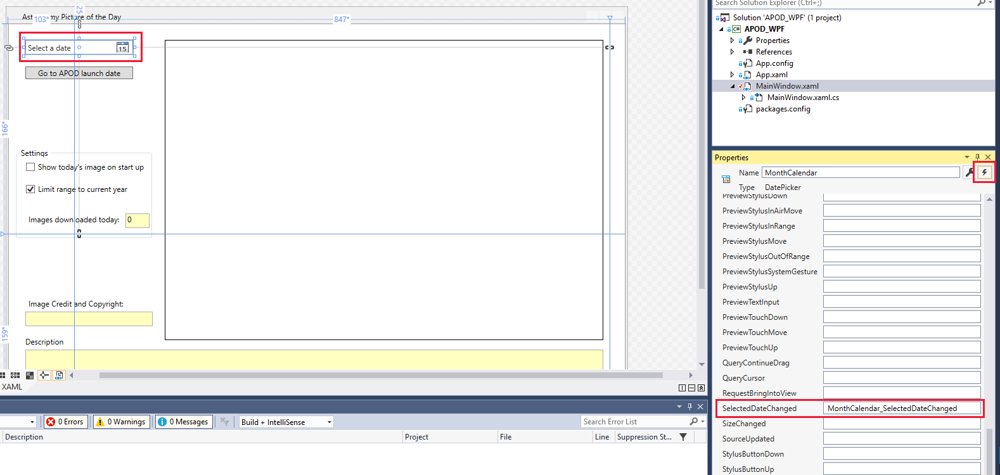

    This action creates the following method, which we leave empty for now:

    ```cs
            private void MonthCalendar_SelectedDateChanged(object sender, SelectionChangedEventArgs e)
            {
    
            }
    
    ```

Before we go any further, let's test what we've done.

### Test that the UI elements work

First, we test that selecting the **LimitRangeCheckBox** does limit the range of dates available in the calendar correctly. Then, test that selecting a date in the calendar calls the right event. We can also check that selecting any other UI element *doesn't* fire any events!

1. On the **Debug** menu, select **Start Debugging**. When the app runs, go to the calendar and explore all the options available to you. You can select a date. You can also change months and years by selecting the top line of the calendar. Try changing to years and going back as far as you can. The range of years should stop at 1995.

    The calendar is quite an impressive UI element. It has lots of features that all work without requiring you to add any extra code.

2. Now select the **Limit range to current year** check box. Go back and play with the calendar, and verify that you can't go back beyond the first of the current year anymore. Next, clear that check box and ensure that you can now go back to 1995.

3. In the **MonthCalendar_SelectedDateChanged** event, set a breakpoint on the first brace ("{"). Select that line of code and then select **Breakpoint > Insert Breakpoint** from the menu. If you did it right, a red circle appears to the left of the line number.

4. Back in the app, select any date in the calendar. This action should stop the program at the breakpoint. Select **Continue** from the **Debug** menu when you've verified that the program has correctly halted on the event. Try it with a couple of dates, and then we're done testing our UI. Select **Stop Debugging** from the **Debug** menu. The UI test is now over.

Now we want to make something way more exciting happen when we select a date!

### Add the code to download an image

1. Let's make sure that all the resources we need are available to us. Remember that we installed the Newtonsoft package, and we need to call some HTTP functions, too. Make sure the list of **using** statements at the top of the MainWindow.xaml.cs file includes all of the following:

    ```cs
    using System;
    using System.Threading.Tasks;
    using System.Windows;
    using System.Windows.Controls;
    using System.Windows.Media.Imaging;
    using Newtonsoft.Json.Linq;
    using System.Net.Http;
    using System.Net.Http.Headers;
    using System.IO;
    ```

2. Next, we need to do a bit of research. We know that the APOD is an image, but it can also be video (a scenario we're not going to support). However, there are quite a few image formats out there. By researching formats available in WPF, we can add a test to ensure that a downloaded image is in a supported format. Add the following method to your class. All it does is extract the file-name extension from an image URL and return true if that extension is supported.

    ```cs
            private bool IsSupportedFormat(string photoURL)
            {
                // Extract the extension and force to lower case for comparison purposes.
                string ext = System.IO.Path.GetExtension(photoURL).ToLower();
    
                // Check the extension against supported WPF formats.
                return (ext == ".jpg" || ext == ".jpeg" || ext == ".png" || ext == ".gif" || ext == ".bmp" ||
                        ext == ".wmf" || ext == ".tif" || ext == ".ico");
            }
    ```

3. Now we add the real meat of the program: the method to retrieve an image. This method can be complex. First, it's coded as an asynchronous **Task**. Read through the comments in the code to understand the flow, or at least to begin to understand it!

    ```cs
            private async Task RetrievePhoto()
            {
                var client = new HttpClient();
                JObject jResult = null;
                string responseContent = null;
                string description = null;
                string photoUrl = null;
                string copyright = null;
    
                // Set the UI elements to defaults.
                ImageCopyrightTextBox.Text = "NASA";
                DescriptionTextBox.Text = "";
    
                // Build the date parameter string for the date selected, or the last date if a range is specified.
                DateTime dt = (DateTime) MonthCalendar.SelectedDate;
                string dateSelected = $"{dt.Year.ToString()}-{dt.Month.ToString("00")}-{dt.Day.ToString("00")}";
                string URLParams = $"?date={dateSelected}&api_key=DEMO_KEY";
    
                // Populate the HTTP client appropriately.
                client.BaseAddress = new Uri(EndpointURL);
                client.DefaultRequestHeaders.Accept.Add(new MediaTypeWithQualityHeaderValue("application/json"));
    
                // The critical call: send a GET request with the appropriate parameters.
                HttpResponseMessage response = client.GetAsync(URLParams).Result;
    
                if (response.IsSuccessStatusCode)
                {
                    // Be ready to catch any data or server errors.
                    try
                    {
                        // Parse the response by using the Newtonsoft APIs.
                        responseContent = await response.Content.ReadAsStringAsync();
    
                        // Parse the response string for the details we need.
                        jResult = JObject.Parse(responseContent);
    
                        // Now get the image.
                        photoUrl = (string)jResult["url"];
                        var photoURI = new Uri(photoUrl);
                        var bmi = new BitmapImage(photoURI);
    
                        ImagePictureBox.Source = bmi;
    
                        if (IsSupportedFormat(photoUrl))
                        {
                            // Get the copyright message, but fill with "NASA" if no name is provided.
                            copyright = (string)jResult["copyright"];
                            if (copyright != null && copyright.Length > 0)
                            {
                                ImageCopyrightTextBox.Text = copyright;
                            }
    
                            // Populate the description text box.
                            description = (string)jResult["explanation"];
                            DescriptionTextBox.Text = description;
                        }
                        else
                        {
                            DescriptionTextBox.Text = $"Image type is not supported. URL is {photoUrl}";
                        }
                    }
                    catch (Exception ex)
                    {
                        DescriptionTextBox.Text = $"Image data is not supported. {ex.Message}";
                    }
    
                    // Keep track of our downloads in case we reach the limit.
                    ++imageCountToday;
                    ImagesTodayTextBox.Text = imageCountToday.ToString();
                }
                else
                {
                    DescriptionTextBox.Text = "We were unable to retrieve the NASA picture for that day: " +
                        $"{response.StatusCode.ToString()} {response.ReasonPhrase}";
                }
            }
    ```

4. Before we can test our app so far, we must complete the **MonthCalendar_SelectedDateChanged** method. We must add the **async** keyword to the method definition and use the **await** keyword when we make the call. In other words, even though the call is asynchronous, we're going to wait for the result before proceeding.

    Note also that we don't call the method to retrieve a photo if the **ignoreDoubleEvent** flag is set, but we do clear that flag if it's set.

    ```cs
            private async void MonthCalendar_SelectedDateChanged(object sender, SelectionChangedEventArgs e)
            {
                // Retrieve an image, unless a double event has been fired, in which case ignore the first event.
                if (!ignoreDoubleEvent)
                {
                    await RetrievePhoto();
                }
                else
                {
                    ignoreDoubleEvent = false;
                }
            }
    ```

That's all the coding we need to do before we test the app again.

### Test that the program downloads and displays an image

Now for the fun part of this tutorial.

1. In the **Debug** menu, select **Start Without Debugging** and select a date.

2. Does it work? Do you see some wonderful images when you select dates? If not, go back over your code carefully to locate the problem.

    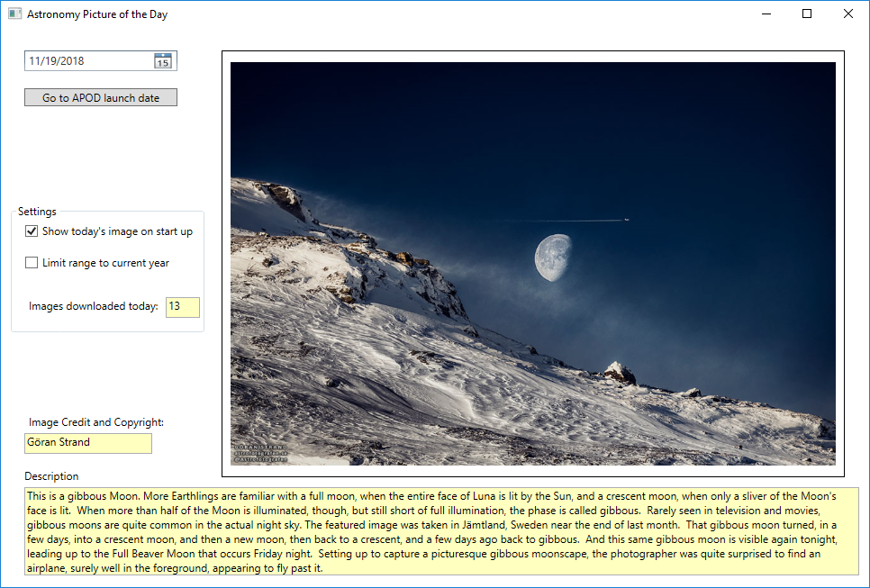

### Add code to save/restore settings

The next step is a bit more mundane. We want to preserve the user's selections from one session of the app to the next. First, we create an initialization, or *init*, file. The init file is read when the app is opened. The UI elements are set based on the contents of this file before the user does anything. When the user closes the app, the current settings are saved until the next time the app runs.

Apps that don't preserve user preferences can become tedious to use after a while. It's good practice to make your apps user friendly in this way.

1. Let's think about the logic for our settings. We want to give the user the option of *not* displaying today's astronomy picture on startup, in case they have already seen it or don't want to use up one of their 50 downloads per day. We must save today's date, the startup setting, and the count of images already downloaded today. We also save the setting that limits the range of dates, which we added mainly as an example of how to save and restore settings.

    The first step is to provide name strings for these four settings, so add the following code as globals for your **MainWindow** class:

    ```cs
            // Init file name strings, used to preserve UI values between sessions.
            const string SettingToday = "date today";
            const string SettingShowOnStartup = "show on startup";
            const string SettingImageCountToday = "images today";
            const string SettingLimitRange = "limit range";
    ```
  
2. We also need a **string** to hold the path to the init file and a **char** to use to separate the settings into name/value pairs. So, add these globals, too:

    ```cs
            // The full path to the init file.
            string initFilePath;
    
            // A char used to divide the name from the value in the init file.
            const char SettingDivider = ':';
    ```

3. Let's store the init file in the same folder as the app itself. Add the following line to the **MainWindow()** constructor method:

    ```cs
            // Store the init file in the same folder as the application.
            initFilePath = System.IO.Path.Combine(AppDomain.CurrentDomain.BaseDirectory, "init_apod.txt");
    ```

4. Let's now think about how to save these settings. We need to add an event when the app is closed. Select the **Window** in the design view, right-click anywhere on the layout, select **Set Current Selection**, and then choose the window name from the list. The window properties display. Select the event icon and then select the **Closed** event. This action adds skeletal code for an event called **APOD_WPF_Close**. The only code that's needed in this event is to call a method that writes the init file:

    ```cs
            private void APOD_WPF_Closed(object sender, EventArgs e)
            {
                WriteInitFile();
            }
    ```

5. Now write that method. Using the **StreamWriter** object is helpful in this situation, and a few lines are all you need for the body of the method. Note the use of the divider character to separate the name of a setting from its value.

    ```cs
            private void WriteInitFile()
            {
                using (var sw = new StreamWriter(initFilePath))
                {
                    // Write out todays date, to keep track on the downloads per day.
                    sw.WriteLine(SettingToday + SettingDivider + DateTime.Today.ToShortDateString());
    
                    // Write out the number of images we have downloaded today.
                    sw.WriteLine(SettingImageCountToday + SettingDivider + imageCountToday.ToString());
    
                    // Write out the UI settings we want to preserve for the next time.
                    sw.WriteLine(SettingShowOnStartup + SettingDivider + ShowTodaysImageCheckBox.IsChecked.ToString());
                    sw.WriteLine(SettingLimitRange + SettingDivider + LimitRangeCheckBox.IsChecked.ToString());
                }
            }
    ```

    > [!NOTE]
    > By declaring the settings strings and divider **char** as globals for use in both reading and writing the settings, we avoid errors in spelling, punctuation, and spacing, and other mistakes that often cause an app to fail.

6. Test the code so far. Open the app and close it again immediately. Go to the folder that contains the app. (Hint: use the **Save File As** menu option to find the folder where your project is located.) Open the file called init_apod.txt. In Notepad, it should look something like this:

    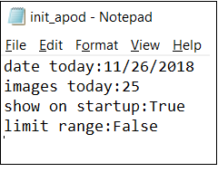

    > [!NOTE]
    > By giving our settings human-readable names, we're able to verify that the app is working correctly even though the purpose of the init file does not require that it ever be read by a human.

7. Reading the init file is a more complex operation. It's called from the **MainWindow** constructor, so add a line at the end of the method:

    ```cs
            public MainWindow()
            {
                InitializeComponent();
    
                // Set the maximum date to today, and the minimum date to the date APOD was launched.
                MonthCalendar.DisplayDateEnd = DateTime.Today;
                MonthCalendar.DisplayDateStart = launchDate;
    
                // Store the init file in the same folder as the application.
                initFilePath = System.IO.Path.Combine(AppDomain.CurrentDomain.BaseDirectory, "init_apod.txt");
    
                // Read the init file and set UI fields.
                ReadInitFile();
            }
    ```

8. Reading the init file takes a bit of work. Copy and paste the following method and read through the comments. Note how each setting string is parsed and how the appropriate UI elements are updated. There's no init file when the app runs for the first time, so we must handle the setting of initial defaults. Finally, we display the number of images downloaded today in the UI text box and trigger a date-selected event if we need to render today's image.

    ```cs
            private void ReadInitFile()
            {
                // Check that we have an init file.
                if (File.Exists(initFilePath))
                {
                    String line = null;
                    String[] part;
                    bool isToday = false;
    
                    using (var sr = new StreamReader(initFilePath))
                    {
                        while ((line = sr.ReadLine()) != null)
                        {
                            // Split the line into the part before the colon (the name), and the part after (the value).
                            part = line.Split(SettingDivider);
    
                            // Switch on the "name" part, and then process the "value" part.
                            switch (part[0])
                            {
                                // Read the date and, if it's today's date, read the number of images already downloaded.
                                // If it's not today's date, set the number of downloads back to zero.
                                case SettingToday:
                                    var dt = DateTime.Parse(part[1]);
                                    if (dt.Equals(DateTime.Today))
                                    {
                                        isToday = true;
                                    }
                                    break;
    
                                case SettingImageCountToday:
    
                                    // If the last time the app was used was earlier today, the
                                    // image count stored is valid against the 50-per-day maximum.
                                    if (isToday)
                                    {
                                        imageCountToday = int.Parse(part[1]);
                                    }
                                    else
                                    {
                                        imageCountToday = 0;
                                    }
                                    break;
    
                                case SettingShowOnStartup:
                                    ShowTodaysImageCheckBox.IsChecked = bool.Parse(part[1]);
                                    break;
    
                                case SettingLimitRange:
    
                                    // This statement might invoke a call to LimitRangeCheckBox_CheckedChanged.
                                    LimitRangeCheckBox.IsChecked = bool.Parse(part[1]);
                                    break;
    
                                default:
                                    throw new Exception("Unknown init file entry: " + line);
                            }
                        }
                    }
                }
                else
                {
                    // No init file exists yet, so set defaults.
                    imageCountToday = 0;
                    ShowTodaysImageCheckBox.IsChecked = true;
                    LimitRangeCheckBox.IsChecked = false;
                }
    
                ImagesTodayTextBox.Text = imageCountToday.ToString();
    
                // Make a call to retrieve a picture on startup, if required by the setting.
                if (ShowTodaysImageCheckBox.IsChecked == true)
                {
                    // Note that, in WPF, this fires a double event, the first of which should be ignored.
                    ignoreDoubleEvent = true;
                    MonthCalendar.SelectedDate = DateTime.Today;
                }
            }
    ```

Now, let's get back to the fun side of programming!

### Test the completed WPF program

1. Build and run the completed app.

    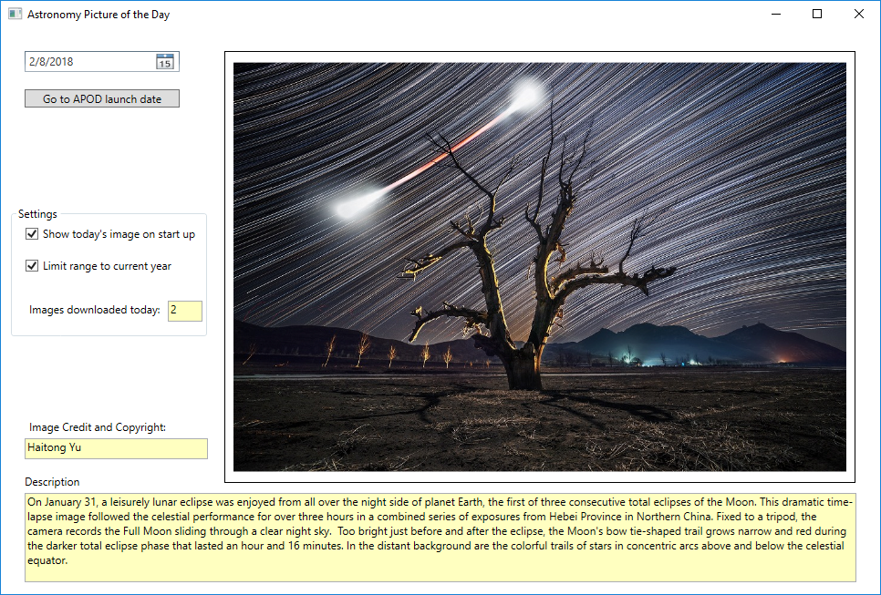

2. Change some of the settings, close the app, and run it again. Are the settings preserved correctly? Is the count of downloaded images correct?

3. Check out some of the amazing astronomy photography by selecting dates at random or perhaps dates of special meaning to you. Wonderful stuff!

    And, great job completing the tutorial.

    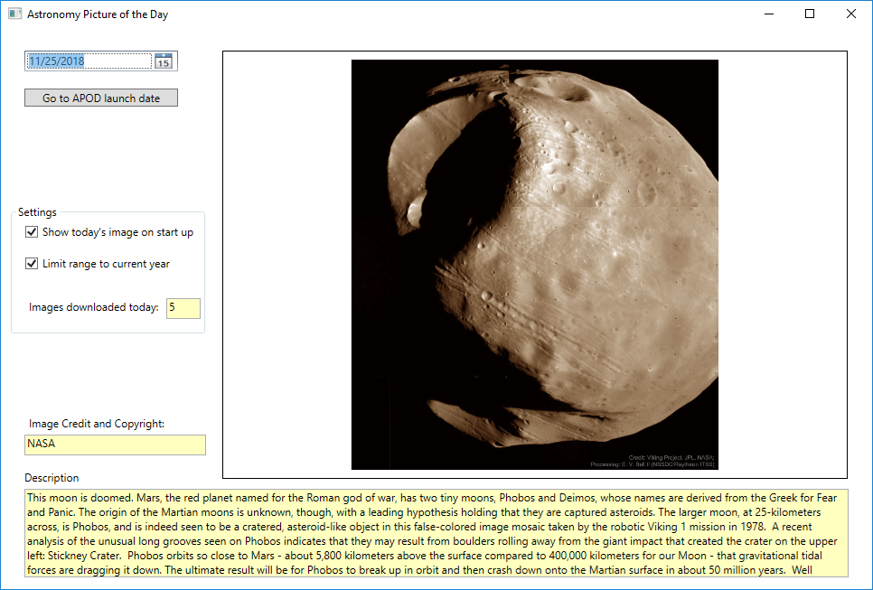

::: zone-end

::: zone pivot="uwp"


### Create the UWP project

1. In Visual Studio 2022, create a UWP C# project. Give the project a meaningful name, such as **APOD_UWP**.

    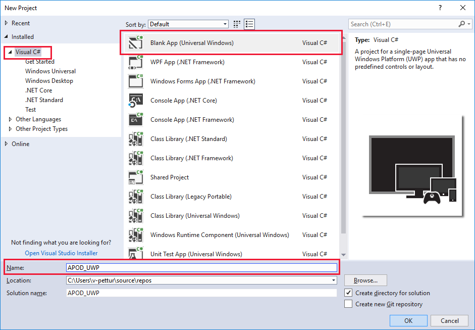

2. When the puzzling minimum-version dialog box appears, just select **OK**.

### Install the required NuGet packages

1. Reinventing the wheel isn't smart, so let's download an add-on package for Visual Studio that helps us parse the response when we make HTTP calls. One popular add-on is from Newtonsoft, so go to **Tools > NuGet Package Manager > Manage NuGet Packages for Solution**. The list of installed packages appears.

    

2. Select **Browse** to display the list of available packages. Select **Newtonsoft.Json** so it's highlighted, select the check box for your project in the pane on the right, and then select **Install**.

    

### Build the app UI

The goal of this step is to lay out the UI components and give them a quick test. We need to construct a UI like this:

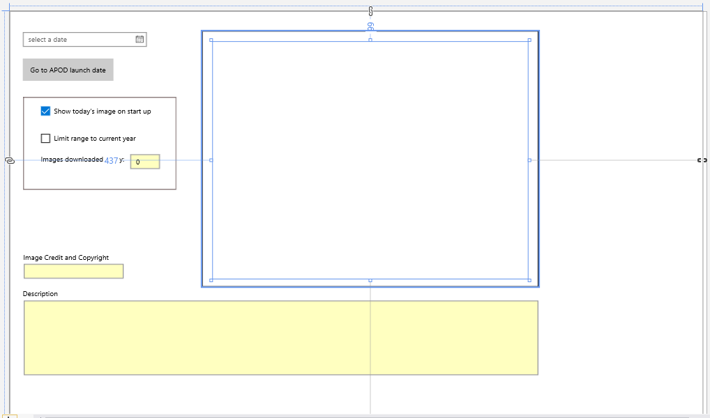

1. Start by opening the **Toolbox** and expanding **All XAML Controls**. Locate the **CalendarDatePicker** element and drag it to the upper-left portion of the designer layout. In **Properties**, change its name to **MonthCalendar**.

    > [!NOTE]
    > Be careful not to confuse the **CalendarDatePicker** with the **DatePicker** UI elements. They're different controls with a different set of properties.

2. Below the date picker, add a **Button**, change its name to **LaunchButton**, and change its **Content** property (in the **Common** category) to **Go to APOD launch date**.

3. Now add a **Border** below the button. There's no need to give it a name because we don't access it, but change all the **BorderThickness** properties—in the **Appearance** category—to **1**. This border contains the settings that are preserved from one session of the app to the next. Expand the border so that it can take several lines of entries, but you don't have to be precise about it. You can align it precisely after adding the content.

4. Drag a **CheckBox** inside the border, change its name to **ShowTodaysImageCheckBox**, and change its **Content** property (again in the **Common** category) to **Show today's image on start up**.

5. Drag a second **CheckBox** inside the border, change its name to **LimitRangeCheckBox**, and change its **Content** property to **Limit range to current year**.

6. Now add a **TextBlock**, still inside the border. Again, there's no need for a name, but change its **Text** property (in the **Common** category) to **Images downloaded today:**.

7. To the right of the text block, add a small **TextBox** and name it **ImagesTodayTextBox**. This text is read-only, so in the **Common** category of the properties, select the **IsReadOnly** check box. Next, open the **Brush** category, select the **Background**, and change its color to **255,255,192,100%**. These values produce a good, contrasting, light-yellow color as background for the black text, to hint that the text box is read-only. We do the same for the other read-only text boxes that we add later.

    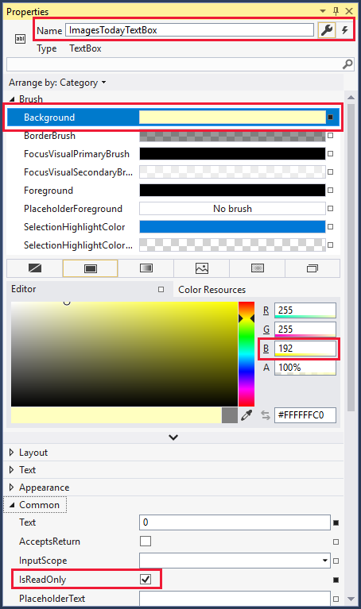

8. Adjust the alignment of the check boxes, text block, and text box. Make them all fit neatly inside the border, as in the layout shown at the start of step 3.

9. It's important to credit the downloaded images with the correct name and copyright, so add another text-block and text-box pair underneath the border. Change the text block **Text** to **Image Credit and Copyright:**. Name the text box **ImageCopyrightTextBox**. Expand the text box to a width that displays most credits without scrolling, so perhaps place it below the text block and make it the same width as the border above it. Finally, repeat the read-only procedure: set the **IsReadOnly** property and change the background brush color to light yellow.

10. Now add the third text-block and text-box pair. The text block should say **Description:**. Expand the text box to nearly the full width of the layout and make it several lines in height. Name the text box **DescriptionTextBox** and again, set its read-only properties. Also, set its **TextWrapping** property (found by expanding the **Text** category) to **Wrap**.

11. To make it easier to lay out all the elements neatly, drag a **Border** element to the layout and expand it to a good width and height. In the **Appearance** category, make sure all **BorderThickness** entries are set to **1**. In this case, give the border a name, such as **PictureBorder**.

    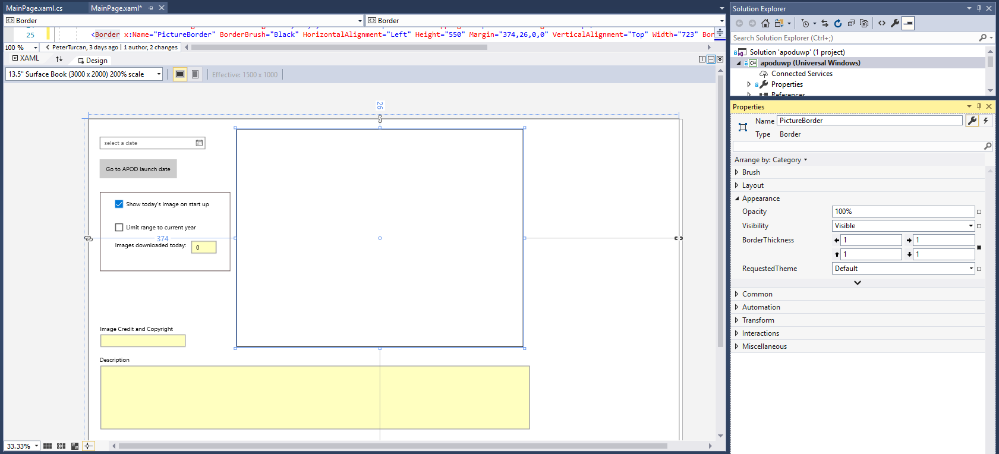

12. Now, with the border selected, drag an **Image** element from the toolbox into the border. This element aligns the image correctly within the border. Name the image **ImagePictureBox**. If you have difficulty selecting the image instead of the border, right-click anywhere inside where the image should be and select the **Set Current Selection** menu item. We named the border so both the image and border show up clearly in this menu and you can select the one you're working on.

    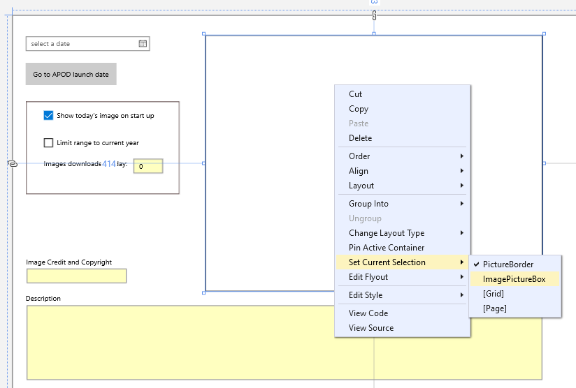

13. On the **Debug** menu, select **Start Without Debugging**. Nothing works yet, but you can view and tidy up the UI elements later. Making the UI as neat as possible is good practice.

### Add code to handle the app UI elements

Only a few of our UI elements need to have events associated with them. Let's work through them one by one. Open the `MainPage.xaml.cs` file.

1. Before we enter any events, lets add a few useful, global values. First, add the endpoint needed to call the NASA service, the launch date of the APOD program, and a count of images downloaded. We also set a couple of defaults for the range of dates available to the calendar.

    The first section of your **MainPage** class should read like this:

    ```cs
        public sealed partial class MainPage : Page
        {
            // The objective of the NASA API portal is to make NASA data, including imagery, eminently accessible to application developers. 
            const string EndpointURL = "https://api.nasa.gov/planetary/apod";
    
            // June 16, 1995: the APOD launch date.
            DateTime launchDate = new DateTime(1995, 6, 16);
    
            // A count of images downloaded today.
            int imageCountToday;
    
            public MainPage()
            {
                this.InitializeComponent();
    
                // Set the maximum date to today, and the minimum date to the APOD launch date.
                MonthCalendar.MinDate = launchDate;
                MonthCalendar.MaxDate = DateTime.Today;          
            }
        }
    ```

2. In the design view, double-click the button we named **LaunchButton**, or, in the events for this button, select the **Click** event. Either way, the **LaunchButton_Click** method is created, and the `MainPage.xaml.cs` code file opens to show it.

3. Insert the body of the **LaunchButton_Click** method. This code sets the selected date of the calendar to the launch date of the APOD program, but first sets the **LimitRangeCheckBox** to **false** to ensure that the full range of dates is available in the calendar. Setting this check box to **false** just keeps things consistent. The launch date of the program should be available only if the date range available isn't restricted to the current year.

    ```cs
            private void LaunchButton_Click(object sender, RoutedEventArgs e)
            {
                // Make sure the full range of dates is available.
                LimitRangeCheckBox.IsChecked = false;
    
                // This will not load up the image, just sets the calendar to the APOD launch date.
                MonthCalendar.Date = launchDate;
            }
    ```
  
4. Next, supply the code for the **LimitRangeCheckBox**. This code changes the range of dates available in the calendar from the full history of the APOD program to only the current year. Display the events for this check box by selecting the events icon in the **Properties** pane. Find the **Checked** and the **Unchecked** events and select them. This process is different from the WPF and Windows Forms technologies, where these events are combined into one. You're creating the outlines of the two event methods, to which you can now add this code:

    ```cs
            private void LimitRangeCheckBox_Checked(object sender, RoutedEventArgs e)
            {
                // Set the calendar minimum date to the first of the current year.
                var firstDayOfThisYear = new DateTime(DateTime.Today.Year, 1, 1);
                MonthCalendar.MinDate = firstDayOfThisYear;
            }
    
            private void LimitRangeCheckBox_Unchecked(object sender, RoutedEventArgs e)
            {
                // Set the calendar minimum date to the launch of the APOD program.
                MonthCalendar.MinDate = launchDate;
            }
    ```

5. The last event we need to react to is the important one: a date being selected in the **MonthCalendar**. Open the events for this control and select the **DateChanged** event. This action creates the following method, which we leave empty for now:

    ```cs
            private void MonthCalendar_DateChanged(CalendarDatePicker sender, CalendarDatePickerDateChangedEventArgs args)
            {
    
            }
    ```

Before we go any further, let's test what we've done.

### Test that the app UI elements work

First, test that selecting the **LimitRangeCheckBox** does limit the range of dates available in the calendar correctly. Then, test that selecting a date in the calendar calls the right event. We can also check that selecting any other UI element *doesn't* fire any events!

1. On the **Debug** menu, select **Start Debugging**. When the app runs, go to the calendar and explore all the options available to you. You can select a date. You can also change months and years by selecting the top line of the calendar. Try changing to years and going back as far as you can. The range of years should stop at 1995. 

    The calendar is quite an impressive UI element. It has lots of features that all work without requiring you to add any extra code.

2. Now select the **Limit range to current year** check box. Go back and play with the calendar, and verify that you can't go back beyond the first of the current year anymore. Next, clear that check box and ensure that you can now go back to 1995.

3. In the **MonthCalendar_DateChanged** event, set a breakpoint on the first brace ("{"). Right-click that line of code and then select **Breakpoint > Insert Breakpoint** from the menu. If you did it right, a red circle appears to the left of the line number.

4. Back in the app, select any date in the calendar. This action should stop the program at the breakpoint. Select **Continue** from the **Debug** menu when you've verified that the program has correctly halted on the event. Try it with a couple of dates, and then we're done testing our UI. Select **Stop Debugging** from the **Debug** menu.

Now we want to make something way more exciting happen when we select a date!

### Add the code to download an image

1. Let's make sure that all the resources we need are available to us. Remember that we installed the Newtonsoft package, and we need to call some HTTP functions, too. Make sure the list of **using** statements at the top of the `MainPage.xaml.cs` file includes all of the following:

    ```cs
    using System;
    using System.IO;
    using Windows.UI.Xaml;
    using Windows.UI.Xaml.Controls;
    using Windows.UI.Xaml.Media.Imaging;
    using Newtonsoft.Json.Linq;
    using System.Net.Http;
    using System.Net.Http.Headers;
    using System.Threading.Tasks;
    ```

2. Next, we need to do a bit of research. We know that the APOD is an image, but it can also be video (a scenario we're not going to support). However, there are quite a few image formats out there. By researching the formats available in UWP, we can add a test to ensure that a downloaded image is in a supported format. Add the following method to your class. All it does is extract the file-name extension from an image URL and return true if that extension is supported.

    ```cs
            private bool IsSupportedFormat(string photoURL)
            {
                // Extract the extension and force to lower case for comparison purposes.
                string ext = Path.GetExtension(photoURL).ToLower();
    
                // Check the extension against supported UWP formats.
                return (ext == ".jpg" || ext == ".jpeg" || ext == ".png" || ext == ".gif" ||
                        ext == ".tif" || ext == ".bmp" || ext == ".ico" || ext == ".svg");
            }
    ```

3. Now we add the real meat of the program: the method to retrieve an image. This method can be complex, as it's coded as an asynchronous **Task**. Read through the comments in the code to understand the flow, or at least to begin to understand it!

    ```cs
            private async Task RetrievePhoto()
            {
                var client = new HttpClient();
                JObject jResult = null;
                string responseContent = null;
                string description = null;
                string photoUrl = null;
                string copyright = null;
    
                // Set the UI elements to defaults
                ImageCopyrightTextBox.Text = "NASA";
                DescriptionTextBox.Text = "";
    
                // Build the date parameter string for the date selected, or the last date if a range is specified.
                DateTimeOffset dt = (DateTimeOffset)MonthCalendar.Date;
    
                string dateSelected = $"{dt.Year.ToString()}-{dt.Month.ToString("00")}-{dt.Day.ToString("00")}";
                string URLParams = $"?date={dateSelected}&api_key=DEMO_KEY";
    
                // Populate the HTTP client appropriately.
                client.BaseAddress = new Uri(EndpointURL);
                client.DefaultRequestHeaders.Accept.Add(new MediaTypeWithQualityHeaderValue("application/json"));
    
                // The critical call: send a GET request with the appropriate parameters.
                HttpResponseMessage response = client.GetAsync(URLParams).Result;
    
                if (response.IsSuccessStatusCode)
                {
                    // Be ready to catch any data or server errors.
                    try
                    {
                        // Parse the response by using the Newtonsoft APIs.
                        responseContent = await response.Content.ReadAsStringAsync();
    
                        // Parse the response string for the details we need.
                        jResult = JObject.Parse(responseContent);
    
                        // Now get the image.
                        photoUrl = (string)jResult["url"];
                        var photoURI = new Uri(photoUrl);
                        var bmi = new BitmapImage(photoURI);
    
                        ImagePictureBox.Source = bmi;
    
                        if (IsSupportedFormat(photoUrl))
                        {
                            // Get the copyright message, but fill with "NASA" if no name is provided.
                            copyright = (string)jResult["copyright"];
                            if (copyright != null && copyright.Length > 0)
                            {
                                ImageCopyrightTextBox.Text = copyright;
                            }
    
                            // Populate the description text box.
                            description = (string)jResult["explanation"];
                            DescriptionTextBox.Text = description;
                        }
                        else
                        {
                            DescriptionTextBox.Text = $"Image type is not supported. URL is {photoUrl}";
                        }
                    }
                    catch (Exception ex)
                    {
                        DescriptionTextBox.Text = $"Image data is not supported. {ex.Message}";
                    }
    
                    // Keep track of our downloads in case we reach the limit.
                    ++imageCountToday;
                    ImagesTodayTextBox.Text = imageCountToday.ToString();
                }
                else
                {
                    DescriptionTextBox.Text = "We were unable to retrieve the NASA picture for that day: " +
                        $"{response.StatusCode.ToString()} {response.ReasonPhrase}";
                }
            }
    ```

4. Before we can test our app so far, we must complete the **MonthCalendar_DateChanged** method. We must add the **async** keyword to the method definition and use the **await** keyword when we make the call. In other words, even though the call is asynchronous, we're going to wait for the result before proceeding.

    ```cs
            private async void MonthCalendar_DateChanged(CalendarDatePicker sender, CalendarDatePickerDateChangedEventArgs args)
            {
                await RetrievePhoto();
            }
    ```

That's all the coding we need to do before our next test.

### Test the program

Now for the fun part of this tutorial.

1. In the **Debug** menu, select **Start Without Debugging** and select a date.

2. Does it work? Do you see some wonderful images when you select dates? If not, go back over your code carefully to locate the problem.

    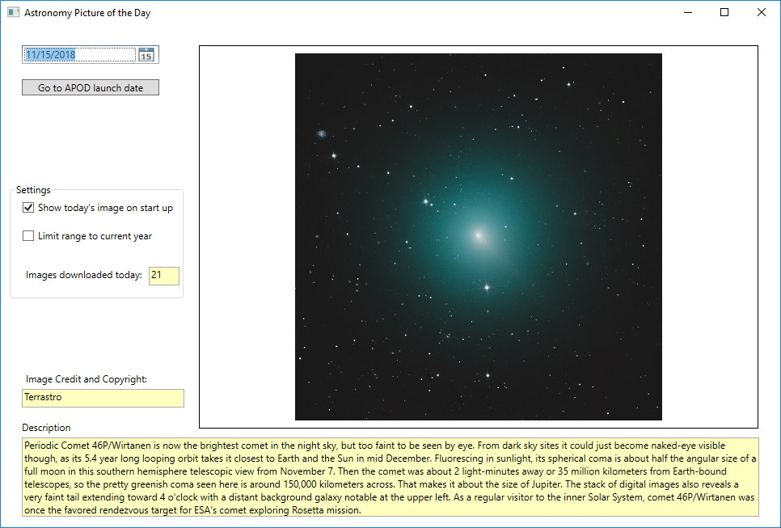

### Add the code to save/restore settings

The next stage is a bit less exciting, although it uses technology that's new to UWP. We want to preserve the user's selections from one session of the app to the next. We're going to preserve these selections by using the **LocalSettings** feature of UWP. Local settings take the place of an init file, provide convenient, local, persistent storage, and require fewer lines of code to implement than writing to a file.

Apps that don't preserve user preferences can become tedious to use after a while. It's good practice to make your apps user friendly in this way.

1. Let's think about the logic for our settings. We want to give the user the option of *not* displaying today's astronomy picture on startup, in case they have already seen it or don't want to use up one of their 50 downloads per day. We must save today's date, the startup setting, and the count of images already downloaded today. We also want to save the setting that limits the range of dates, which we added mainly as an example of how to save and restore settings.

    The first step is to provide name strings for these four settings, so add the following code as globals for your **MainPage** class:

    ```cs
            // Settings name strings, used to preserve UI values between sessions.
            const string SettingDateToday = "date today";
            const string SettingShowOnStartup = "show on startup";
            const string SettingImageCountToday = "image count today";
            const string SettingLimitRange = "limit range";
    ```

2. We also need to define a container for the local settings, so add this global code, too:

    ```cs
            // Declare a container for the local settings.
            Windows.Storage.ApplicationDataContainer localSettings; 
    ```

3. Add the following line to the **MainPage()** constructor method, to create the local settings container:

    ```cs
                // Create the container for the local settings.
                localSettings = Windows.Storage.ApplicationData.Current.LocalSettings;
    ```

4. Let's now think about how to save these settings. We need to add an event when the app is closed. Select the grid in the design view, right-click anywhere on the layout, select **Set Current Selection**, and then choose **[Grid]** from the list. The grid properties display. Select the event icon and then select the **LostFocus** event. This action adds skeletal code for an event called **Grid_LostFocus**. The only code that's needed in this event is to call a method that writes the settings:

    ```cs
            private void Grid_LostFocus(object sender, RoutedEventArgs e)
            {
                WriteSettings();
            }
    ```

5. Now write that method. It's easy to store values by using the local settings feature of UWP.

    ```cs
            private void WriteSettings()
            {
                // Preserve the required UI settings in the local storage container.
                localSettings.Values[SettingDateToday] = DateTime.Today.ToString();
                localSettings.Values[SettingShowOnStartup] = ShowTodaysImageCheckBox.IsChecked.ToString();
                localSettings.Values[SettingLimitRange] = LimitRangeCheckBox.IsChecked.ToString();
                localSettings.Values[SettingImageCountToday] = imageCountToday.ToString();
            }
    ```

    > [!NOTE]
    > By declaring the settings strings as globals for use in both reading and writing the settings, we avoid errors induced by spelling mistakes, punctuation, spacing, and other tedious mistakes that so often lead to an app not working.

6. Reading the settings is a more complex operation. The read operation is called from the **MainPage** constructor, so add a line at the end of the method:

    ```cs
            public MainPage()
            {
                this.InitializeComponent();
    
                // Create the container for the local settings.
                localSettings = Windows.Storage.ApplicationData.Current.LocalSettings;
    
                // Set the maximum date to today, and the minimum date to the date APOD was launched.
                MonthCalendar.MinDate = launchDate;
                MonthCalendar.MaxDate = DateTime.Today;
    
                ReadSettings();            
            }
    ```

7. Reading the settings takes a bit of work. Copy and paste the following method and read through the comments. Note how each setting string is parsed and how the appropriate UI elements are updated. There are no stored settings when the app runs for the first time, so we must handle the initial defaults. Finally, we display the number of images downloaded today in the UI text box and trigger a date-selected event if we need to render today's image.

    ```cs
            private void ReadSettings()
            {
                // If the app is being started the same day that it was run previously, the count of images downloaded today
                // must be set to the stored setting. Otherwise, it should be zero.
                bool isToday = false;
                Object todayObject = localSettings.Values[SettingDateToday];
    
                if (todayObject != null)
                {
                    // First check to see if this is the same day as the previous run of the app.
                    DateTime dt = DateTime.Parse((string)todayObject);
                    if (dt.Equals(DateTime.Today))
                    {
                        isToday = true;
                    }
                }
    
                // Set the default for images downloaded today.
                imageCountToday = 0;
    
                if (isToday)
                {
                    Object value = localSettings.Values[SettingImageCountToday];
                    if (value != null)
                    {
                        imageCountToday = int.Parse((string)value);
                    }
                }
                ImagesTodayTextBox.Text = imageCountToday.ToString();
    
                // Set the UI check boxes, depending on the stored settings or defaults if there are no settings.
                Object showTodayObject = localSettings.Values[SettingShowOnStartup];
                if (showTodayObject != null)
                {
                    ShowTodaysImageCheckBox.IsChecked = bool.Parse((string)showTodayObject);
                }
                else
                {
                    // Set the default.
                    ShowTodaysImageCheckBox.IsChecked = true;
                }
    
                Object limitRangeObject = localSettings.Values[SettingLimitRange];
                if (limitRangeObject != null)
                {
                    LimitRangeCheckBox.IsChecked = bool.Parse((string)limitRangeObject);
                }
                else
                {
                    // Set the default.
                    LimitRangeCheckBox.IsChecked = false;
                }
    
                // Show today's image if the check box requires it.
                if (ShowTodaysImageCheckBox.IsChecked == true)
                {
                    MonthCalendar.Date = DateTime.Today;
                }
            }
    ```

Now let's get back to the fun side of programming!

### Test the completed UWP program

1. Build and run the completed app.

    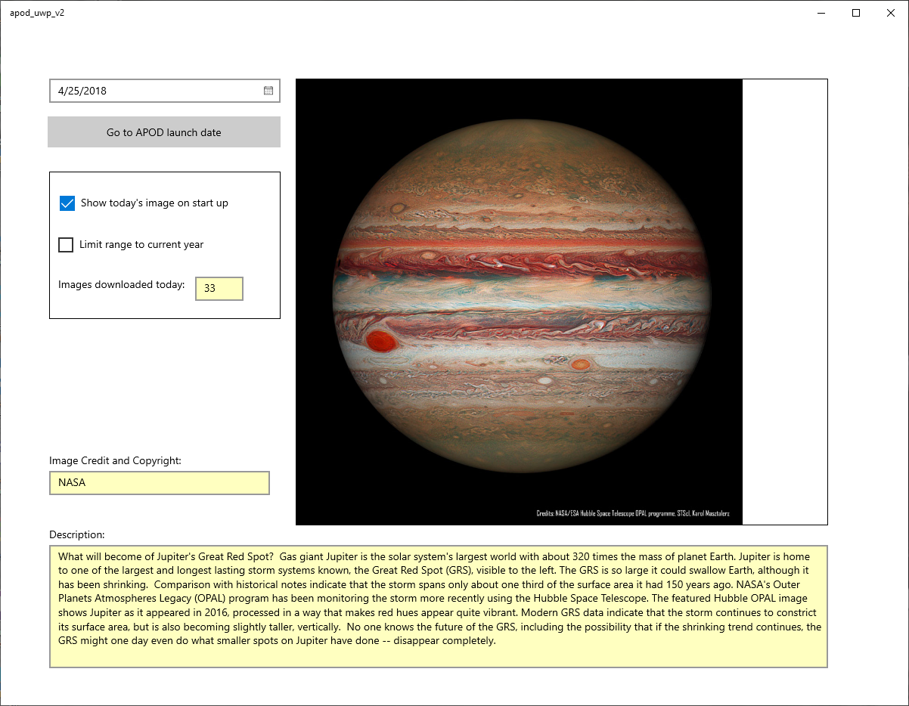

2. Change some of the settings, close the app, and run it again. Are the settings preserved correctly? Is the count of downloaded images correct?

3. Check out some of the amazing astronomy photography by selecting dates at random or perhaps dates of special meaning to you. Wonderful stuff!

   And, great job completing the tutorial.

::: zone-end

### Summary

If you're interested, try this tutorial for one of the other UI technologies. In this way, you can find out which you prefer. UWP is the latest and has some great features, such as the persistent local settings feature we use here. Windows Forms is tried, tested, and robust. WPF has some great features and some quirks, too, as you can see if you try that version of the tutorial.
