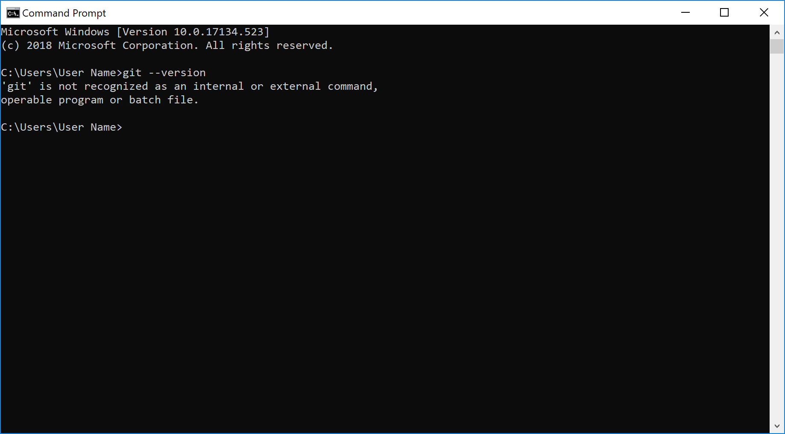
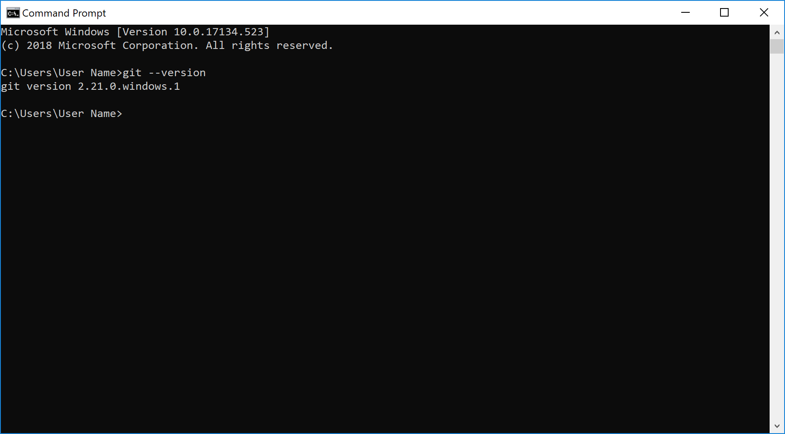

## Introduction

It's impressive what's possible to accomplish with a website today. Web applications look and feel like native applications, but run in your web browser. These web apps require no updates from the user. There is no app store approval process, so when you publish your changes, they are immediately available to visitors. Progressive Web Apps show us the potential for what we can accomplish with a website. Features include faster loading, improved search, offline data storage, multi-device support, and push notifications.

But if you're interested in starting web development today, you may be faced by a dizzying array of options. How do you choose from the many tools and frameworks out there? What are the best practices you should be aware of, and common pitfalls to avoid?

In this module, we'll show you the basic components of a web application, and the tools you can use to start web development. We'll use HTML, CSS, and Javascript together to build a simple website, we'll use developer tools in the browser to check our work, and we'll use Git to track changes so we can collaborate and recover from problems when they occur.

Let's get started by installing the tools we need and setting up our developer environment.

## Installation and Setup

### Using a source code editor

You could write an entire webpage in a text editor and save the file with the `.html` extension. After all, computer code is just characters written in a language computers understand. However, using a *source code editor* or *integrated development environment* (IDE) can help us to write better code. We can save time and reduce errors with features like autocomplete, syntax highlighting, and error checking.

Visual Studio Code (VS Code) is a code editor that works across different operating systems: Windows, macOS, and Linux. You can read more about [why Visual Studio Code](https://code.visualstudio.com/docs/editor/whyvscode) get a taste of its features.

### Download and install

Our next step is to [download Visual Studio Code](https://code.visualstudio.com/Download) and install.

You can read the [manual for Visual Studio Code](https://code.visualstudio.com/docs) if you have questions or would like more detail. Visual Studio Code uses the Electron software framework, which relies on the V8 JavaScript engine.

If you're having trouble with installing VS Code, look through the [setup guide](https://code.visualstudio.com/docs/setup/setup-overview) for Windows, macOS, or Linux.

### Additional tools

In addition to an editor, we'll need a browser to look at our website. The code we'll be writing in this module is generally well supported by older browsers, but it's a best practice to have the most up-to-date browser. Some HTML, CSS, and JavaScript features require newer browsers to work.

If you're using Windows 10, [Microsoft Edge](https://www.microsoft.com/windows/microsoft-edge) is the default browser. If you're on macOS, [Safari](https://www.apple.com/safari/) is the default browser.

Alternately, you can [install Chrome](https://www.google.com/chrome/). Read the Chrome [installation instructions](https://support.google.com/chrome/answer/95346) if you need help. If you want your IDE to open Chrome for testing, set Chrome to be your default browser. Like Visual Studio Code, the Chrome browser also uses the V8 JavaScript engine.

### Version control

A *version control system* tracks changes so you can recall or recover your work. [Git](https://git-scm.com/book/en/v2/Getting-Started-About-Version-Control) is a distributed version control system that also helps you collaborate with other developers. Some projects become so large or complex over time, and it's hard to imagine not having a system like Git to help you resolve issues and track changes.

Although Visual Studio Code includes Git support, the only way to access all commands is with a *[command line interface](https://code.visualstudio.com/docs/editor/command-line)* (CLI or command line). Having a basic grasp of the command line can assist you with future web developer tasks.

There are multiple CLI options available for you in Windows 10, **Command Prompt** and **PowerShell**. After installing Git, we'll also have the *Git Bash* CLI. All of these options have different commands. For consistency across operating systems, on Windows, we'll only use **Git Bash** after installation.

> [!NOTE]
> You can also use [Windows Subsystem for Linux](https://docs.microsoft.com/windows/wsl/about) to install your preferred Linux distribution on Windows, and access the **Bash** command line from there.

In **Windows 10**, navigate to the CLI using one of the following methods.

- **Start menu > Windows System > Command Prompt**
- **Start menu > Windows PowerShell > Windows PowerShell**
- Windows Logo Key+X

For macOS, you can find the CLI using one of the following methods.

- In **Finder** menu bar, navigate to **Go > Utilities > Terminal**
- Or in **Finder**, navigate to **Applications > Utilities > Terminal**
- Or use the shortcut Command+Shift+U and select **Terminal** to open.

### Install Git

Before installing anything, you might want to check if you already have Git. In your command line interface, type `git --version` and then hit the enter (return) key.



If you have Git, you'll see a version number, which means you can skip installing it again.

> [!IMPORTANT]
> For macOS, you may see the message, "Choose an option in the dialog to download the command line developer tools." It's not a problem if you want to install these additional tools; however, it isn't necessary either. After the installation and rechecking your Git version, you might see a message like, "git version 2.17.2 (Apple Git-113)". If this is the case, then you should still install Git from the download page or Homebrew.



There are different ways to install and configure Git. You can visit the [Git download page](https://git-scm.com/downloads) and follow the [installation instructions](https://git-scm.com/book/en/v2/Getting-Started-Installing-Git). Stick with the default options as you proceed through the installer steps. After completing the installation, on Windows, you'll have another CLI option called [Git Bash](https://gitforwindows.org) (GitBash, Git BASH, Bash, or BASH).

A *package manager* like [Homebrew](https://brew.sh) is another way to install Git. Package managers help you securely install software, keep everything updated, and manage dependencies. After installing Homebrew, you can install Git in the command line with the following command.

```bash
brew install git
```

Type `git --version` again to see that Git installed.

## Customize and configure

### Setup your Git identity

Before committing changes to a project, it's a good idea to associate your information with Git, so you are set up for *distributed development*. The [first-time Git setup](https://git-scm.com/book/en/v2/Getting-Started-First-Time-Git-Setup) guide walks you through the process.

Using **Git Bash** or **Terminal**, enter the following after replacing `<YourName>` and `<YourEmail>` using the format demonstrated below.

```bash
git config --global user.name "Your Name"
git config --global user.email you@example.com
```

You can check your assigned username and email with the following command.

> [!NOTE]
> You can skip this step for now because it's easier to use your source code editor in the next step.

```bash
git config --global --edit
```

If you do enter the command, a built-in text editor called Vim will show the result. To exit Vim, press Control+C, then enter the characters `:qa!` and press Enter (return). We can avoid these type of commands and edit more easily by using VS Code.

### Configure Git for your editor

After creating a Git identity to tag your projects with, it's useful to associate your source code editor with Git. As a result, you can use your editor to open and edit files with Git. Also, you'll gain syntax highlighting for Git changes and conflict resolution when merging with other peoples' work. Otherwise, Git editing would take place in the default CLI text editor, which can be inhospitable.

Use **Git Bash** or **Terminal** to configure [VS Code as your Git editor](https://code.visualstudio.com/Docs/editor/versioncontrol).

```bash
git config --global core.editor "code --wait"
```

To edit your Git configuration with VS Code, run the following.

```bash
git config --global -e
```

If you see the following error after typing this command, close VS Code, then move the VS Code application from **Downloads** to the **Applications** folder. Reopen VS Code from the **Applications** folder.

```bash
hint: Waiting for your editor to close the file... code --wait: code: command not found
error: There was a problem with the editor 'code --wait'.
```

Now that we have an editor, it's easier to edit and save changes.

To compare the differences between files, copy and paste this code into the VS Code configuration.

```bash
[diff]
    tool = default-difftool
[difftool "default-difftool"]
    cmd = code --wait --diff $LOCAL $REMOTE
```

For macOS, save your changes in **VS Code** by going to the **File** menu and selecting **Save**. Or use the keyboard shortcut Command+S.


### Install extensions or packages

You can extend the functionality of VS Code using the [extensions marketplace](https://code.visualstudio.com/docs/editor/extension-gallery). Keep in mind these are community developed resources. There are often a few solutions for the same type of feature. You can install extensions individually in your editor, or several at once with the command line. See the [VS Code manual](https://code.visualstudio.com/docs/editor/extension-gallery) for more details about customization.

For web development, the extensions and packages below will get you started.

All we need right now is **open-in-browser**. To install a VS Code extension from the command line, use the following format.

```bash
code --install-extension techer.open-in-browser
```

You can take a peek at all the extensions you installed with the following command.

```bash
code --list-extensions
```

For more information about how to uninstall a an extension, visit the [VS Code user guide](https://code.visualstudio.com/docs/editor/extension-gallery).

Way to go! Installation and setup can be hard work. Thankfully, we only need to install and setup once. Now we're ready to create a website.
