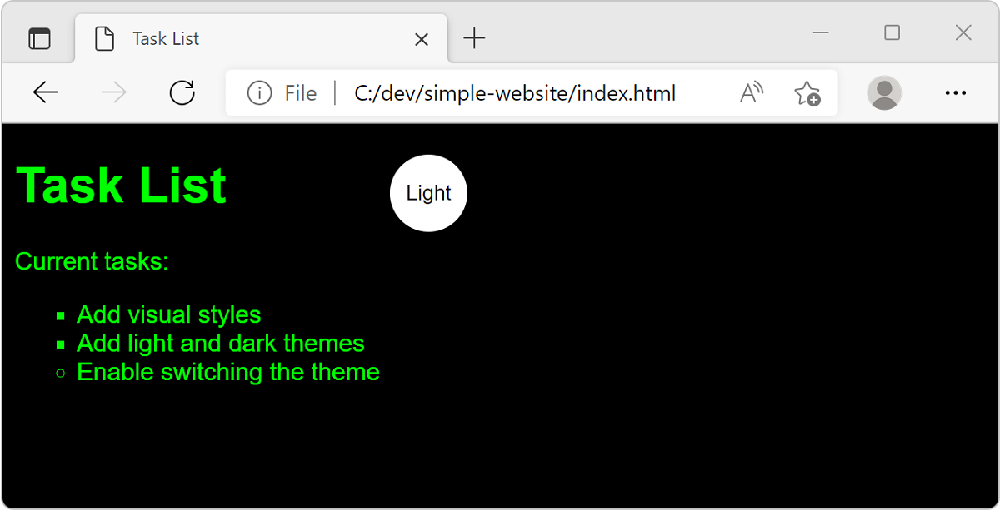

It's impressive what you can do on the web today. You can build web experiences that run on all devices, include all sorts of media content, perform complicated computation, and even create apps that look and feel like native applications.

If you're interested in starting web development today, you may be faced by a dizzying array of options. In this module, you'll learn the basic components of a website and some tools you can use to start web development. You'll use HTML, CSS, and JavaScript together to build a website. You'll also use developer tools in the browser to understand what's happening.

With this fundamental knowledge in place, you'll have a better context to make decisions in the future when building websites. For example, whether you should choose JavaScript frameworks or create your own JavaScript functions to build your website.

Let's get started by taking a look at where we want to go.

## Scenario

Imagine that you're a web developer and you've been asked to make your company's website appeal to a broader range of customers. To allow your customers to customize their experience on your website, you decide to add support for light and dark themes. You create a small, proof-of-concept website to demonstrate support for themes using CSS, and you write a JavaScript function to toggle between these themes.

When completed, your website will look like this example when the dark theme is selected:

## What's in a web page?

The content, style, and interactive logic are separated into HTML, CSS, and JavaScript files, respectively. A design principle in modern programming is *separation of concerns*. Among the many reasons to separate concerns, two are simplicity and reuse. For example, by styling HTML elements using CSS, you can simplify your HTML code. Instead of coding the appearance within each element, you apply CSS styles to all the elements on a page, regardless of the page complexity. In addition, you can link multiple HTML pages to a single CSS file, which can help simplify a consistent look and feel across your entire website.

## Learning objectives

In this module, you'll:

- Create a basic web page using HTML
- Apply styles to page elements using CSS
- Create themes using CSS
- Add support for switching between themes using JavaScript
- Inspect the website using browser developer tools

You'll run the site in your default browser. At the end of the module, we'll link to other modules that show how to deploy the website using Azure Static Web Apps.

## Prerequisites

- [Visual Studio Code](https://code.visualstudio.com), a cross-platform code editor.
- Familiarity with at least one programming language and one markup language like HTML
- A computer that's running one of the following:
  - Windows: Windows 7, 8, 10
  - Mac: macOS 10.9 or later
  - Linux: Ubuntu, Debian, Red Hat, Fedora, or SUSE
