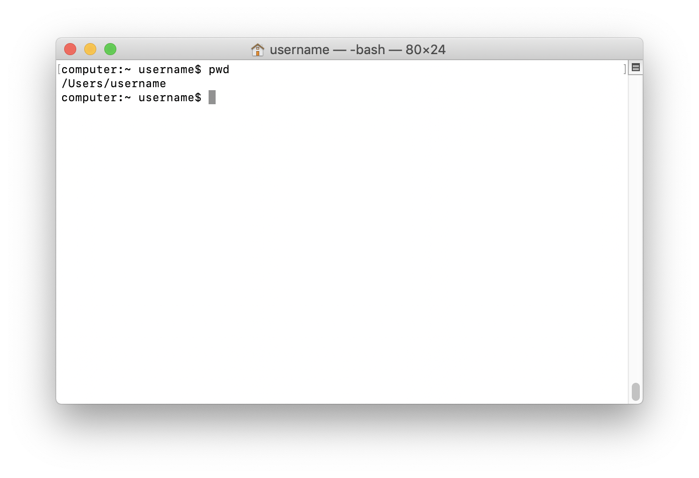
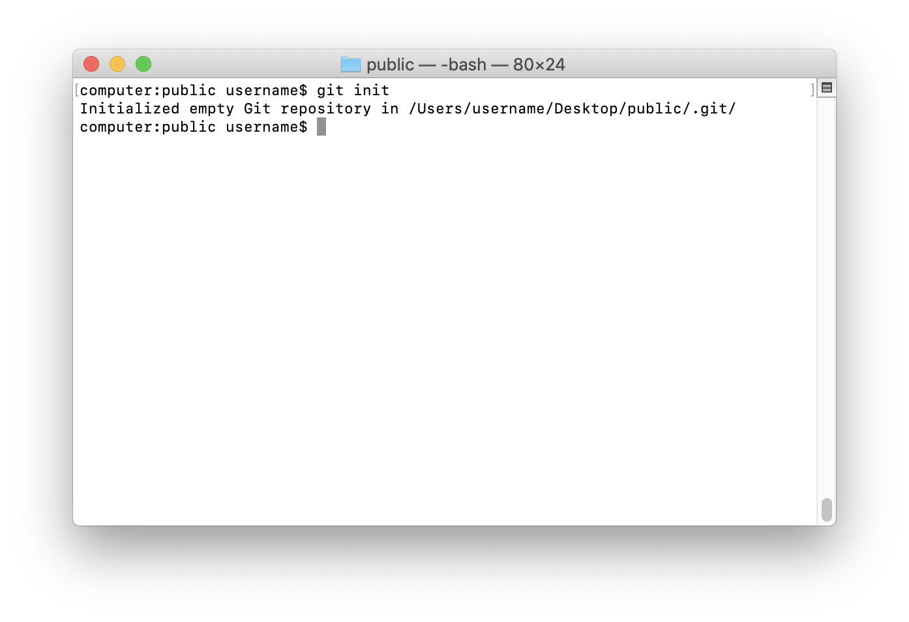
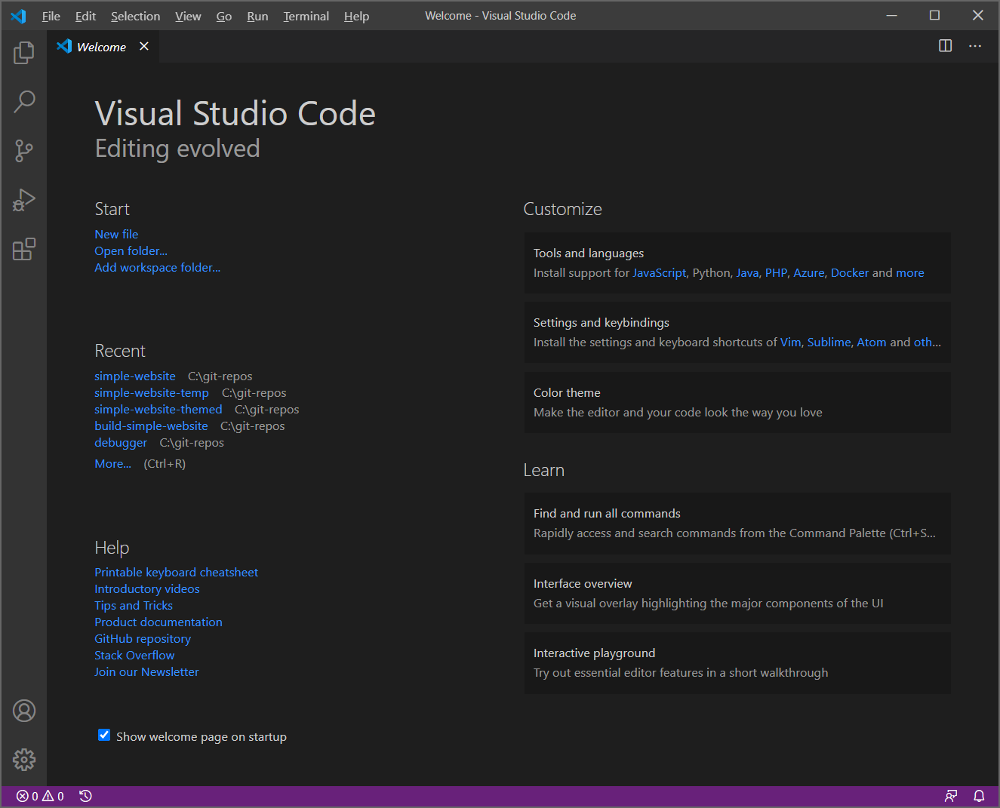
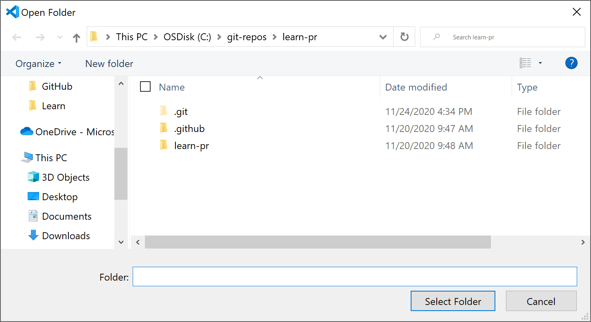
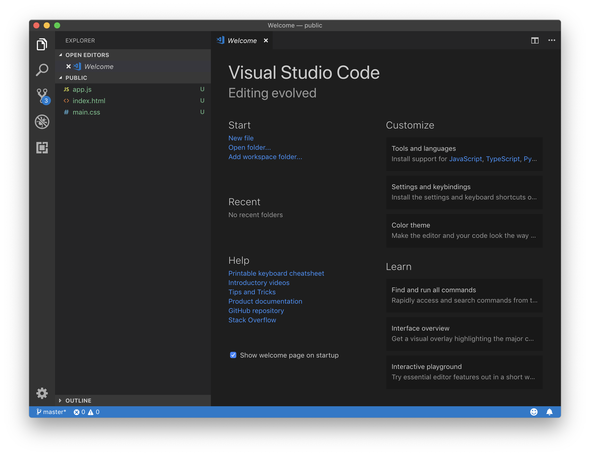

There are different ways to create and manage website projects. Some variation occurs depending on the specific tools you have, and also the preferences of your organization. When creating a website, it's not uncommon for your project structure to change over time as it becomes more complicated. The key is to keep a semblance of organization, and there are common strategies to help. Large projects often require a higher degree of care and attention so that many people can keep everything straight.

## Using the command line

You can use either the command line or code editor to establish a project folder and new files. To get started with the command line interface, open **Git Bash** or **Terminal**. So you can determine where to put your creations, you need to know a little about how to navigate through directories on your computer. Then you can conquer the world wide web!

### Navigation

Your computer has a *root directory* or top-level folder that all other sub-folders originate. You also have a user or *home directory* that you create when you set up a new computer user. The CLI starts a new session in your home directory, which is denoted by a tilde `~` followed by your username. You can show part of the current directory *path* with the print working directory command `pwd`.

To see the existing files and folders in a directory, use the list `ls` command. From your user directory or home folder, you should be able to see a list of folders such as **Desktop** and **Documents**. Navigate to the **Documents** folder by using the change directory `cd` command. Not too scary.

> [!TIP]
> On some command lines, you can start typing a directory, then press Tab to autocomplete the word.

Change directory `cd <DirectoryName>` lets you specify the folder you would like to enter, where `<DirectoryName>` is a folder that already exists. Enter `cd Documents` to open and `ls` to see it's content. To exit, or go up a level in the directory structure, you can use change directory followed by a space and two periods. Use the `cd ..` command followed by `ls` to safely return to the home directory. Travel to the Desktop with `cd Desktop` so you can create a new folder.

> [!TIP]
> If you somehow venture off the trail into the file system somewhere, use `cd ~` to return to your home directory. You can also type `cd` followed by a space, then drag a folder from the file system to locate and enter that path.

To create a new project folder, used the *make directory* command `mkdir` followed by a name, which in this case is `public`. The full command to create a directory is `mkdir public`. After creating the new directory, navigate into it using `cd public`.

### Initializing Git

As mentioned previously, Git will magically track changes we make to a project. However, for file tracking to successfully occur, we need to initialize a *repository* (repo). A repo contains the necessary metadata to track our project and appears as a single folder named `.git`. Folders or files that start with a period are designated as hidden in the operating system, and may only be visible by changing preferences, using the command line, or viewing in a special program like an IDE.

To initialize our project as a Git repo, enter `git init`. If you try looking at your new creation with the `ls` command, it seems like nothing happened. We can utilize the built-in CLI manual by entering `man` followed by what we need help with `ls` or altogether `man ls`. There are quite a few options available, but `ls -a` or `ls -la` will provide the necessary details to show us hidden directories. Press lowercase *q* to quit the manual page. If you're feeling adventurous, enter the git directory with `cd .git` and take a look. When you're ready, return to the public folder with the `cd ..` command.

### Creating files

Let's fix our somewhat empty *public* directory by creating a few new files. At first glance, the `touch` command updates directory or file dates. However, `touch` has dual functionality and creates a file if it doesn't exist. Try out the command `touch index.html main.css app.js` to generate project files and `ls` to see the result. Powerful, the command line is.

In VS Code, you can also create files with the command `code index.html main.css app.js`. These files are immediately opened in the editor, saving you a step, but also requires you to save each file.

Remember, now that you're a command line superhero, "With great power comes great responsibility!"

> [!WARNING]
> Entering a few characters in the wrong way can delete your entire computer, so please check your commands and type carefully. For example, see `man rm` for more details.

Now, these are empty files, so it's not uncommon to immediately want to open everything up in a source code editor and get to work.

Assuming that you're using VS Code, type `code .` in the command line to open the directory in that application. A period indicates the current directory. To illustrate this for Windows try `start .` or for macOS `open .`. These commands open a new window in the file system with your current directory.

We could build a website all in one text file or HTML file. Here we're using an HTML file for content and page structure. A CSS file is for presentation and styling. The  file is for behaviors and interactivity.

Setting up three files helps us stay organized. It's an example of *progressive enhancement*. If JavaScript isn't enabled or supported, the CSS and HTML will still work. However, if CSS doesn't work, at least the HTML content will be displayed.

## Using an editor

You may find, in some cases, it's more appropriate to create a new folder or file directly in your code editor.

### Opening with VS Code

When you open VS Code, the **Welcome** page opens. Notice you can create a new file or open a folder. You can also accomplish this by going to **File > New File**.

Select **Open folder** in the Start section, or go to **File > Open** and select the **public** folder we previously created on the Desktop.

If not visible, you can display the **Welcome** window by navigating to **Help > Welcome**. Alternately, select **View > Command Palette** or the keyboard shortcut Shift+Command+P. Then in the search field enter **>Help: Welcome**.

When opening a folder, the operating system provides a button to create a **New Folder**. We don't need a new folder at the moment, so select the **Open** button to view files in VS Code.

Notice on the left-hand side of the window, in the activity bar, there is now a badge over the Git icon indicating three new changes. We'll return to this topic in the *Tracking changes* unit.

### Online editors

If for some reason you're unable to use an IDE like VS Code, there are capable online editors worth exploring. You can utilize online editors for experimenting and sharing examples. Each online editor has basic features and benefits. Disadvantages show up for more advanced web development, but online editors are becoming more capable all the time. While not a comprehensive list, here are some examples.

- [StackBlitz](https://stackblitz.com)
- [Repl.it](https://repl.it)
- [JSFiddle](https://jsfiddle.net)
- [CodePen](https://codepen.io)
