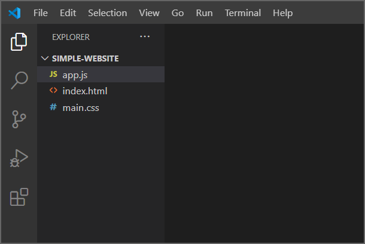
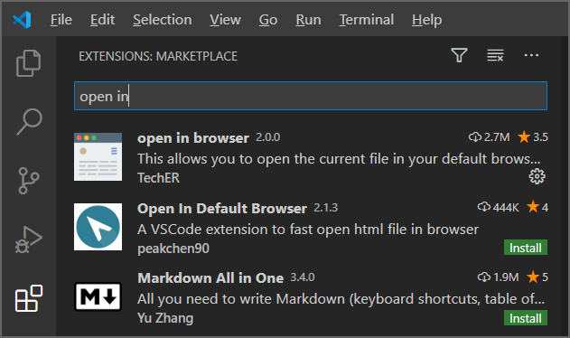

There are different ways to create and manage website projects. Some variation occurs depending on the specific tools you have, and also the preferences of your organization. When creating a website, it's not uncommon for your project structure to change over time as it becomes more complicated. The key is to keep a semblance of organization, and there are common strategies to help. Large projects often require a higher degree of care and attention so that many people can keep everything straight.

## Open Visual Studio Code

When you open Visual Studio Code, the **Welcome** page opens. Notice you can create a new file or open a folder. You can also accomplish this by going to **File > New File**.

If not visible, you can display the **Welcome** window by navigating to **Help > Welcome**. Alternately, select **View > Command Palette** or the keyboard shortcut Shift+Command+P. Then in the search field enter **>Help: Welcome**.

## Create a new folder

Select **Open folder** in the Start section of the Welcome page, or go to **Folder > Open**.

When opening a folder, the operating system provides a button to create a **New Folder**.

Go to the location where you want to create the new folder, and select **New Folder**. Name the folder **simple-website**.

## Create some files

Go to **File > New**.

Save the file with Control+S (Windows) or Command+S (macOS). Name the file `index.html`.

Repeat the preceding steps to create two more files, `main.css` and `app.js`. When you're finished, your project folder will contain the following files that comprise your web site:

- index.html
- main.css
- app.js

Under the folder name in the Explorer window, you see the three files that make up your web site.

You could build a website all in one text file or HTML file. Here you're using an HTML file for content and page structure. A CSS file is for presentation and styling. The JavaScript file is for behaviors and interactivity.

Setting up three files helps us stay organized. It's an example of *progressive enhancement*. If JavaScript isn't enabled or supported, the CSS and HTML will still work. However, if CSS doesn't work, at least the HTML content will be displayed.

### Install extensions or packages

You can extend the functionality of Visual Studio Code using the extensions marketplace. Keep in mind these are community developed resources. There are often a few solutions for the same type of feature. You can install extensions individually in your editor, or several at once with the command line.

For web development, all you need right now is **open-in-browser**. This extension helps you to quickly open the website in your default browser, instead of copying and pasting the file URL into your browser.

To install this extension, select the Extensions icon on the Activity Bar (left pane).

Next, type "open in" in the search bar, then select **open in browser**, published by TechER, and choose **Install**. The extension gets installed.

Switch back to the Explorer window.

Way to go! Installation and setup takes a little extra time, but we only need to install and setup once. Now we're ready to create a website.
