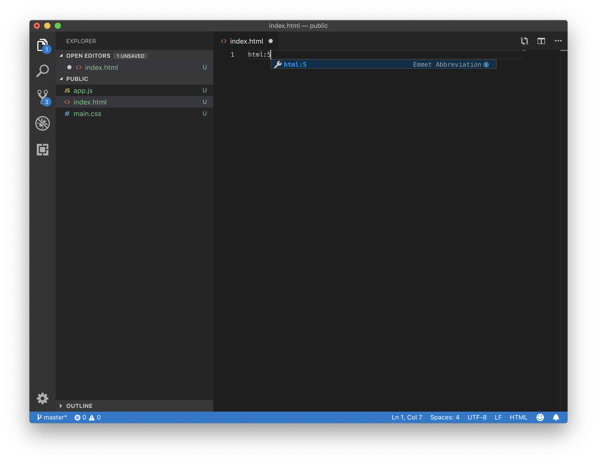
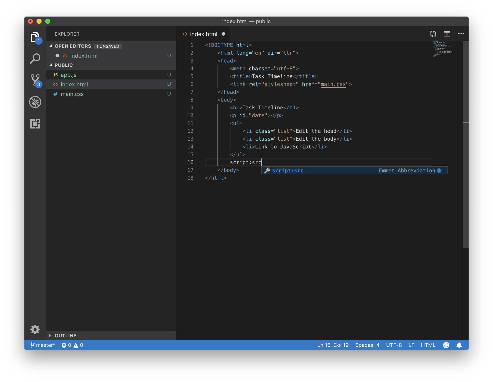
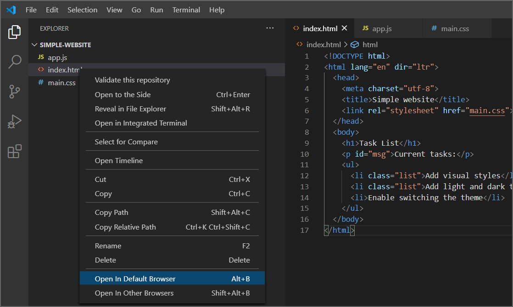
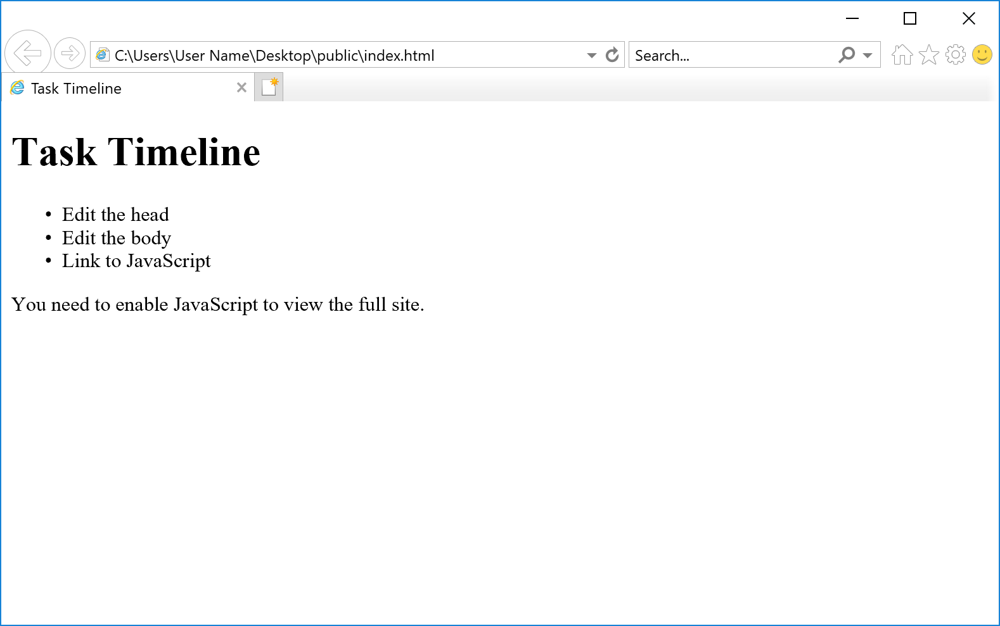
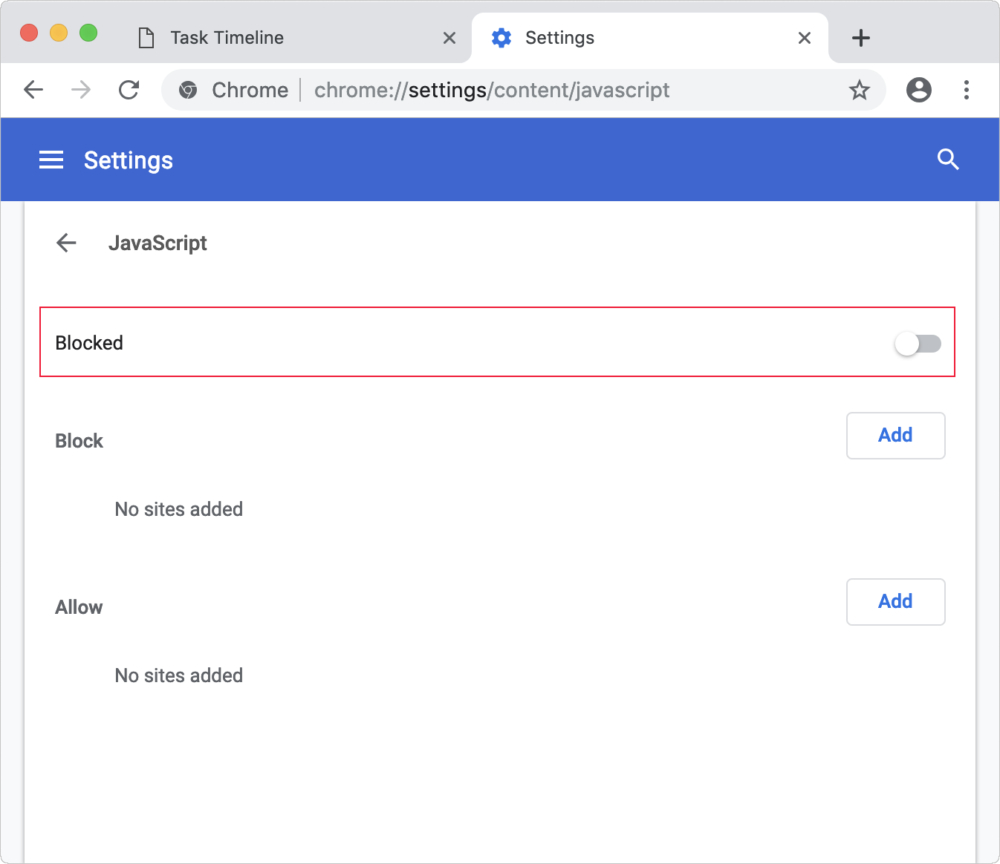
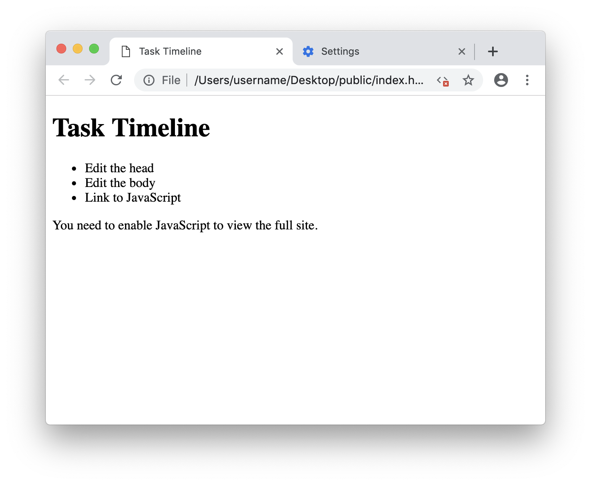
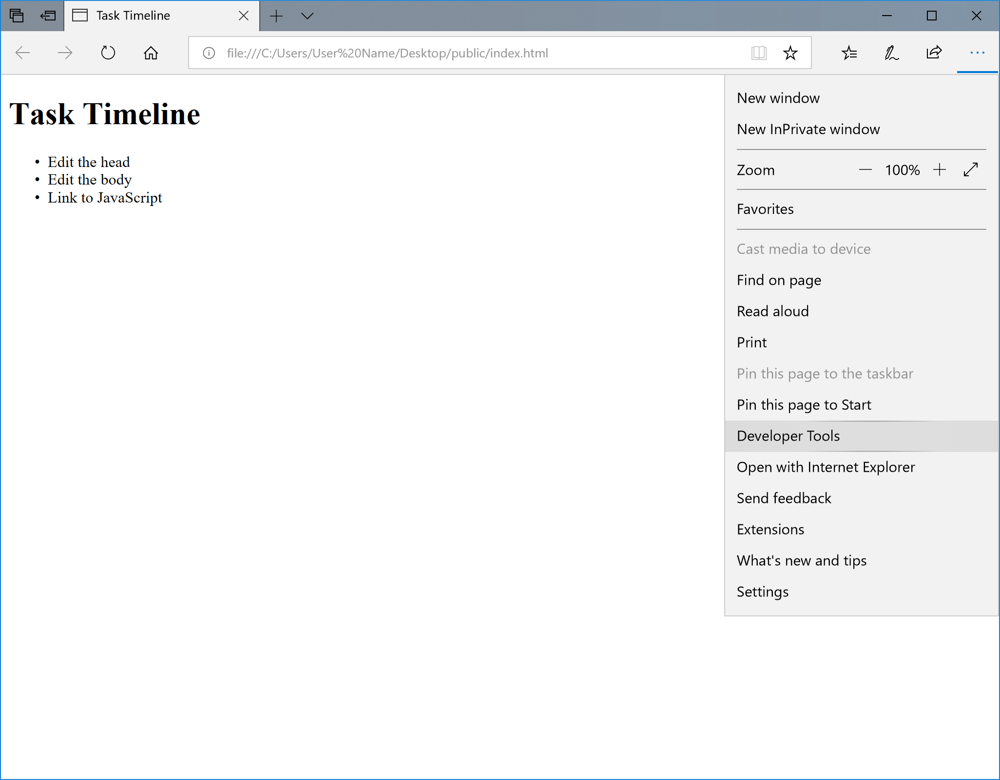
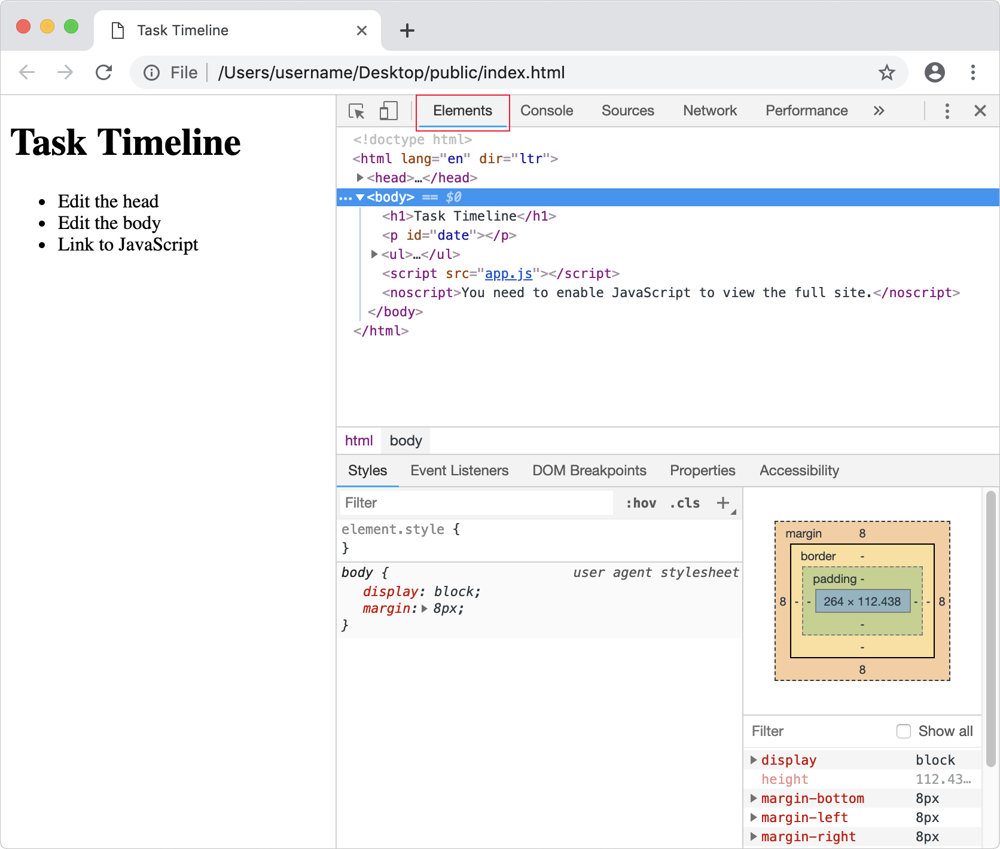

At the moment we have an empty HTML file. Let's add some code! The goal is to use hypertext markup language (HTML) to describe the web page the browser should display. Wouldn't it be nice to have a starting template? Editors can conveniently fill in some of the typical boilerplate or HTML structure for you.

## Using autocomplete

Visual Studio Code (VS Code) provides basic support for HTML programming out of the box. There is syntax highlighting, smart completions with IntelliSense, and customizable formatting. VS Code also includes great Emmet support (from the documentation on Emmet in Visual Studio Code).

In **Visual Studio Code**, open `index.html` by selecting the `index.html` file. Select the `index.html` page and type `html:5`, then hit Enter (Return).



Edit your code so that it resembles the following, then save the file with Control+S (Windows) or Command+S (macOS).

```html
<!DOCTYPE html>
<html lang="en" dir="ltr">
  <head>
    <meta charset="utf-8">
    <title></title>
  </head>
  <body>

  </body>
</html>
```

> [!TIP]
> You can click and drag to select a line, then use Command + Tab or Shift + Command + Tab to adjust the line indentation. In VS Code, the **Selection** menu has a list of helpful commands for navigating your code. For quick navigation, the left and right arrow keys are your friend.

There have been different versions of HTML. The document type `<!DOCTYPE html>` indicates this is HTML5 code.

HTML, head, and body are *elements* with opening and closing *tags*. *Attributes* in the *opening tag* provide more information about the element. For the `<html>` tag, the language is English, and text direction is left-to-right. Language `lang` is an attribute name, and English `"en"` is an *attribute value*.

The `meta` tag indicates *metadata* information that won't typically be visible to the viewer unless they view source code in their browser. Meta elements or tags provide descriptive information about the webpage. For example, they help search engines display results to people.

The *character set* (charset) UTF-8 may seem insignificant but is crucial for establishing how computers interpret characters. If missing, charset can lead to compromised security. There's quite a bit of history and technical information behind charset. The bigger picture here is that boilerplate provides some sensible defaults.

## Edit the head

The *title* of a webpage appears at the top of a browser window and is significant in a few ways. First, the title is utilized by and displayed in search engines. Second, when a visitor bookmarks the page, the title becomes the default name for the bookmark. Third, the title helps visitors navigate by seeing what page they are viewing. Let's add a title.

> [!IMPORTANT]
> From this point forward, the ellipsis (...) indicates that previously declared code precedes or follows. There should be enough code provided as context to make necessary changes or update to your work.

```html
...
<head>
  <meta charset="utf-8">
  <title>Task Timeline</title>
...
```

You could write the CSS code directly in the head of the website, which is called *internal CSS*. However, it's a best practice to separate HTML structure and CSS styling. Having a separate CSS page is called *external CSS*. Code tends to be easier to read when it's concise and compartmentalized. You can use one or more external style sheets to service multiple webpages. Rather than updating each HTML page with duplicated CSS, you can make changes once and have those updates broadcast to all dependent pages. Let's link to an external stylesheet.

In **Visual Studio Code**, type `link` and hit the Enter (Return) key. Update the `href` to `main.css` and save the file with Control+S (Windows) or Command+S (macOS).

```html
...
<head>
  <meta charset="utf-8">
  <title>Task Timeline</title>
  <link rel="stylesheet" href="main.css">
</head>
...
```

## Edit the body

Let's start filling in the *body* element now. Add a *heading* `<h1>`, *paragraph* `<p>`, and create a *list item* `<li>`. Update your code so it looks like the following.

```html
...
<body>
  <h1>Task Timeline</h1>
  <p id="date"></p>
  <ul>
    <li class="list">Edit the head</li>
    <li class="list">Edit the body</li>
    <li>Link to JavaScript</li>
  </ul>
</body>
```

An ID attribute can be used for styling one element, while the class attribute is for styling one or more elements.

There's no text between the open and closing `<p>` tags so nothing will appear on the page for that element yet. Yes, you can write markup without having any content.

Each list item `<li>` element is grouped into an unordered list `<ul>`.

## Link to JavaScript

Like CSS, we could add JavaScript directly to the HTML page, but it's better not to. For example, you could create a popup alert, by adding `<script>alert('Hello World')</script>` anywhere in the body. The script tag `<script>` will let us link to an external JavaScript file.

In **VS Code**, type `script:src` and press Enter (Return).



Adjust your code to look like the following.

```html
<!DOCTYPE html>
<html lang="en" dir="ltr">
  <head>
    <meta charset="utf-8">
    <title>Task Timeline</title>
    <link rel="stylesheet" href="main.css">
  </head>
  <body>
    <h1>Task Timeline</h1>
    <p id="date"></p>
    <ul>
      <li class="list">Edit the head</li>
      <li class="list">Edit the body</li>
      <li>Link to JavaScript</li>
    </ul>
    <script src="app.js"></script>
  </body>
</html>
```

The script element could be placed in the `<head>` or elsewhere in the `<body>`. However, putting `<script>` at the end of the `<body>` section allows all the page content to display on the screen first, then load the script.

## No script

The `<noscript>` element can be used to show a message if JavaScript is deactivated.

```html
...
    <script src="app.js"></script>
    <noscript>You need to enable JavaScript to view the full site.</noscript>
  </body>
</html>
```

Using the `<noscript>` element is an example of *fault tolerance* or *graceful degradation*. We can detect and plan for when a feature isn't supported or available.

Remember to save your changes with the keyboard shortcut Control+S (Windows) or Command+S (macOS).

## Open in browser

You can preview your webpage locally by opening the HTML file in a browser. Instead of a website address that begins with `https://`, your browser points to the local file path. For example, the path might look similar to the following: *file:///Users/username/Desktop/public/index.html*.

To preview using **VS Code**, select `index.html` and select **Open In Default Browser** or use the keyboard shortcut Alt+B.



> [!IMPORTANT]
> If you're having trouble, make sure you're directly selecting on the filename icon or text.

The webpage will open in your default browser.

To test the `<noscript>` element, you can deactivate JavaScript and reload the page.

If you're using the **Edge** browser, select the **More** menu (...), and select **Open with Internet Explorer**. Then follow the instructions for [how to enable JavaScript in Windows](https://support.microsoft.com/help/3135465/how-to-enable-javascript-in-windows). Once you have deactivated JavaScript and tested the `<noscript>` feature, don't forget to reenable JavaScript.



In **Chrome** go to **Chrome > Preferences > Advanced > Content settings > JavaScript**.

- **Toggle allowed** or **blocked** to turn off or on.
- Or open a new tab and enter chrome://settings/content/javascript



Reload the page to see the `<noscript>` message.



After seeing the `<noscript>` message, re-enable JavaScript, and reload the page.

## Developer tools

You can inspect a webpage by using the developer tools in your browser. Let's give this a try.

In **Edge**, the keyboard shortcut for **Developer Tools** is F12 (FN+F12). Alternately, view **Settings and more** with Alt+X and select **Developer Tools**.



In **Chrome**, the keyboard shortcut for **Developer Tools** is Option+Command+I.

1. Select the **Elements** tab.
2. Roll over and select the HTML elements.
3. Open the disclosure triangles.



> [!NOTE]
> If using **Safari**, see the [Web Developer Tools](https://developer.apple.com/safari/tools/) and [Safari User Guide](https://support.apple.com/guide/safari/use-the-developer-tools-in-the-develop-menu-sfri20948/mac) for more information.

Inspecting the page in a browser provides all sorts of useful information and can help you troubleshoot problems. You can also view CSS details with the inspector, as you'll see in the next section.
