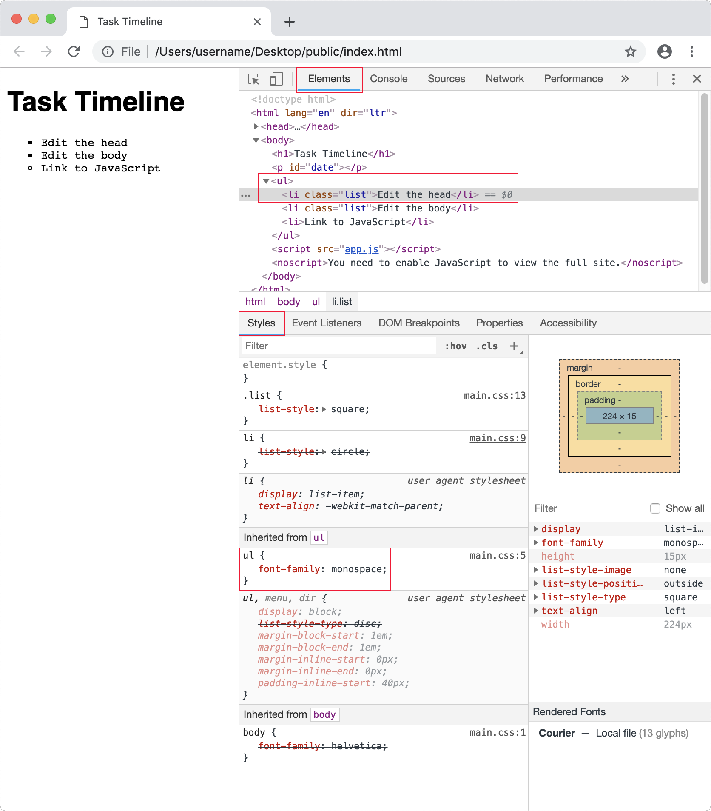

Cascading Style Sheets (CSS) let you specify how your page should look. The basic idea is to target HTML code then define what the style should be. For example, you can select a box and apply rounded corners or give the box a gradient background. CSS is responsible for determining how hyperlinks look and respond when you interact with them—although you define the destination address in HTML. In CSS3, you can also do sophisticated animation effects.

## CSS rules

Imagine you have an old fashioned key and a series of doors down a long corridor. First, you select a door; then you unlock it with the key. Once you have access to a room, you can decorate however you'd like. You might paint the walls blue or set the floor to be hardwood. You select a room and define rules for how it should look. You can apply the same style to multiple rooms, which is just like CSS.

In **Visual Studio Code**, open the `main.css` file and type the following.

```css
body {
    font-family: helvetica;
}
  
ul {
    font-family: helvetica;
}
```

You can use CSS rules to style HTML. The unordered list element `ul {}` above is a *selector*, which selects the HTML element to style `<ul>`. The *declaration* is `font-family: helvetica` and says what the style of should be. The *property name* is `font-family`, and the *value* is `helvetica`. The property and value together make a key-value pair.

What you're selecting is an existing element that you previously defined in HTML (`<body>` and `<ul>`). As you'll see next, you can define your own custom names for elements.

## Selectors

*ID* and *class selectors* allow you to apply styles to custom attribute names in your HTML. An ID is used to style one element, whereas classes can style multiple elements. The custom attributes below are called `#msg` and `.list`. The ID selector is *msg* and has a pound sign prefix, while the class selector *list* has a period prefix. The names are arbitrary so long as they match what you've defined in the HTML.

```css
...
li {
  list-style: circle;
}

.list {
  list-style: square;
}

#msg {
  font-family: sans-serif;
}
```

Remember to save your work with the keyboard shortcut Control+S (Windows) or Command+S (macOS).

## Add a light theme

Next, you begin adding support for color themes for your website. Begin by defining a light-colored theme.

.light-theme {
  color: #00FF00;
  background: #000000;
}

In your HTML file, update the `<body>` element with a class name, `light-theme`, so the class selector for light theme will work correctly.

```html
<body class="light-theme">
```

## View in browser

To preview using **Visual Studio Code**, select on `index.html` and select **Open In Default Browser**.

> [!IMPORTANT]
> Even though you were just editing the `main.css` file, to preview the changes, you should select the `index.html` file.

The webpage will open in your default browser.

Are the font styles what you expected to see? It's interesting how styles cascade from `body` to `h1`. We didn't define anything for `h1`, so it inherits styling from the `body`. However, `li` takes precedence over the `body` tag because we specifically defined a style for it.

## Add a dark theme

For the dark theme, we want to take a bit longer and set up the plumbing for the next unit, in which we enable theme switching on the web page.

Next, add some constants to the page root in your CSS file. The `:root` selector represents the `<html>` element in the HTML page. A best practice is to define a set of global CSS variables in the `:root` element. Here, you define three color variables attached to the page root.

```css
:root {
  --green: #00FF00;
  --white: #ffffff;
  --black: #000000;
}
```

Next, in your CSS file, add the following after the `:root` selector, replacing the current `body` selector. The * selector is a universal selector that applies to all page elements, except where a more specific selector overrides it. Here, you use it to set the default `color` property for all page elements. For the `color` and `background` properties, you define some new variables to use for the light theme.

```css
* {
  color: --fontColor;
}

body {
    font-family: helvetica, sans-serif;
    background: --bg;
}
```

At the end of the CSS file, add the `light-theme` selector. You will use this to set the colors of the light them, the font color and the background color.

```css
.light-theme {
  --bg: --green;
  --fontColor: --black;
}
```

## View applied CSS

Developer tools


## delete - CSS rules

Imagine you have an old fashioned key and a series of doors down a long corridor. First, you select a door; then you unlock it with the key. Once you have access to a room, you can decorate however you'd like. You might paint the walls blue or set the floor to be hardwood. You select a room and define rules for how it should look. You can apply the same style to multiple rooms, which is just like CSS.

In **Visual Studio Code**, open the `main.css` file and type the following.

```css
body {
  font-family: helvetica;
}

ul {
  font-family: monospace;
}
```

We can use CSS rules to style HTML. The unordered list element `ul {}` above is a *selector*, which selects the HTML element to style `<ul>`. The *declaration* is `font-family: monospace` and says what the style of should be. The *property name* is `font-family`, and the *value* is `monospace`. The property and value together make a key-value pair.

What we're selecting is an existing element that we previously defined in HTML (`<body>` and `<ul>`). As we'll see next, you can define your own custom names for elements.

## delete - Selectors

*ID* and *class selectors* allow you to apply styles to custom attribute names in your HTML. An ID is used to style one element, whereas classes can style multiple elements. The custom attributes below are called `#date` and `.list`. The ID selector is *date* and has a pound sign prefix, while the class selector *list* has a period prefix. The names are arbitrary so long as they match what you've defined in the HTML.

```css
...
li {
  list-style: circle;
}

.list {
  list-style: square;
}

#date {
  font-size: 12px;
  font-style: italic;
  font-weight: bold;
}

```

Remember to save your work with the keyboard shortcut Control+S (Windows) or Command+S (macOS).

> [!NOTE]
> We still won't see the ID paragraph style on our page until the next unit.

## delete - Internal CSS

As previously mentioned, you can write CSS directly in the `<head>` element of HTML, which is called internal CSS. Here is an example, but let's skip adding it to the `html` page.

```html
...
<head>
  <meta charset="utf-8">
  <title>Task Timeline</title>
  <style media="screen">
    h1 {
      font-family: helvetica;
      color: darkblue;
    }
  </style>
...
```

Even for a basic website, there are so many CSS rules the HTML page becomes cluttered very quickly. With more than one page the same CSS would often be repeated and challenging to manage.

## delete - External CSS

In the previous unit on HTML, we put our CSS in an external file and linked it to the HTML.

```html
...
<head>
  <meta charset="utf-8">
  <title>Task Timeline</title>
  <link rel="stylesheet" href="main.css">
...
```

One benefits of external CSS is that multiple HTML pages can link to the same CSS file. If you make a change to the CSS, then your styling will update for each page. Designating an HTML file for the structure of the page, a CSS file for the styling, and JavaScript file for interaction or events is called *separation of concerns*.

## delete - Open in browser

To preview using **Visual Studio Code**, select on `index.html` and select **Open In Default Browser**.

> [!IMPORTANT]
> Even though you were just editing the `main.css` file, to preview the changes, you should select the `index.html` file.

The webpage will open in your default browser.

Are the font styles what you expected to see? It's interesting how styles cascade from `body` to `h1`. We didn't define anything for `h1`, so it inherits styling from the `body`. However, `li` takes precedence over the `body` tag because we specifically defined a style for it.

## delete - Developer tools

In **Edge**, the keyboard shortcut for **Developer Tools** is F12 (FN+F12). Alternately, view **Settings and more** with Alt+X and select **Developer Tools**.

In **Chrome**, the keyboard shortcut for **Developer Tools** is Option+Command+I.

1. Select the **Styles** tab.
2. Select the **Elements** tab.
3. Roll over and select the HTML elements.
4. Open the disclosure triangles.
5. Select a `<li>` element. Note the custom style `font-family: monospace;`.


