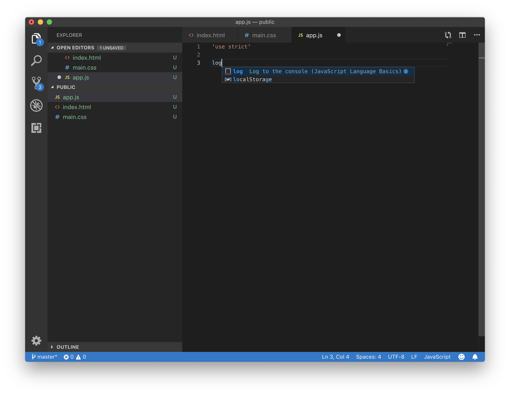
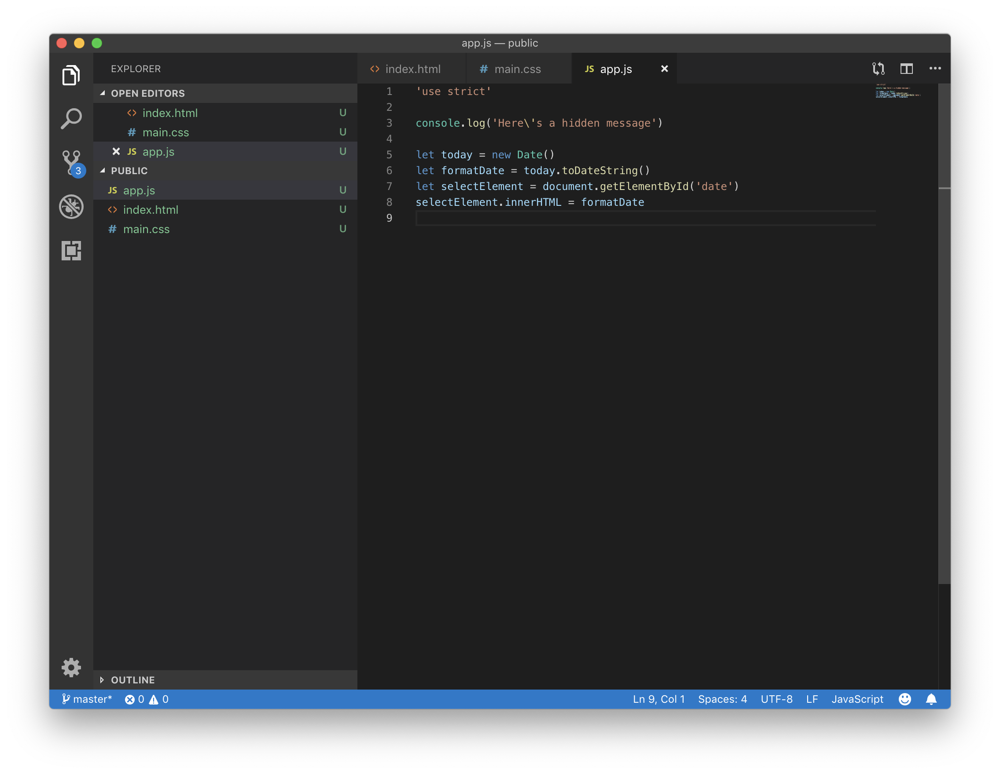
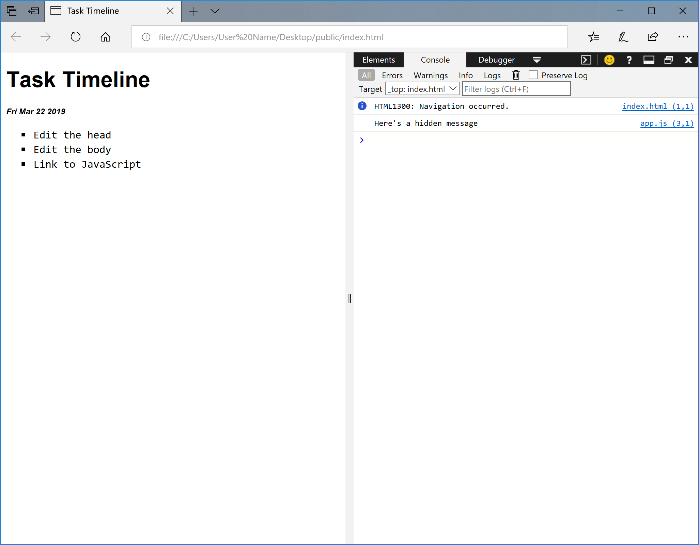
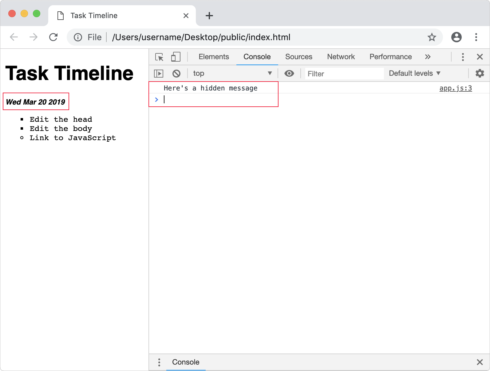
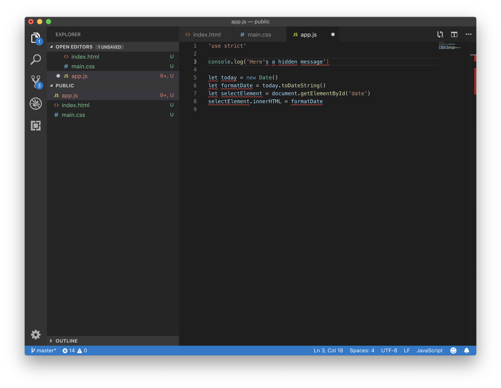

[JavaScript](https://developer.mozilla.org/docs/Glossary/JavaScript) or *ECMAScript* is a programming language that helps you add interactivity to your webpage. When you select a button, JavaScript is the code that defines the event or behavior that will happen, such as open a popup window. Using JavaScript, you can add or remove content like text from the webpage without reloading it. As a web developer, you can use the browser to test and get feedback about your scripts.

## Use strict mode

As you get started with JavaScript, the initial focus is often working with numbers, math, text manipulation, dates, and storing information. Sometimes JavaScript makes assumptions about the type of data you enter; assignment, math, or logical equality can give you unexpected results. JavaScript tries to be friendly, make your code work, and provide you with a solution even if the result should be an error. To combat these shortcomings, you can activate *strict mode*, which reduces silent errors, improves performance, provides more warnings, and fewer unsafe features.

In **Visual Studio Code**, open the `app.js` file and type the following.

```javascript
'use strict'
```

> [!NOTE]
> You can [usually omit semicolons](https://news.codecademy.com/your-guide-to-semicolons-in-javascript/) in JavaScript; it's a good idea to brush up on [when semicolons are necessary](https://standardjs.com/rules.html#semicolons). There's a bit of debate about this topic in the JavaScript community. If your preference is to end statements with a semicolon `'use strict';`, feel free to add them.

## Console message

You can create a hidden message that won't appear on your webpage. However, what you write in the console will show up in the browser developer tools. Using *console messages* can be really helpful for seeing the result of our code.

```javascript
...
console.log('Here\'s a hidden message');
```

In **Visual Studio Code**, when in JavaScript file, you can use autocomplete by typing `log` then hitting enter (return).



You can define a text *string* with single or double quotes around the text.

The backslash in the word `here\'s` is an *escape character* that's needed to define the apostrophe as text. If you remove the backslash, you see an error in the console, "Uncaught SyntaxError: Unexpected identifier."

## Commenting code

You can write *comments* in your JavaScript for one line with a double forward slash `//`. If you want to create a multi-line comment, use forward-slash star (or asterisk) `/*` to start and star forward-slash `*/` (or asterisk) to end. It's quite useful for troubleshooting to deactivate code by commenting it out.

```javascript
// This is a single-line comment.

/* Here's a
multi-line
comment. */

// console.log('This code is no longer active')
```

You can also write comments or deactivate code in HTML and CSS.

```html
<!-- This is an HTML comment. -->

/* CSS comments are just like multi-line JavaScript ones.*/
```

In **Visual Studio Code**, you can select (highlight) one or more lines of code, then use the keyboard shortcut Control+/ (Windows) or Command+/ (macOS) to apply or un-apply the comment. The correct type of comment or *syntax* is automatically applied for HTML, CSS, and JavaScript. However, all multi-line JavaScript comments are applied as single line comments.

Generally speaking, use comments sparingly as they tend to clutter your code visually. If you use comments strategically, they can be helpful to you or others—especially if you haven't looked at a *codebase* for a while. Be aware that code may not produce the behavior the author outlines in a comment. Also, if you *refactor* your code, remember to update the comment.

## Add the date

It would be convenient to see today's date on our webpage. There are a few main steps. First, you'll retrieve a new date from the built-in JavaScript *object*. It looks like this `new Date()`. Next, you can transform the date format by using `toDateString()`. The HTML needs to know where you want to add this information on the page or *document*, so retrieve an element using `getElementById('date')`. The final step is to insert the date string inside the selected element with `innerHTML`.

```javascript
...
let today = new Date();
let formatDate = today.toDateString();
let selectElement = document.getElementById('date');
selectElement.innerHTML = formatDate;
```

Here we're using the word `let` to create a *variable* named `today`, which holds the date and time. It's a convention to use *camel case* for variable names with more than one word—for example, the variable `formatDate`.

When you declare a variable, it holds a reference to the value you assign. Variables are a useful way of storing information temporarily so you can reuse the values. In the `selectElement` variable, you're saving the result of reformatting the date. In that step, you remove the time and timezone from using `toDateString()`.

The main idea to remember here is that you can use JavaScript to select an ID (or class attribute) and then do something—like change HTML (or CSS styles) on the page.



## Open in browser

As before, even though you were just editing the `app.js` file, to preview the changes, you should select the `index.html` file.

To preview using **Visual Studio Code**, select `index.html` and select **Open In Default Browser**.

The webpage will open in your default browser.

## Developer tools

In **Edge**, the keyboard shortcut for **Developer Tools** is F12 (FN+F12). Alternately, you can view **Settings and more** with Alt+X and select **Developer Tools**. Then select the **Console tab** or press Control+2.



In **Chrome**, the keyboard shortcut for **Console** in the Developer Tools is Option+Command+J.

## To do

1. Check that the date is showing on the page.
2. Look for the `console.log` message, "Here's a hidden message."
3. In the editor, try commenting out `console.log('Here\'s a hidden message')`. Save and reload the page. The shortcut for reload is Control+R (Windows) or Command+R (macOS).
4. Un-comment, then remove the escape character `\` in `here\'s`. Save and reload the page.
5. Look for an error something like, "Uncaught SyntaxError: Unexpected identifier" or "Uncaught SyntaxError: missing ) after argument list."
6. Undo the previous edit with the keyboard shortcut *Command+Z* (macOS), save, and test that the error went away.




