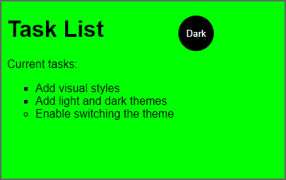
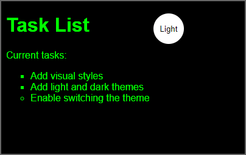
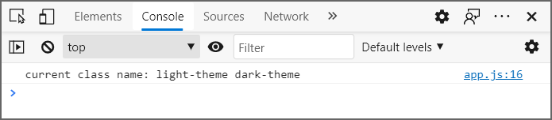

JavaScript (or *ECMAScript*) is a programming language that helps you add interactivity to your webpage. When you select a button, JavaScript is the code that defines the event or behavior that will happen, such as open a popup window. Using JavaScript, you can add or remove content like text from the webpage without reloading it. As a web developer, you can use the browser to test and get feedback about your scripts.

## Link to JavaScript

Like CSS, we could add JavaScript directly to the HTML page, but it's better not to. For example, you could create a popup alert, by adding `<script>alert('Hello World')</script>` anywhere in the body. The script tag `<script>` will let us link to an external JavaScript file.

In **Visual Studio Code**, type `script:src` and press Enter (Return).

Adjust the script element to look like the following. Place it right after the list.

```html
<ul>
  <li class="list">Add visual styles</li>
  <li class="list">Add light and dark themes</li>
  <li>Enable switching the theme</li>
</ul>
<script src="app.js"></script>
```

The script element could be placed in the `<head>` or elsewhere in the `<body>`. However, putting `<script>` at the end of the `<body>` section allows all the page content to display on the screen first, then load the script.

## No script

The `<noscript>` element can be used to show a message if JavaScript is deactivated.

```html
    <script src="app.js"></script>
    <noscript>You need to enable JavaScript to view the full site.</noscript>
```

Using the `<noscript>` element is an example of *fault tolerance* or *graceful degradation*. We can detect and plan for when a feature isn't supported or available.

Remember to save your changes with the keyboard shortcut Control+S (Windows) or Command+S (macOS).

## Use strict mode

As you get started with JavaScript, the initial focus is often working with numbers, math, text manipulation, dates, and storing information. Sometimes JavaScript makes assumptions about the type of data you enter; assignment, math, or logical equality can give you unexpected results. JavaScript tries to be friendly, make your code work, and provide you with a solution even if the result should be an error. To combat these shortcomings, you can activate *strict mode*, which reduces silent errors, improves performance, provides more warnings, and fewer unsafe features.

In **Visual Studio Code**, open the `app.js` file and type the following.

```javascript
'use strict'
```

> [!NOTE]
> You can usually omit semicolons in JavaScript, but it's a good idea to brush up on when semicolons are necessary before making any decisions about that. There's a bit of debate about this topic in the JavaScript community.

## Add a button

You need some way to let the user switch between the light and dark theme in your web page. In this scenario, we do that with a button element. In your HTML page, add a `<button>` element. Put the button at the end of the list inside of a `<div>` element.

```html
<ul>
  <li class="list">Add visual styles</li>
  <li class="list">Add light and dark themes</li>
  <li>Enable switching the theme</li>
</ul>
<div>
  <button class="btn">Dark</button>
</div>
```

In your CSS file, add a selector for the button. To make the button colors different from the general light or dark theme colors, set the `color` and `background-color` properties in the button selector. This selector, specific to the button, overrides the universal selector (*) used to apply font colors in your CSS file. (We also add rules for the size, shape, and placement of the button, etc.)

```css
.btn {
  position: absolute;
  top: 20px;
  left: 250px;
  height: 50px;
  width: 50px;
  border-radius: 50%;
  border: none;
  font-family: helvetica, sans-serif;
  color: var(--btnFontColor);
  background-color: var(--btnBg);
}
```

To improve the button's appearance, add a pseudo-class selector, `btn:focus`, after the button selector. By setting the `outline-style` rule to `none`, you eliminate an outline when the button is selected.

```css
.btn:focus { outline-style: none; }
```

Next, update the CSS for the light and dark theme. Define some new variables, `btnBg` and `btnFontColor`, to specify the button-specific background color and font color.

```css
.light-theme {
  --bg: var(--green);
  --fontColor: var(--black);
  --btnBg: var(--black);
  --btnFontColor: var(--white);
}

.dark-theme {
  --bg: var(--black);
  --fontColor: var(--green);
  --btnBg: var(--white);
  --btnFontColor: var(--black);
}
```

## Add an event handler

To make the button do something when you press it, you need an event handler in your JavaScript file. For a button, you need an event handler for the `click` event.

Before you can add the event handler, you need a reference to the button. In your JavaScript file, use `document.querySelector` to get the button reference.

```js
const switcher = document.querySelector('.btn');
```

Next, add the event listener and the event handler for the `click` event. In the following code, you add a listener for the `click` event. The function passed into the event listener is your actual event handler.

```js
switcher.addEventListener('click', function() {
    document.body.classList.toggle('dark-theme')
});
```

In the preceding code, you use the `toggle` method to switch the <body> element to the `dark-theme` class. This automatically gets the dark theme styles applied instead of light theme. However, the button label also needs to be updated to show the correct theme, so you need to add an `if` statement to check the current theme and update the button label. Here is what the complete JavaScript code should look like.

```js
'use strict'

const switcher = document.querySelector('.btn');

switcher.addEventListener('click', function() {
    document.body.classList.toggle('dark-theme')

    var className = document.body.className;
    if(className == "light-theme") {
        this.textContent = "Dark";
    }
    else {
        this.textContent = "Light";
    }

});
```

It's a JavaScript convention to use *camel case* for variable names with more than one word—for example, the variable `className`.

## Console message

You can create a hidden message that won't appear on your webpage. However, what you write in the console will show up in the browser developer tools. Using *console messages* can be really helpful for seeing the result of our code.

Add a call to `console.log` after the `if` statement, but inside the event listener.

```javascript
...
    console.log('current class name: ' + className);
});
```

In **Visual Studio Code**, when in a JavaScript file, you can use autocomplete by typing `log` then hitting enter (return).

You can define a text *string* with single or double quotes around the text.

## Open in browser

As before, even though you were just editing the `app.js` file, to preview the changes, you should select the `index.html` file.

To preview using **Visual Studio Code**, select `index.html` and select **Open In Default Browser**.

The webpage will open in your default browser.



Click the new **Dark** button to switch to the dark theme.



Make sure that everything looks correct.

## Check the page in the developer tools

In **Edge**, the keyboard shortcut for **Developer Tools** is F12 (FN+F12). Alternately, you can view **Settings and more** with Alt+X and select **Developer Tools**. Then select the **Console tab** or press Control+2.

In **Chrome**, the keyboard shortcut for **Console** in the Developer Tools is Option+Command+J. (F12 also works.)

1. Select the **Styles** tab.
2. Select the **Elements** tab.
3. Select the `<body>` element. In the **Styles** tab, look at the applied theme. If the current theme is dark, the `dark-theme` styles are applied.

Make sure the dark theme is selected.

Select the **Console** tab to see the `console.log` message, "current class name: light-theme dark-theme".



Using the console, you get an interesting look at how the CSS theme switching is handled. Both class names are applied to the `<body>` element. However, the last class name applied, the dark theme, takes precedence. In the **Styles** tab, you can see that the dark theme rules override the light theme rules, which are shown using strike though text.
