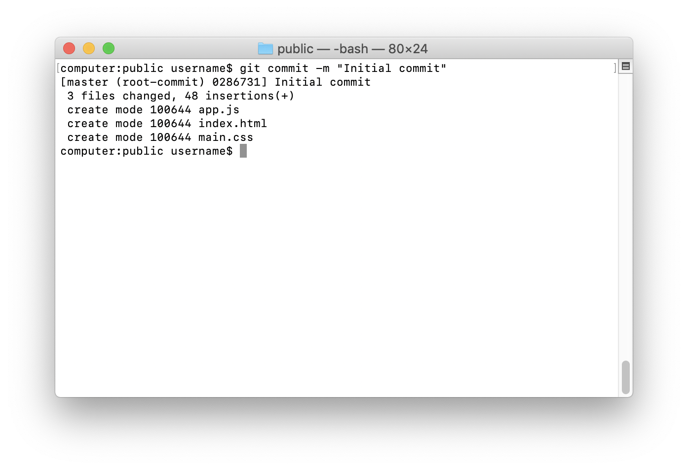
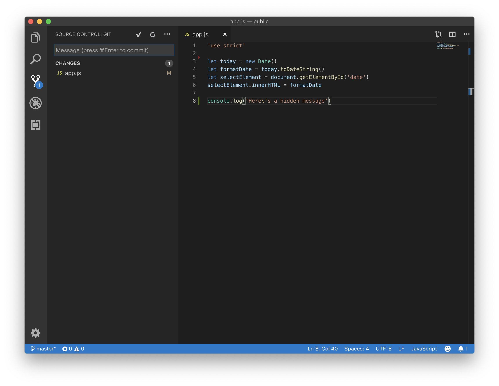
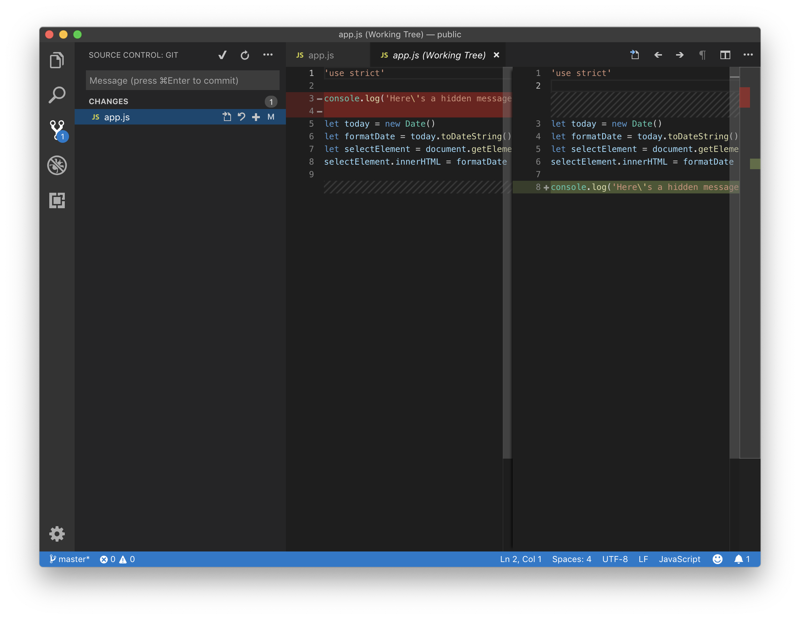
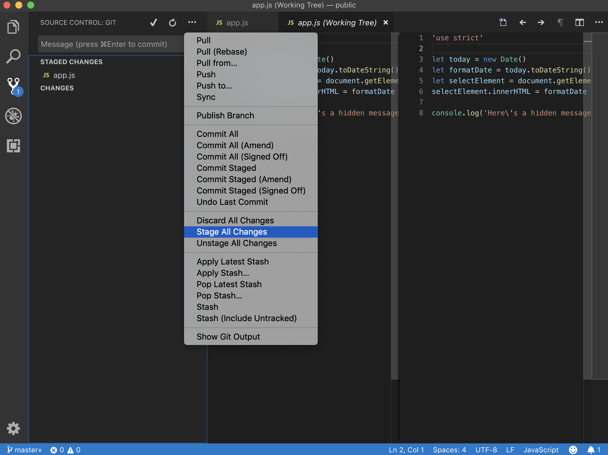
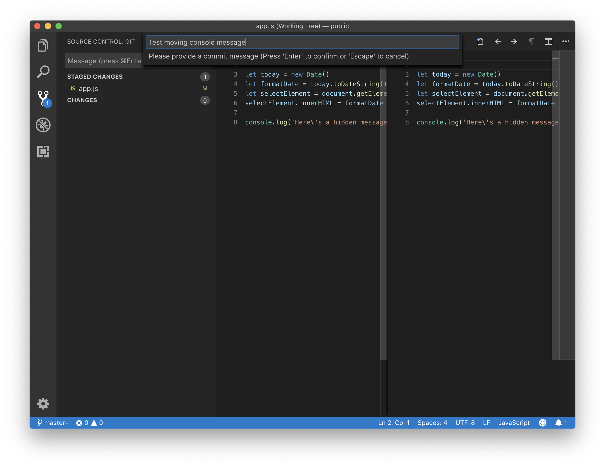

Alright, we've built a web page. It's a great start! Web development can be like an iceberg; there's a lot more work under the surface than you see in the finished result. Take small steps and move forward a little at a time. A website visitor will recognize and appreciate an excellent user experience even if they don't know how you built the site.

It's a good idea to save your files, and *commit* changes frequently using Git. How often you commit changes is up to you. It's generally good to commit changes when the code is working or functional. Take a minute to clean up experiments, broken code, or unneeded console logs. Think about updating or adding meaningful comments to help jog your memory in the future.

## Git status

Before applying any changes to Git, you can check the status. It's an optional step, but sometimes useful for making sure reality matches what's in your head. To do this, open up **Git Bash** or **Terminal**, and enter the following.

```bash
git status
```

The result should say, "on branch master." You can see if any files have changed since your last commit.


If you ever see the following message, navigate back to your project folder (in this case the public folder on your Desktop), then try `git status` again.

```bash
fatal: not a git repository (or any of the parent directories): .git
```


## Git add

When you add files with Git, you're preparing to record or *stage* the changes. Although you could add a single file, usually it's best to stage all changes with the following command.

```bash
git add .
```

Rechecking the status with `git status` is optional, but will show you what it looks like after adding.


## Git commit

After staging your changes, you can save them by *committing*. You add a message to the *commit*, so you know what changes occurred. Adding meaningful messages is a bit of an art. You want to be concise, yet informative. Think about writing what changes you made or why you made them. Commit your changes with the following command.

```bash
git commit -m "Initial commit"
```



Now, if you use `git status` again, you'll see this message.

```bash
"On branch master
nothing to commit, working tree clean"
```

You may see a few different types of messages from Git. For example, there are no changes detected. Or you could have a mix between committed and uncommitted changes. The main thing to notice is that Git provides you with interactive feedback on what to do.

```bash
no changes added to commit (use "git add" and/or "git commit -a")
```

```bash
Changes not staged for commit:
  (use "git add <file>..." to update what will be committed)
  (use "git checkout -- <file>..." to discard changes in working directory)
```

```bash
Untracked files:
  (use "git add <file>..." to include in what will be committed)
```

```bash
Changes to be committed:
  (use "git reset HEAD <file>..." to unstage)

	new file:
```

For now, the two main things to remember are `git add .` and `git commit -m "Message"`. With these two commands, you can track changes to your work. As a bonus, you'll be set up to collaborate with other people when the time comes.

Now that you have the hang of adding and committing with Git Bash or Terminal, you can accomplish the same steps in an editor like VS Code.

## Using git with VS-Code

Let's briefly look at Git integration in an IDE. Close or quit out of **Git Bash** or **Terminal** with the keyboard shortcut Command+Q (macOS). Then open **Visual Studio Code**.

Note the source control badges (we saw in *Project structure*), in the activity bar, have disappeared.


Let's make a quick edit to our JavaScript file using keyboard shortcuts (you should know).

| Keyboard shortcuts | Windows | macOS |
|----------|----------|----------|
| Cut | Control+X | Command+X |
| Copy | Control+C | Command+C |
| Paste | Control+V | Command+V |
| Save | Control+S | Command+S |

Cut the `console.log` line, paste it to the bottom of the page, and then save.

```javascript
'use strict'

let today = new Date()
let formatDate = today.toDateString()
let selectElement = document.getElementById('date')
selectElement.innerHTML = formatDate

console.log('Here\'s a hidden message')
```

Note the red where you removed a line of code and the green where you added a new line.



You can also see the **Source Control** section (in the activity bar) has recognized changes. Click on the **Source Control icon**, then click on **app.js** under **changes**. The editor group (Working Tree) shows two panels side-by-side to compare the differences between files with red (deleted, minus) and green (added, plus).

You can *stage* file changes with the **plus icon** next to a file or use the **minus icon** to *unstage*. The **minus icon** only shows up if you've staged a file.



Let's stage all of our changes by selecting the **icon**  and selecting **Stage All Changes**. This is equivalent to `git add .` in Git Bash or Terminal. Select the **checkmark icon** to *commit*.



Type the commit message, "Test moving console message." Press the Enter (Return) key and note the changes. There is no longer a Git badge or changes in the list.



Close the (Working Tree) window with Control+W (Windows) or Command+W (macOS).
