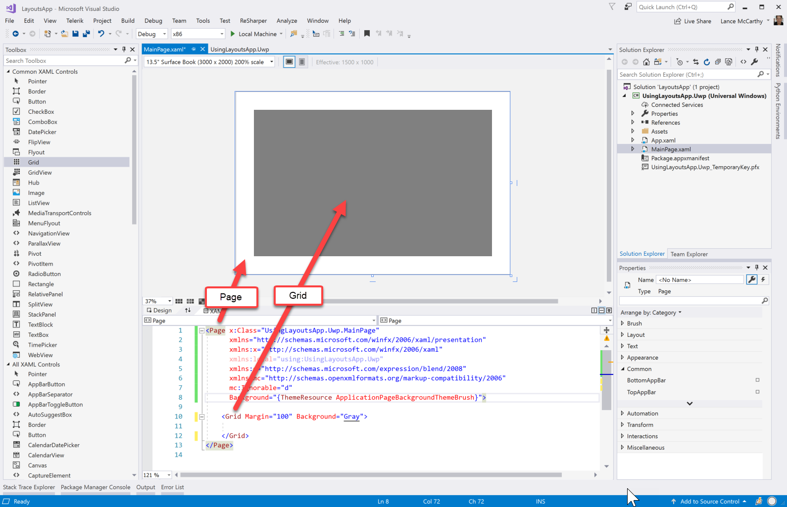
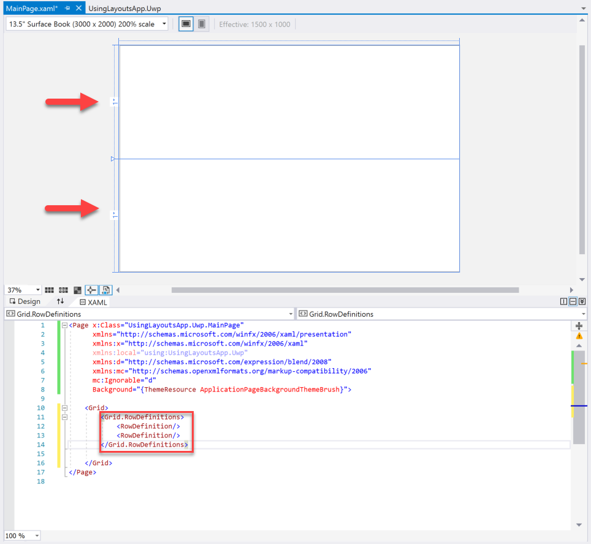
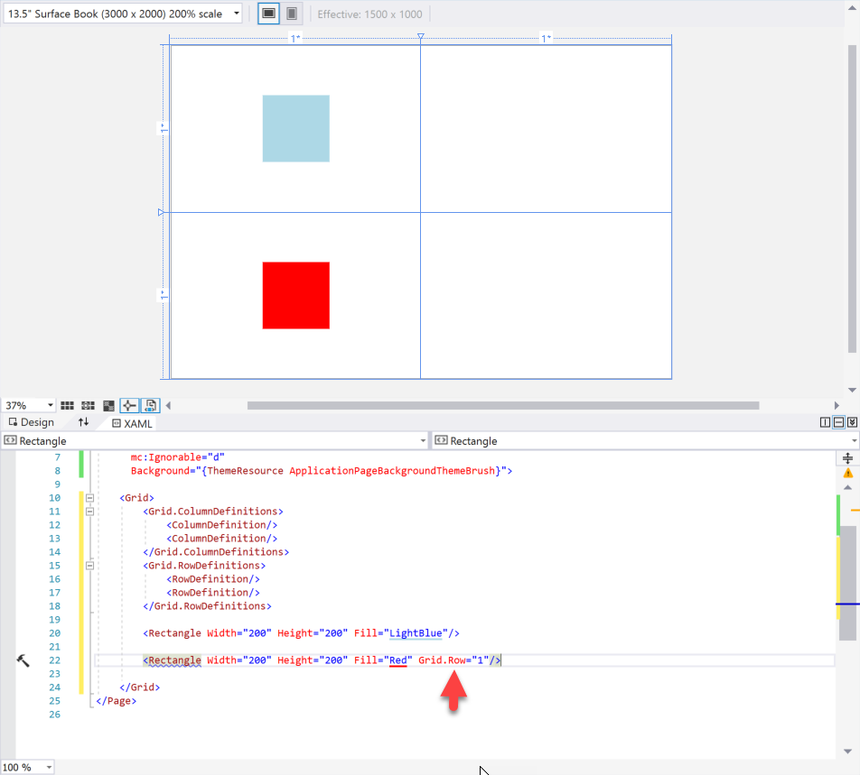
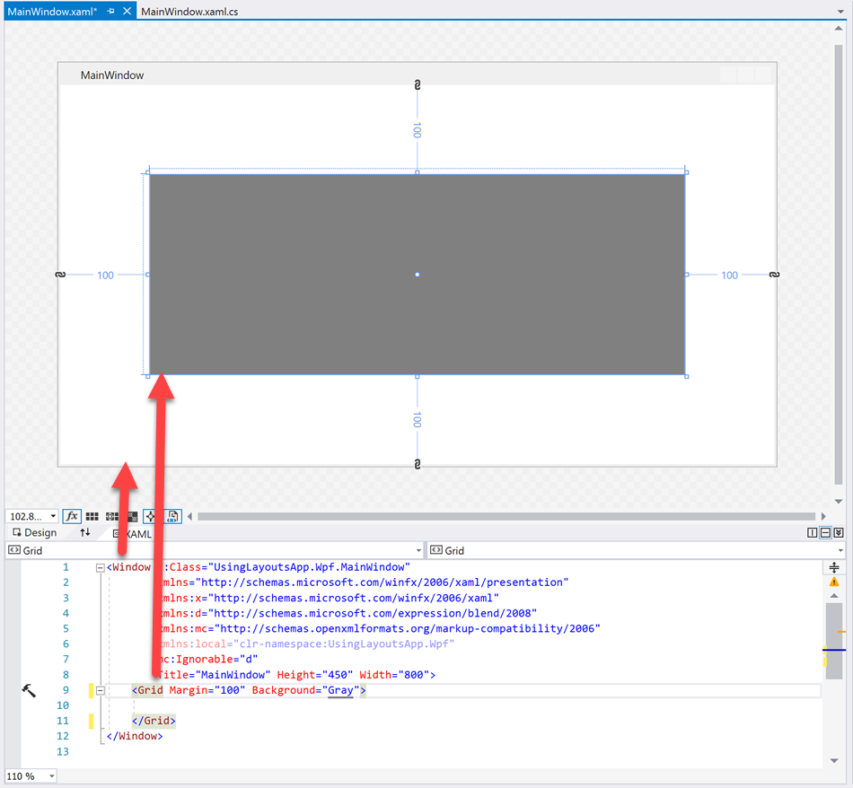
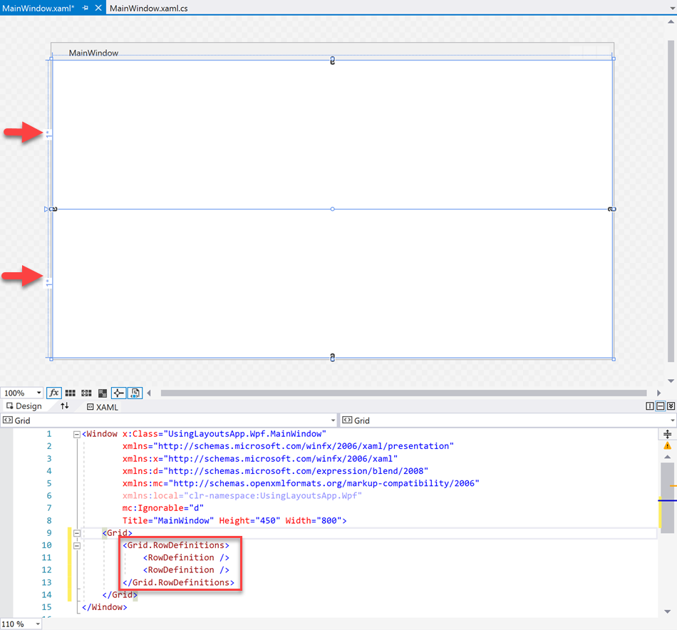
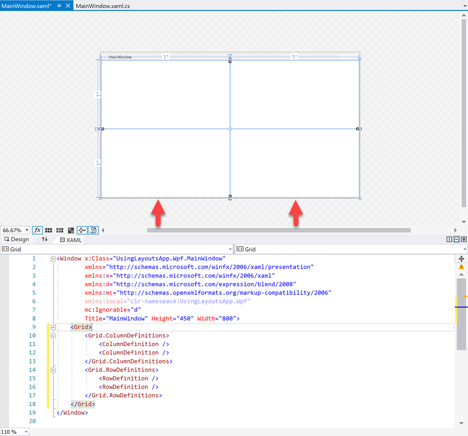
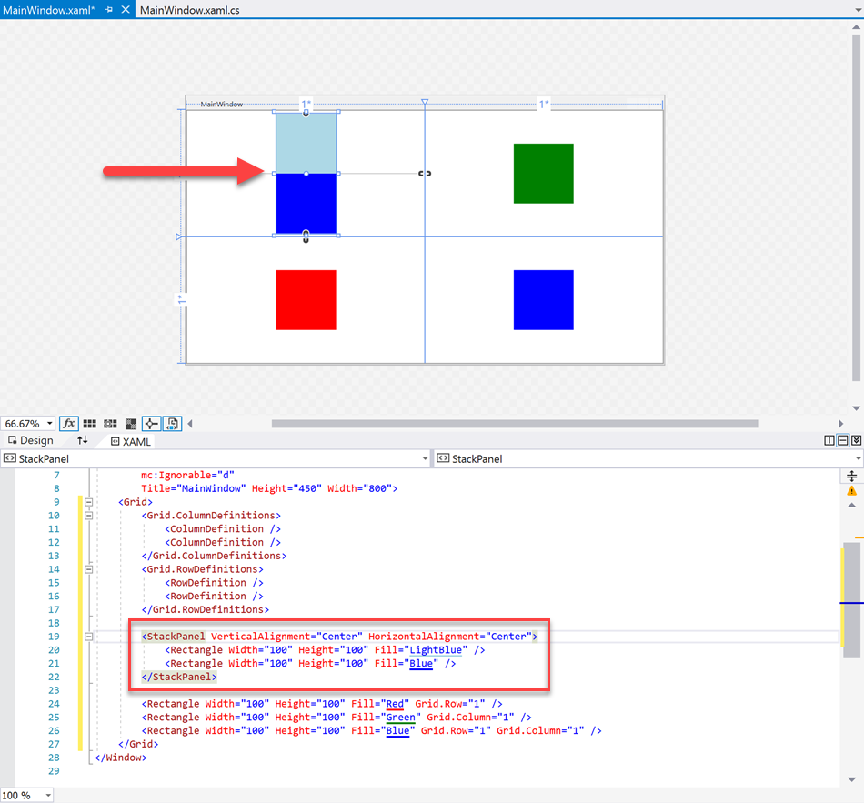

## Create a UI layout

The user interface (UI) is how an application and a user can communicate with each other. The application needs to show the user information. And the user needs a way to interact with that information. To start, let's explore some basic building blocks of a user interface:

- How to use a grid or panel layout.
- How to configure the layout controls to arrange visual elements.
- The layout controls' automatic sizing and positioning features.

After you're done, we explore some controls that can display and accept user-entered information. Examples are `TextBox` and `Button`. Then we discuss how to take in user input.

> [!IMPORTANT]
> Let's quickly discuss terminology. These building blocks are called a **control** or sometimes an **element**. A control might only exist to position other controls, like a `Grid` control. Or it might have a specific purpose, like showing text as the `TextBox` control does. No matter what their specific purpose is, all controls share a common responsibility. They're elements that build the user interface.

### Layouts

Layout controls are the foundation of any user interface. They arrange the elements of an application's UI. Elements like text, buttons, and images all need rules for where they go and how they behave.

For example, are these elements stacked together in the middle of the screen? Or are they placed in rows that expand evenly when the user resizes the application? You can determine this answer by both the element's properties and the layout's positioning. Example properties are **Width** and **Height**.

Now let's get started.

::: zone pivot="uwp"


#### Create a new project

With Visual Studio open, create a Universal Windows Platform (UWP) C# project. Give the project a meaningful name for this lesson. An example is **UsingLayoutsApp.Uwp**.

:::image type="content" source="../media/1-create-new-project-uwp.png" alt-text="Screenshot that shows the Configure your new project window with red boxes around the Blank App (Universal Windows) project type, the Project name text box, and the Create button.":::

#### The Grid layout control

When Visual Studio finishes generating the project, **MainPage.xaml** opens by default. If it doesn't open, you can double-click on it in the Solution Explorer.

Look at the code editor next to the designer. Notice that there are two elements: a `Page` and a `Grid`. This layout is the default for a new page:

```xml
<Page x:Class="UsingLayoutsApp.MainPage"
      xmlns="http://schemas.microsoft.com/winfx/2006/xaml/presentation"
      xmlns:x="http://schemas.microsoft.com/winfx/2006/xaml"
      xmlns:local="using:UsingLayoutsApp"
      xmlns:d="http://schemas.microsoft.com/expression/blend/2008"
      xmlns:mc="http://schemas.openxmlformats.org/markup-compatibility/2006"
      mc:Ignorable="d"
      Background="{ThemeResource ApplicationPageBackgroundThemeBrush}">

    <Grid>

    </Grid>
</Page>
```

Notice how the `Grid` element is nested inside the two `<Page></Page>` tags. That's because the `Grid` is the **child** of the `Page`. So it's inside the `Page` element's boundaries.

Let's try an experiment to visualize the relationship between the `Grid` and the `Page`.

To see the distinction between the parent and child, set the **Margin** and **Background** properties of the `Grid` element:

```xml
<Page x:Class="UsingLayoutsApp.MainPage"
      xmlns="http://schemas.microsoft.com/winfx/2006/xaml/presentation"
      xmlns:x="http://schemas.microsoft.com/winfx/2006/xaml"
      xmlns:local="using:UsingLayoutsApp"
      xmlns:d="http://schemas.microsoft.com/expression/blend/2008"
      xmlns:mc="http://schemas.openxmlformats.org/markup-compatibility/2006"
      mc:Ignorable="d"
      Background="{ThemeResource ApplicationPageBackgroundThemeBrush}">

    <Grid Margin="100" Background="Gray">

    </Grid>
</Page>
```

Now the `Grid` has a gray background and a 100-pixel margin around it.



We know the `Grid` is on top of the `Page` because we see all the gray color. A child element gets placed on top of a parent element. It's like placing a gray piece of paper on top of a white table.

The `Page` element only supports having **one** child element. The `Grid` element supports as many children as you need. So a `Grid` is one of the most versatile layout elements. It's used as the main layout control of an application page.

> [!NOTE]
> There are many other layout controls that support multiple children and are suitable for page-level use. An example is the `RelativePanel`. These controls are slightly more advanced than the `Grid`. They're outside the scope of this lesson.

To see how the `Grid` contains many children, add three `Rectangle` elements to the `Grid`. These elements normally get centered. But we position them apart from each other by using the **HorizontalAlignment** property:

```xml
<Page x:Class="UsingLayoutsApp.MainPage"
      xmlns="http://schemas.microsoft.com/winfx/2006/xaml/presentation"
      xmlns:x="http://schemas.microsoft.com/winfx/2006/xaml"
      xmlns:local="using:UsingLayoutsApp"
      xmlns:d="http://schemas.microsoft.com/expression/blend/2008"
      xmlns:mc="http://schemas.openxmlformats.org/markup-compatibility/2006"
      mc:Ignorable="d"
      Background="{ThemeResource ApplicationPageBackgroundThemeBrush}">

    <Grid Margin="100" Background="Gray">
        <Rectangle Width="200" Height="200" Fill="LightBlue" HorizontalAlignment="Left" />
        <Rectangle Width="200" Height="200" Fill="LightPink" HorizontalAlignment="Center" />
        <Rectangle Width="200" Height="200" Fill="LightGreen" HorizontalAlignment="Right" />
    </Grid>
</Page>
```

Now you see three `Rectangle` elements inside the `Grid`. Each is positioned horizontally according to its **HorizontalAlignment** value.


Notice how the blue and green rectangles on the edges don't go outside of the `Grid` into the white area where the `Page` is. This layout is the **critical element of the parent-child relationship**. The `Rectangle` elements are children of the `Grid`. And the `Grid` is the child of the `Page`.

#### Grid rows and columns

The `Grid` is a flexible and powerful layout control. With the `Grid`, you can use some rows and columns. By using their special properties, you can automatically size and position the `Grid`'s children. This positioning is done by using **RowDefinitions** and **ColumnDefinitons**.  

Let's start fresh with an empty `Grid`. Then we add two rows by using the **RowDefinitions** property:

```xml
<Page x:Class="UsingLayoutsApp.MainPage"
      xmlns="http://schemas.microsoft.com/winfx/2006/xaml/presentation"
      xmlns:x="http://schemas.microsoft.com/winfx/2006/xaml"
      xmlns:local="using:UsingLayoutsApp"
      xmlns:d="http://schemas.microsoft.com/expression/blend/2008"
      xmlns:mc="http://schemas.openxmlformats.org/markup-compatibility/2006"
      mc:Ignorable="d"
      Background="{ThemeResource ApplicationPageBackgroundThemeBrush}">

    <Grid>
        <Grid.RowDefinitions>
            <RowDefinition/>
            <RowDefinition/>
        </Grid.RowDefinitions>

    </Grid>
</Page>
```

We set the **RowDefinitions** property differently than we set **Margin** because it's in a new line that uses the `Grid.RowDefinitions` syntax. This setting is functionally the same as using a property inline like we did with **Margin**. But it's appropriate for setting multiple values.

In the designer, you now see a horizontal line that goes through the middle of the `Grid`. This line shows that we have two rows: one on top and one on the bottom.



> [!NOTE]
> If you don't see the line, put your cursor anywhere inside the `<Grid></Grid>` tags in the XAML code editor. This action quickly selects the `Grid` in the designer for you.

What about columns? It's the same approach but with the **ColumnDefinitions** property. Now add a few `ColumnDefinition` objects to the `Grid`:

```xml
<Page x:Class="UsingLayoutsApp.MainPage"
      xmlns="http://schemas.microsoft.com/winfx/2006/xaml/presentation"
      xmlns:x="http://schemas.microsoft.com/winfx/2006/xaml"
      xmlns:local="using:UsingLayoutsApp"
      xmlns:d="http://schemas.microsoft.com/expression/blend/2008"
      xmlns:mc="http://schemas.openxmlformats.org/markup-compatibility/2006"
      mc:Ignorable="d"
      Background="{ThemeResource ApplicationPageBackgroundThemeBrush}">

    <Grid>
        <Grid.ColumnDefinitions>
            <ColumnDefinition/>
            <ColumnDefinition/>
        </Grid.ColumnDefinitions>
        <Grid.RowDefinitions>
            <RowDefinition/>
            <RowDefinition/>
        </Grid.RowDefinitions>

    </Grid>
</Page>
```

As with the rows, there's now a vertical line that goes up the middle of the `Grid`. It defines two columns: one on the left and one on the right.


> [!NOTE]
> If you need more room in the code editor or the designer, you can zoom out either one. Select and hold the Ctrl key and scroll at the same time.

Now let's place content in the rows and columns. To keep this lesson simple, we use a 200 x 200 `Rectangle`:

```xml
<Page x:Class="UsingLayoutsApp.MainPage"
      xmlns="http://schemas.microsoft.com/winfx/2006/xaml/presentation"
      xmlns:x="http://schemas.microsoft.com/winfx/2006/xaml"
      xmlns:local="using:UsingLayoutsApp"
      xmlns:d="http://schemas.microsoft.com/expression/blend/2008"
      xmlns:mc="http://schemas.openxmlformats.org/markup-compatibility/2006"
      mc:Ignorable="d"
      Background="{ThemeResource ApplicationPageBackgroundThemeBrush}">

    <Grid>
        <Grid.ColumnDefinitions>
            <ColumnDefinition/>
            <ColumnDefinition/>
        </Grid.ColumnDefinitions>
        <Grid.RowDefinitions>
            <RowDefinition/>
            <RowDefinition/>
        </Grid.RowDefinitions>

        <Rectangle Width="200" Height="200" Fill="LightBlue"/>

    </Grid>
</Page>
```

You see the rectangle in the top-left corner of the `Grid`. It's placed there because any child element's row and column are set to 0 by default. Row and column definitions use a zero-based numbering system.

Let's add another `Rectangle`. This time, we set the **Fill** to *Red* and the **Grid.Row** property to *1*:

```xml
<Page x:Class="UsingLayoutsApp.MainPage"
      xmlns="http://schemas.microsoft.com/winfx/2006/xaml/presentation"
      xmlns:x="http://schemas.microsoft.com/winfx/2006/xaml"
      xmlns:local="using:UsingLayoutsApp"
      xmlns:d="http://schemas.microsoft.com/expression/blend/2008"
      xmlns:mc="http://schemas.openxmlformats.org/markup-compatibility/2006"
      mc:Ignorable="d"
      Background="{ThemeResource ApplicationPageBackgroundThemeBrush}">

    <Grid>
        <Grid.ColumnDefinitions>
            <ColumnDefinition/>
            <ColumnDefinition/>
        </Grid.ColumnDefinitions>
        <Grid.RowDefinitions>
            <RowDefinition/>
            <RowDefinition/>
        </Grid.RowDefinitions>

        <Rectangle Width="200" Height="200" Fill="LightBlue"/>

        <Rectangle Width="200" Height="200" Fill="Red" Grid.Row="1"/>

    </Grid>
</Page>
```



Now what about the columns? Set them the same way that you set the rows. Add two more `Rectangle`s and set the **Grid.Column** property:

```xml
<Page x:Class="UsingLayoutsApp.MainPage"
      xmlns="http://schemas.microsoft.com/winfx/2006/xaml/presentation"
      xmlns:x="http://schemas.microsoft.com/winfx/2006/xaml"
      xmlns:local="using:UsingLayoutsApp"
      xmlns:d="http://schemas.microsoft.com/expression/blend/2008"
      xmlns:mc="http://schemas.openxmlformats.org/markup-compatibility/2006"
      mc:Ignorable="d"
      Background="{ThemeResource ApplicationPageBackgroundThemeBrush}">

    <Grid>
        <Grid.ColumnDefinitions>
            <ColumnDefinition/>
            <ColumnDefinition/>
        </Grid.ColumnDefinitions>
        <Grid.RowDefinitions>
            <RowDefinition/>
            <RowDefinition/>
        </Grid.RowDefinitions>

        <Rectangle Width="200" Height="200" Fill="LightBlue"/>

        <Rectangle Width="200" Height="200" Fill="Red" Grid.Row="1"/>

        <Rectangle Width="200" Height="200" Fill="Green" Grid.Column="1"/>

        <Rectangle Width="200" Height="200" Fill="Blue" Grid.Row="1" Grid.Column="1" />

    </Grid>
</Page>
```


> [!NOTE]
> Remember that `Grid.Row="0"` and `Grid.Column="0"` are the default values for any child of the `Grid`. You can choose to set these values or leave them out.

You can automatically or explicitly size rows and columns:

```xml
<!-- The default, star-sized, takes the maximum amount of space -->
<RowDefinition Height="*"/>
<!-- Takes up the minimum amount of space to fit the content-->
<RowDefinition Height="Auto"/>
<!-- You can also explicitly set a value in pixels -->
<RowDefinition Height="50"/>
```

Until now, we used the default, star-sized option. But rows can also take up the minimum amount of space possible. This option is called **autosized**.

Let's try an autosized row to see this option in action. Modify the last demo by setting the first `RowDefinition` **Height** to *Auto*:

```xml
<Page x:Class="UsingLayoutsApp.MainPage"
      xmlns="http://schemas.microsoft.com/winfx/2006/xaml/presentation"
      xmlns:x="http://schemas.microsoft.com/winfx/2006/xaml"
      xmlns:local="using:UsingLayoutsApp"
      xmlns:d="http://schemas.microsoft.com/expression/blend/2008"
      xmlns:mc="http://schemas.openxmlformats.org/markup-compatibility/2006"
      mc:Ignorable="d"
      Background="{ThemeResource ApplicationPageBackgroundThemeBrush}">

    <Grid>
        <Grid.ColumnDefinitions>
            <ColumnDefinition/>
            <ColumnDefinition/>
        </Grid.ColumnDefinitions>
        <Grid.RowDefinitions>
            <RowDefinition Height="Auto"/>
            <RowDefinition/>
        </Grid.RowDefinitions>

        <Rectangle Width="200" Height="200" Fill="LightBlue"/>

        <Rectangle Width="200" Height="200" Fill="Red" Grid.Row="1"/>

        <Rectangle Width="200" Height="200" Fill="Green" Grid.Column="1"/>

        <Rectangle Width="200" Height="200" Fill="Blue" Grid.Row="1" Grid.Column="1" />

    </Grid>
</Page>
```


You see the first row squeezed to the minimum amount of space. It's the height of the content in that row. The second row fills up the rest of the available space as it's still star sized. Remember that you don't have to enter **Height=**. That's the default value.

Autosize can be done with columns. But instead of **Height**, you set **Width**. Set the **Width** of the first `ColumnDefinition` to *Auto*:

```xml
<Page x:Class="UsingLayoutsApp.MainPage"
      xmlns="http://schemas.microsoft.com/winfx/2006/xaml/presentation"
      xmlns:x="http://schemas.microsoft.com/winfx/2006/xaml"
      xmlns:local="using:UsingLayoutsApp"
      xmlns:d="http://schemas.microsoft.com/expression/blend/2008"
      xmlns:mc="http://schemas.openxmlformats.org/markup-compatibility/2006"
      mc:Ignorable="d"
      Background="{ThemeResource ApplicationPageBackgroundThemeBrush}">

    <Grid>
        <Grid.ColumnDefinitions>
            <ColumnDefinition Width="Auto"/>
            <ColumnDefinition />
        </Grid.ColumnDefinitions>
        <Grid.RowDefinitions>
            <RowDefinition />
            <RowDefinition />
        </Grid.RowDefinitions>

        <Rectangle Width="200" Height="200" Fill="LightBlue" />

        <Rectangle Width="200" Height="200" Fill="Red" Grid.Row="1" />

        <Rectangle Width="200" Height="200" Fill="Green" Grid.Column="1" />

        <Rectangle Width="200" Height="200" Fill="Blue" Grid.Row="1" Grid.Column="1" />

    </Grid>
</Page>
```

Now the first column is as small as it can possibly be. It's only as wide as the content. The second column fills the rest of the available area.


We're almost done with this unit. Before we move on, we briefly touch on one of the most used simple layouts, the `StackPanel`.

#### The StackPanel

The `StackPanel` is a simple layout control that stacks items next to each other. It doesn't require that you define rows or columns. A commonly used layout combination is a `Grid` and a `StackPanel` together.

A simple example shows how to use a `StackPanel`.

We use the same four rectangles from the last exercise. But this time, we put the first `Rectangle` in a `StackPanel` with another `Rectangle`:

```xml
<Page x:Class="UsingLayoutsApp.MainPage"
      xmlns="http://schemas.microsoft.com/winfx/2006/xaml/presentation"
      xmlns:x="http://schemas.microsoft.com/winfx/2006/xaml"
      xmlns:local="using:UsingLayoutsApp"
      xmlns:d="http://schemas.microsoft.com/expression/blend/2008"
      xmlns:mc="http://schemas.openxmlformats.org/markup-compatibility/2006"
      mc:Ignorable="d"
      Background="{ThemeResource ApplicationPageBackgroundThemeBrush}">

    <Grid>
        <Grid.ColumnDefinitions>
            <ColumnDefinition />
            <ColumnDefinition />
        </Grid.ColumnDefinitions>
        <Grid.RowDefinitions>
            <RowDefinition />
            <RowDefinition />
        </Grid.RowDefinitions>

        <StackPanel VerticalAlignment="Center">
            <Rectangle Width="200" Height="200" Fill="LightBlue" />
            <Rectangle Width="200" Height="200" Fill="Blue" />
        </StackPanel>

        <Rectangle Width="200" Height="200" Fill="Red" Grid.Row="1" />

        <Rectangle Width="200" Height="200" Fill="Green" Grid.Column="1" />

        <Rectangle Width="200" Height="200" Fill="Blue" Grid.Row="1" Grid.Column="1" />
    </Grid>
</Page>
```

The default stacking strategy for a `StackPanel` is **Vertical**. So you see the two rectangles stacked together vertically.


You can also stack items horizontally. Set the **Orientation** property of the `StackPanel` to *Horizontal*:

```xml
<Page x:Class="UsingLayoutsApp.MainPage"
      xmlns="http://schemas.microsoft.com/winfx/2006/xaml/presentation"
      xmlns:x="http://schemas.microsoft.com/winfx/2006/xaml"
      xmlns:local="using:UsingLayoutsApp"
      xmlns:d="http://schemas.microsoft.com/expression/blend/2008"
      xmlns:mc="http://schemas.openxmlformats.org/markup-compatibility/2006"
      mc:Ignorable="d"
      Background="{ThemeResource ApplicationPageBackgroundThemeBrush}">

    <Grid>
        <Grid.ColumnDefinitions>
            <ColumnDefinition />
            <ColumnDefinition />
        </Grid.ColumnDefinitions>
        <Grid.RowDefinitions>
            <RowDefinition />
            <RowDefinition />
        </Grid.RowDefinitions>

        <StackPanel Orientation="Horizontal" HorizontalAlignment="Center" VerticalAlignment="Center">
            <Rectangle Width="200" Height="200" Fill="LightBlue" />
            <Rectangle Width="200" Height="200" Fill="Blue" />
        </StackPanel>

        <Rectangle Width="200" Height="200" Fill="Red" Grid.Row="1" />

        <Rectangle Width="200" Height="200" Fill="Green" Grid.Column="1" />

        <Rectangle Width="200" Height="200" Fill="Blue" Grid.Row="1" Grid.Column="1" />
    </Grid>
</Page>
```


In the next unit, we put these layouts to use. We add commonly used controls like `TextBlock` and `Button` and position them around the UI.

::: zone-end

::: zone pivot="wpf"


#### Create a new project

With Visual Studio open, create a WPF C# project. Give the project a meaningful name for this lesson. An example is  **UsingLayoutsApp.Wpf**.

:::image type="content" source="../media/1-create-new-project-wpf.png" alt-text="Screenshot that shows the Configure your new project window with red boxes around the WPF Application project type, the Project name text box, and the Next button.":::

#### The Grid layout control

When Visual Studio generates the project, you see **MainWindow.xaml** open by default. If it wasn't opened, double-click it in the Solution Explorer.

Look at the code editor next to the designer. Notice the two elements: a `Window` and a `Grid`. This layout is the default for a new page:

```xml
<Window x:Class="UsingLayoutsApp.MainWindow"
        xmlns="http://schemas.microsoft.com/winfx/2006/xaml/presentation"
        xmlns:x="http://schemas.microsoft.com/winfx/2006/xaml"
        xmlns:d="http://schemas.microsoft.com/expression/blend/2008"
        xmlns:mc="http://schemas.openxmlformats.org/markup-compatibility/2006"
        xmlns:local="clr-namespace:UsingLayoutsApp"
        mc:Ignorable="d"
        Title="MainWindow" Height="450" Width="800">
    <Grid>

    </Grid>
</Window>
```

Notice how the `Grid` element nests inside the two `<Window></Window>` tags. That's because the `Grid` is the child of the `Window`. So it's inside the `Window` element's boundaries.

Let's try an experiment to better visualize the relationship between the `Grid` and the `Window`.

To see the distinction between the parent and child, set the **Margin** and **Background** properties of the `Grid` element:

```xml
<Window x:Class="UsingLayoutsApp.MainWindow"
        xmlns="http://schemas.microsoft.com/winfx/2006/xaml/presentation"
        xmlns:x="http://schemas.microsoft.com/winfx/2006/xaml"
        xmlns:d="http://schemas.microsoft.com/expression/blend/2008"
        xmlns:mc="http://schemas.openxmlformats.org/markup-compatibility/2006"
        xmlns:local="clr-namespace:UsingLayoutsApp"
        mc:Ignorable="d"
        Title="MainWindow" Height="450" Width="800">
    <Grid Margin="100" Background="Gray">

    </Grid>
</Window>
```

Now the `Grid` has a gray background and a 100-pixel margin all around.



We know the `Grid` is on top of the `Window` because we see all the gray color. A child element gets placed on top of a parent element. It's like placing a gray piece of paper on top of a white table.

The `Window` element only supports **one** child element. The `Grid` element supports as many children as you need. So a `Grid` is one of the most versatile layout elements. It's used as the main layout control of an application page.

> [!NOTE]
> Many other layout controls support multiple children and are suitable for page-level use. These controls are slightly more advanced than the `Grid`. They're outside the scope of this lesson.

To see how the `Grid` contains many children, add three `Rectangle` elements to the `Grid`. These elements normally get centered. But we position them apart from each other by using **HorizontalAlignment**:

```xml
<Window x:Class="UsingLayoutsApp.MainWindow"
        xmlns="http://schemas.microsoft.com/winfx/2006/xaml/presentation"
        xmlns:x="http://schemas.microsoft.com/winfx/2006/xaml"
        xmlns:d="http://schemas.microsoft.com/expression/blend/2008"
        xmlns:mc="http://schemas.openxmlformats.org/markup-compatibility/2006"
        xmlns:local="clr-namespace:UsingLayoutsApp"
        mc:Ignorable="d"
        Title="MainWindow" Height="450" Width="800">
    <Grid Margin="100" Background="Gray">
        <Rectangle Width="100" Height="100" Fill="LightBlue" HorizontalAlignment="Left" />
        <Rectangle Width="100" Height="100" Fill="LightPink" HorizontalAlignment="Center" />
        <Rectangle Width="100" Height="100" Fill="LightGreen" HorizontalAlignment="Right" />
    </Grid>
</Window>
```

Now you see three rectangles inside the `Grid`. Each is positioned horizontally according to its **HorizontalAlignment** value.


Notice how the rectangles don't go outside of the `Grid` into the white area where the `Window` is. This layout is the **critical element of the parent-child relationship**. The `Rectangle` elements are the children of the `Grid`. And the `Grid` is the child of the `Window`.

#### Grid rows and columns

The `Grid` is a flexible and powerful layout control. With it, you can use some rows and columns. They have special properties that automatically size and position the `Grid`'s children. This positioning is done by using **RowDefinitions** and **ColumnDefinitons**.  

Let's start fresh with an empty `Grid`. Then add two rows by using the **RowDefinitions** property:

```xml
<Window x:Class="UsingLayoutsApp.MainWindow"
        xmlns="http://schemas.microsoft.com/winfx/2006/xaml/presentation"
        xmlns:x="http://schemas.microsoft.com/winfx/2006/xaml"
        xmlns:d="http://schemas.microsoft.com/expression/blend/2008"
        xmlns:mc="http://schemas.openxmlformats.org/markup-compatibility/2006"
        xmlns:local="clr-namespace:UsingLayoutsApp"
        mc:Ignorable="d"
        Title="MainWindow" Height="450" Width="800">
    <Grid>
        <Grid.RowDefinitions>
            <RowDefinition />
            <RowDefinition />
        </Grid.RowDefinitions>
    </Grid>
</Window>
```

> [!NOTE]
> We set the **RowDefinitions** property differently than the **Margin** as it's in a new line that uses the `Grid.RowDefinitions` syntax. This setting is functionally the same as using a property inline like we did with the **Margin**. But it's appropriate for setting multiple values.

In the designer, you now see a horizontal line that goes through the middle of the `Grid`. This line shows that we have two rows: one on top and one on the bottom.



> [!NOTE]
> If you don't see the line, put your cursor anywhere inside the `<Grid></Grid>` tags in the XAML code editor. This action quickly selects the `Grid` in the designer for you.

What about columns? It's the same approach but with the **ColumnDefinitions** property. Add some `ColumnDefinition` objects to the `Grid`:

```xml
<Window x:Class="UsingLayoutsApp.MainWindow"
        xmlns="http://schemas.microsoft.com/winfx/2006/xaml/presentation"
        xmlns:x="http://schemas.microsoft.com/winfx/2006/xaml"
        xmlns:d="http://schemas.microsoft.com/expression/blend/2008"
        xmlns:mc="http://schemas.openxmlformats.org/markup-compatibility/2006"
        xmlns:local="clr-namespace:UsingLayoutsApp"
        mc:Ignorable="d"
        Title="MainWindow" Height="450" Width="800">
    <Grid>
        <Grid.ColumnDefinitions>
            <ColumnDefinition />
            <ColumnDefinition />
        </Grid.ColumnDefinitions>
        <Grid.RowDefinitions>
            <RowDefinition />
            <RowDefinition />
        </Grid.RowDefinitions>
    </Grid>
</Window>
```

As with the rows, there's now a vertical line that goes up the middle of the `Grid`. It defines two columns: one on the left and one on the right.



> [!NOTE]
> If you need more room in the code editor or the designer, you can zoom out either one. Select and hold the Ctrl key and scroll at the same time. There's also a drop-down menu at the bottom-left corner with the current zoom level.

Now let's place content in the rows and columns. To keep this lesson simple, we use a 200 x 200 `Rectangle`:

```xml
<Window x:Class="UsingLayoutsApp.MainWindow"
        xmlns="http://schemas.microsoft.com/winfx/2006/xaml/presentation"
        xmlns:x="http://schemas.microsoft.com/winfx/2006/xaml"
        xmlns:d="http://schemas.microsoft.com/expression/blend/2008"
        xmlns:mc="http://schemas.openxmlformats.org/markup-compatibility/2006"
        xmlns:local="clr-namespace:UsingLayoutsApp"
        mc:Ignorable="d"
        Title="MainWindow" Height="450" Width="800">
    <Grid>
        <Grid.ColumnDefinitions>
            <ColumnDefinition />
            <ColumnDefinition />
        </Grid.ColumnDefinitions>
        <Grid.RowDefinitions>
            <RowDefinition />
            <RowDefinition />
        </Grid.RowDefinitions>

        <Rectangle Width="200" Height="200" Fill="LightBlue" />
    </Grid>
</Window>
```

You see the `Rectangle` in the top-left corner of the `Grid`. It's placed there because any child element's row and column are set to 0 by default. Row and column definitions use a zero-based numbering system.

Let's add another `Rectangle`. This time, we set the **Fill** to *Red* and the **Grid.Row** properties to *1*:

```xml
<Window x:Class="UsingLayoutsApp.MainWindow"
        xmlns="http://schemas.microsoft.com/winfx/2006/xaml/presentation"
        xmlns:x="http://schemas.microsoft.com/winfx/2006/xaml"
        xmlns:d="http://schemas.microsoft.com/expression/blend/2008"
        xmlns:mc="http://schemas.openxmlformats.org/markup-compatibility/2006"
        xmlns:local="clr-namespace:UsingLayoutsApp"
        mc:Ignorable="d"
        Title="MainWindow" Height="450" Width="800">
    <Grid>
        <Grid.ColumnDefinitions>
            <ColumnDefinition />
            <ColumnDefinition />
        </Grid.ColumnDefinitions>
        <Grid.RowDefinitions>
            <RowDefinition />
            <RowDefinition />
        </Grid.RowDefinitions>

        <Rectangle Width="200" Height="200" Fill="LightBlue" />

        <Rectangle Width="200" Height="200" Fill="Red" Grid.Row="1" />
    </Grid>
</Window>
```


Now what about the columns? Set them the same way that you set the rows. Add two more `Rectangle` elements and set the **Grid.Column** property:

```xml
<Window x:Class="UsingLayoutsApp.MainWindow"
        xmlns="http://schemas.microsoft.com/winfx/2006/xaml/presentation"
        xmlns:x="http://schemas.microsoft.com/winfx/2006/xaml"
        xmlns:d="http://schemas.microsoft.com/expression/blend/2008"
        xmlns:mc="http://schemas.openxmlformats.org/markup-compatibility/2006"
        xmlns:local="clr-namespace:UsingLayoutsApp"
        mc:Ignorable="d"
        Title="MainWindow" Height="450" Width="800">
    <Grid>
        <Grid.ColumnDefinitions>
            <ColumnDefinition />
            <ColumnDefinition />
        </Grid.ColumnDefinitions>
        <Grid.RowDefinitions>
            <RowDefinition />
            <RowDefinition />
        </Grid.RowDefinitions>

        <Rectangle Width="200" Height="200" Fill="LightBlue" />
        <Rectangle Width="200" Height="200" Fill="Red" Grid.Row="1" />
        <Rectangle Width="200" Height="200" Fill="Green" Grid.Column="1" />
        <Rectangle Width="200" Height="200" Fill="Blue" Grid.Row="1" Grid.Column="1" />
    </Grid>
</Window>
```


> Remember that `Grid.Row="0"` and `Grid.Column="0"` are the default values for any child of the `Grid`. You can choose to set them or leave them out.

Row and columns can be automatically or explicitly sized:

```xml
<!-- The default, star-sized, takes the maximum amount of space -->
<RowDefinition Height="*"/>
<!-- Takes up the minimum amount of space to fit the content-->
<RowDefinition Height="Auto"/>
<!-- You can also explicitly set a value in pixels -->
<RowDefinition Height="50"/>
```

Until now, we used the default, star-sized option. But rows can also take up the minimum amount of space possible. This option is called **autosized**.

Let's try an autosized row to see this option in action. Modify the last demo as follows:

- Change all the rectangles' **Width** and **Height** properties to 100. Then we can get a little more room to work with.
- Set the first `RowDefinition` **Height** to *Auto*.

```xml
<<Window x:Class="UsingLayoutsApp.MainWindow"
        xmlns="http://schemas.microsoft.com/winfx/2006/xaml/presentation"
        xmlns:x="http://schemas.microsoft.com/winfx/2006/xaml"
        xmlns:d="http://schemas.microsoft.com/expression/blend/2008"
        xmlns:mc="http://schemas.openxmlformats.org/markup-compatibility/2006"
        xmlns:local="clr-namespace:UsingLayoutsApp"
        mc:Ignorable="d"
        Title="MainWindow" Height="450" Width="800">
    <Grid>
        <Grid.ColumnDefinitions>
            <ColumnDefinition />
            <ColumnDefinition />
        </Grid.ColumnDefinitions>
        <Grid.RowDefinitions>
            <RowDefinition Height="Auto"/>
            <RowDefinition />
        </Grid.RowDefinitions>

        <Rectangle Width="100" Height="100" Fill="LightBlue" />
        <Rectangle Width="100" Height="100" Fill="Red" Grid.Row="1" />
        <Rectangle Width="100" Height="100" Fill="Green" Grid.Column="1" />
        <Rectangle Width="100" Height="100" Fill="Blue" Grid.Row="1" Grid.Column="1" />
    </Grid>
</Window>
```

You see the first row squeezed to the minimum amount of space. It's the height of the content in that row, the rectangles. The second row fills up the rest of the available space as it's still star sized. Remember that you don't have to enter **Height=**. That's the default value.


Autosize can be done with columns. But instead of **Height**, you set the **Width**. Set the **Width** of the first `ColumnDefinition` to *Auto*:

```xml
<Window x:Class="UsingLayoutsApp.MainWindow"
        xmlns="http://schemas.microsoft.com/winfx/2006/xaml/presentation"
        xmlns:x="http://schemas.microsoft.com/winfx/2006/xaml"
        xmlns:d="http://schemas.microsoft.com/expression/blend/2008"
        xmlns:mc="http://schemas.openxmlformats.org/markup-compatibility/2006"
        xmlns:local="clr-namespace:UsingLayoutsApp"
        mc:Ignorable="d"
        Title="MainWindow" Height="450" Width="800">
    <Grid>
        <Grid.ColumnDefinitions>
            <ColumnDefinition Width="Auto"/>
            <ColumnDefinition />
        </Grid.ColumnDefinitions>
        <Grid.RowDefinitions>
            <RowDefinition />
            <RowDefinition />
        </Grid.RowDefinitions>

        <Rectangle Width="100" Height="100" Fill="LightBlue" />
        <Rectangle Width="100" Height="100" Fill="Red" Grid.Row="1" />
        <Rectangle Width="100" Height="100" Fill="Green" Grid.Column="1" />
        <Rectangle Width="100" Height="100" Fill="Blue" Grid.Row="1" Grid.Column="1" />
    </Grid>
</Window>

```

Now the first column is as small as it can possibly be. It's only as wide as the content. And the second column fills the rest of the available area.


We're almost done with this unit. Before we move on, we briefly touch on one of the most used simple layouts, the `StackPanel`.

#### The StackPanel

The `StackPanel` is a simple layout control that stacks items next to each other. It doesn't require that you define rows or columns. A commonly used combination is a `Grid` and a `StackPanel` together.

A simple example shows how to use a `StackPanel`.

We use the same four rectangles from the last exercise. But this time, we put the first `Rectangle` in a `StackPanel` with another `Rectangle`:

```xml
<Window x:Class="UsingLayoutsApp.MainWindow"
        xmlns="http://schemas.microsoft.com/winfx/2006/xaml/presentation"
        xmlns:x="http://schemas.microsoft.com/winfx/2006/xaml"
        xmlns:d="http://schemas.microsoft.com/expression/blend/2008"
        xmlns:mc="http://schemas.openxmlformats.org/markup-compatibility/2006"
        xmlns:local="clr-namespace:UsingLayoutsApp"
        mc:Ignorable="d"
        Title="MainWindow" Height="450" Width="800">
    <Grid>
        <Grid.ColumnDefinitions>
            <ColumnDefinition />
            <ColumnDefinition />
        </Grid.ColumnDefinitions>
        <Grid.RowDefinitions>
            <RowDefinition />
            <RowDefinition />
        </Grid.RowDefinitions>

        <StackPanel VerticalAlignment="Center" HorizontalAlignment="Center">
            <Rectangle Width="100" Height="100" Fill="LightBlue" />
            <Rectangle Width="100" Height="100" Fill="Blue" />
        </StackPanel>

        <Rectangle Width="100" Height="100" Fill="Red" Grid.Row="1" />
        <Rectangle Width="100" Height="100" Fill="Green" Grid.Column="1" />
        <Rectangle Width="100" Height="100" Fill="Blue" Grid.Row="1" Grid.Column="1" />
    </Grid>
</Window>
```

The default stacking strategy for a `StackPanel` is **Vertical**. So you see the two rectangles stacked together vertically.



You can also stack items horizontally. Set the **Orientation** property of the `StackPanel` to *Horizontal*:

```xml
<Window x:Class="UsingLayoutsApp.MainWindow"
        xmlns="http://schemas.microsoft.com/winfx/2006/xaml/presentation"
        xmlns:x="http://schemas.microsoft.com/winfx/2006/xaml"
        xmlns:d="http://schemas.microsoft.com/expression/blend/2008"
        xmlns:mc="http://schemas.openxmlformats.org/markup-compatibility/2006"
        xmlns:local="clr-namespace:UsingLayoutsApp"
        mc:Ignorable="d"
        Title="MainWindow" Height="450" Width="800">
    <Grid>
        <Grid.ColumnDefinitions>
            <ColumnDefinition />
            <ColumnDefinition />
        </Grid.ColumnDefinitions>
        <Grid.RowDefinitions>
            <RowDefinition />
            <RowDefinition />
        </Grid.RowDefinitions>

        <StackPanel Orientation="Horizontal" VerticalAlignment="Center" HorizontalAlignment="Center">
            <Rectangle Width="100" Height="100" Fill="LightBlue" />
            <Rectangle Width="100" Height="100" Fill="Blue" />
        </StackPanel>

        <Rectangle Width="100" Height="100" Fill="Red" Grid.Row="1" />
        <Rectangle Width="100" Height="100" Fill="Green" Grid.Column="1" />
        <Rectangle Width="100" Height="100" Fill="Blue" Grid.Row="1" Grid.Column="1" />
    </Grid>
</Window>
```


In the next unit, we put these layouts to use. We add commonly used controls like `TextBlock` and `Button` and position them around the UI.

::: zone-end

### Summary

In this unit, you learned how to use some of the most common layout controls. You can move on to the next unit or try the other UI technology. UWP and Windows Presentation Foundation (WPF) share many features. And they use the same markup and coding languages. So you can reuse most of what you've learned and see which one you prefer to use.
