## Add elements to your UI

You set up your app's layout. Now let's learn how to fill it with elements. We explore some properties common to all elements. We also learn how to combine these elements and configure their properties to create the UI that you want.

In this unit, you learn these things:

- How to use common positions and properties like **Size**, **Margin**, and **Alignment**.
- How elements are arranged and layered.
- How to use a few common controls like `TextBlock` and `Button` and their unique properties.
- How to combine all of these properties to get the UI you want.

Let's get started.

### UI elements

::: zone pivot="uwp"


#### Create a new project

With Visual Studio open, create a UWP C# project. Give the project a meaningful name for this lesson. An example is **UsingControlsApp.Uwp**.

:::image type="content" source="../media/1-create-new-project-uwp.png" alt-text="Screenshot that shows the Configure your new project window with red boxes around the Blank App (Universal Windows) project type, the Project name text box, and the Create button.":::

#### Understand size

In the previous unit, we used the `Rectangle` to demonstrate some features of how a `Grid` lays out rows and columns. This time, we work directly with the `Rectangle` to demonstrate some basic properties shared by most UI elements:

- **Width** and **Height**
- **Margin** and **Padding**
- **VerticalAlignment** and **HorizontalAlignment**

These properties work the same way for all controls. So understanding the simple `Rectangle` means you can apply this knowledge to other controls.

Open **MainPage.xaml** if it's not already open. Change the design area to *13.3 inch Desktop PC*. This change decreases the area of the designer, so we can better see our layout.


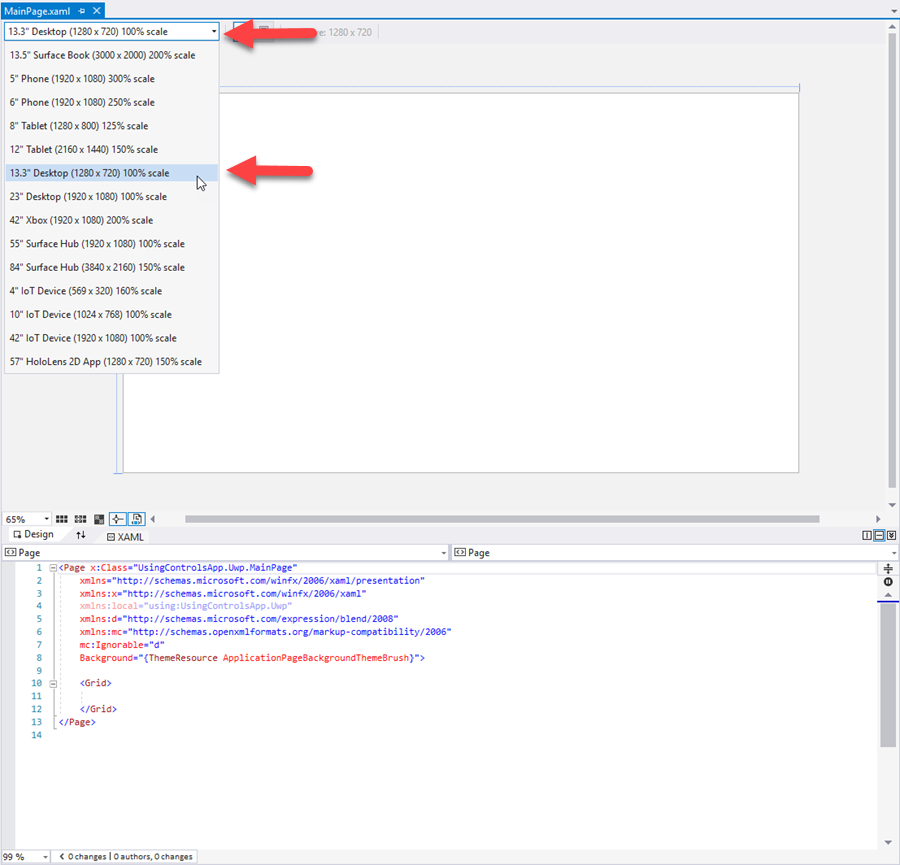


Add a `Rectangle` with a *Blue* **Background** to the `Grid`:


```xml
<Page x:Class="UsingControlsApp.Uwp.MainPage"
    xmlns="http://schemas.microsoft.com/winfx/2006/xaml/presentation"
    xmlns:x="http://schemas.microsoft.com/winfx/2006/xaml"
    xmlns:local="using:UsingControlsApp.Uwp"
    xmlns:d="http://schemas.microsoft.com/expression/blend/2008"
    xmlns:mc="http://schemas.openxmlformats.org/markup-compatibility/2006"
    mc:Ignorable="d"
    Background="{ThemeResource ApplicationPageBackgroundThemeBrush}">

    <Grid>
        <Rectangle Fill="Blue"/>
    </Grid>
</Page>
```

Now you see a blue `Rectangle` in the designer:


The blue `Rectangle` fills the entire `Grid` because the default **HorizontalAlignment** and **VerticalAlignment** of a `Rectangle` is *Stretch*. To constrain it, give the control an explicit **Width** and **Height** value.


Set the **Width** of the `Rectangle` to 200 pixels:

```xml
<Page x:Class="UsingControlsApp.Uwp.MainPage"
    xmlns="http://schemas.microsoft.com/winfx/2006/xaml/presentation"
    xmlns:x="http://schemas.microsoft.com/winfx/2006/xaml"
    xmlns:local="using:UsingControlsApp.Uwp"
    xmlns:d="http://schemas.microsoft.com/expression/blend/2008"
    xmlns:mc="http://schemas.openxmlformats.org/markup-compatibility/2006"
    mc:Ignorable="d"
    Background="{ThemeResource ApplicationPageBackgroundThemeBrush}">

    <Grid>
        <Rectangle Fill="Blue"
                   Width="200"/>
    </Grid>
</Page>
```

Now you see the width of the `Rectangle` constrained to 200 pixels because we defined an explicit value for the **Width**.

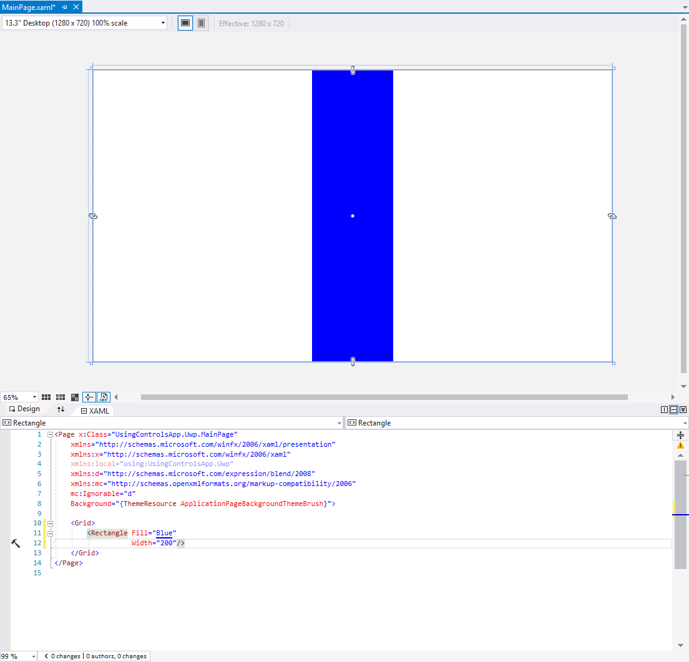


However, the `Rectangle` still fills the space vertically. To constrain it, we can also set the **Height**.

Give the `Rectangle` a **Height** of 200 pixels:

```xml
<Page x:Class="UsingControlsApp.Uwp.MainPage"
    xmlns="http://schemas.microsoft.com/winfx/2006/xaml/presentation"
    xmlns:x="http://schemas.microsoft.com/winfx/2006/xaml"
    xmlns:local="using:UsingControlsApp.Uwp"
    xmlns:d="http://schemas.microsoft.com/expression/blend/2008"
    xmlns:mc="http://schemas.openxmlformats.org/markup-compatibility/2006"
    mc:Ignorable="d"
    Background="{ThemeResource ApplicationPageBackgroundThemeBrush}">

    <Grid>
        <Rectangle Fill="Blue"
                   Width="200"
                   Height="200"/>
    </Grid>
</Page>
```

Now the `Rectangle` is in the middle of the `Grid`.

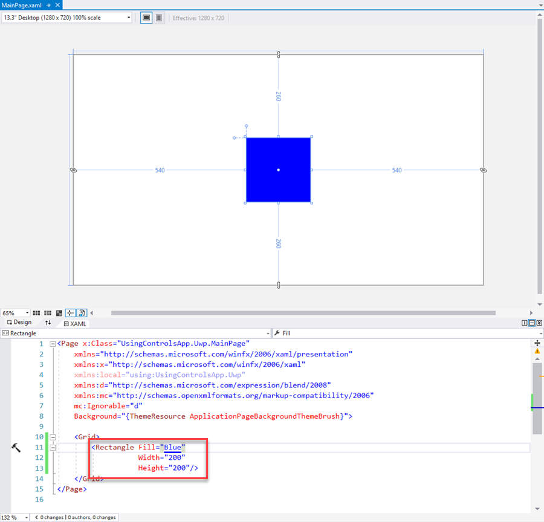

> [!NOTE]
> Zoom the code editor or designer at any time with the zoom level drop-down menu at the bottom-left corner. Or select and hold the Ctrl key and scroll at the same time. Zoom doesn't change the code or app. It's a tool that helps you see your work better. In the previous screenshot, it was 99 percent. But in this one, it's 132 percent.

#### Alignment and margin

The order that you add the elements in code matters. An example is when we put the `Grid` on top of the `Page` in the previous lesson. These things are important to know as you build your UI:
* Why certain elements are placed where they are.
* Why some elements are on top of others.

We need to look not only at the order elements are added in the code but also at the alignment and margin of those elements. Let's visualize these settings with another `Rectangle`.

Add another `Rectangle` with *LightBlue* **Background**. This time, set the **Width** and **Height** to 100 pixels:

```xml
<Page x:Class="UsingControlsApp.Uwp.MainPage"
    xmlns="http://schemas.microsoft.com/winfx/2006/xaml/presentation"
    xmlns:x="http://schemas.microsoft.com/winfx/2006/xaml"
    xmlns:local="using:UsingControlsApp.Uwp"
    xmlns:d="http://schemas.microsoft.com/expression/blend/2008"
    xmlns:mc="http://schemas.openxmlformats.org/markup-compatibility/2006"
    mc:Ignorable="d"
    Background="{ThemeResource ApplicationPageBackgroundThemeBrush}">

    <Grid>
        <Rectangle Fill="Blue"
                   Width="200"
                   Height="200" />

        <Rectangle Fill="LightBlue"
                   Width="100"
                   Height="100" />
    </Grid>
</Page>
```

You see the new `Rectangle` on top of the previous `Rectangle`.


> [!NOTE]
> Remember this important feature of XAML when you build your user interfaces. In a layout control like a `Grid`, the order the controls are defined in the code is the layer order they have in the UI.

In this example, the light blue rectangle covers the darker blue rectangle because the two rectangles are in the middle of the page and overlap. What if they're not directly on top of each other? What if we changed the first `Rectangle`'s **HorizontalAlignment** or **VerticalAlignment**?

Set the first `Rectangle`'s **HorizontalAlignment** to *Left*:

```xml
<Page x:Class="UsingControlsApp.Uwp.MainPage"
    xmlns="http://schemas.microsoft.com/winfx/2006/xaml/presentation"
    xmlns:x="http://schemas.microsoft.com/winfx/2006/xaml"
    xmlns:local="using:UsingControlsApp.Uwp"
    xmlns:d="http://schemas.microsoft.com/expression/blend/2008"
    xmlns:mc="http://schemas.openxmlformats.org/markup-compatibility/2006"
    mc:Ignorable="d"
    Background="{ThemeResource ApplicationPageBackgroundThemeBrush}">

    <Grid>
        <Rectangle Fill="Blue"
                   Width="200"
                   Height="200"
                   HorizontalAlignment="Left"/>

        <Rectangle Fill="LightBlue"
                   Width="100"
                   Height="100" />
    </Grid>
</Page>
```

Now you see the blue `Rectangle` repositioned to the left side of the `Grid`.

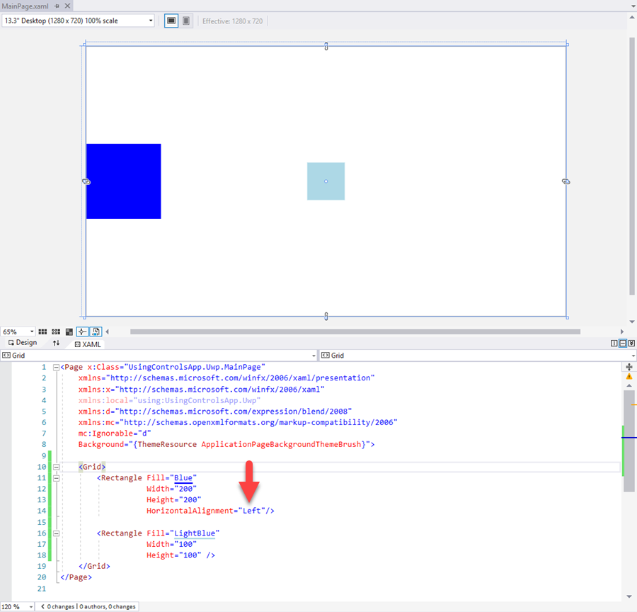

It retains the **Width** and **Height** values. But the **HorizontalAlignment** value is no longer the default *Stretch*.

> [!NOTE]
> **Width** and **Height** are absolute values. They take priority over the default *Stretch* vertical and horizontal alignment.

Now set the `Rectangle`'s **VerticalAlignment** to *Top*:

```xml
<Page x:Class="UsingControlsApp.Uwp.MainPage"
    xmlns="http://schemas.microsoft.com/winfx/2006/xaml/presentation"
    xmlns:x="http://schemas.microsoft.com/winfx/2006/xaml"
    xmlns:local="using:UsingControlsApp.Uwp"
    xmlns:d="http://schemas.microsoft.com/expression/blend/2008"
    xmlns:mc="http://schemas.openxmlformats.org/markup-compatibility/2006"
    mc:Ignorable="d"
    Background="{ThemeResource ApplicationPageBackgroundThemeBrush}">

    <Grid>
        <Rectangle Fill="Blue"
                   Width="200"
                   Height="200"
                   HorizontalAlignment="Left"
                   VerticalAlignment="Top"/>

        <Rectangle Fill="LightBlue"
                   Width="100"
                   Height="100" />
    </Grid>
</Page>
```


Notice that the `Rectangle` moved to the top-left corner.

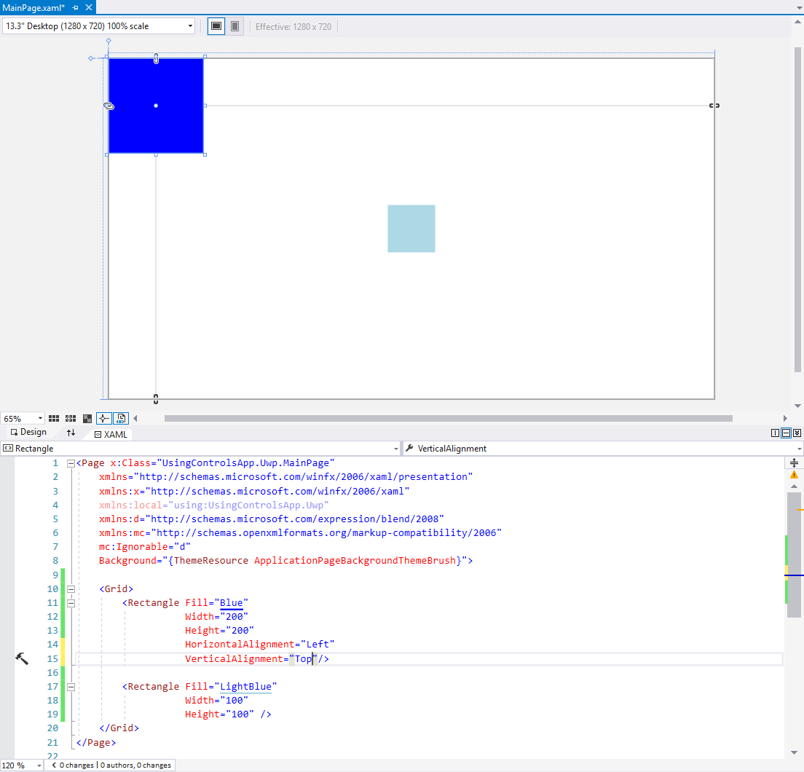


That looks like a tight fit. Let's add some space between the edges of the `Rectangle` and the `Grid`. We add space with the **Margin** property. It's available to all UI elements.

We set the **Margin** by using a *left, top, right, bottom* pattern for the values. Let's give the `Rectangle` a 20-pixel **Margin** on the left and top:

```xml
<Page x:Class="UsingControlsApp.Uwp.MainPage"
    xmlns="http://schemas.microsoft.com/winfx/2006/xaml/presentation"
    xmlns:x="http://schemas.microsoft.com/winfx/2006/xaml"
    xmlns:local="using:UsingControlsApp.Uwp"
    xmlns:d="http://schemas.microsoft.com/expression/blend/2008"
    xmlns:mc="http://schemas.openxmlformats.org/markup-compatibility/2006"
    mc:Ignorable="d"
    Background="{ThemeResource ApplicationPageBackgroundThemeBrush}">

    <Grid>
        <Rectangle Fill="Blue"
                   Width="200"
                   Height="200"
                   HorizontalAlignment="Left"
                   VerticalAlignment="Top"
                   Margin="20,20,0,0"/>

        <Rectangle Fill="LightBlue"
                   Width="100"
                   Height="100" />
    </Grid>
</Page>
```
Now you see 20 pixels of space between the left side and top of the `Rectangle`:


To get the same margin value all around, use a single number like `Margin="20"`. This setting is the same as `Margin="20,20,20,20"`.

**Side task**. The same behavior can be seen against any side. Try setting the **HorizontalAlignment** to *Right* and **VerticalAlignment** to *Bottom*. How would you set the **Margin** to add some space there?

> [!NOTE]
> Some controls have a **Padding** property. The `Grid` is one of them. This property is the same as **Margin**. But the space is added to the **inside edge** instead of the outside edge. Set `<Grid Padding="20">` to see this property in action.


#### The TextBlock

You learned how to use some basic layout properties. Let's apply that knowledge to some new fundamental controls like `TextBlock` and `Button`. These two controls use the properties we covered so far. But they bring some new ones like **Text** and **Content**.

Add a `TextBlock` to the `Grid` and set the **Text** property to *I'm a TextBlock*:

```xml
<Page x:Class="UsingControlsApp.Uwp.MainPage"
    xmlns="http://schemas.microsoft.com/winfx/2006/xaml/presentation"
    xmlns:x="http://schemas.microsoft.com/winfx/2006/xaml"
    xmlns:local="using:UsingControlsApp.Uwp"
    xmlns:d="http://schemas.microsoft.com/expression/blend/2008"
    xmlns:mc="http://schemas.openxmlformats.org/markup-compatibility/2006"
    mc:Ignorable="d"
    Background="{ThemeResource ApplicationPageBackgroundThemeBrush}">

    <Grid>
        <Rectangle Fill="Blue"
                   Width="200"
                   Height="200"
                   HorizontalAlignment="Left"
                   VerticalAlignment="Top"
                   Margin="20,20,0,0"/>

        <Rectangle Fill="LightBlue"
                   Width="100"
                   Height="100" />

        <TextBlock Text="I'm a TextBlock."/>
    </Grid>
</Page>
```

The text appears at the top left of the `Grid`. The default alignment of the entire `TextBlock` container is *Stretch* like the `Rectangles`. But the **text alignment** is top left.


To center the text over the light blue `Rectangle`, change the `TextBlock` **VerticalAlignment** and **HorizontalAlignment** to *Center*:

```xml
<Page x:Class="UsingControlsApp.Uwp.MainPage"
    xmlns="http://schemas.microsoft.com/winfx/2006/xaml/presentation"
    xmlns:x="http://schemas.microsoft.com/winfx/2006/xaml"
    xmlns:local="using:UsingControlsApp.Uwp"
    xmlns:d="http://schemas.microsoft.com/expression/blend/2008"
    xmlns:mc="http://schemas.openxmlformats.org/markup-compatibility/2006"
    mc:Ignorable="d"
    Background="{ThemeResource ApplicationPageBackgroundThemeBrush}">

    <Grid>
        <Rectangle Fill="Blue"
                   Width="200"
                   Height="200"
                   HorizontalAlignment="Left"
                   VerticalAlignment="Top"
                   Margin="20,20,0,0"/>

        <Rectangle Fill="LightBlue"
                   Width="100"
                   Height="100" />

        <TextBlock Text="I'm a TextBlock."
                   VerticalAlignment="Center"
                   HorizontalAlignment="Center"/>
    </Grid>
</Page>
```
Now you see the text centered on the page. But it's on top of the light blue `Rectangle`.

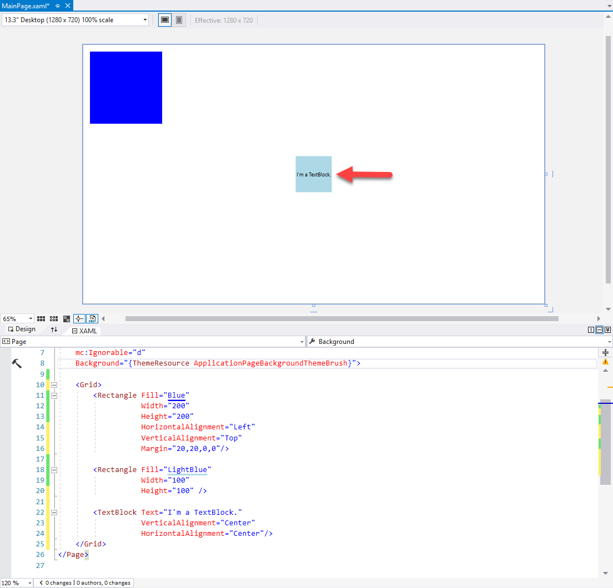

Finally, let's try some `TextBlock` font properties: **FontFamily**, **FontSize**, and **FontWeight**:

```xml
<Page x:Class="UsingControlsApp.Uwp.MainPage"
    xmlns="http://schemas.microsoft.com/winfx/2006/xaml/presentation"
    xmlns:x="http://schemas.microsoft.com/winfx/2006/xaml"
    xmlns:local="using:UsingControlsApp.Uwp"
    xmlns:d="http://schemas.microsoft.com/expression/blend/2008"
    xmlns:mc="http://schemas.openxmlformats.org/markup-compatibility/2006"
    mc:Ignorable="d"
    Background="{ThemeResource ApplicationPageBackgroundThemeBrush}">

    <Grid>
        <Rectangle Fill="Blue"
                   Width="200"
                   Height="200"
                   HorizontalAlignment="Left"
                   VerticalAlignment="Top"
                   Margin="20,20,0,0"/>

        <Rectangle Fill="LightBlue"
                   Width="100"
                   Height="100" />

        <TextBlock Text="I'm a TextBlock."
                   VerticalAlignment="Center"
                   HorizontalAlignment="Center"
                   FontSize="46"
                   FontWeight="Bold"
                   FontFamily="Consolas"/>
    </Grid>
</Page>
```

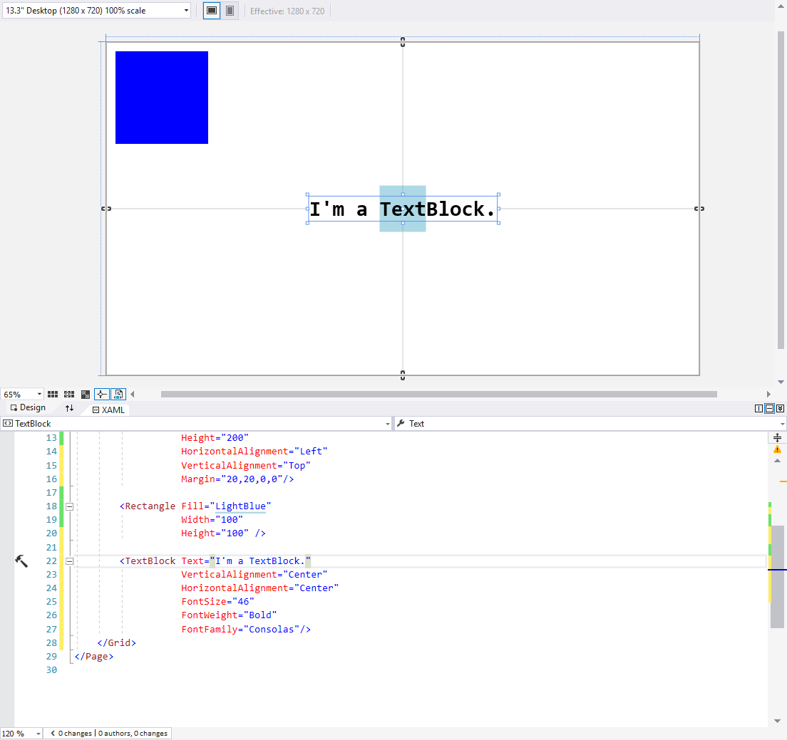

#### The Button

Most controls don't use a **Text** property like the `TextBlock` does. Instead, they use a property called **Content**. You can set any other element as the **Content**. But if you only use text, it displays that text for you.

The `Button` is this type of control. To set the text that's in the `Button`, you set the **Content** property. Let's try an example.

Add a `Button` to the `Grid` and set the **Content** to *I'm a button*:

```xml
<Page x:Class="UsingControlsApp.Uwp.MainPage"
    xmlns="http://schemas.microsoft.com/winfx/2006/xaml/presentation"
    xmlns:x="http://schemas.microsoft.com/winfx/2006/xaml"
    xmlns:local="using:UsingControlsApp.Uwp"
    xmlns:d="http://schemas.microsoft.com/expression/blend/2008"
    xmlns:mc="http://schemas.openxmlformats.org/markup-compatibility/2006"
    mc:Ignorable="d"
    Background="{ThemeResource ApplicationPageBackgroundThemeBrush}">

    <Grid>
        <Rectangle Fill="Blue"
                   Width="200"
                   Height="200"
                   HorizontalAlignment="Left"
                   VerticalAlignment="Top"
                   Margin="20,20,0,0"/>

        <Rectangle Fill="LightBlue"
                   Width="100"
                   Height="100" />

        <TextBlock Text="I'm a TextBlock."
                   VerticalAlignment="Center"
                   HorizontalAlignment="Center"
                   FontSize="46"
                   FontWeight="Bold"
                   FontFamily="Consolas"/>

        <Button Content="I'm a Button."/>
    </Grid>
</Page>
```

Now you see the following image:

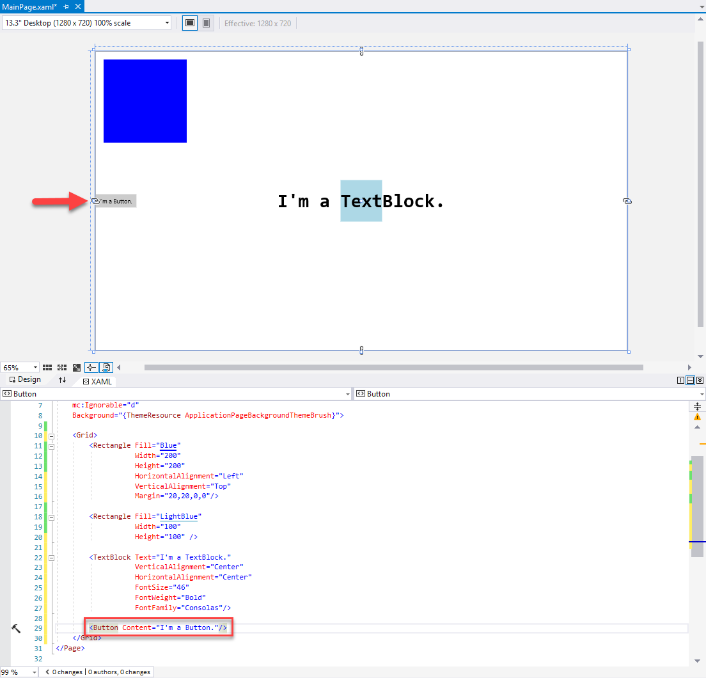

> [!NOTE]
> Something's different in the `Button` than in the `Rectangle` or `TextBlock`. The default **HorizontalAlignment** is *Left*, and **VerticalAlignment** is *Center*. When you try new controls, keep in mind that not all of them have the same default property values.


Let's wrap up this lesson by combining everything you learned to adjust the `Button`. Set the following `Button` properties:

- **HorizontalAlignment** to *Center*
- **VerticalAlignment** to *Bottom*
- **Margin** to *20*
- **FontSize** to *36*
- **FontWeight** to *SemiBold*
- **FontFamily** to *Arial*

```xml
<Page x:Class="UsingControlsApp.Uwp.MainPage"
    xmlns="http://schemas.microsoft.com/winfx/2006/xaml/presentation"
    xmlns:x="http://schemas.microsoft.com/winfx/2006/xaml"
    xmlns:local="using:UsingControlsApp.Uwp"
    xmlns:d="http://schemas.microsoft.com/expression/blend/2008"
    xmlns:mc="http://schemas.openxmlformats.org/markup-compatibility/2006"
    mc:Ignorable="d"
    Background="{ThemeResource ApplicationPageBackgroundThemeBrush}">

    <Grid>
        <Rectangle Fill="Blue"
                   Width="200"
                   Height="200"
                   HorizontalAlignment="Left"
                   VerticalAlignment="Top"
                   Margin="20,20,0,0"/>

        <Rectangle Fill="LightBlue"
                   Width="100"
                   Height="100" />

        <TextBlock Text="I'm a TextBlock."
                   VerticalAlignment="Center"
                   HorizontalAlignment="Center"
                   FontSize="46"
                   FontWeight="Bold"
                   FontFamily="Consolas"/>

        <Button Content="I'm a Button."
                HorizontalAlignment="Center"
                VerticalAlignment="Bottom"
                Margin="20"
                FontSize="36"
                FontWeight="SemiBold"
                FontFamily="Arial"/>
    </Grid>
</Page>
```

Now you see the `Button` at the bottom center with the assigned font properties.


You've got the fundamentals of some basic layouts and adding controls to the UI. Now let's use these elements to accept user input. From button selections to accepting text input, the next lesson speeds things up as we build a functional application.

::: zone-end

::: zone pivot="wpf"


#### Create a new project

With Visual Studio open, create a WPF C# project. Give the project a meaningful name for this lesson. An example is **UsingControlsApp.Wpf**.

:::image type="content" source="../media/1-create-new-project-wpf.png" alt-text="Screenshot that shows the Configure your new project window with red boxes around the WPF Application project type, the Project name text box, and the Next button.":::

#### Understand size

In the previous unit, we used the `Rectangle` to demonstrate some features of how a `Grid` lays out rows and column. This time, we work directly with the `Rectangle` to demonstrate some of the basic properties shared by most UI elements:

- **Width** and **Height**
- **Margin** and **Padding**
- **VerticalAlignment** and **HorizontalAlignment**

These properties work the same way for all controls. So understanding the simple `Rectangle` means you can apply this knowledge to other controls.

Open **MainWindow.xaml** if it's not already open. Add a `Rectangle` with a *Blue* **Background** to the `Grid`:

```xml
<Window x:Class="UsingControlsApp.MainWindow"
        xmlns="http://schemas.microsoft.com/winfx/2006/xaml/presentation"
        xmlns:x="http://schemas.microsoft.com/winfx/2006/xaml"
        xmlns:d="http://schemas.microsoft.com/expression/blend/2008"
        xmlns:mc="http://schemas.openxmlformats.org/markup-compatibility/2006"
        xmlns:local="clr-namespace:UsingControlsApp"
        mc:Ignorable="d"
        Title="MainWindow" Height="450" Width="800">
    <Grid>
        <Rectangle Fill="Blue" />
    </Grid>
</Window>
```

Now you see the following image in the designer:

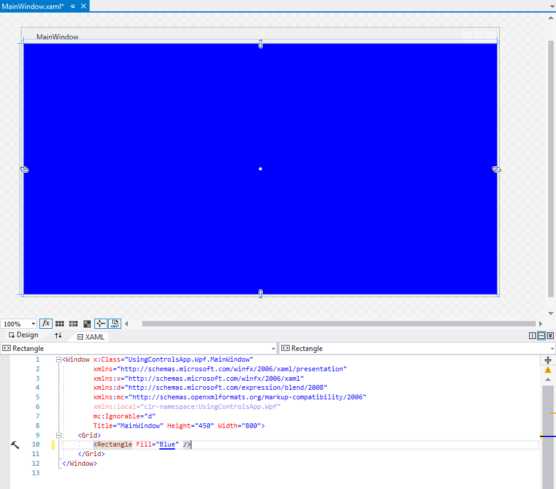

The blue `Rectangle` fills the entire `Grid` because the default **HorizontalAlignment** and **VerticalAlignment** of a `Rectangle` is *Stretch*. To constrain the `Rectangle`, give the control an explicit **Width** and **Height** value.

Let's start by setting the **Width** of the `Rectangle` to 200 pixels:

```xml
<Window x:Class="UsingControlsApp.MainWindow"
        xmlns="http://schemas.microsoft.com/winfx/2006/xaml/presentation"
        xmlns:x="http://schemas.microsoft.com/winfx/2006/xaml"
        xmlns:d="http://schemas.microsoft.com/expression/blend/2008"
        xmlns:mc="http://schemas.openxmlformats.org/markup-compatibility/2006"
        xmlns:local="clr-namespace:UsingControlsApp"
        mc:Ignorable="d"
        Title="MainWindow" Height="450" Width="800">
    <Grid>
        <Rectangle Fill="Blue"
                   Width="200" />
    </Grid>
</Window>
```

The width of the `Rectangle` is constrained to 200 pixels because we defined an explicit value for the **Width**.

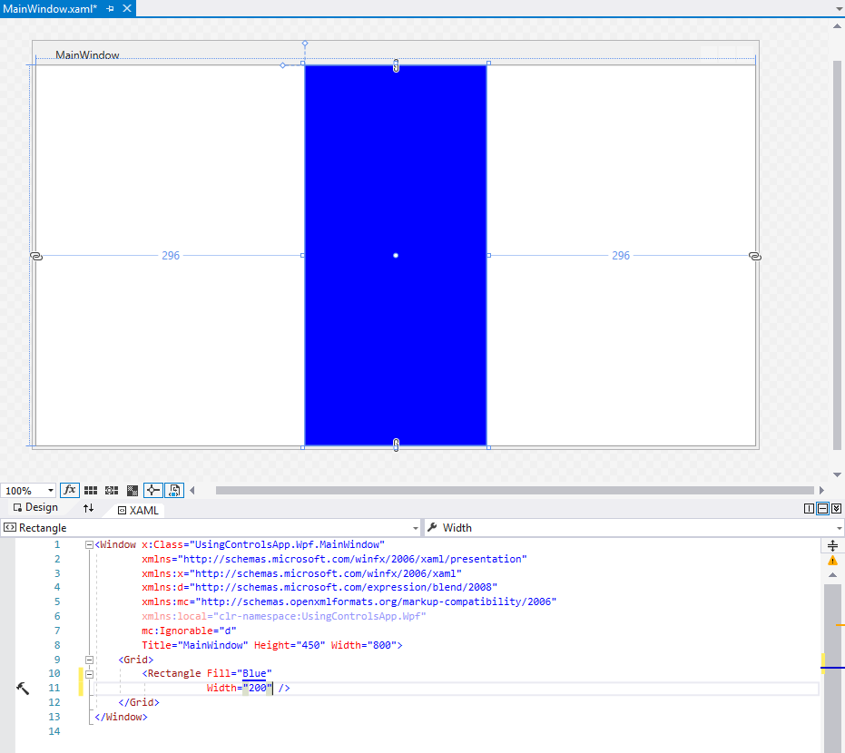

The `Rectangle` still fills the space vertically. To constrain it, set the **Height**.

Give the `Rectangle` a **Height** of 200 pixels:

```xml
<Window x:Class="UsingControlsApp.MainWindow"
        xmlns="http://schemas.microsoft.com/winfx/2006/xaml/presentation"
        xmlns:x="http://schemas.microsoft.com/winfx/2006/xaml"
        xmlns:d="http://schemas.microsoft.com/expression/blend/2008"
        xmlns:mc="http://schemas.openxmlformats.org/markup-compatibility/2006"
        xmlns:local="clr-namespace:UsingControlsApp"
        mc:Ignorable="d"
        Title="MainWindow" Height="450" Width="800">
    <Grid>
        <Rectangle Fill="Blue"
                   Width="200"
                   Height="200" />
    </Grid>
</Window>
```

Now the `Rectangle` is in the middle of the `Grid`.

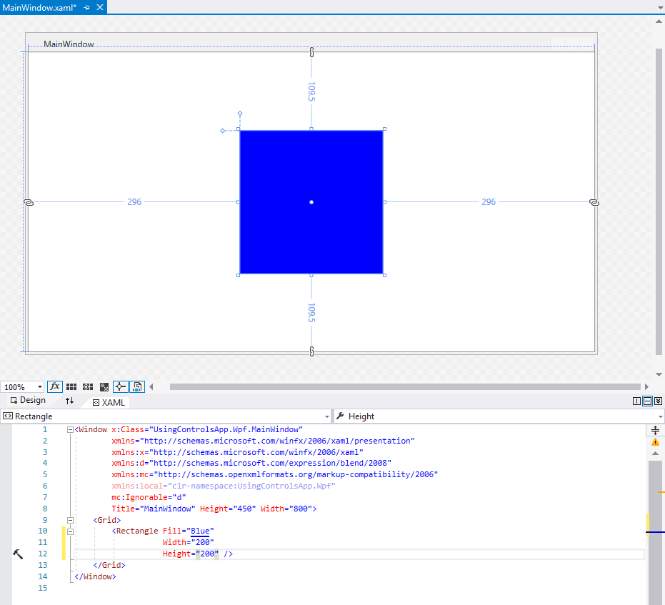

> [!NOTE]
> Zoom the code editor or designer at any time with the zoom level drop-down menu at the bottom-left corner. Or select and hold the Ctrl key and scroll at the same time. Zoom doesn't change the code or app. It's a tool that helps you see your work better. In the previous screenshot, it was 99 percent. In this one, it's 132 percent.

#### Alignment and margin

The order that you add the elements in code matters. An example is when we put the `Grid` on top of the `Page`. These things are important to know as you build your UI:

- Why certain elements are placed where they are.
- Why some elements are on top of others.

We need to look not only at the order elements are added in the code but also at the alignment and margin of those elements. Let's visualize these settings with another `Rectangle`.

Add another `Rectangle` with *LightBlue* **Background**. But this time, set the **Width** and **Height** to 100 pixels:

```xml
<Window x:Class="UsingControlsApp.MainWindow"
        xmlns="http://schemas.microsoft.com/winfx/2006/xaml/presentation"
        xmlns:x="http://schemas.microsoft.com/winfx/2006/xaml"
        xmlns:d="http://schemas.microsoft.com/expression/blend/2008"
        xmlns:mc="http://schemas.openxmlformats.org/markup-compatibility/2006"
        xmlns:local="clr-namespace:UsingControlsApp"
        mc:Ignorable="d"
        Title="MainWindow" Height="450" Width="800">
    <Grid>
        <Rectangle Fill="Blue"
                   Width="200"
                   Height="200" />

        <Rectangle Fill="LightBlue"
                   Width="100"
                   Height="100" />
    </Grid>
</Window>
```

Now you see the new `Rectangle` on top of the previous `Rectangle`.


> [!NOTE]
> Remember this important feature of XAML when you build your user interfaces. In a layout control like a `Grid`, the order the controls are defined in the code is the layer order they have in the UI.

In this example, the light blue rectangle covers the darker blue rectangle because the two rectangles are in the middle of the page and overlap. What if they're not directly on top of each other? What if we changed the first `Rectangle`'s **HorizontalAlignment** or **VerticalAlignment**?

Set the first `Rectangle`'s **HorizontalAlignment** to *Left*:

```xml
<Window x:Class="UsingControlsApp.MainWindow"
        xmlns="http://schemas.microsoft.com/winfx/2006/xaml/presentation"
        xmlns:x="http://schemas.microsoft.com/winfx/2006/xaml"
        xmlns:d="http://schemas.microsoft.com/expression/blend/2008"
        xmlns:mc="http://schemas.openxmlformats.org/markup-compatibility/2006"
        xmlns:local="clr-namespace:UsingControlsApp"
        mc:Ignorable="d"
        Title="MainWindow" Height="450" Width="800">
    <Grid>
        <Rectangle Fill="Blue"
                   Width="200"
                   Height="200"
                   HorizontalAlignment="Left" />

        <Rectangle Fill="LightBlue"
                   Width="100"
                   Height="100" />
    </Grid>
</Window>
```

Now you see the blue `Rectangle` repositioned to the left side of the `Grid`.

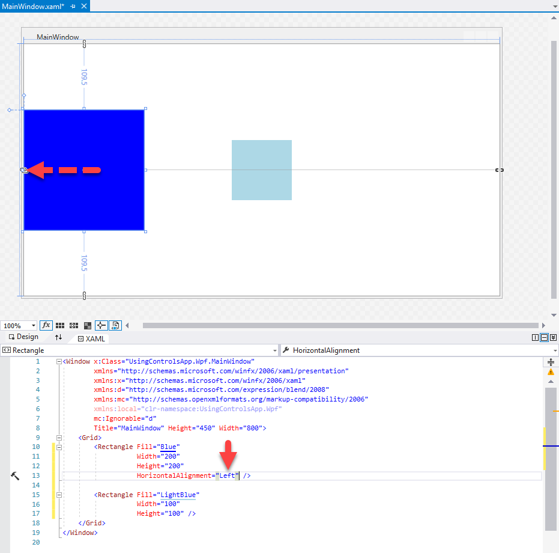

It retains the **Width** and **Height** values. But the **HorizontalAlignment** value is no longer the default *Stretch*.

> [!NOTE]
> **Width** and **Height** are absolute values. They take priority over the default *Stretch* vertical and horizontal alignment.

Now set the `Rectangle`'s **VerticalAlignment** to *Top*:

```xml
<Window x:Class="UsingControlsApp.MainWindow"
        xmlns="http://schemas.microsoft.com/winfx/2006/xaml/presentation"
        xmlns:x="http://schemas.microsoft.com/winfx/2006/xaml"
        xmlns:d="http://schemas.microsoft.com/expression/blend/2008"
        xmlns:mc="http://schemas.openxmlformats.org/markup-compatibility/2006"
        xmlns:local="clr-namespace:UsingControlsApp"
        mc:Ignorable="d"
        Title="MainWindow" Height="450" Width="800">
    <Grid>
        <Rectangle Fill="Blue"
                   Width="200"
                   Height="200"
                   HorizontalAlignment="Left"
                   VerticalAlignment="Top" />

        <Rectangle Fill="LightBlue"
                   Width="100"
                   Height="100" />
    </Grid>
</Window>
```

Notice that the `Rectangle` moved to the top-left corner.

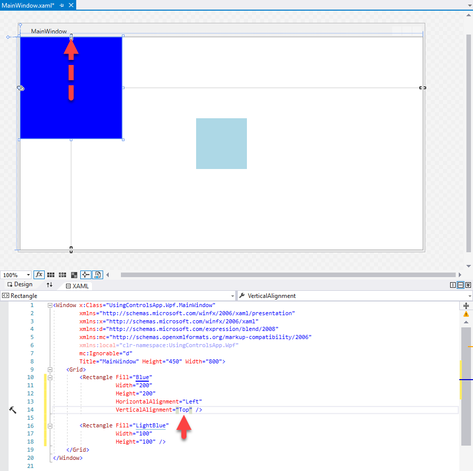

That looks like a tight fit. Let's add some space between the edges of the `Rectangle` and the `Grid`. We add space with the **Margin** property, which is available to all UI elements.

When you set **Margin**, you use a *left, top, right, bottom* pattern for the values. Give the `Rectangle` a 20-pixel **Margin** on the left and the top:

```xml
<Window x:Class="UsingControlsApp.MainWindow"
        xmlns="http://schemas.microsoft.com/winfx/2006/xaml/presentation"
        xmlns:x="http://schemas.microsoft.com/winfx/2006/xaml"
        xmlns:d="http://schemas.microsoft.com/expression/blend/2008"
        xmlns:mc="http://schemas.openxmlformats.org/markup-compatibility/2006"
        xmlns:local="clr-namespace:UsingControlsApp"
        mc:Ignorable="d"
        Title="MainWindow" Height="450" Width="800">
    <Grid>
        <Rectangle Fill="Blue"
                   Width="200"
                   Height="200"
                   HorizontalAlignment="Left"
                   VerticalAlignment="Top"
                   Margin="20,20,0,0" />

        <Rectangle Fill="LightBlue"
                   Width="100"
                   Height="100" />
    </Grid>
</Window>
```

Now you see 20 pixels of space between the left side and top of the `Rectangle`.


To get the same margin value all around, use a single number like `Margin="20"`. This setting is the same as `Margin="20,20,20,20"`.

**Side task**. The same behavior can be seen against any side. Try setting the **HorizontalAlignment** to *Right* and **VerticalAlignment** to *Bottom*. How would you set the **Margin** to add some space there?

> [!NOTE]
> Some controls have a **Padding** property. The `Grid` is one of them. This property is the same as **Margin**. But the space is added to the **inside edge** instead of the outside edge. Set `<Grid Padding="20">` to see this property in action.

#### The TextBlock

You learned how to use some basic layout properties. Now let's apply that knowledge to some new fundamental controls like `TextBlock` and `Button`. These two controls use the properties we covered so far. But they bring some new ones like **Text** and **Content**.

Add a `TextBlock` to the `Grid` and set the **Text** property to *I'm a TextBlock*:

```xml
<Window x:Class="UsingControlsApp.MainWindow"
        xmlns="http://schemas.microsoft.com/winfx/2006/xaml/presentation"
        xmlns:x="http://schemas.microsoft.com/winfx/2006/xaml"
        xmlns:d="http://schemas.microsoft.com/expression/blend/2008"
        xmlns:mc="http://schemas.openxmlformats.org/markup-compatibility/2006"
        xmlns:local="clr-namespace:UsingControlsApp"
        mc:Ignorable="d"
        Title="MainWindow" Height="450" Width="800">
    <Grid>
        <Rectangle Fill="Blue"
                   Width="200"
                   Height="200"
                   HorizontalAlignment="Left"
                   VerticalAlignment="Top"
                   Margin="20,20,0,0" />

        <Rectangle Fill="LightBlue"
                   Width="100"
                   Height="100" />

        <TextBlock Text="I'm a TextBlock." />
    </Grid>
</Window>
```

Now you see the text at the top left of the `Grid`. The default alignment of the entire `TextBlock` container is *Stretch*, like the rectangles. But the **text alignment** is top left.

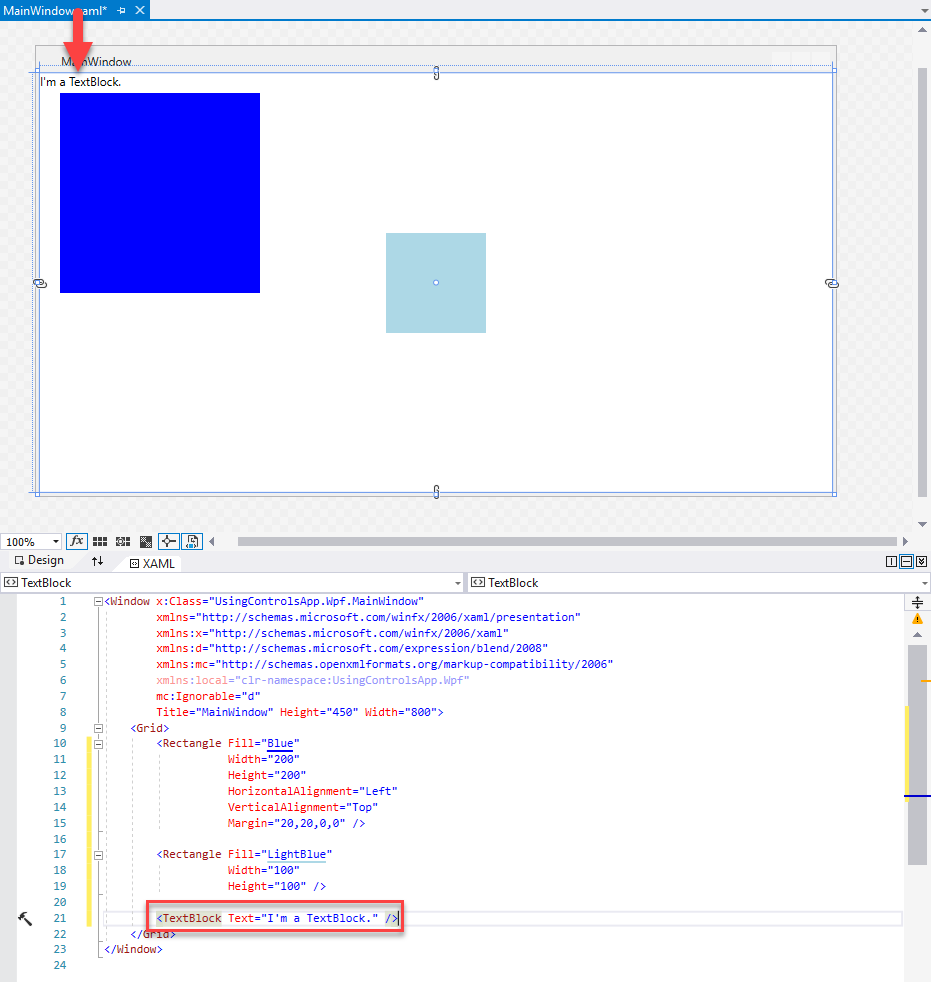

To center the text over the light blue `Rectangle`, change the `TextBlock` **VerticalAlignment** and **HorizontalAlignment** to *Center*:

```xml
<Window x:Class="UsingControlsApp.MainWindow"
        xmlns="http://schemas.microsoft.com/winfx/2006/xaml/presentation"
        xmlns:x="http://schemas.microsoft.com/winfx/2006/xaml"
        xmlns:d="http://schemas.microsoft.com/expression/blend/2008"
        xmlns:mc="http://schemas.openxmlformats.org/markup-compatibility/2006"
        xmlns:local="clr-namespace:UsingControlsApp"
        mc:Ignorable="d"
        Title="MainWindow" Height="450" Width="800">
    <Grid>
        <Rectangle Fill="Blue"
                   Width="200"
                   Height="200"
                   HorizontalAlignment="Left"
                   VerticalAlignment="Top"
                   Margin="20,20,0,0" />

        <Rectangle Fill="LightBlue"
                   Width="100"
                   Height="100" />

        <TextBlock Text="I'm a TextBlock."
                   VerticalAlignment="Center"
                   HorizontalAlignment="Center" />
    </Grid>
</Window>
```

Now you see the text centered on the page. But it's on top of the light blue `Rectangle`.

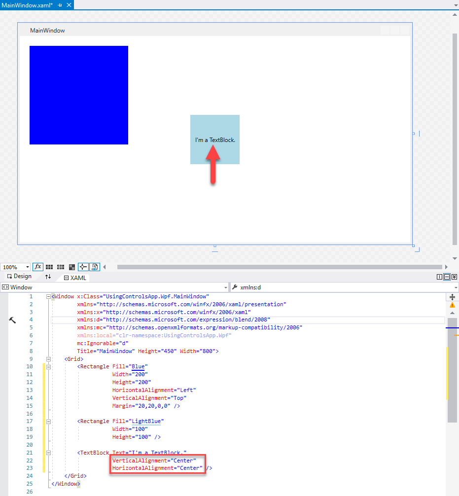

Finally, let's try some `TextBlock` font properties: **FontFamily**, **FontSize**, and **FontWeight**:

```xml
<Window x:Class="UsingControlsApp.MainWindow"
        xmlns="http://schemas.microsoft.com/winfx/2006/xaml/presentation"
        xmlns:x="http://schemas.microsoft.com/winfx/2006/xaml"
        xmlns:d="http://schemas.microsoft.com/expression/blend/2008"
        xmlns:mc="http://schemas.openxmlformats.org/markup-compatibility/2006"
        xmlns:local="clr-namespace:UsingControlsApp"
        mc:Ignorable="d"
        Title="MainWindow" Height="450" Width="800">
    <Grid>
        <Rectangle Fill="Blue"
                   Width="200"
                   Height="200"
                   HorizontalAlignment="Left"
                   VerticalAlignment="Top"
                   Margin="20,20,0,0" />

        <Rectangle Fill="LightBlue"
                   Width="100"
                   Height="100" />

        <TextBlock Text="I'm a TextBlock."
                   VerticalAlignment="Center"
                   HorizontalAlignment="Center"
                   FontSize="46"
                   FontWeight="Bold"
                   FontFamily="Consolas" />
    </Grid>
</Window>
```

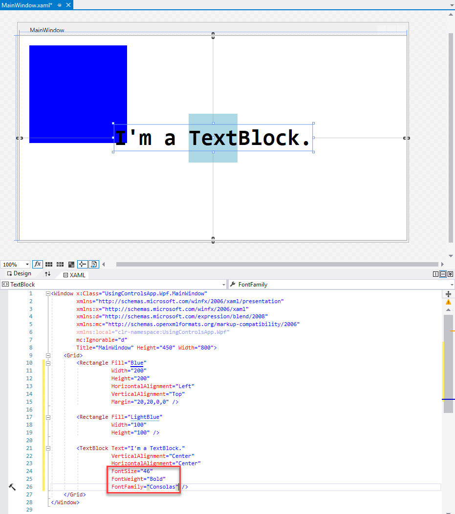

#### The Button

Most controls don't use a **Text** property like the `TextBlock` does. Instead, they use a property named **Content**. You can set any other element as the **Content**. But if you only use text, it displays that text for you.

The `Button` is this type of control. To set the text that's in the `Button`, you set the **Content** property. Let's try an example.

Add a `Button` to the `Grid` and set the **Content** to *I'm a button*:

```xml
<Window x:Class="UsingControlsApp.MainWindow"
        xmlns="http://schemas.microsoft.com/winfx/2006/xaml/presentation"
        xmlns:x="http://schemas.microsoft.com/winfx/2006/xaml"
        xmlns:d="http://schemas.microsoft.com/expression/blend/2008"
        xmlns:mc="http://schemas.openxmlformats.org/markup-compatibility/2006"
        xmlns:local="clr-namespace:UsingControlsApp"
        mc:Ignorable="d"
        Title="MainWindow" Height="450" Width="800">
    <Grid>
        <Rectangle Fill="Blue"
                   Width="200"
                   Height="200"
                   HorizontalAlignment="Left"
                   VerticalAlignment="Top"
                   Margin="20,20,0,0" />

        <Rectangle Fill="LightBlue"
                   Width="100"
                   Height="100" />

        <TextBlock Text="I'm a TextBlock."
                   VerticalAlignment="Center"
                   HorizontalAlignment="Center"
                   FontSize="46"
                   FontWeight="Bold"
                   FontFamily="Consolas" />

        <Button Content="I'm a Button." />
    </Grid>
</Window>
```

Now you see the following image:


Why can't you see the `Rectangle` or `TextBlock` anymore? Remember that the order you define for the children of the `Grid` determines the visual order they're layered in. Just as the `TextBlock` is on top of the `Rectangle`, the `Button` is on top of everything else.

> [!NOTE]
> In WPF, the `Button`'s default **HorizontalAlignment** is *Stretch*, and **VerticalAlignment** is *Stretch*. To change these values, set an explicit value for **Width** and **Height** or change the default alignment values. When you try new controls, keep in mind that not all of them have the same default property values.

Let's wrap up this lesson by **combining everything you learned** to adjust the `Button`. Set the following `Button` properties:

- **HorizontalAlignment** to *Center*
- **VerticalAlignment** to *Bottom*
- **Margin** to *20*
- **FontSize** to *36*
- **FontWeight** to *SemiBold*
- **FontFamily** to *Arial*

```xml
<Window x:Class="UsingControlsApp.MainWindow"
        xmlns="http://schemas.microsoft.com/winfx/2006/xaml/presentation"
        xmlns:x="http://schemas.microsoft.com/winfx/2006/xaml"
        xmlns:d="http://schemas.microsoft.com/expression/blend/2008"
        xmlns:mc="http://schemas.openxmlformats.org/markup-compatibility/2006"
        xmlns:local="clr-namespace:UsingControlsApp"
        mc:Ignorable="d"
        Title="MainWindow" Height="450" Width="800">
    <Grid>
        <Rectangle Fill="Blue"
                   Width="200"
                   Height="200"
                   HorizontalAlignment="Left"
                   VerticalAlignment="Top"
                   Margin="20,20,0,0" />

        <Rectangle Fill="LightBlue"
                   Width="100"
                   Height="100" />

        <TextBlock Text="I'm a TextBlock."
                   VerticalAlignment="Center"
                   HorizontalAlignment="Center"
                   FontSize="46"
                   FontWeight="Bold"
                   FontFamily="Consolas" />

        <Button Content="I'm a Button."
                HorizontalAlignment="Center"
                VerticalAlignment="Bottom"
                Margin="20"
                FontSize="36"
                FontWeight="SemiBold"
                FontFamily="Arial" />
    </Grid>
</Window>
```

Now you see the `Button` at the bottom center with the assigned font properties.


You've got the fundamentals of some basic layouts and adding controls to the UI. Now let's use these elements to accept user input. From button selections to accepting text input, the next lesson speeds things up as we build a functional application.

::: zone-end

### Summary

In this unit, you learned how to begin using controls in desktop applications. You can see that UWP and WPF share many features:

- The same type of controls.
- The same markup and coding languages.

You can reuse most of what you learned and see which platform you'd rather use.
