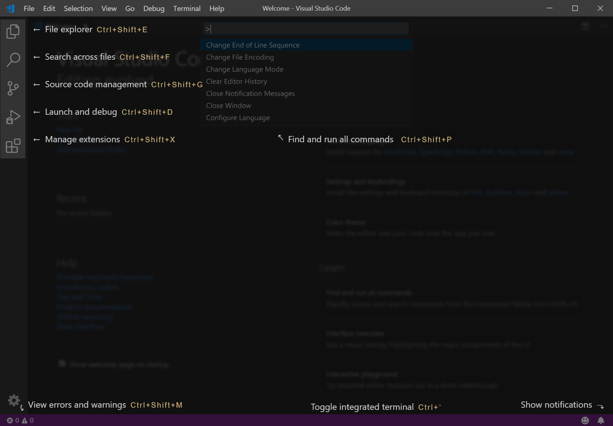

To begin, let's download and install Visual Studio Code locally, then take a short tour of the user interface (UI) and features. We recommend you perform these steps on your own installation, but you can read through the **Tour** section without following along if you prefer.

## Download

Browse to [https://code.visualstudio.com](https://code.visualstudio.com) and select the stable build for your platform. The Insiders Edition is like using a beta test version of the next update, but isn't applicable for this learning module. If you don't see your specific platform, select [Other downloads](https://code.visualstudio.com/#alt-downloads) to see all currently supported builds.

## Install

During installation, be sure to check out the options presented and select any opt-in features you'd like. These options are mostly for convenience and personal preference, so you can accept the defaults to simplify your installation. The following image shows the Windows options and their defaults.

Take a moment on first run to check for available updates. On Windows, updates can be done using the **Help** pulldown menu and selecting **Check for Updates**. This option may appear in other pulldown menu locations on other platforms.

## Tour

Let's take a look at a few key features of the user interface, and a short tour of Visual Studio Code's core functionality. When you first run Visual Studio Code, you should see a "Welcome" page similar to the following screenshot. If you don't see the Welcome page, you can access it using the **Help > Welcome** dropdown menu item.

:::image type="content" source="../media/2-visual-studio-code-welcome.png" alt-text="Screenshot that shows the Visual Studio Code Welcome screen after the initial installation." lightbox="../media/2-visual-studio-code-welcome.png":::

### User interface

The first thing you probably notice is how simple the interface seems to be. This simplicity is intentional, but hides the true power of this editor. For now, familiarize yourself with the main UI components.

One UI function you're likely to find valuable is the Command Palette, which is F1 on any platform, Ctrl + Shift + P on Windows, and is listed under the **View** dropdown menu. It's a great starting place if you have an idea of what you'd like to do in Visual Studio Code, but can't recall exactly how to do it.

:::image type="content" source="../media/2-visual-studio-code-command-palette.png" alt-text="Screenshot that shows Visual Studio Code with the command palette open." lightbox="../media/2-visual-studio-code-command-palette.png":::

By default, the Command Palette comes up in Command mode, signified by the `>` prompt. This mode includes most Visual Studio Code functionality, including finding keyboard shortcuts. But there's far more available here. For a list, press F1 + backspace to remove the command prompt `>` and type a question mark `?`. Take a moment to explore these modes if you'd like.

### Color themes

Changing the look of your editor is important to most of us. Visual Studio Code makes it easy with Themes. On the Welcome page, select **Color theme** under **Customize** and you see something like the following screenshot:

:::image type="content" source="../media/2-visual-studio-code-color-themes-2023.png" alt-text="Screenshot that shows Visual Studio Code with the Color theme options displayed." lightbox="../media/2-visual-studio-code-color-themes-2023.png":::

> [!NOTE]
> You can also get to this list in other ways, such as the Command palette, pulldown menus, and keyboard shortcuts.

Take this opportunity to try our different color themes. If the default themes aren't satisfying for you, there are many extensions to bring even more visual functionality into the UI.

### Tools and extensions

Select **Tools and languages** under **Customize** and see the left pane expand to show the current list of available extensions, similar to what you see in the next screenshot. You can also use the **View** menu and select **Extensions**. The first option adds the filter `@category:"programming languages"` to the extensions list, to show only extensions in that category. You can edit this filter yourself, or clear it with the **Clear Extensions Input** button.

:::image type="content" source="../media/2-visual-studio-code-extensions.png" alt-text="Screenshot that shows the Extensions menu selected in Visual Studio Code.":::

We're not installing any of these extensions right now, but take a moment to scroll through the list to get an idea of the various options. We'll discuss extensions in more depth in the next unit.
