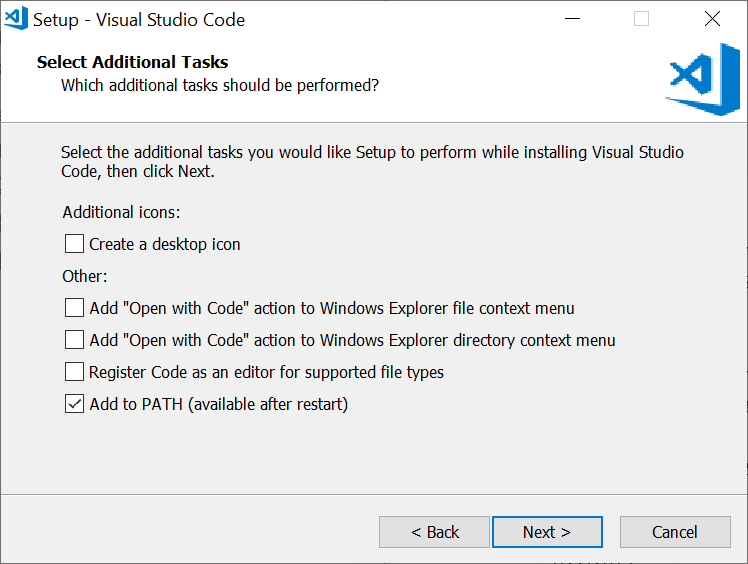
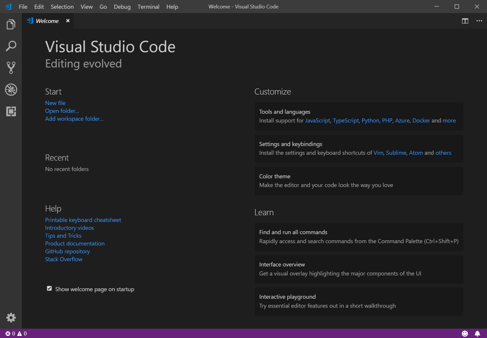
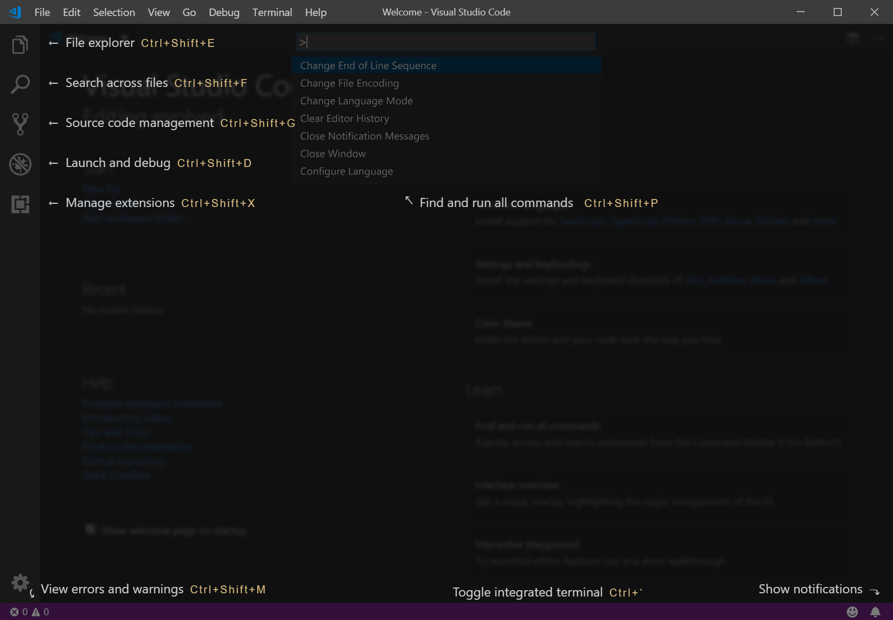
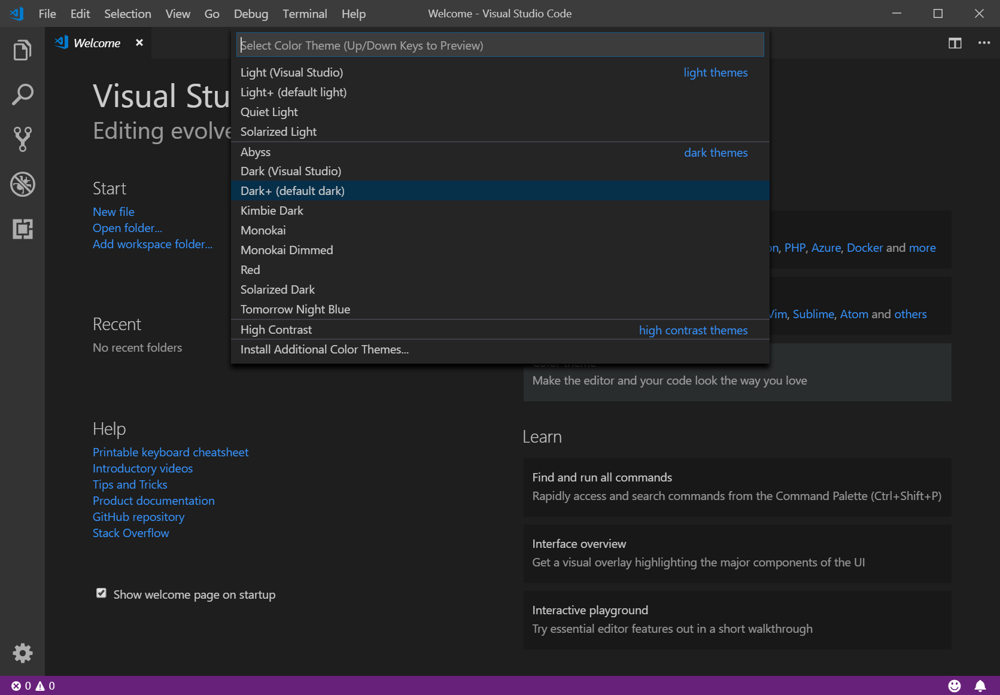
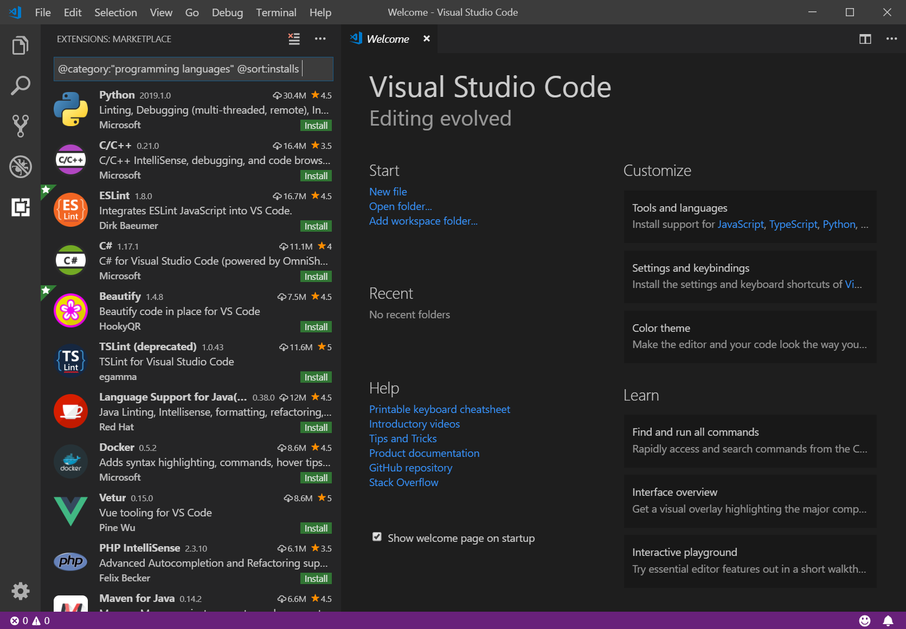

To begin, let's download and install VS Code locally, then take a short tour of the user interface (UI) and features. We recommend you perform these steps on your own installation, but you can read through the **Tour** section without following along if you prefer.

## Download

Browse to [https://code.visualstudio.com](https://code.visualstudio.com) and select the stable build for your platform. The Insiders Edition is like using a beta test version of the next update, but is not applicable for this learning module. If you don't see your specific platform, select [Other downloads](https://code.visualstudio.com/#alt-downloads) to see all currently supported builds.

## Install

During installation, be sure to check out the options presented and select any opt-in features you'd like. These options are mostly for convenience and personal preference, so you can accept the defaults to simplify your installation. Below are the Windows options and their defaults.

Take a moment on first run to check for available updates. On Windows, this can be easily done using the **Help** pulldown menu and selecting **Check for Updates**. This option may appear in other pulldown menu locations on other platforms.

## Tour

Let's take a look at a few key features of the user interface, and a short tour of VS Code's core functionality. When you first run VS Code, you should see a "Welcome" page similar to the screenshot below. If you don't see the Welcome page, you can access it using the **Help > Welcome** dropdown menu item.

### User interface

The first thing you'll probably notice is how simple the interface seems to be. This is intentional, but hides the true power of this editor. For now, familiarize yourself with the main UI components.

One UI function you are likely to find quite valuable is the Command Palette (F1 on any platform, Ctrl + Shift + P on Windows, and listed under the **View** dropdown menu). It's a great starting place if you have an idea what you'd like to do in VS Code, but can't recall exactly how to do it.

By default, the Command Palette comes up in Command mode, signified by the `>` prompt. This mode includes most VS Code functionality, including finding keyboard shortcuts. But there's far more available here. For a list, press F1 + backspace to remove the command prompt (`>`) and type a question mark (`?`). Take a moment to explore these modes if you'd like.

### Color themes

Changing the look of your editor is a big deal to most of us. VS Code makes it easy with Themes. On the Welcome page, select **Color theme** under **Customize** and you'll see something like the following.

> [!NOTE]
> You can also get to this list in other ways, such as the Command palette, pulldown menus, and keyboard shortcuts.

Take this opportunity to try our different color themes. If the default themes aren't satisfying for you, there are many extensions to bring even more visual functionality into the UI.

### Tools and extensions

Click on the **Tools and languages** topic under **Customize** and you'll see the left pane expand to show the current list of available extensions, similar to what you see below. You can also use the **View** menu and select **Extensions**. Note that the first option adds the filter `@category:"programming languages"` to the extensions list, to show only extensions in that category. You can edit this filter yourself, or clear it with the **Clear Extensions Input** button (highlighted in the screenshot below).

We won't install any of these right now, but feel free to take a moment to scroll through the list to get an idea of the varied options available. We'll discuss extensions in more depth in the next unit.