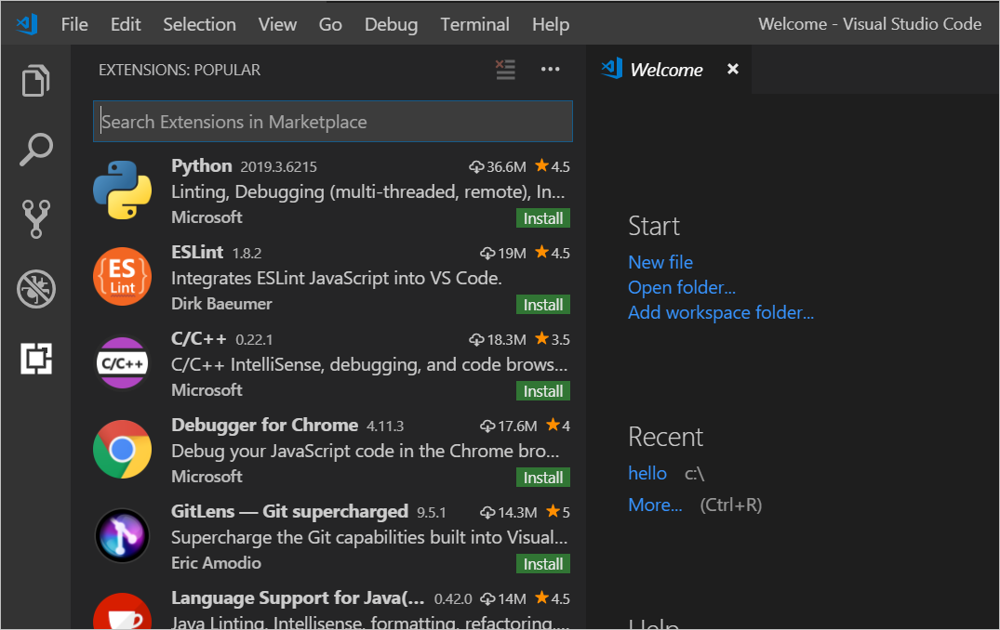

In this unit, you'll learn how easy it is to locate and install Visual Studio Code (VS Code) extensions. As seen previously, VS Code installs with many built-in extensions, but it does not come bundled with support for every development language and environment. By using the Extensions Marketplace, you can locate the tools, languages, and debuggers you need for your particular workflow and personal preference. Additionally, there are many extensions that add to the powerful features of VS Code for even greater customization and control, efficiency, and maybe even some fun.

## Extension Marketplace

In the previous unit, you saw the default list presented when you access the Extension Marketplace. Let's look more closely at that, and install a few things.

### Searching for extensions

On the left of the VS Code UI is the Activity Bar. If you do not see an Activity Bar, toggle it on by navigating the pulldown menu sequence: **View > Appearance > Show Activity Bar**. The **Extensions** icon is the highlighted icon in the following graphic.

By default, all activity icons are showing. If you don't see this icon, right-click in the vacant area of the Activity Bar to see the list of available icons, and select **Extensions**. Open the Extensions list by selecting the icon shown below.

> [!NOTE]
> There is a keyboard shortcut for extensions. Hover your mouse over the **Extensions** icon to see yours (varies by platform).

Since this is your first time installing any extensions, you'll see only a list of popular extensions on the marketplace.

This list is one way to browse, but with so many extensions available, it's usually quicker to use the Search box at the top.

To give you an idea of the variety of choices available for a given category of extensions, type **icons** in the search box. You should see many pages of extensions, sorted by default order (a combination of install count and rating). You can sort more specifically by choosing a sort from the ellipsis icon (`...`) in the upper-right corner of the Extensions area.

### Installing and managing extensions

Installing is as easy as clicking the **Install** button on an extension entry in the Marketplace. Let's install a few now. Use the Search box to locate the extensions listed below, and then use the **Install** button on each (we'll get into the function of each of these later):

- Material Theme
- Prettier Now
- Bracket Pair Colorizer
- Live Server

While installing, removing, disabling, and enabling extensions, the button may change into a **Reload** button. Be sure to select it if applicable.

#### Material Theme

Just for fun, let's play around with this one a little bit. Once it's installed and ready, bring up the Color Themes (remember, there are many ways to get there, from pull-down menu sequences to keyboard shortcuts and the Welcome page). We use the direct shortcut Ctrl-K, Ctrl-T (Cmd-K, Cmd-T on macOS). Now use the up and down arrow keys to change the theme. You'll see the change immediately as you select new themes. Try out some of the Material Themes that now appear in the list to find one you like. Even if you don't select one you prefer now, if you're like many of us, you'll eventually enjoy a quick change to the color theme once in a while. Adding lots of choices can help you with this, so feel free to add more themes.

This extension is here to illustrate customization features. You can safely remove or disable it if you don't like it.

#### Prettier Now

This extension is a *beautifier*. In case you aren't already aware, this term refers to an editor's ability to format your code automatically using certain rules the designer has decided work well for the type of code you're' working with, so it can be a subtle but powerful tool to use. There are many beautifiers available in the Extensions Marketplace, but this one has a lot of options and is easy to use.

Again, if you don't care for this extension, feel free to disable it or choose a different one.

#### Bracket Pair Colorizer

As with the beautifier and theme we installed, this is an extension that can help you code more efficiently with visual feedback, but isn't required for web development. However, this extension can truly save you a lot of time troubleshooting, and provide your eyes some relief.

#### Live Server

This extension provides a local development server with a live reload feature for static and dynamic pages. This greatly eases web development by providing real-time updates to your content in a web browser. As with most extensions, there are other choices for this functionality in the Marketplace, but we'll use this one for now.

This is the only extension here that we'll be using in later units, and other modules might also direct you to install it or a similar extension. Next, we'll put together a simple web page and you'll see how this extension works.
