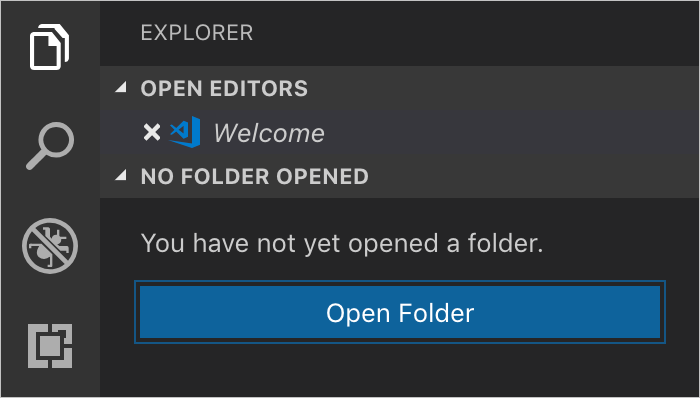
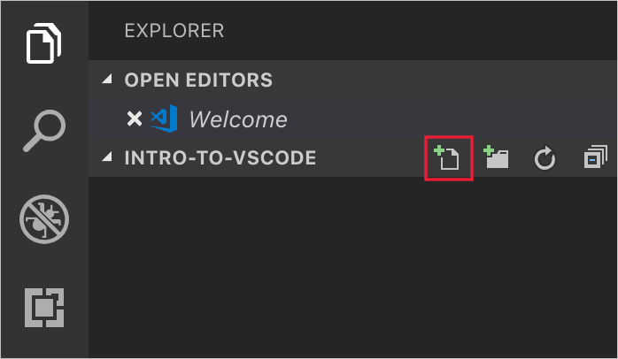
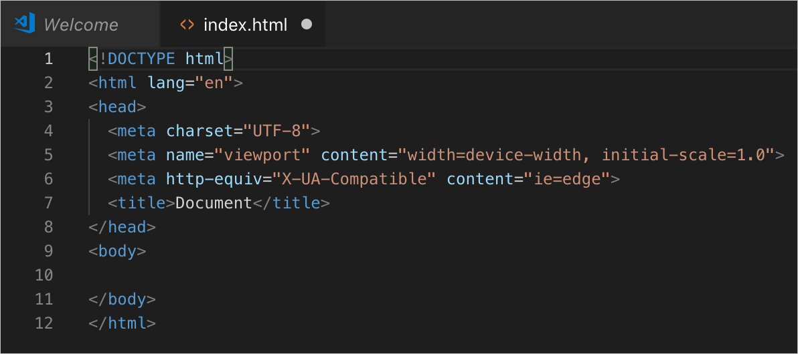
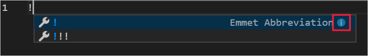
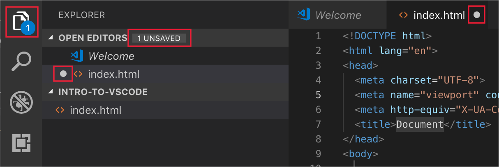

As with most of the Visual Studio Code functionality, there are many ways to create and manage files. In this unit, we'll create and edit a file. We suggest creating a folder called **intro-to-vscode** on your local computer and work from there. Although you can think of this as your project folder for this module, Visual Studio Code won't create any files other than the specific files needed for this lesson unless you create a Workspace, discussed at the end of this unit.

## Using Explorer to manage files

The **Explorer** button, shown below, toggles the Explorer view in the sidebar on and off.

You should see the **Open Folder** button as shown here.

Select this button and navigate to the intro-to-vscode folder you created previously.

## Create an HTML file

In this case you probably don't have any files yet, so the folder is empty. Let's solve that now. Use the **New File** icon, shown below, to create a new file in the current folder. Note that this icon doesn't show up unless you hover your mouse cursor over the portion of the Explorer where your folder name is listed.

Name the new file `index.html` and press Enter.

## Using Emmet to create code

You should now have an empty file named `index.html` open in the editor and listed in the Explorer. If you start typing valid HTML, you'll see color coding come in as you work. Instead of typing everything manually, we can use Visual Studio Code's built-in Emmet support to do a lot of the tedious bits.

In your empty editor window `index.html`, type `!` (exclamation point) then select the Tab key. This will tell Emmet to fill in the minimum HTML needed to make a web page using default values, as shown below.

We've taken a direct line to creating the HTML here, skipping over optional features of Emmet. For example, when you type the exclamation point but before you type the Tab key, you'll see something like the following.

Note the little `i` in the blue circle off to the right, which you can click for more info. Also, be sure to take note of the location of the full Emmet reference at [Emmet In Visual Studio Code](https://code.visualstudio.com/docs/editor/emmet). You don't need to know all the details at this moment, but it's useful to have a feel for the scope of Emmet and what it can do to make you more efficient.

Let's head back to our new file we're editing. Notice the changes to the UI after adding content.

There's a number 1 on the **Explorer** icon in the Activity Bar, which means there's one file open that's been changed but not saved. After that is a count of unsaved changes in the Explorer, next to the Open Editors header. Lastly, the file name in the list of open editors and the editor tab for the file itself each have a large dot.

All these various indicators are provided to notify you that you have unsaved changes, so you'll know regardless of which parts of the UI you decide to hide or show.

Saving files manually is no different than usual, from the File menu or using keyboard shortcuts. Visual Studio Code also has a handy automatic file save feature you can enable, which is in the File menu. (Alternately, hit F1, start typing "auto save," and select File: Toggle Auto Save).

## Syntax highlighting from built-in extensions

Let's look over the built-in extensions list. These are the extensions that come pre-installed on Visual Studio Code, and don't show up in your usual installed extensions list. To view the built-in extensions, select the ellipsis icon (`...`) in the Filter Extensions area and choose **Show Built-in Extensions**. The length of this list may surprise you! Take a moment to scroll through the various items to get a feel for what's already here.

> [!NOTE]
> There are syntax highlighting extensions for many languages such as HTML already built in. You may have noticed this particular extension at work in the previous section when you added HTML with Emmet.

## Using a Workspace to organize your project

Although not required, you may opt to work within the Workspace construct if you're working with multiple files at once. This is nothing more than a work environment that contains all the files and settings you want for a given project. If you create a new Workspace, you'll need to name it and save it to the location of your choosing. We won't discuss workspaces in detail here. If you want to know more, see [Multi-root Workspaces](https://code.visualstudio.com/docs/editor/multi-root-workspaces) in the [Visual Studio Code Documentation](https://code.visualstudio.com/docs).
