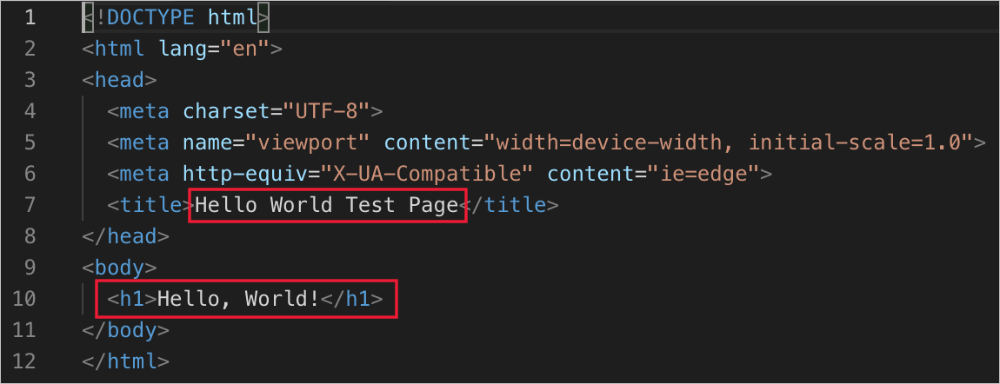

In the last unit, we created a simple, auto-generated HTML file named index.html. Let's pick up where we left off and make a web app we can run on a local server.

## First test: Hello World

For a first test to see the minimal code we can run, we'll add some content to display. When we left our new index.html file in the last unit, it looked like the following.

Now edit this code to look like the following screen shot (pertinent content is highlighted with red outline).

Notice how the HTML IntelliSense and color coding extensions are working for you throughout. You might explore this more in future modules, but feel free to go ahead and experiment on your own. If you do, be sure to also try the auto-completion features.

## Publish the web page locally

Now it's time to run the HTML locally. Select the **GoLive** icon in the bottom right status bar.

This will tell the Live Server extension we installed earlier to start up and launch your default web browser to serve up the content in the current file. You should see **Hello World Test Page** in the browser's title bar and **Hello, World!** in a large heading font.

Congratulations! You've just served up your first web page. Of course, this is content only you can see, because it's being served by a locally running web server (the Live Server extension). You'll notice the web address is the IP address reserved for the local machine. If you want this web page to be available online, you'd need to deploy it to a web server connected to the internet. This is beyond the scope of this lesson module, but you can learn about it in other modules in this series.
