## Enhancing your app's UI

There's a lot you can do to improve the basic layout and controls in your apps. In this module, we'll show you some of the UI elements you can add to provide a better experience for your users, from navigation between pages to web and media features. After you've learned how they work, you can combine any and all of these features to create the UI your app needs.

### Application navigation

Navigation is a critical feature for an application that has more than one page (also referred to as a *view*). And your app might also need to pass information between its views. In this unit, we'll show you how to take input from a user and pass it to a second view when the user navigates.

In this unit, you will:

- Learn how to provide navigation between different views of an application.
- Learn how to pass data between the views when users navigate.

Let's get started!

::: zone pivot="uwp"


#### 1. Create a project

In Visual Studio, create a Universal Windows Platform (UWP) C# project. Give the project a meaningful name that's based on this lesson, like **NavigationApp.Uwp**.


#### 2. Introducing `Frame` and `Page`

We'll be using two items for app navigation in this lesson:

* `Page`. Contains the user interface content. Most modern applications have multiple pages that perform different actions in the application.
* `Frame`. Displays `Page` instances and provides navigation functionality.

To get started, open your project's App.xaml.cs file so we can see how the very first `Page` of the application is created. Notice the **OnLaunched** method. This method runs when the app starts. It's responsible for setting up the root `Frame` of the application and navigating to the first `Page`.

Let's look at a simplified version of the **OnLaunched** method to understand the navigation:

```csharp
protected override void OnLaunched(LaunchActivatedEventArgs e)
{
    // 1. The Window.Content gets a Frame instance.
    Frame rootFrame = Window.Current.Content as Frame;
    
    // Check to see if the Frame is null.
    // - If null, then this is a new instance of the app and we need a new Frame.
    // - If not null, then the app was already running and has a Frame.
    if (rootFrame == null)
    {
        rootFrame = new Frame();
        Window.Current.Content = rootFrame;
    }
	
    // 2. Navigate to the first Page by using the Frame.Navigate method.
    if (rootFrame.Content == null)
    {
        // The Navigate method accepts a typeof(ThePageYouWant) parameter.
        rootFrame.Navigate(typeof(MainPage));
    }
    
    // Actives the Window.
    Window.Current.Activate();
}

```

Pay particular attention to *how* a page is navigated to. The `Frame` **Navigate** method accepts a `Type` parameter via the `typeof` operator. So you're not creating an instance of `MainPage` manually. Instead, the navigation system will create that `Page` instance in that specific page type.

```csharp
rootFrame.Navigate(typeof(MainPage));
```

#### 3. Add pages
Now let's create a couple pages in the application so you can try navigating between them. Take the following steps:

Right-click the project name (not the solution name), expand **Add**, and then select **New Item**.

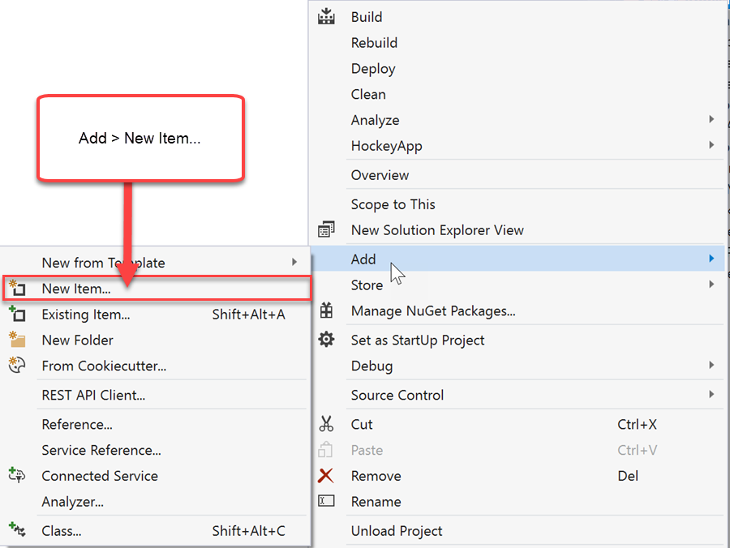

Select the **Blank Page** template, name the page **Page1.xaml**, and then select **Add**.

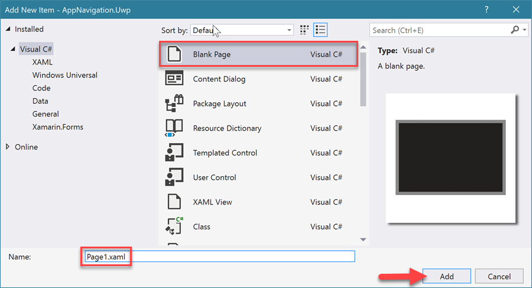

Repeat the preceding two steps, but this time name the page **Page2.xaml**.

You should now see two pages in **Solution Explorer**:

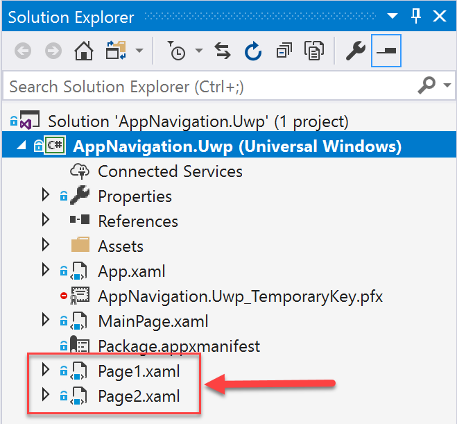

#### 4. Navigating between the pages

Next, we'll need some buttons that the user will select to move between the pages.

Add a `Button` with a click event handler and a `TextBlock` to **MainPage.xaml**:

*MainPage.xaml*
```xml
<Page x:Class="AppNavigation.Uwp.MainPage"
      xmlns="http://schemas.microsoft.com/winfx/2006/xaml/presentation"
      xmlns:x="http://schemas.microsoft.com/winfx/2006/xaml"
      xmlns:d="http://schemas.microsoft.com/expression/blend/2008"
      xmlns:mc="http://schemas.openxmlformats.org/markup-compatibility/2006"
      mc:Ignorable="d"
      Background="{ThemeResource ApplicationPageBackgroundThemeBrush}">

    <Grid>
        <Grid.RowDefinitions>
            <RowDefinition Height="Auto" />
            <RowDefinition />
        </Grid.RowDefinitions>

        <Grid Background="AntiqueWhite"
              Padding="10">
            <TextBlock Text="Home"
                       Style="{ThemeResource TitleTextBlockStyle}"
                       VerticalAlignment="Center"
                       HorizontalAlignment="Center" />
        </Grid>

        <Button Content="Go To Page 1"
                Click="Page1Button_OnClick"
                HorizontalAlignment="Center"
                VerticalAlignment="Center"
                Grid.Row="1"
                Margin="20" />
    </Grid>
</Page>
```
*MainPage.xaml.cs*
```csharp
using Windows.UI.Xaml;
using Windows.UI.Xaml.Controls;

namespace AppNavigation.Uwp
{
    public sealed partial class MainPage : Page
    {
        public MainPage()
        {
            InitializeComponent();
        }

        private void Page1Button_OnClick(object sender, RoutedEventArgs e)
        {
        
        }
    }
}
```

In the **Page1Button_OnClick** event handler, use **Frame.Navigate** to navigate to an instance of **Page1**.

The **Page.Frame** property is a convenient feature of the `Page` class. When a `Frame` creates a `Page` instance, it sets the **Page.Frame** property. This makes it easy to access the `Frame` element's properties and methods, like **Frame.Navigate**!

*MainPage.xaml.cs*
```csharp
using Windows.UI.Xaml;
using Windows.UI.Xaml.Controls;

namespace AppNavigation.Uwp
{
    public sealed partial class MainPage : Page
    {
        public MainPage()
        {
            InitializeComponent();
        }

        private void Page1Button_OnClick(object sender, RoutedEventArgs e)
        {
            // The Page.Frame property is a reference to the Frame that's displaying the page.
            // Use Frame.Navigate to go to the next page.
            Frame.Navigate(typeof(Page1));
        }
    }
}
```

Open **Page1.xaml** and add a back `Button` in the upper-left corner of the page:

*Page1.xaml*
```xml
<Page x:Class="AppNavigation.Uwp.Page1"
      xmlns="http://schemas.microsoft.com/winfx/2006/xaml/presentation"
      xmlns:x="http://schemas.microsoft.com/winfx/2006/xaml"
      xmlns:d="http://schemas.microsoft.com/expression/blend/2008"
      xmlns:mc="http://schemas.openxmlformats.org/markup-compatibility/2006"
      mc:Ignorable="d"
      Background="{ThemeResource ApplicationPageBackgroundThemeBrush}">

    <Grid>
        <Grid.RowDefinitions>
            <RowDefinition Height="Auto" />
            <RowDefinition />
        </Grid.RowDefinitions>

        <Grid Background="AntiqueWhite"
              Padding="10">
            <Button Click="BackButton_OnClick">
                <SymbolIcon Symbol="Back" />
            </Button>

            <TextBlock Text="Page 1"
                       Style="{ThemeResource TitleTextBlockStyle}"
                       VerticalAlignment="Center"
                       HorizontalAlignment="Center" />
        </Grid>****
    </Grid>
</Page>
```

*Page1.xaml.cs*
```csharp
using Windows.UI.Xaml;
using Windows.UI.Xaml.Controls;

namespace AppNavigation.Uwp
{
    public sealed partial class Page1 : Page
    {
        public Page1()
        {
            InitializeComponent();
        }

        private void BackButton_OnClick(object sender, RoutedEventArgs e)
        {
        
        }
    }
}
```

In the **BackButton_Click** event handler, use **Frame.GoBack** to navigate backward:

*Page1.xaml.cs*
```csharp
using Windows.UI.Xaml;
using Windows.UI.Xaml.Controls;

namespace AppNavigation.Uwp
{
    public sealed partial class Page1 : Page
    {
        public Page1()
        {
            InitializeComponent();
        }

        private void BackButton_OnClick(object sender, RoutedEventArgs e)
        {
            // First, check that it's safe to ask the Frame to go backward.
            if (Frame.CanGoBack)
            {
                // If there's a page in the "backstack," we can call GoBack().
                Frame.GoBack();
            }
        }
    }
}
```

Notice that we're first checking whether the `Frame` can go backward before calling **GoBack**. The `Frame` keeps a history of these page instances in **Frame.BackStack** and doesn't create new instances. This leaves the page state intact. Advanced navigation is outside the scope of this lesson. See [Navigation history and backwards navigation](/windows/uwp/design/basics/navigation-history-and-backwards-navigation) to learn more.

**Run the app and navigate between `MainPage` and `Page1`**

Select the button to go to **Page1**:

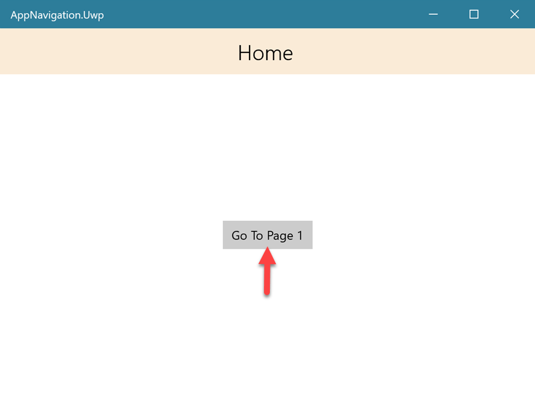

Select the back button to go back to **MainPage**:


### Passing data between pages

Sometimes you'll need to pass information between the first page and the second page. Here's an example of this scenario: the first page displays a list of products, and when a user selects a product, the app navigates to a second page to show the product details. In this scenario, you need a way to pass information about what product was selected so the second page can show the details.

To make passing this information as easy as possible, the **Frame.Navigate** method has an option to pass a second parameter, a *navigation parameter*.

`Frame.Navigate(typeof(Page2), "You sent text data to Page 2!");`

In this example, a `string` is passed as the navigation parameter, but the parameter is of type `object`. This type gives you a lot of flexibility because you can pass anything that inherits from `object`!

#### Passing data between `Page1` and `Page2`

Open **Page2.xaml** and add this content to the page:

*Page2.xaml*
```xml
<Page x:Class="AppNavigation.Uwp.Page2"
      xmlns="http://schemas.microsoft.com/winfx/2006/xaml/presentation"
      xmlns:x="http://schemas.microsoft.com/winfx/2006/xaml"
      xmlns:d="http://schemas.microsoft.com/expression/blend/2008"
      xmlns:mc="http://schemas.openxmlformats.org/markup-compatibility/2006"
      mc:Ignorable="d"
      Background="{ThemeResource ApplicationPageBackgroundThemeBrush}">

    <Grid>
        <Grid.RowDefinitions>
            <RowDefinition Height="Auto" />
            <RowDefinition />
        </Grid.RowDefinitions>

        <Grid Background="AntiqueWhite"
              Padding="10">
            <Button Click="BackButton_OnClick">
                <SymbolIcon Symbol="Back" />
            </Button>

            <TextBlock Text="Page 2"
                       Style="{ThemeResource TitleTextBlockStyle}"
                       VerticalAlignment="Center"
                       HorizontalAlignment="Center" />
        </Grid>

        <TextBlock x:Name="ParameterDataTextBlock"
                   HorizontalAlignment="Center"
                   VerticalAlignment="Center"
                   Grid.Row="1"
                   Margin="20" />
    </Grid>
</Page>
```

Notice that we used the same approach as we did in **Page1** for the header area, but we have an additional `TextBlock` in the middle of the page to display any data that's sent to **Page2**.

Open **Page2.xaml.cs** and override **OnNavigatedTo** to read the navigation parameter.

**OnNavigatedTo** is in the `Page` class. This method will run when navigation is complete. `NavigationEventArgs` will contain any navigation information that might be useful, like the navigation parameter **e.Parameter.**

*Page2.xaml.cs*
```csharp
using Windows.UI.Xaml;
using Windows.UI.Xaml.Controls;
using Windows.UI.Xaml.Navigation;

namespace AppNavigation.Uwp
{
    public sealed partial class Page2 : Page
    {
        public Page2()
        {
            InitializeComponent();
        }

        // You can override the OnNavigatedTo method to execute logic when a page loads.
        // You can also use it to get any parameters that were passed from the previous page.
        protected override void OnNavigatedTo(NavigationEventArgs e)
        {
            // If e.Parameter is a string, set the TextBlock's text with it.
            if (e?.Parameter is string textMessage)
            {
                ParameterDataTextBlock.Text = textMessage;
            }

            // If e.Parameter is a number, show that number in the TextBlock.
            if (e?.Parameter is int numericalMessage)
            {
                ParameterDataTextBlock.Text = $"You sent the number {numericalMessage} as a navigation parameter.";
            }

            base.OnNavigatedTo(e);
        }

        private void BackButton_OnClick(object sender, RoutedEventArgs e)
        {
            if (Frame.CanGoBack)
            {
                Frame.GoBack();
            }
        }
    }
}
```

The previous logic checks what kind of information is contained in **e.Parameter** and then shows the value in **ParameterDataTextBlock.Text**.

Now let's go back to **Page1** and add a few things so we can pass numerical or string data to **Page2** when we navigate.

Open **Page1.xaml** and add the following `StackPanel` content:

*Page1.xaml*
```xml
<Page x:Class="AppNavigation.Uwp.Page1"
      xmlns="http://schemas.microsoft.com/winfx/2006/xaml/presentation"
      xmlns:x="http://schemas.microsoft.com/winfx/2006/xaml"
      xmlns:d="http://schemas.microsoft.com/expression/blend/2008"
      xmlns:mc="http://schemas.openxmlformats.org/markup-compatibility/2006"
      mc:Ignorable="d"
      Background="{ThemeResource ApplicationPageBackgroundThemeBrush}">

    <Grid>
        <Grid.RowDefinitions>
            <RowDefinition Height="Auto" />
            <RowDefinition />
        </Grid.RowDefinitions>

        <Grid Background="AntiqueWhite"
              Padding="10">
            <Button Click="BackButton_OnClick">
                <SymbolIcon Symbol="Back" />
            </Button>

            <TextBlock Text="Page 1"
                       Style="{ThemeResource TitleTextBlockStyle}"
                       VerticalAlignment="Center"
                       HorizontalAlignment="Center" />
        </Grid>

        <StackPanel Grid.Row="1"
                    HorizontalAlignment="Center"
                    VerticalAlignment="Center"
                    Spacing="10">
            <RadioButton x:Name="SendNoDataRadioButton"
                         Content="Send no data to page 2"
                         IsChecked="True"
                         GroupName="ParameterOptions" />
            <RadioButton x:Name="SendTextDataRadioButton"
                         Content="Send text data to page 2"
                         GroupName="ParameterOptions" />
            <RadioButton x:Name="SendNumericalDataRadioButton"
                         Content="Send numerical data to page 2"
                         GroupName="ParameterOptions" />
            <Button Content="Go To Page 2"
                    Click="Page2Button_OnClick"
                    HorizontalAlignment="Stretch" />
        </StackPanel>
    </Grid>
</Page>
```

Open **Page1.xaml.cs** and configure the **Page2Button_OnClick** event handler to pass a `string`, an `int`, or nothing to **Page2**, depending on which `RadioButton` is selected.

*Page1.xaml.cs*
```csharp
using Windows.UI.Xaml;
using Windows.UI.Xaml.Controls;

namespace AppNavigation.Uwp
{
    public sealed partial class Page1 : Page
    {
        public Page1()
        {
            InitializeComponent();
        }

        private void BackButton_OnClick(object sender, RoutedEventArgs e)
        {
            // First, check that it's safe to ask the Frame to go backward.
            if (Frame.CanGoBack)
            {
                // If there's a page in the "backstack", we can call GoBack().
                Frame.GoBack();
            }
        }

        private void Page2Button_OnClick(object sender, RoutedEventArgs e)
        {
            // You can pass an object to the next page by using the second parameter of the Navigate method.
            if (SendTextDataRadioButton.IsChecked == true)
            {
                // Here we pass a string parameter.
                Frame.Navigate(typeof(Page2), "You sent text data to Page 2!");
            }
            else if (SendNumericalDataRadioButton.IsChecked == true)
            {
                // Here we pass an integer parameter.
                Frame.Navigate(typeof(Page2), 5);
            }
            else if (SendNoDataRadioButton.IsChecked == true)
            {
                // Navigate without a parameter.
                Frame.Navigate(typeof(Page2));
            }
        }
    }
}
```

Select F5 to start debugging and navigate to **Page1**. Try each of the parameter data options while navigating between **Page1** and **Page2**.

*Text data*

Select the text data option and then select **Go To Page 2**:

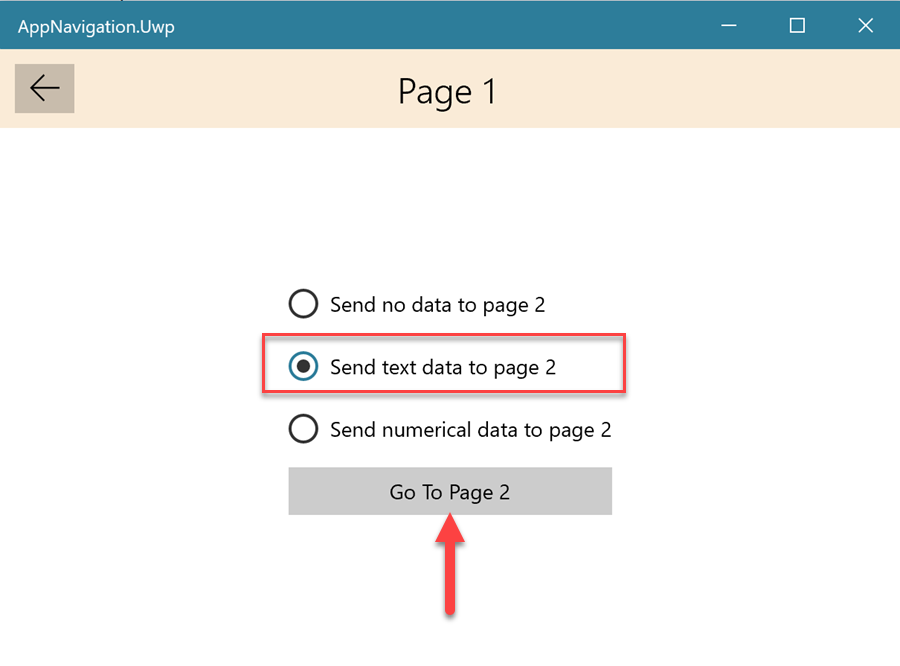

The `string` parameter message appears on **Page2**:

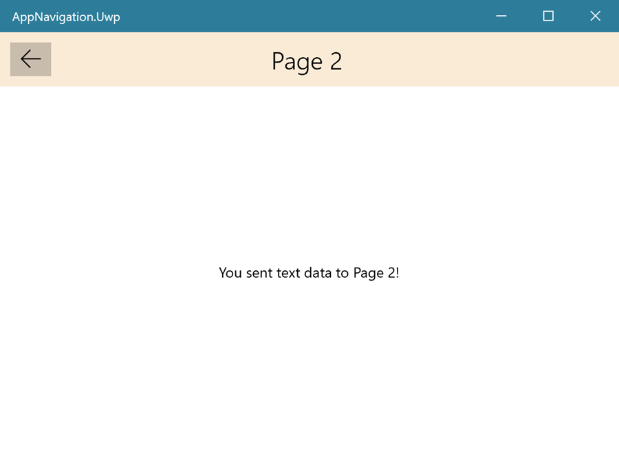

*Numerical data*

Go back to **Page1** and try the numerical data option this time:


The `int` parameter message appears on **Page2**:


That's a wrap for a first look at using navigation in a UWP application. Great job!


::: zone-end

::: zone pivot="wpf"

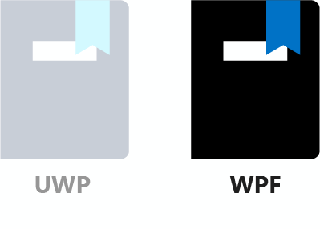

#### 1. Create a project

In Visual Studio, create a WPF C# project. Give the project a meaningful name, something like **NavigationApp.Wpf**.


#### 2. Introducing `NavigationWindow` and `Page`

We'll be using two items for app navigation in this lesson:

* `Page`. Contains the user interface content. Most modern applications have multiple views that perform different actions in the application.
* `NavigationWindow`. Displays `Page` instances in a single `Window` and provides navigation functionality.

By default, Visual Studio will use the normal `Window` object for the project's `MainWindow` class. We want to use a `NavigationWindow` instead. You can easily make this change by editing the code directly. Take the following steps:

Open **MainWindow.xaml** and manually change the type from `Window` to `NavigationWindow`:

*MainWindow.xaml*
```xml
<NavigationWindow x:Class="AppNavigation.Wpf.MainWindow"
                  xmlns="http://schemas.microsoft.com/winfx/2006/xaml/presentation"
                  xmlns:x="http://schemas.microsoft.com/winfx/2006/xaml"
                  xmlns:d="http://schemas.microsoft.com/expression/blend/2008"
                  xmlns:mc="http://schemas.openxmlformats.org/markup-compatibility/2006"
                  xmlns:local="clr-namespace:AppNavigation.Wpf"
                  mc:Ignorable="d"
                  Title="MainWindow"
                  Height="450"
                  Width="800">
</NavigationWindow>
```

Open **MainWindow.xaml.cs** and change the base class type from `Window` to `NavigationWindow`.

Your code should now look like this example:

*MainWindow.xaml.cs*
```csharp
using System.Windows.Navigation;

namespace AppNavigation.Wpf
{
    public partial class MainWindow : NavigationWindow
    {
        public MainWindow()
        {
            InitializeComponent();
        }
    }
}
```

Technically, you don't have to define the base class in the code-behind file because the `NavigationWindow` base type is already defined in the XAML. You could just delete the ` : Window` base class identifier instead.


#### 3. Add pages
Now let's create a couple pages in the application so you can try navigating between them. Take the following steps:

Right-click the project name (not the solution name) in **Solution Explorer**, expand **Add**, and then select **Page**.

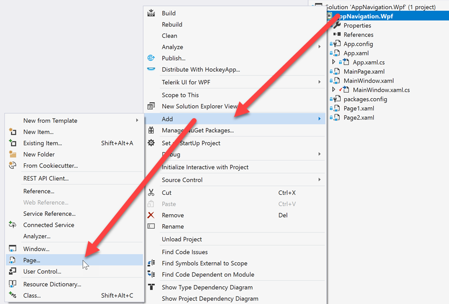

Make sure the **Page (WPF)** template is selected, name the page **Page1.xaml**, and then select **Add**.


Repeat the preceding two steps, but this time name the page **Page2.xaml**.

Repeat steps the first two steps again, but this time name the page **MainPage.xaml**.

You should now see three pages in **Solution Explorer**:

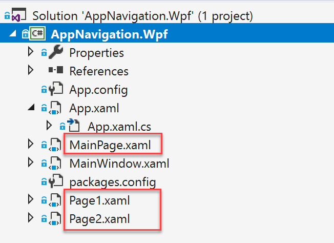

#### 4. Navigating between the pages

Before we get started navigating through the pages, we need to set one `Page` as the one that appears when the app starts.

Open **MainWindow.xaml** and add `Source="MainPage.xaml"`. This code sets `MainPage` as the `NavigationWindow` element's first page.

*MainWindow.xaml*
```xml
<NavigationWindow x:Class="AppNavigation.Wpf.MainWindow"
                  xmlns="http://schemas.microsoft.com/winfx/2006/xaml/presentation"
                  xmlns:x="http://schemas.microsoft.com/winfx/2006/xaml"
                  xmlns:d="http://schemas.microsoft.com/expression/blend/2008"
                  xmlns:mc="http://schemas.openxmlformats.org/markup-compatibility/2006"
                  xmlns:local="clr-namespace:AppNavigation.Wpf"
                  mc:Ignorable="d"
                  Title="MainWindow"
                  Height="450"
                  Width="800"
                  Source="MainPage.xaml">
</NavigationWindow>
```

We'll need a button on `MainPage` so the user can navigate to the next page. Add a `Button` with a click event handler to **MainPage.xaml**:

*MainPage.xaml*
```xml
<Page x:Class="AppNavigation.Wpf.MainPage"
        xmlns="http://schemas.microsoft.com/winfx/2006/xaml/presentation"
        xmlns:x="http://schemas.microsoft.com/winfx/2006/xaml"
        xmlns:d="http://schemas.microsoft.com/expression/blend/2008"
        xmlns:mc="http://schemas.openxmlformats.org/markup-compatibility/2006"
        xmlns:local="clr-namespace:AppNavigation.Wpf"
        mc:Ignorable="d"
        WindowTitle="Home"
        Height="450"
        Width="800">
    <Grid>
        <Button Content="Go To Page 1"
                Click="Page1Button_OnClick"
                HorizontalAlignment="Center"
                VerticalAlignment="Center"
                Margin="20" />
    </Grid>
</Page>
```

*MainPage.xaml.cs*
```csharp
using System;
using System.Windows;
using System.Windows.Controls;

namespace AppNavigation.Wpf
{
    public partial class MainPage : Page
    {
        public MainPage()
        {
            InitializeComponent();
        }

        private void Page1Button_OnClick(object sender, RoutedEventArgs e)
        {

        }
    }
}
```

In the **Page1Button_OnClick** event handler, use **NavigationService.Navigate** to navigate to **Page1.xaml**:

*MainPage.xaml.cs*
```csharp
using System;
using System.Windows;
using System.Windows.Controls;

namespace AppNavigation.Wpf
{
    public partial class MainPage : Page
    {
        public MainPage()
        {
            InitializeComponent();
        }

        private void Page1Button_OnClick(object sender, RoutedEventArgs e)
        {
            // The Page uses the parent NavigationWindow's NavigationService.
            // Use that NavigationService's Navigate method with a relative URI to go to another Page.
            NavigationService?.Navigate(new Uri("Page1.xaml", UriKind.Relative));
        }
    }
}
```

The **Page.NavigationService** property is a convenient feature of the `Page` class. When a `NavigationWindow` renders a `Page`, it sets the page's **NavigationService** property. This makes it easy to access navigation properties and methods.

Open **Page1.xaml** and put a `TextBlock` in the middle of the `Page` to let users know what page they're on:

*Page1.xaml*
```xml
<Page x:Class="AppNavigation.Wpf.Page1"
      xmlns="http://schemas.microsoft.com/winfx/2006/xaml/presentation"
      xmlns:x="http://schemas.microsoft.com/winfx/2006/xaml"
      xmlns:d="http://schemas.microsoft.com/expression/blend/2008"
      xmlns:mc="http://schemas.openxmlformats.org/markup-compatibility/2006"
      mc:Ignorable="d"
      WindowTitle="Page 1"
      Height="450"
      Width="800">
    <Grid>
        <TextBlock Text="Welcome to Page1"
                   HorizontalAlignment="Center"
                   VerticalAlignment="Center" />
    </Grid>
</Page>

```

**Run the app and navigate between `MainPage` and `Page1`**

Select **Go to Page 1** to navigate to **Page1**:

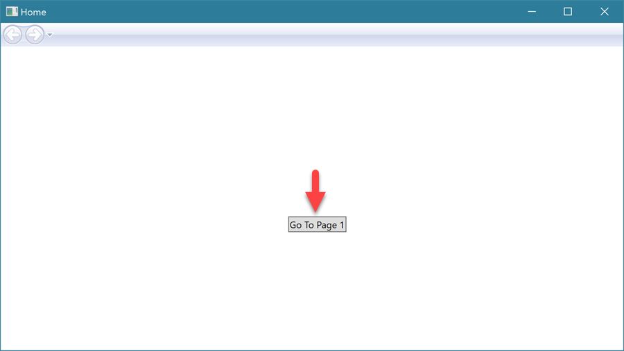

Notice that, after **Page1** loaded, the navigation bar's back button became enabled! This is because there's now a page to go back to, sometimes called *a page in the backstack*.

Select the back button to go back to **MainPage**:

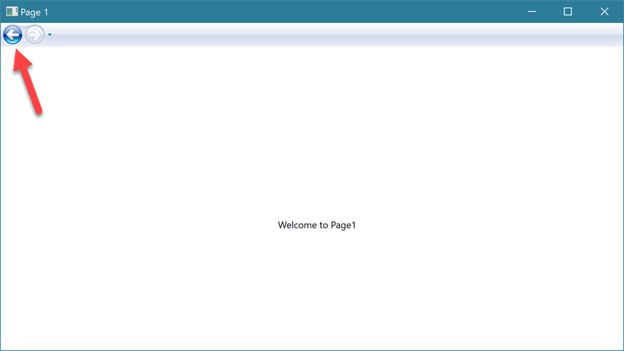

This navigation experience is similar to what you see in a web browser. You can use the forward button to go back to pages after you've navigated backward.

### Passing data between pages

Sometimes you'll need to pass information between the first page and the second page. Here's an example of this scenario: the first page displays a list of products, and when a user selects a product, the app navigates to a second page to show the product details. In this scenario, you need a way to pass information about what product was selected so the second page can show the details.

We can pass this information by using an overload of the **NavigationService.Navigate** method and using an instance of the `Page` object instead of the page's file name:

`NavigationService?.Navigate(new Page2("You sent text data to Page 2!"));`

In this example, a `string` is passed as a *navigation parameter* to the `Page2` class constructor. You can use whatever type of object you want because you can control what the constructor can accept for parameters.

Let's set up our application so that you can send either text or a number to an instance of `Page2`.

#### Passing data between `Page1` and `Page2`

Open **Page2.xaml** and add this content to the page:

*Page2.xaml*
```xml
<Page x:Class="AppNavigation.Wpf.Page2"
      xmlns="http://schemas.microsoft.com/winfx/2006/xaml/presentation"
      xmlns:x="http://schemas.microsoft.com/winfx/2006/xaml"
      xmlns:d="http://schemas.microsoft.com/expression/blend/2008"
      xmlns:mc="http://schemas.openxmlformats.org/markup-compatibility/2006"
      xmlns:local="clr-namespace:AppNavigation.Wpf"
      mc:Ignorable="d"
      WindowTitle="Page 2"
      Height="450"
      Width="800">

    <Grid>
        <StackPanel HorizontalAlignment="Center"
                    VerticalAlignment="Center">
            <TextBlock x:Name="ParameterDataTextBlock"
                       HorizontalAlignment="Center"
                       VerticalAlignment="Center"
                       Margin="20" />

            <Button Content="Go Back"
                    Margin="5"
                    Click="GoBackButton_OnClick" />
        </StackPanel>
    </Grid>
</Page>
```

You've added these elements:
- A `TextBlock` in the middle of the page to display any data that's sent to `Page2`.
- A `Button` to provide an alternative to using the `NavigationWindow` navigation bar's buttons.

Open **Page2.xaml.cs** to use a class constructor parameter to read the navigation parameter and complete the `Button` click event handler.

*Page2.xaml.cs*
```csharp
using System.Windows;
using System.Windows.Controls;

namespace AppNavigation.Wpf
{
    public partial class Page2 : Page
    {
        // Overload the Page constructor to allow a parameter to be passed.
        public Page2(object parameter = null)
        {
            InitializeComponent();

            if (parameter is string textMessage)
            {
                // If the parameter is a string, set the TextBlock's text with it.
                ParameterDataTextBlock.Text = textMessage;
            }
            else if (parameter is int numericalMessage)
            {
                // If the parameter is a number, show that number in the TextBlock.
                ParameterDataTextBlock.Text = $"You sent the number {numericalMessage} as a navigation parameter.";
            }
            else
            {
                // If the parameter is null or any unexpected object type, use a generic welcome message.
                ParameterDataTextBlock.Text = "Welcome to Page 2, no parameters were passed.";
            }
        }

        // As an alternative to using the NavigationWindow's navigation buttons,
        // you can programmatically invoke the GoBack() method.
        private void GoBackButton_OnClick(object sender, RoutedEventArgs e)
        {
            // Checking to make sure there is a page to go back to.
            if (NavigationService.CanGoBack)
            {
                // Programmatically navigate to the previous page.
                NavigationService.GoBack();
            }
        }
    }
}
```

The previous logic checks what kind of information is contained in **parameter** and then shows the value in **ParameterDataTextBlock.Text**. In the **GoBackButton_OnClick** click event handler, we use the **CanGoBack** property of **NavigationService** to make sure it's safe to invoke the **GoBack** method.

Now let's go back to **Page1** and add a few things so that we can pass numerical or string data to **Page2** when the user navigates.

Open **Page1.xaml**, remove the `TextBlock`, and add the following `StackPanel` content in its place:

*Page1.xaml*
```xml
<Page x:Class="AppNavigation.Wpf.Page1"
      xmlns="http://schemas.microsoft.com/winfx/2006/xaml/presentation"
      xmlns:x="http://schemas.microsoft.com/winfx/2006/xaml"
      xmlns:d="http://schemas.microsoft.com/expression/blend/2008"
      xmlns:mc="http://schemas.openxmlformats.org/markup-compatibility/2006"
      mc:Ignorable="d"
      WindowTitle="Page 1"
      Height="450"
      Width="800">
    <Grid>
        <StackPanel HorizontalAlignment="Center"
                    VerticalAlignment="Center">
            <TextBlock Text="Use the navigation buttons above or select an option for Page 2."
                       Margin="0,0,0,10"/>
            <RadioButton x:Name="SendNoDataRadioButton"
                         Content="Send no data to page 2"
                         IsChecked="True"
                         GroupName="ParameterOptions"
                         Margin="0,0,0,10" />
            <RadioButton x:Name="SendTextDataRadioButton"
                         Content="Send text data to page 2"
                         GroupName="ParameterOptions"
                         Margin="0,0,0,10" />
            <RadioButton x:Name="SendNumericalDataRadioButton"
                         Content="Send numerical data to page 2"
                         GroupName="ParameterOptions"
                         Margin="0,0,0,10" />
            <Button Content="Go To Page 2"
                    Click="Page2Button_OnClick"
                    HorizontalAlignment="Stretch" />
        </StackPanel>
    </Grid>
</Page>
```

Open **Page1.xaml.cs** and configure the **Page2Button_OnClick** event handler to pass a `string`, an `int`, or nothing to **Page2**, depending on which `RadioButton` is selected:

*Page1.xaml.cs*
```csharp
using System.Windows;
using System.Windows.Controls;

namespace AppNavigation.Wpf
{
    public partial class Page1 : Page
    {
        public Page1()
        {
            InitializeComponent();
        }

        private void Page2Button_OnClick(object sender, RoutedEventArgs e)
        {
            // You can pass an object to the next page by using the Page2's constructor overload.
            if (SendTextDataRadioButton.IsChecked == true)
            {
                // Here we pass a string parameter.
                NavigationService?.Navigate(new Page2("You sent text data to Page 2!"));
            }
            else if (SendNumericalDataRadioButton.IsChecked == true)
            {
                // Here we pass an integer parameter.
                NavigationService?.Navigate(new Page2(5));
            }
            else if (SendNoDataRadioButton.IsChecked == true)
            {
                // Navigate without a parameter.
                NavigationService?.Navigate(new Page2());
            }
        }
    }
}
```

Select F5 to start debugging and navigate to **Page1**. Try each of the parameter data options while navigating between **Page1** and **Page2**.

*Text data*

Select the text data option and select **Go To Page 2**:

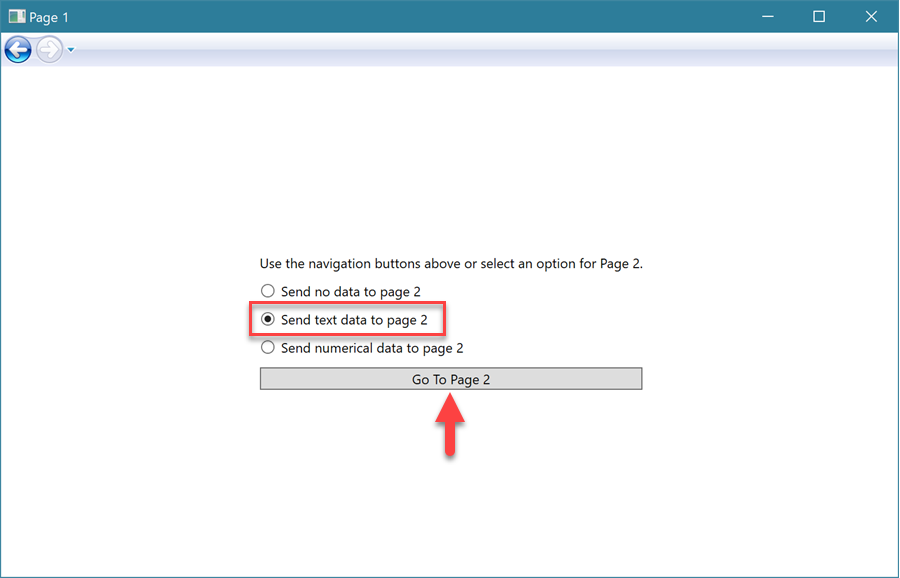

The `string` parameter message appears on **Page2**:

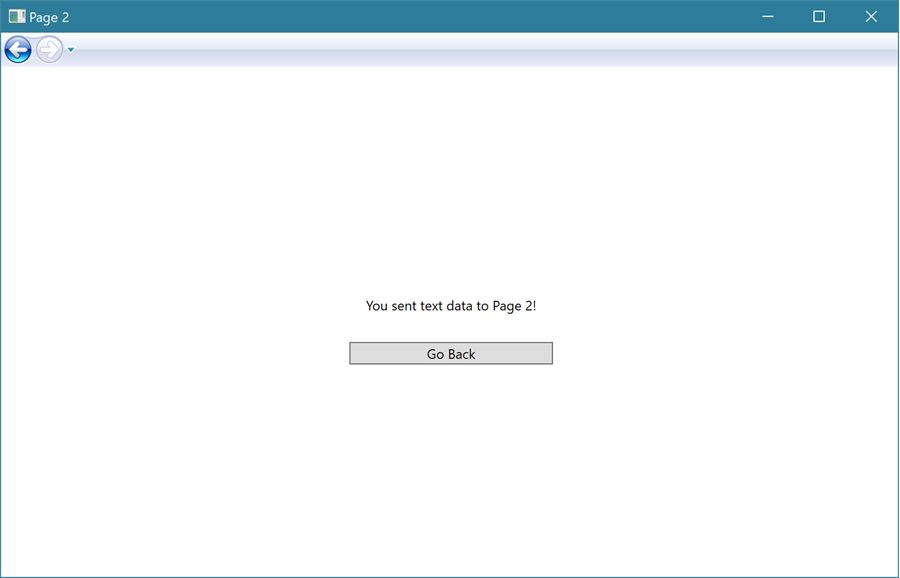

*Numerical data*

Go back to **Page1** and try the numerical data option this time:

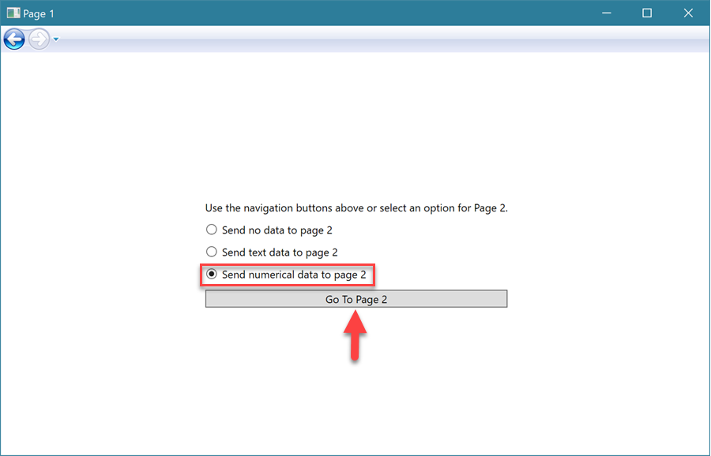

The `int` parameter message appears on **Page2**:

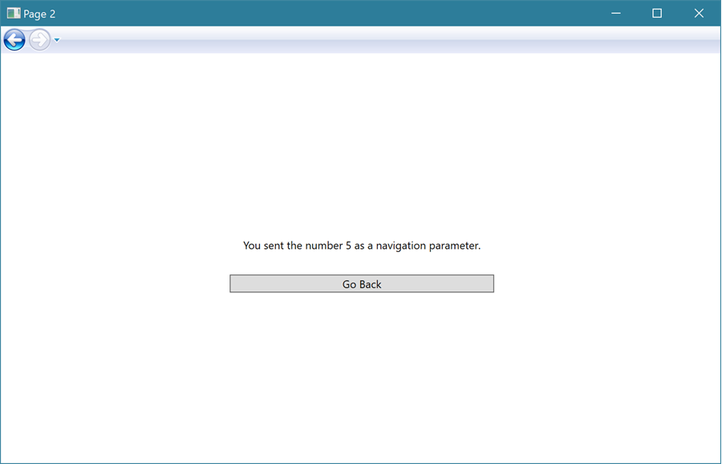

That's a wrap for a first look at using navigation in a WPF application!

::: zone-end

### Summary

In this unit, you learned how to navigate between views in a desktop application. You can either move on to the next unit or try the same thing by using the UI technology that you haven't tried. You'll find that UWP and WPF share a lot of features, including the same markup and coding languages, so you can reuse most of what you've learned and see which technology you prefer.