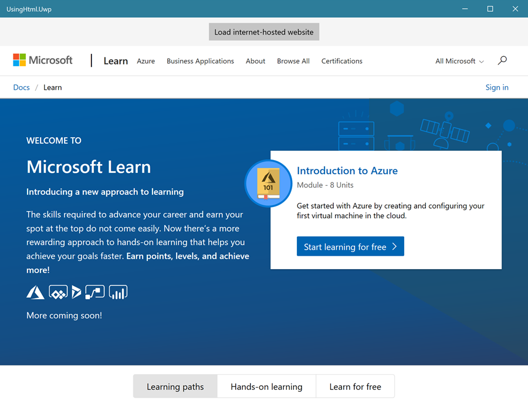
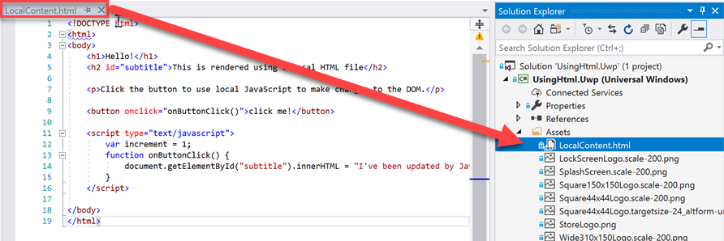
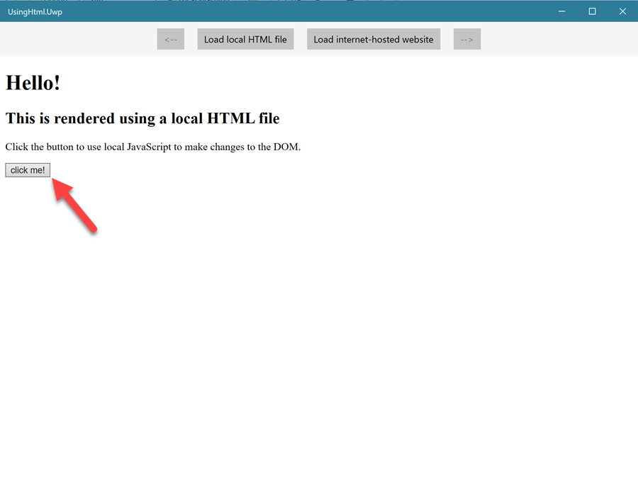
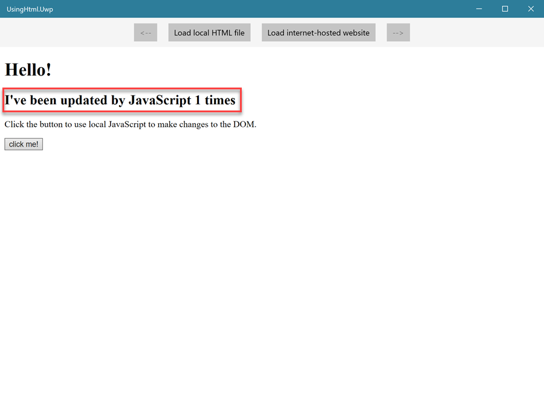
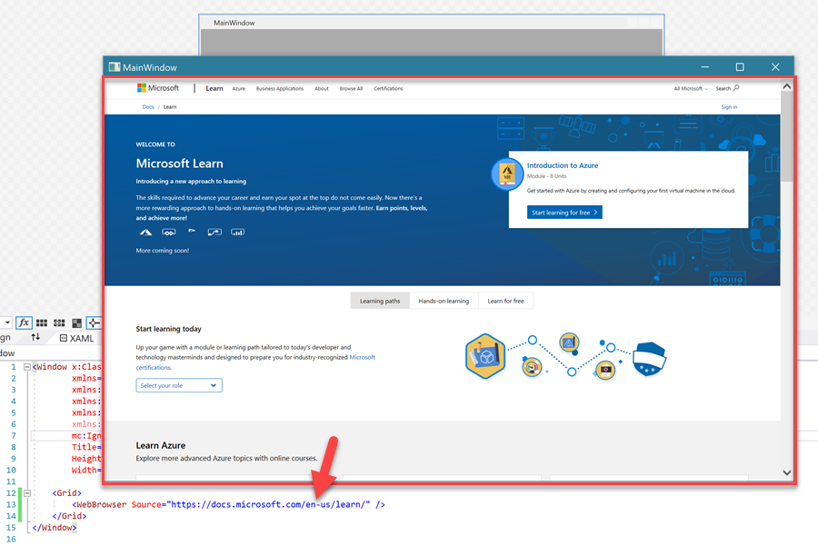
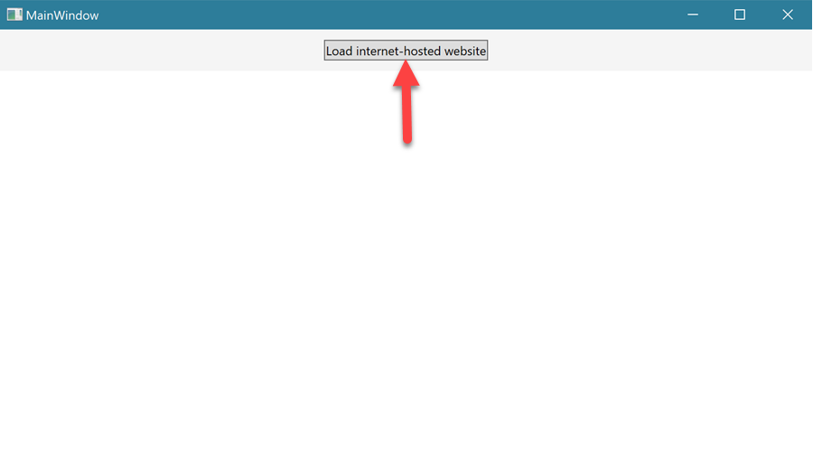
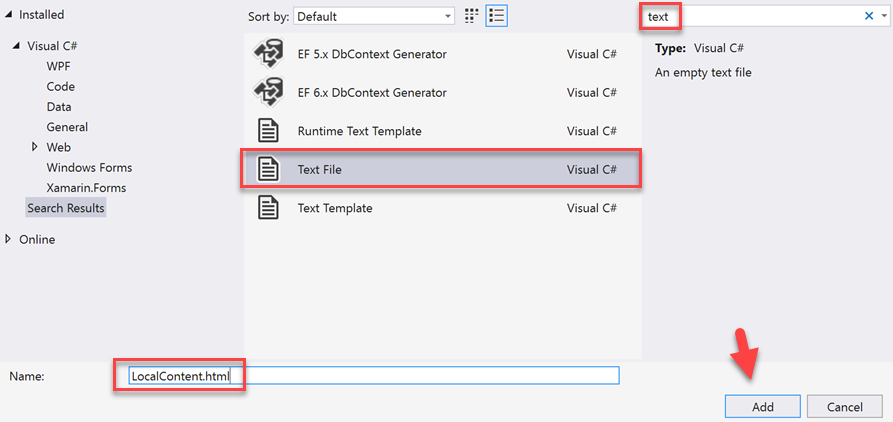
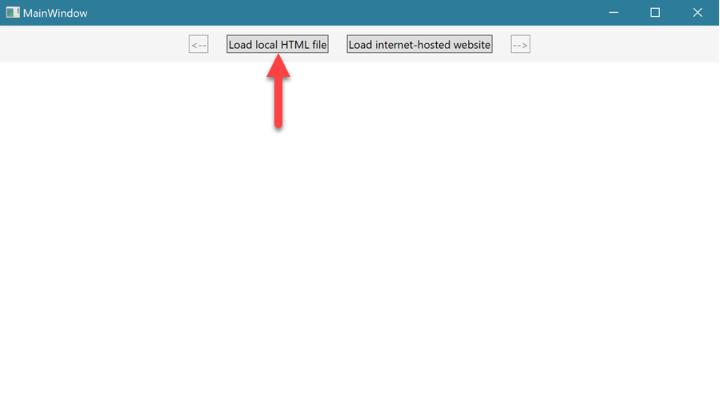
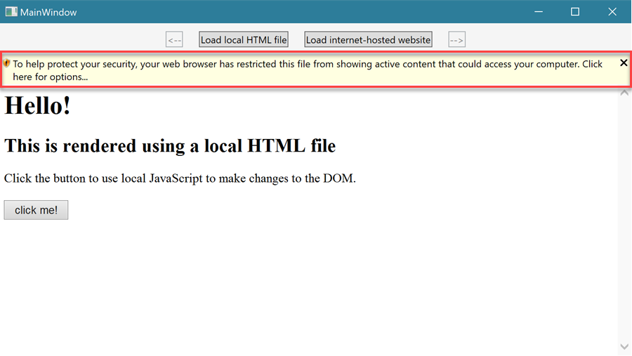
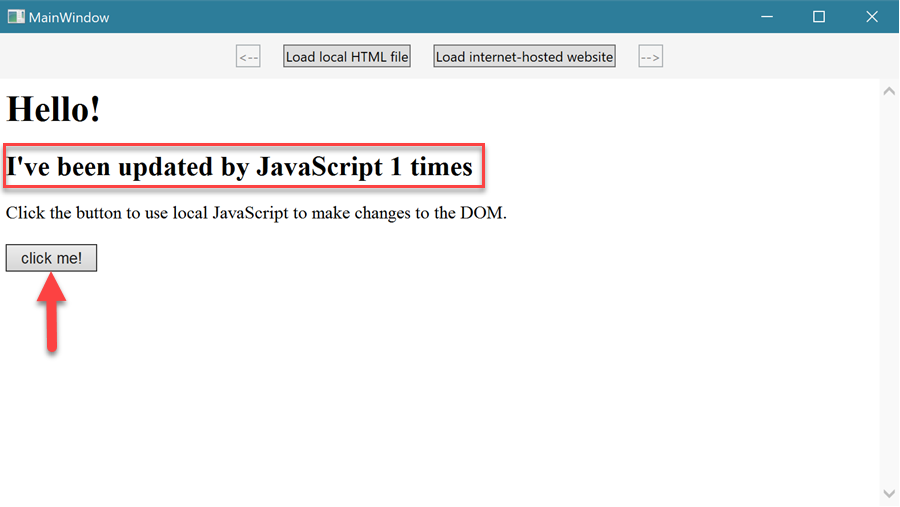

HTML is a web markup syntax, but you can use it in Windows 10 desktop applications if you add a web control. This control gives you the ability to include a view in your app that loads a webpage from the internet or static HTML.

In this unit, you will:

- Learn how to add the web control to your UI.
- Learn how to load an internet-based webpage.
- Learn how to load static HTML.

Let's get started!


### Using HTML in a desktop app

::: zone pivot="uwp"


#### 1. Create a project

In Visual Studio, create a Universal Windows Platform (UWP) C# project. Give the project a meaningful name that's based on this lesson, like **UsingHtmlApp.Uwp**.


#### 2. The `WebView` control

To get started, we'll first walk through how to add a `WebView` control to a page and open a website that's hosted online.

Open **MainPage.xaml** and add a `WebView` control to the page:

*MainPage.xaml*
```xml
<Page x:Class="UsingHtml.Uwp.MainPage"
      xmlns="http://schemas.microsoft.com/winfx/2006/xaml/presentation"
      xmlns:x="http://schemas.microsoft.com/winfx/2006/xaml"
      xmlns:local="using:UsingHtml.Uwp"
      xmlns:d="http://schemas.microsoft.com/expression/blend/2008"
      xmlns:mc="http://schemas.openxmlformats.org/markup-compatibility/2006"
      mc:Ignorable="d"
      Background="{ThemeResource ApplicationPageBackgroundThemeBrush}">

    <Grid>
        <WebView Source="https://docs.microsoft.com/learn/"/>
    </Grid>
</Page>
```

That's it. Your application will now display a website, and you can navigate around the website by using links in the site's content.


In most cases, you'll even see the website load in the XAML designer!

That functionality doesn't make an application very useful by itself, because you can't change the website programmatically. The user needs to use the links on the web page to navigate anywhere.

#### 3. Dynamically changing the website

You can set the `WebView` content dynamically at runtime by using the **Navigate** method. To demonstrate this ability, let's use the same Microsoft Learn web page but navigate to it by using a `Button`.

Open **MainPage.xaml**. Add a `Button` above the `WebView`, and remove the **Source** property from the `WebView`. Set the `Grid` **BackgroundColor** so we have a little contrast.

*MainPage.xaml*
```xml
<Page x:Class="UsingHtml.Uwp.MainPage"
      xmlns="http://schemas.microsoft.com/winfx/2006/xaml/presentation"
      xmlns:x="http://schemas.microsoft.com/winfx/2006/xaml"
      xmlns:local="using:UsingHtml.Uwp"
      xmlns:d="http://schemas.microsoft.com/expression/blend/2008"
      xmlns:mc="http://schemas.openxmlformats.org/markup-compatibility/2006"
      mc:Ignorable="d"
      Background="{ThemeResource ApplicationPageBackgroundThemeBrush}">

    <Grid Background="WhiteSmoke">
        <Grid.RowDefinitions>
            <RowDefinition Height="Auto" />
            <RowDefinition />
        </Grid.RowDefinitions>

        <StackPanel Orientation="Horizontal"
                    HorizontalAlignment="Center">
            <Button Content="Load internet-hosted website"
                    Click="UseUrlButton_OnClick"
                    Margin="10" />
        </StackPanel>

        <WebView x:Name="WebView1"
                 Grid.Row="1" />
    </Grid>
</Page>
```
 Open **MainPage.xaml.cs** and complete the **UseUrlButton_OnClick** event handler by using the `WebView` **Navigate** method:
 
 *MainPage.xaml.cs*

```csharp
using System;
using Windows.UI.Xaml;
using Windows.UI.Xaml.Controls;

namespace UsingHtml.Uwp
{
    public sealed partial class MainPage : Page
    {
        public MainPage()
        {
            InitializeComponent();
        }
        
        private void UseUrlButton_OnClick(object sender, RoutedEventArgs e)
        {
            // For HTML content hosted on the internet, you can simply use the URL.
            WebView1.Navigate(new Uri("https://docs.microsoft.com/learn/"));
        }
    }
}
```

Notice that the **Navigate** method uses a `Uri` instead of a `string`.

**Deploy the application**

You'll see that the `WebView` isn't showing any content when the app first starts. Select the `Button` to load the website:


Here's the result of selecting the button:



#### 4. Back and forward buttons

You can control backward and forward navigation from the `WebView` by using the **GoBack** and **GoForward** methods. To try this, let's add a couple new buttons to the top of the page.

We'll also want to take advantage of the `WebView` **NavigationCompleted** event so we know when to enable or disable those buttons.

Add a back `Button` and a forward `Button` to the top of the page. Then define the `WebView` **NavigationCompleted** event handler.

*MainPage.xaml*
```xml
<Page x:Class="UsingHtml.Uwp.MainPage"
      xmlns="http://schemas.microsoft.com/winfx/2006/xaml/presentation"
      xmlns:x="http://schemas.microsoft.com/winfx/2006/xaml"
      xmlns:local="using:UsingHtml.Uwp"
      xmlns:d="http://schemas.microsoft.com/expression/blend/2008"
      xmlns:mc="http://schemas.openxmlformats.org/markup-compatibility/2006"
      mc:Ignorable="d"
      Background="{ThemeResource ApplicationPageBackgroundThemeBrush}">

    <Grid Background="WhiteSmoke">
        <Grid.RowDefinitions>
            <RowDefinition Height="Auto" />
            <RowDefinition />
        </Grid.RowDefinitions>

        <StackPanel Orientation="Horizontal"
                    HorizontalAlignment="Center">
            <Button x:Name="BackButton"
                    Content="&lt;--"
                    IsEnabled="False"
                    Click="BackButton_OnClick"
                    Margin="10" />
            <Button Content="Load internet-hosted website"
                    Click="UseUrlButton_OnClick"
                    Margin="10" />
            <Button x:Name="ForwardButton"
                    Content="-->"
                    IsEnabled="False"
                    Click="ForwardButton_OnClick"
                    Margin="10" />
        </StackPanel>

        <WebView x:Name="WebView1"
                 NavigationCompleted="WebView1_OnNavigationCompleted"
                 Grid.Row="1" />
    </Grid>
</Page>

```
Complete the **BackButton_OnClick**, **ForwardButton_OnClick**, and **WebView1_OnNavigationCompleted** event handlers in the code-behind file:

*MainPage.xaml.cs*
```csharp
using System;
using Windows.UI.Xaml;
using Windows.UI.Xaml.Controls;

namespace UsingHtml.Uwp
{
    public sealed partial class MainPage : Page
    {
        public MainPage()
        {
            InitializeComponent();
        }

        private void UseUrlButton_OnClick(object sender, RoutedEventArgs e)
        {
            // For HTML content hosted on the internet, you can simply use the URL.
            WebView1.Navigate(new Uri("https://docs.microsoft.com/learn/"));
        }

        private void BackButton_OnClick(object sender, RoutedEventArgs e)
        {
            // Check if we can perform backward navigation.
            if (WebView1.CanGoBack)
            {
                // If we can go back, call the WebView's GoBack() method.
                WebView1.GoBack();
            }
        }

        private void ForwardButton_OnClick(object sender, RoutedEventArgs e)
        {
            // Check if we can perform forward navigation.
            if (WebView1.CanGoForward)
            {
                // If we can go forward, call the WebView's GoForward() method.
                WebView1.GoForward();
            }
        }

        // We can use the NavigationCompleted event to update the user interface with useful information.
        // We'll use it to update the back and forward buttons.
        private void WebView1_OnNavigationCompleted(WebView sender, WebViewNavigationCompletedEventArgs args)
        {
            // Enable or disable the back button depending on whether the WebView can go back.
            BackButton.IsEnabled = WebView1.CanGoBack;

            // Enable or disable the forward button depending on whether the WebView can go forward.
            ForwardButton.IsEnabled = WebView1.CanGoForward;
        }
    }
}
```

The **NavigationCompleted** event handler will run whenever the `WebView` completes navigation. It's an ideal place to enable or disable the buttons by using the **CanGoBack** and **CanGoForward** properties of the `WebView`.

**Deploy the application for another quick test**

1. Select the middle button to load the Microsoft Learn website.
3. Navigate a few pages into the website. The back button becomes enabled.
4. Use the back button. (Notice that this is just like using a web browser application's back button.)
5. Try the forward button.

Now that we've explored using online web content, what about offline content? Let's move on to section 5 to explore this option.

#### 5. Using local HTML

You don't need to have a web server or a hosted website to render HTML in `WebView`. You can instead use offline, or local, HTML content. To demonstrate this capability, we'll use a local HTML file.

**Create a local HTML file in the project**

Right-click the **Assets** folder in **Solution Explorer**, expand **Add**, and then select **New Item**.

Filter by **text**, select **Text File**, and then name the file **LocalContent.html**.


After the file is added, open it and add this HTML content:

*LocalContent.html*

```xml
<!DOCTYPE html>
<html>
<body>
    <h1>Hello!</h1>
    <h2 id="subtitle">This is rendered using a local HTML file</h2>

    <p>Click the button to use local JavaScript to make changes to the DOM.</p>

    <button onclick="onButtonClick()">click me!</button>

    <script type="text/javascript">
        var increment = 1;
        function onButtonClick() {
            document.getElementById("subtitle").innerHTML = "I've been updated by JavaScript " + increment++ + " times";
        }
    </script>

</body>
</html>
```

You should see the following result:



Open **MainPage.xaml** and add a **Load local HTML file** `Button` to the top of the page:

*MainPage.xaml*
```xml
<Page x:Class="UsingHtml.Uwp.MainPage"
      xmlns="http://schemas.microsoft.com/winfx/2006/xaml/presentation"
      xmlns:x="http://schemas.microsoft.com/winfx/2006/xaml"
      xmlns:local="using:UsingHtml.Uwp"
      xmlns:d="http://schemas.microsoft.com/expression/blend/2008"
      xmlns:mc="http://schemas.openxmlformats.org/markup-compatibility/2006"
      mc:Ignorable="d"
      Background="{ThemeResource ApplicationPageBackgroundThemeBrush}">

    <Grid Background="WhiteSmoke">
        <Grid.RowDefinitions>
            <RowDefinition Height="Auto" />
            <RowDefinition />
        </Grid.RowDefinitions>

        <StackPanel Orientation="Horizontal"
                    HorizontalAlignment="Center">
            <Button x:Name="BackButton"
                    Content="&lt;--"
                    IsEnabled="False"
                    Click="BackButton_OnClick"
                    Margin="10" />
            <Button Content="Load local HTML file"
                    Click="LoadHtmlFileButton_OnClick"
                    Margin="10" />
            <Button Content="Load internet-hosted website"
                    Click="UseUrlButton_OnClick"
                    Margin="10" />
            <Button x:Name="ForwardButton"
                    Content="-->"
                    IsEnabled="False"
                    Click="ForwardButton_OnClick"
                    Margin="10" />
        </StackPanel>

        <WebView x:Name="WebView1"
                 NavigationCompleted="WebView1_OnNavigationCompleted"
                 Grid.Row="1" />
    </Grid>
</Page>
```

Complete the **LoadHtmlFileButton_OnClick** event handler in the code-behind file:

*MainPage.xaml.cs*
```csharp
using System;
using Windows.UI.Xaml;
using Windows.UI.Xaml.Controls;

namespace UsingHtml.Uwp
{
    public sealed partial class MainPage : Page
    {
        public MainPage()
        {
            InitializeComponent();
        }

        private void UseUrlButton_OnClick(object sender, RoutedEventArgs e)
        {
            // For HTML content hosted on the internet, you can simply use the URL.
            WebView1.Navigate(new Uri("https://docs.microsoft.com/learn/"));
        }

        private void BackButton_OnClick(object sender, RoutedEventArgs e)
        {
            // Check if we can perform backward navigation.
            if (WebView1.CanGoBack)
            {
                // If we can go back, call the WebView's GoBack() method.
                WebView1.GoBack();
            }
        }

        private void ForwardButton_OnClick(object sender, RoutedEventArgs e)
        {
            // Check if we can perform forward navigation.
            if (WebView1.CanGoForward)
            {
                // If we can go forward, call the WebView's GoForward() method.
                WebView1.GoForward();
            }
        }

        // We can use the NavigationCompleted event to update the user interface with useful information.
        // We'll use it to update the back and forward buttons.
        private void WebView1_OnNavigationCompleted(WebView sender, WebViewNavigationCompletedEventArgs args)
        {
            // Enable or disable the back button depending on whether the WebView can go back.
            BackButton.IsEnabled = WebView1.CanGoBack;

            // Enable or disable the forward button depending on whether the WebView can go forward.
            ForwardButton.IsEnabled = WebView1.CanGoForward;
        }

        private void LoadHtmlFileButton_OnClick(object sender, RoutedEventArgs e)
        {
            // Normally, when using a relative path to the application's local folder, you just use the "ms-appx://" prefix.
            // However, when loading HTML files, you need to use the "ms-appx-web://" prefix.
            WebView1.Navigate(new Uri("ms-appx-web:///assets/LocalContent.html"));
        }
    }
}
```

The key takeaway here is that there's no difference between using the **Navigate** method for an offline HTML file and using it for an online website. The `Uri` specifies where the `WebView` can find the HTML content.

**Deploy the application and test local HTML functionality**

When the application opens, select **Load local HTML file**:


You should see the rendered HTML:



Now select **click me!** to run the JavaScript. This button updates the subtitle text on the web page.




That brings us to the end of this introduction to using HTML in a UWP Windows application.

::: zone-end

::: zone pivot="wpf"


#### 1. Create a project

In Visual Studio, create a WPF C# project. Give the project a meaningful name that's based on this lesson, like **UsingHtmlApp.Wpf**.


#### 2. The `WebBrowser` control

To get started, we'll first walk through how to add a `WebBrowser` control to a page and open a website that's hosted online.

Open **MainWindow.xaml** and add a `WebBrowser` control to the page:

*MainWindow.xaml*
```xml
<Window x:Class="UsingHtml.Wpf.MainWindow"
        xmlns="http://schemas.microsoft.com/winfx/2006/xaml/presentation"
        xmlns:x="http://schemas.microsoft.com/winfx/2006/xaml"
        xmlns:d="http://schemas.microsoft.com/expression/blend/2008"
        xmlns:mc="http://schemas.openxmlformats.org/markup-compatibility/2006"
        xmlns:local="clr-namespace:UsingHtml.Wpf"
        mc:Ignorable="d"
        Title="MainWindow"
        Height="450"
        Width="800">
    <Grid>
        <WebBrowser Source="https://docs.microsoft.com/learn/" />
    </Grid>
</Window>
```

That's it! Your application will now display a website, and you can navigate around the website by using links in the site's content.



That functionality doesn't make an application very useful by itself, because you can't change the website programmatically. The user needs to use the links on the web page to navigate anywhere.

#### 3. Dynamically changing the website

You can set the `WebBrowser` content dynamically at runtime by using the **Navigate** method. To demonstrate this ability, let's use the same Microsoft Learn web page but navigate to it by using a `Button`.

Open **MainWindow.xaml**. Add a `Button` above the `WebBrowser`, and remove the **Source** property from the `WebBrowser`. Finally, set the `Grid` **BackgroundColor** so we have a little contrast.

*MainWindow.xaml*
```xml
<Window x:Class="UsingHtml.Wpf.MainWindow"
        xmlns="http://schemas.microsoft.com/winfx/2006/xaml/presentation"
        xmlns:x="http://schemas.microsoft.com/winfx/2006/xaml"
        xmlns:d="http://schemas.microsoft.com/expression/blend/2008"
        xmlns:mc="http://schemas.openxmlformats.org/markup-compatibility/2006"
        xmlns:local="clr-namespace:UsingHtml.Wpf"
        mc:Ignorable="d"
        Title="MainWindow"
        Height="450"
        Width="800">

    <Grid Background="WhiteSmoke">
        <Grid.RowDefinitions>
            <RowDefinition Height="Auto" />
            <RowDefinition />
        </Grid.RowDefinitions>

        <StackPanel Orientation="Horizontal"
                    HorizontalAlignment="Center">
            <Button Content="Load internet-hosted website"
                    Click="UseUrlButton_OnClick"
                    Margin="10" />
        </StackPanel>

        <WebBrowser x:Name="WebBrowser1"
                    Grid.Row="1" />
    </Grid>
</Window>
```
Open **MainWindow.xaml.cs** and complete the **UseUrlButton_OnClick** event handler by using the `WebBrowser` **Navigate** method:
 
 *MainWindow.xaml.cs*

```csharp
using System;
using System.Windows;

namespace UsingHtml.Wpf
{
    public partial class MainWindow : Window
    {
        public MainWindow()
        {
            InitializeComponent();
        }

        private void UseUrlButton_OnClick(object sender, RoutedEventArgs e)
        {
            // For HTML content hosted on the internet, use an absolute URI.
            WebBrowser1.Navigate(new Uri("https://docs.microsoft.com/learn/", UriKind.Absolute));
        }
    }
}
```

Notice that the **Navigate** method uses a `Uri` instead of a `string`. `UriKind.Absolute` means that the address isn't relative to another location. (It's the complete address.)

**Deploy the application**

You'll see that the `WebBrowser` isn't showing any content when the app first starts. Select the `Button` to load the website:



Here's the result of selecting the button:


#### 4. Back and forward buttons

You can control backward and forward navigation from the `WebBrowser` by using the **GoBack** and **GoForward** methods. To try this, let's add a couple new buttons to the top of the page.

We'll also want to take advantage of the `WebBrowser` **NavigationCompleted** event so we know when to enable or disable those buttons.

Add a back `Button` and a forward `Button` to the top of the page. Then define the `WebBrowser` **NavigationCompleted** event handler.

*MainWindow.xaml*
```xml
<Window x:Class="UsingHtml.Wpf.MainWindow"
        xmlns="http://schemas.microsoft.com/winfx/2006/xaml/presentation"
        xmlns:x="http://schemas.microsoft.com/winfx/2006/xaml"
        xmlns:d="http://schemas.microsoft.com/expression/blend/2008"
        xmlns:mc="http://schemas.openxmlformats.org/markup-compatibility/2006"
        xmlns:local="clr-namespace:UsingHtml.Wpf"
        mc:Ignorable="d"
        Title="MainWindow"
        Height="450"
        Width="800">

    <Grid Background="WhiteSmoke">
        <Grid.RowDefinitions>
            <RowDefinition Height="Auto" />
            <RowDefinition />
        </Grid.RowDefinitions>

        <StackPanel Orientation="Horizontal"
                    HorizontalAlignment="Center">
            <Button x:Name="BackButton"
                    Content="&lt;--"
                    IsEnabled="False"
                    Click="BackButton_OnClick"
                    Margin="10" />
            <Button Content="Load internet-hosted website"
                    Click="UseUrlButton_OnClick"
                    Margin="10" />
            <Button x:Name="ForwardButton"
                    Content="-->"
                    IsEnabled="False"
                    Click="ForwardButton_OnClick"
                    Margin="10" />
        </StackPanel>

        <WebBrowser x:Name="WebBrowser1"
                    Navigated="WebBrowser1_OnNavigated"
                    Grid.Row="1" />
    </Grid>
</Window>
```
Complete the **BackButton_OnClick**, **ForwardButton_OnClick**, and **WebBrowser1_OnNavigationCompleted** event handlers in the code-behind file:

*MainWindow.xaml.cs*
```csharp
using System;
using System.Windows;

namespace UsingHtml.Wpf
{
    public partial class MainWindow : Window
    {
        public MainWindow()
        {
            InitializeComponent();
        }

        private void UseUrlButton_OnClick(object sender, RoutedEventArgs e)
        {
            // For HTML content hosted on the internet, use an absolute URI.
            WebBrowser1.Navigate(new Uri("https://docs.microsoft.com/learn/", UriKind.Absolute));
        }

        private void BackButton_OnClick(object sender, RoutedEventArgs e)
        {
            // Check if we can perform backward navigation.
            if (WebBrowser1.CanGoBack)
            {
                // If we can go back, call the WebBrowser's GoBack() method.
                WebBrowser1.GoBack();
            }
        }

        private void ForwardButton_OnClick(object sender, RoutedEventArgs e)
        {
            // Check if we can perform forward navigation.
            if (WebBrowser1.CanGoForward)
            {
                // If we can go forward, call the WebBrowser's GoForward() method.
                WebBrowser1.GoForward();
            }
        }

        // We can use the Navigated event to update the user interface with useful information.
        // We'll use it to update the back and forward buttons.
        private void WebBrowser1_OnNavigated(object sender, System.Windows.Navigation.NavigationEventArgs e)
        {
            // Enable or disable the back button depending on whether the WebBrowser can go back.
            BackButton.IsEnabled = WebBrowser1.CanGoBack;

            // Enable or disable the forward button depending on whether the WebBrowser can go forward.
            ForwardButton.IsEnabled = WebBrowser1.CanGoForward;
        }
    }
}
```

The **Navigated** event handler will run whenever the `WebBrowser` completes navigation. It's an ideal place to enable or disable the buttons by using the **CanGoBack** and **CanGoForward** properties of the `WebBrowser`.

**Deploy the application for another quick test**

1. Select the middle button to load the Microsoft Learn website.
2. Navigate a few pages into the website. The back button becomes enabled.
3. Use the back button. (Notice that this us just like using a web browser application's back button.)
4. Try the forward button.

Now that we've explored using online web content, what about offline content? Let's move on to section 5 to explore this option.

#### 5. Using local HTML

You don't need to have a web server or a hosted website to render HTML in the `WebBrowser`. You can instead use offline, or local, HTML content. To demonstrate this capability, we'll use a local HTML file.

**Create a local HTML file in the project**

Right-click the project in **Solution Explorer**, expand **Add**, and then select **New Item**.

Filter by **text**, select **Text File**, and then name the file **LocalContent.html**.



After the file is added, open it and add this HTML content:

*LocalContent.html*

```xml
<!DOCTYPE html>
<html>
<body>
    <h1>Hello!</h1>
    <h2 id="subtitle">This is rendered using a local HTML file</h2>

    <p>Click the button to use local JavaScript to make changes to the DOM.</p>

    <button onclick="onButtonClick()">click me!</button>

    <script type="text/javascript">
        var increment = 1;
        function onButtonClick() {
            document.getElementById("subtitle").innerHTML = "I've been updated by JavaScript " + increment++ + " times";
        }
    </script>

</body>
</html>
```

You should see the following result:


Open **MainWindow.xaml** and add a **Load local HTML file** `Button` to the top of the page:

*MainWindow.xaml*
```xml
<Window x:Class="UsingHtml.Wpf.MainWindow"
        xmlns="http://schemas.microsoft.com/winfx/2006/xaml/presentation"
        xmlns:x="http://schemas.microsoft.com/winfx/2006/xaml"
        xmlns:d="http://schemas.microsoft.com/expression/blend/2008"
        xmlns:mc="http://schemas.openxmlformats.org/markup-compatibility/2006"
        xmlns:local="clr-namespace:UsingHtml.Wpf"
        mc:Ignorable="d"
        Title="MainWindow"
        Height="450"
        Width="800">

    <Grid Background="WhiteSmoke">
        <Grid.RowDefinitions>
            <RowDefinition Height="Auto" />
            <RowDefinition />
        </Grid.RowDefinitions>

        <StackPanel Orientation="Horizontal"
                    HorizontalAlignment="Center">
            <Button x:Name="BackButton"
                    Content="&lt;--"
                    IsEnabled="False"
                    Click="BackButton_OnClick"
                    Margin="10" />
            <Button Content="Load local HTML file"
                    Click="LoadHtmlFileButton_OnClick"
                    Margin="10" />
            <Button Content="Load internet-hosted website"
                    Click="UseUrlButton_OnClick"
                    Margin="10" />
            <Button x:Name="ForwardButton"
                    Content="-->"
                    IsEnabled="False"
                    Click="ForwardButton_OnClick"
                    Margin="10" />
        </StackPanel>

        <WebBrowser x:Name="WebBrowser1"
                    Navigated="WebBrowser1_OnNavigated"
                    Grid.Row="1" />
    </Grid>
</Window>
```

Complete the **LoadHtmlFileButton_OnClick** event handler in the code-behind file:

*MainWindow.xaml.cs*
```csharp
using System;
using System.Windows;

namespace UsingHtml.Wpf
{
    public partial class MainWindow : Window
    {
        public MainWindow()
        {
            InitializeComponent();
        }

        private void UseUrlButton_OnClick(object sender, RoutedEventArgs e)
        {
            // For HTML content hosted on the internet, use an absolute URI.
            WebBrowser1.Navigate(new Uri("https://docs.microsoft.com/learn/", UriKind.Absolute));
        }

        private void BackButton_OnClick(object sender, RoutedEventArgs e)
        {
            // Check if we can perform backward navigation.
            if (WebBrowser1.CanGoBack)
            {
                // If we can go back, call the WebBrowser's GoBack() method.
                WebBrowser1.GoBack();
            }
        }

        private void ForwardButton_OnClick(object sender, RoutedEventArgs e)
        {
            // Check if we can perform forward navigation.
            if (WebBrowser1.CanGoForward)
            {
                // If we can go forward, call the WebBrowser's GoForward() method.
                WebBrowser1.GoForward();
            }
        }

        // We can use the Navigated event to update the user interface with useful information.
        // We'll use it to update the back and forward buttons.
        private void WebBrowser1_OnNavigated(object sender, System.Windows.Navigation.NavigationEventArgs e)
        {
            // Enable or disable the back button depending on whether the WebBrowser can go back.
            BackButton.IsEnabled = WebBrowser1.CanGoBack;

            // Enable or disable the forward button depending on whether the WebBrowser can go forward.
            ForwardButton.IsEnabled = WebBrowser1.CanGoForward;
        }

        private void LoadHtmlFileButton_OnClick(object sender, RoutedEventArgs e)
        {
            // Get the folder the application is installed to.
            string applicationDirectory = System.IO.Path.GetDirectoryName(System.Reflection.Assembly.GetExecutingAssembly().GetName().CodeBase);

            // Combines the application path with the file name to get a complete file path.
            string filePath = System.IO.Path.Combine(applicationDirectory, @"LocalContent.html");

            // Use local HTML file for the WebBrowser control.
            WebBrowser1.Navigate(new Uri(filePath));
        }
    }
}
```

The key takeaway here is that there's no difference between using the **Navigate** method for an offline HTML file and using it for an online website. The `Uri` specifies where the `WebBrowser` can find the HTML content.

**Deploy the application and test local HTML functionality**

When the application opens, select **Load local HTML file**:



You should see the rendered HTML. Notice that the `WebBrowser` control will protect the user by disabling any embedded JavaScript:



If you select the banner, you'll see a context menu. Select **Allow blocked content** to enable JavaScript:


Now you can select **click me!** to run the JavaScript. This button updates the subtitle text on the web page:




That brings us to the end of this introduction to using HTML in a WPF Windows application.


::: zone-end

### Summary

In this unit, you learned how to use HTML in a desktop application. You can either move on to the next unit or try the same thing by using the UI technology that you haven't tried. You'll find that UWP and WPF share a lot of features, including the same markup and coding languages, so you can reuse most of what you've learned and see which technology you prefer.

