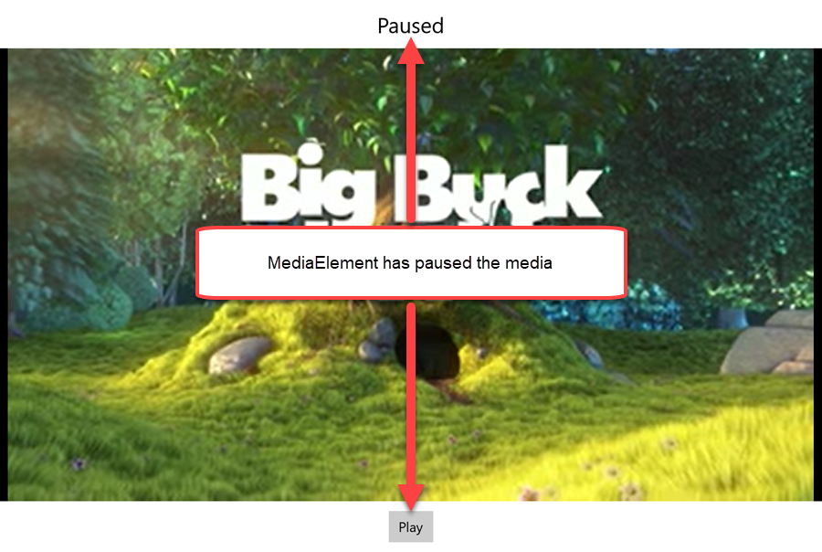
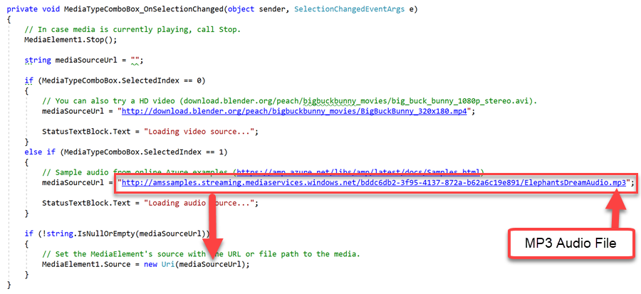
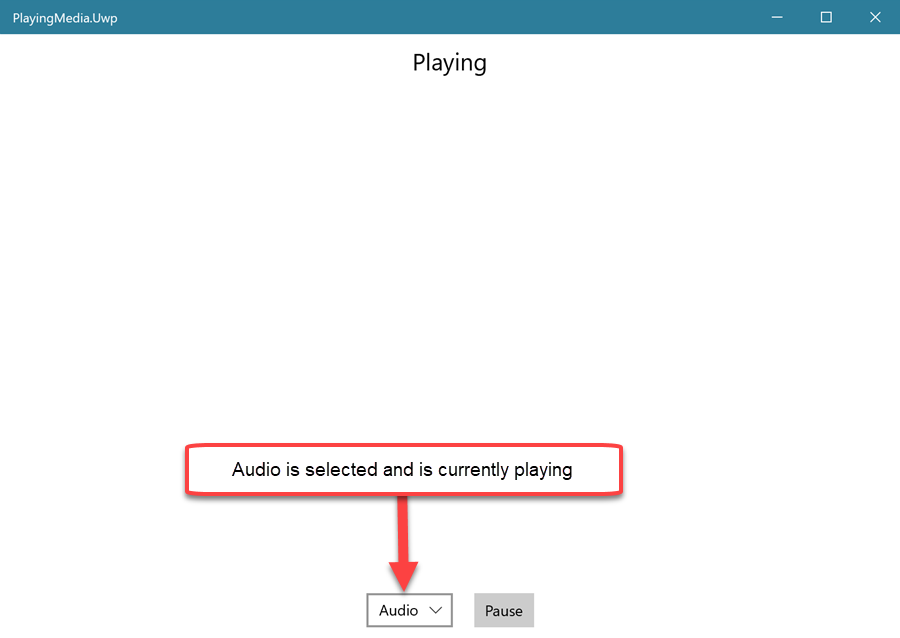
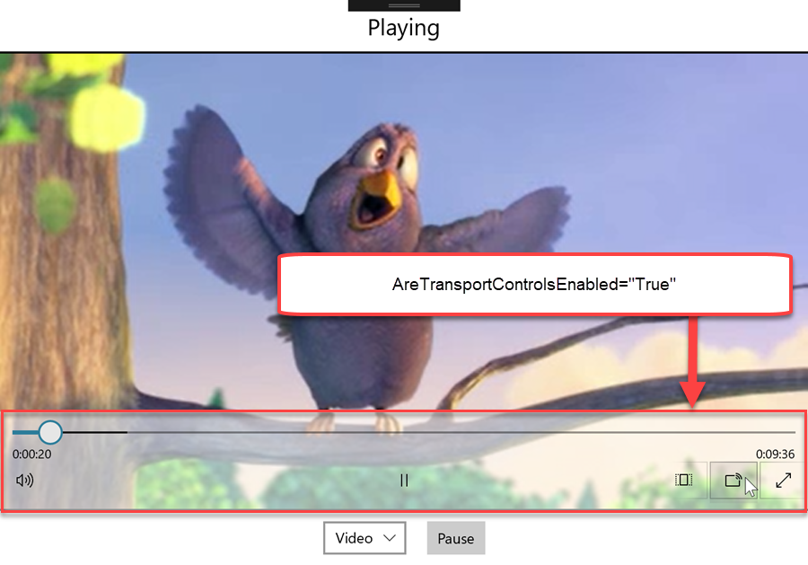
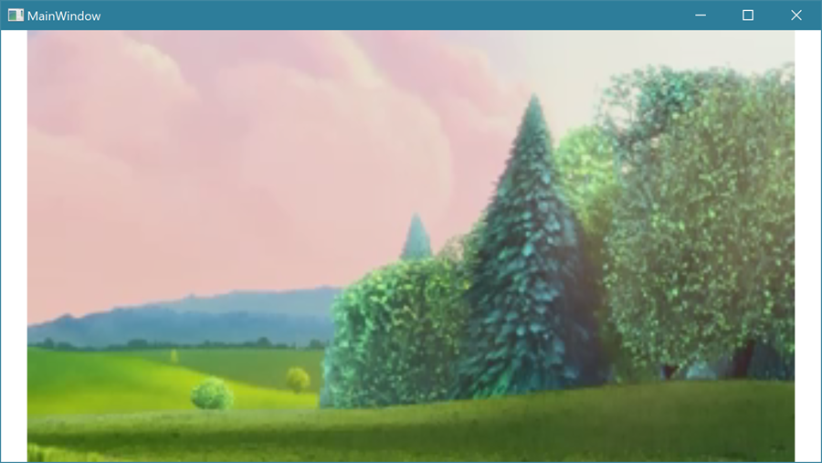
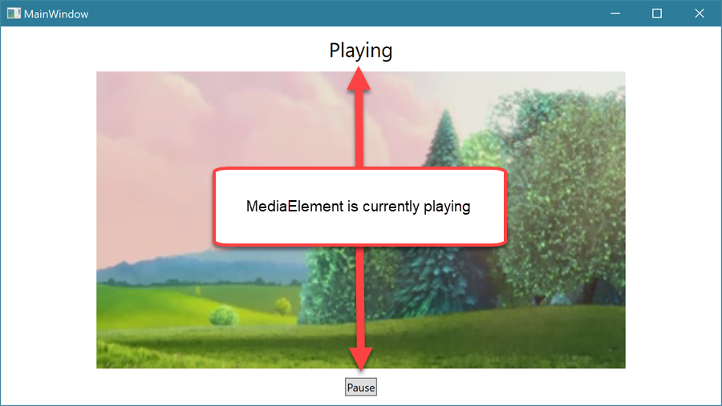
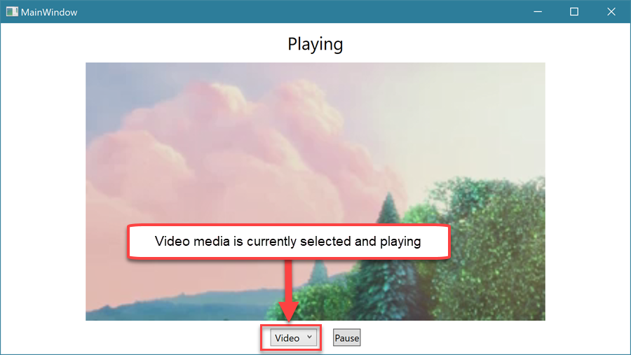
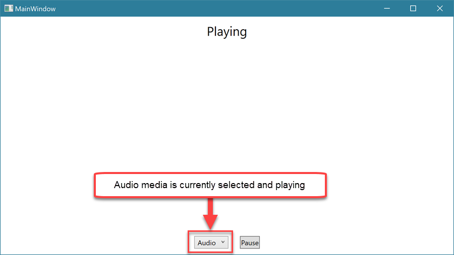

Media is a major feature of any modern platform or application. Windows apps make adding media support to an application easier, requiring as little as a couple lines of code.

In this unit, you will:

- Learn how to use the media control for audio and video.
- Learn how to play a local file or an internet-based file.
- Learn how to use media transport features like pause, play, and stop.

Let's get started!


### Playing media

::: zone pivot="uwp"


#### 1. Create a project

In Visual Studio, create a UWP C# project. Give the project a meaningful name that's based on this lesson, like **MediaPlayerApp.Uwp**.


#### 2. The powerful `MediaElement` control

Using media in your Windows desktop application is straightforward. You don't need to worry about media protocols or codecs. Instead, you can focus on the user experience of your application.

The `MediaElement` control can handle different media types, like video and audio, from a local file source or from an online source. Out of the box, it will handle the more complicated aspects of playback and streaming media, like buffering content for a smooth experience.

Let's create a simple media player that starts streaming a movie when the app opens.

Open **MainPage.xaml** and add a `MediaElement` control to the `Grid`:

*MainPage.xaml*
```xml
<Page x:Class="PlayingMedia.Uwp.MainPage"
      xmlns="http://schemas.microsoft.com/winfx/2006/xaml/presentation"
      xmlns:x="http://schemas.microsoft.com/winfx/2006/xaml"
      xmlns:local="using:PlayingMedia.Uwp"
      xmlns:d="http://schemas.microsoft.com/expression/blend/2008"
      xmlns:mc="http://schemas.openxmlformats.org/markup-compatibility/2006"
      mc:Ignorable="d"
      Background="{ThemeResource ApplicationPageBackgroundThemeBrush}">

    <Grid>
        <MediaElement x:Name="MediaElement1"  AutoPlay="True"/>
    </Grid>
</Page>
```

Open **MainPage.xaml.cs** and use the `Page` **Loaded** event to set the `MediaPlayer` **Source** property:

*MainPage.xaml.cs*
```csharp
using System;
using Windows.UI.Xaml;
using Windows.UI.Xaml.Controls;

namespace PlayingMedia.Uwp
{
    public sealed partial class MainPage : Page
    {
        public MainPage()
        {
            InitializeComponent();
            Loaded += MainPage_Loaded;
        }

        private void MainPage_Loaded(object sender, RoutedEventArgs e)
        {
            // Set the MediaElement's source with the URL or file path of the media.
            MediaElement1.Source = new Uri("http://download.blender.org/peach/bigbuckbunny_movies/BigBuckBunny_320x180.mp4");
        }
    }
}
```

Run the application.

When `MainPage` opens, the `MediaElement` will use the URL to the video file and start streaming the video!


The media's source can be a URL path, a file path, a [MediaStreamSource](https://docs.microsoft.com/uwp/api/windows.ui.xaml.controls.mediaelement.setmediastreamsource), or a [RandomAccessStream when you use SetSource](https://docs.microsoft.com/uwp/api/windows.ui.xaml.controls.mediaelement.setsource).

#### 3. Playback controls and status

Now we need a `Button` to pause and play the video. Just as important, we need a way to show the user what's happening in the `MediaElement`. The state is obvious when the video is playing, but what about when the app doesn't appear to be doing anything? Is it paused or buffering?

`MediaElement` has a **CurrentStateChanged** event that will occur whenever there's a change to the `MediaElement` **CurrentState** (for example, loading, buffering, playing, paused). Subscribing to this event will allow you to show the current `MediaElementState` to the user. It will also let you enable or disable certain buttons depending on the state.

Let's add a `Button` and a `TextBlock` to display the state of the `MediaElement`.

Open **MainPage.xaml**. Add a status `TextBlock`, add a play/pause `Button`, and subscribe to the **CurrentStateChanged** event:

*MainPage.xaml*
```xml
<Page x:Class="PlayingMedia.Uwp.MainPage"
      xmlns="http://schemas.microsoft.com/winfx/2006/xaml/presentation"
      xmlns:x="http://schemas.microsoft.com/winfx/2006/xaml"
      xmlns:local="using:PlayingMedia.Uwp"
      xmlns:d="http://schemas.microsoft.com/expression/blend/2008"
      xmlns:mc="http://schemas.openxmlformats.org/markup-compatibility/2006"
      mc:Ignorable="d"
      Background="{ThemeResource ApplicationPageBackgroundThemeBrush}">

    <Grid>
        <Grid.RowDefinitions>
            <RowDefinition Height="Auto" />
            <RowDefinition />
            <RowDefinition Height="Auto" />
        </Grid.RowDefinitions>

        <TextBlock x:Name="StatusTextBlock"
                   Text="Initializing..."
                   FontSize="22"
                   HorizontalAlignment="Center"
                   Margin="10" />

        <MediaElement x:Name="MediaElement1" 
                      CurrentStateChanged="MediaElement1_OnCurrentStateChanged"
                      Grid.Row="1"/>

        <StackPanel Orientation="Horizontal"
                    HorizontalAlignment="Center"
                    Grid.Row="2">
            <Button x:Name="PlayPauseButton"
                    Content="Play"
                    Visibility="Collapsed"
                    Click="PlayPauseButton_OnClick"
                    Margin="10" />
        </StackPanel>
    </Grid>
</Page>
```
Notice that the `Button` **Visibility** is set to **Collapsed** by default. It's set this way because we want the state of the `MediaElement` to determine the `Button` capability and content.

Open **MainPage.xaml.cs** to complete the **PlayPauseButton_OnClick** and **MediaElement1_OnCurrentStateChanged** event handlers:

*MainPage.xaml.cs*
```csharp
using System;
using Windows.UI.Xaml;
using Windows.UI.Xaml.Controls;
using Windows.UI.Xaml.Media;

namespace PlayingMedia.Uwp
{
    public sealed partial class MainPage : Page
    {
        public MainPage()
        {
            InitializeComponent();
            Loaded += MainPage_Loaded;
        }

        private void MainPage_Loaded(object sender, RoutedEventArgs e)
        {
            // Set the MediaElement's source with the URL or file path of the media.
            MediaElement1.Source = new Uri("http://download.blender.org/peach/bigbuckbunny_movies/BigBuckBunny_320x180.mp4");
        }

        // To keep this example simple, we'll just use pause and play. The
        // MediaElement supports a wide variety of media playback features.
        private void PlayPauseButton_OnClick(object sender, RoutedEventArgs e)
        {
            // If the MediaElement is playing, use the Pause() method.
            if (MediaElement1.CurrentState == MediaElementState.Playing)
            {
                MediaElement1.Pause();
            }

            // If the MediaElement is paused, use the Play() method.
            if (MediaElement1.CurrentState == MediaElementState.Paused)
            {
                MediaElement1.Play();
            }
        }

        private void MediaElement1_OnCurrentStateChanged(object sender, RoutedEventArgs e)
        {
            // Some actions can take time (for example, buffering), so let the user know what the MediaElement is doing.
            StatusTextBlock.Text = MediaElement1.CurrentState.ToString();

            // We can also use MediaPlayer's CurrentState to perform meaningful UI changes.
            // In this case, we hide the play/pause button when it's not needed.
            switch (MediaElement1.CurrentState)
            {
                case MediaElementState.Playing:
                    PlayPauseButton.Content = "Pause";
                    PlayPauseButton.Visibility = Visibility.Visible;
                    break;
                case MediaElementState.Paused:
                    PlayPauseButton.Content = "Play";
                    PlayPauseButton.Visibility = Visibility.Visible;
                    break;
                case MediaElementState.Closed:
                case MediaElementState.Opening:
                case MediaElementState.Buffering:
                case MediaElementState.Stopped:
                    PlayPauseButton.Visibility = Visibility.Collapsed;
                    break;
            }
        }
    }
}
```

The code comments explain this code in detail, but let's walk through the life cycle:

1. The `Page` loads and the `MediaElement` **Source** is set.
2. This causes the `MediaElement` to go from a stopped state to a playing state, which invokes the **CurrentStateChanged** event.
3. In the **MediaElement1_OnCurrentStateChanged** event handler, we use the **MediaElement1.CurrentState** value to:
   - Set the `TextBlock` **Text** value.
   - Set the `Button` **Visibility** and **Content**.
4. In the **PlayPauseButton_OnClick** event handler:
   - If `MediaElementState.Playing`, then run **MediaElement1.Pause()**.
   - If `MediaElementState.Paused`, then run **MediaElement1.Play()**.

This is why the **CurrentStateChanged** event is so useful. You can do all the UI changes in it and only invoke the `MediaElement` methods everywhere else.

**Deploy the app, and watch the `Button` and `TextBlock` update as you go through the functions**

When the `Page` first loads, you'll see the text "Opening" and the `Button` is hidden:


When the video starts playing, the text changes to "Playing." The `Button` is visible and contains the text "Pause":


Select the `Button` to pause the video. The text will change to "Paused" and the `Button` label will change to "Play":



To see the `MediaElementState.Buffering` state in action, try the high definition version of the video: *download.blender.org/peach/bigbuckbunny_movies/big_buck_bunny_1080p_stereo.avi*

Now that we've done video, let's try some audio.

#### 4. Audio

The approach here is just the same as with video, except we set the `MediaElement` **Source** to an audio source. `MediaElement` will automatically detect the media format and act accordingly.

To add audio support to the application, let's add a `ComboBox` so we can switch between video and audio.

Open **MainPage.xaml** and add the `ComboBox`:

*MainPage.xaml*
```xml
<Page x:Class="PlayingMedia.Uwp.MainPage"
      xmlns="http://schemas.microsoft.com/winfx/2006/xaml/presentation"
      xmlns:x="http://schemas.microsoft.com/winfx/2006/xaml"
      xmlns:local="using:PlayingMedia.Uwp"
      xmlns:d="http://schemas.microsoft.com/expression/blend/2008"
      xmlns:mc="http://schemas.openxmlformats.org/markup-compatibility/2006"
      mc:Ignorable="d"
      Background="{ThemeResource ApplicationPageBackgroundThemeBrush}">

    <Grid>
        <Grid.RowDefinitions>
            <RowDefinition Height="Auto" />
            <RowDefinition />
            <RowDefinition Height="Auto" />
        </Grid.RowDefinitions>

        <TextBlock x:Name="StatusTextBlock"
                   Text="Initializing..."
                   FontSize="22"
                   HorizontalAlignment="Center"
                   Margin="10" />

        <MediaElement x:Name="MediaElement1" 
                      CurrentStateChanged="MediaElement1_OnCurrentStateChanged"
                      Grid.Row="1"/>

        <StackPanel Orientation="Horizontal"
                    HorizontalAlignment="Center"
                    Grid.Row="2">
            <ComboBox x:Name="MediaTypeComboBox"
                      SelectedIndex="0"
                      SelectionChanged="MediaTypeComboBox_OnSelectionChanged"
                      Margin="10">
                <ComboBox.Items>
                    <ComboBoxItem Content="Video" />
                    <ComboBoxItem Content="Audio" />
                </ComboBox.Items>
            </ComboBox>

            <Button x:Name="PlayPauseButton"
                    Content="Play"
                    Visibility="Collapsed"
                    Click="PlayPauseButton_OnClick"
                    Margin="10" />
        </StackPanel>
    </Grid>
</Page>
```

The `ComboBox` has a **SelectionChanged** event. We can use that event instead of `Page` **Loaded** to set the `MediaElement` **Source**.

Open **MainPage.xaml.cs**. Remove the **Loaded** event logic and use the new selection approach instead:

*MainPage.xaml.cs*
```csharp
using System;
using Windows.UI.Xaml;
using Windows.UI.Xaml.Controls;
using Windows.UI.Xaml.Media;

namespace PlayingMedia.Uwp
{
    public sealed partial class MainPage : Page
    {
        public MainPage()
        {
            InitializeComponent();
        }

        // To keep this example simple, we'll just use pause and play. The
        // MediaElement supports a wide variety of media playback features.
        private void PlayPauseButton_OnClick(object sender, RoutedEventArgs e)
        {
            // If the MediaElement is playing, use the Pause() method.
            if (MediaElement1.CurrentState == MediaElementState.Playing)
            {
                MediaElement1.Pause();
            }

            // If the MediaElement is paused, use the Play() method.
            if (MediaElement1.CurrentState == MediaElementState.Paused)
            {
                MediaElement1.Play();
            }
        }

        private void MediaElement1_OnCurrentStateChanged(object sender, RoutedEventArgs e)
        {
            // Some actions can take time (for example, buffering), so let the user know what the MediaElement is doing.
            StatusTextBlock.Text = MediaElement1.CurrentState.ToString();

            // We can also use the MediaPlayer's CurrentState to perform meaningful UI changes.
            // In this case, we hide the play/pause button when it's not needed.
            switch (MediaElement1.CurrentState)
            {
                case MediaElementState.Playing:
                    PlayPauseButton.Content = "Pause";
                    PlayPauseButton.Visibility = Visibility.Visible;
                    break;
                case MediaElementState.Paused:
                    PlayPauseButton.Content = "Play";
                    PlayPauseButton.Visibility = Visibility.Visible;
                    break;
                case MediaElementState.Closed:
                case MediaElementState.Opening:
                case MediaElementState.Buffering:
                case MediaElementState.Stopped:
                    PlayPauseButton.Visibility = Visibility.Collapsed;
                    break;
            }
        }

        private void MediaTypeComboBox_OnSelectionChanged(object sender, SelectionChangedEventArgs e)
        {
            // In case media is playing, call Stop.
            MediaElement1.Stop();

            string mediaSourceUrl = "";

            if (MediaTypeComboBox.SelectedIndex == 0)
            {
                // You can also try an HD video (download.blender.org/peach/bigbuckbunny_movies/big_buck_bunny_1080p_stereo.avi).
                mediaSourceUrl = "http://download.blender.org/peach/bigbuckbunny_movies/BigBuckBunny_320x180.mp4";

                StatusTextBlock.Text = "Loading video source...";
            }
            else if (MediaTypeComboBox.SelectedIndex == 1)
            {
                // Sample audio from online Azure examples (https://amp.azure.net/libs/amp/latest/docs/Samples.html).
                mediaSourceUrl = "http://amssamples.streaming.mediaservices.windows.net/bddc6db2-3f95-4137-872a-b62a6c19e891/ElephantsDreamAudio.mp3";

                StatusTextBlock.Text = "Loading audio source...";
            }

            if (!string.IsNullOrEmpty(mediaSourceUrl))
            {
                // Set the MediaElement's source with the URL or file path of the media.
                MediaElement1.Source = new Uri(mediaSourceUrl);
            }
        }
    }
}
```

The logic in the **MediaTypeComboBox_OnSelectionChanged** event handler changes the `MediaElement` **Source** property:

* If the first item, **Video**, was selected, use the online AVI video file, the Big Buck Bunny video.
* If the second item, **Audio**, was selected, use an online MP3 file, an Azure sample audio book named "Elephants Dream."

Here's a screenshot of where the audio media source.



**Deploy the app and try the different media type selections**

By default, the `ComboBox` selection will be the first item, **Video**. You'll see the video load and play when the app starts, like it did in the last test.


If you select **Audio** in the `ComboBox`, the `MediaElement` **Source** will change to the MP3 source. The audio book will start playing.



#### 5. UWP bonus: Built-in transport controls

In this lesson, we started with a simple button to provide play and pause functionality. This is to demonstrate how to interact with the methods of `MediaElement`. In a real-world application, you'd want to give the user a lot more functionality and would need to add buttons for each of the options.

You could implement all of these options manually, but there's a better way. Set **AreTransportControlsEnabled** to *true*:

```xml
<MediaElement AreTransportControlsEnabled="True" />
```
This gives you a powerful set of automatically hiding transport controls, out of the box:

- Full play, pause, and seek (via scrubbing).
- Full screen.
- Cast to another screen (like a smart TV or a game console).
- Audio controls (volume and mute).
- Timeline (current time position and total length).



`MediaElement` is a powerful tool for getting great user experiences with little effort, as simple as pointing it to a media file location. It can also be configured for more advanced functionality. See the [MediaElement documentation](https://docs.microsoft.com/uwp/api/Windows.UI.Xaml.Controls.MediaElement) to learn more.


::: zone-end

::: zone pivot="wpf"


#### 1. Create a project

In Visual Studio, create a WPF C# project. Give the project a meaningful name that's based on this lesson, like **MediaPlayerApp.Wpf**.


#### 2. The powerful `MediaElement` control

Using media in your Windows desktop application is straightforward. You don't need to worry about media protocols or codecs. Instead, you can focus on the user experience of your application.

The `MediaElement` control can handle different media types, like video and audio, from a local file source or from an online source. Out of the box, it will handle the more complicated aspects of playback and streaming media, like buffering content for a smooth experience.

Let's create a simple media player that starts streaming a movie when the app opens.

Open **MainWindow.xaml** and add a `MediaElement` control to the `Grid`:

*MainWindow.xaml*
```xml
<Window x:Class="PlayingMedia.Wpf.MainWindow"
        xmlns="http://schemas.microsoft.com/winfx/2006/xaml/presentation"
        xmlns:x="http://schemas.microsoft.com/winfx/2006/xaml"
        xmlns:d="http://schemas.microsoft.com/expression/blend/2008"
        xmlns:mc="http://schemas.openxmlformats.org/markup-compatibility/2006"
        xmlns:local="clr-namespace:PlayingMedia.Wpf"
        mc:Ignorable="d"
        Title="MainWindow"
        Height="450"
        Width="800">
    <Grid>
        <MediaElement Source="http://download.blender.org/peach/bigbuckbunny_movies/BigBuckBunny_320x180.mp4" />
    </Grid>
</Window>
```

Open **MainWindow.xaml.cs** and use the `Window` **Loaded** event to set the `MediaPlayer` **Source** property:

*MainWindow.xaml.cs*
```csharp
using System;
using System.Windows;
using System.Windows.Controls;

namespace PlayingMedia.Wpf
{
    public partial class MainWindow : Window
    {
        public MainWindow()
        {
            InitializeComponent();
            Loaded += MainWindow_Loaded;
        }

        private void MainWindow_Loaded(object sender, RoutedEventArgs e)
        {
            // Set the MediaElement's source with the URL or file path of the media.
            MediaElement1.Source = new Uri("http://download.blender.org/peach/bigbuckbunny_movies/BigBuckBunny_320x180.mp4", UriKind.RelativeOrAbsolute);
        }
    }
}
```

Run the application.

When `MainWindow` opens, the `MediaElement` will use the URL to the video file and start streaming the video!



#### 3. Playback controls and status

Now we need a `Button` to pause and play the video. Just as important, we need a way to show the user what's happening in the `MediaElement`.  The state is obvious when the video is playing, but what about when it doesn't appear to be doing anything? Is it paused or buffering?

We can use a `TextBlock` to show the status of playback. We can keep the status up-to-date by using a few of the `MediaElement` events:

- **MediaOpened**
- **MediaEnded**
- **MediaFailed**
- **BufferingStarted**
- **BufferingEnded**

Subscribing to these events will allow you to show the playback state to the user. You can also use them to enable or disable a `Button`.

Open **MainWindow.xaml** and add a status `TextBlock` and a play/pause `Button`. Subscribe to the `MediaElement` events listed previously to display the state of the `MediaElement`.

*MainWindow.xaml*
```xml
<Window x:Class="PlayingMedia.Wpf.MainWindow"
        xmlns="http://schemas.microsoft.com/winfx/2006/xaml/presentation"
        xmlns:x="http://schemas.microsoft.com/winfx/2006/xaml"
        xmlns:d="http://schemas.microsoft.com/expression/blend/2008"
        xmlns:mc="http://schemas.openxmlformats.org/markup-compatibility/2006"
        xmlns:local="clr-namespace:PlayingMedia.Wpf"
        mc:Ignorable="d"
        Title="MainWindow"
        Height="450"
        Width="800">
    <Grid>
        <Grid.RowDefinitions>
            <RowDefinition Height="Auto" />
            <RowDefinition />
            <RowDefinition Height="Auto" />
        </Grid.RowDefinitions>

        <TextBlock x:Name="StatusTextBlock"
                   Text="Initializing..."
                   FontSize="22"
                   HorizontalAlignment="Center"
                   Margin="10" />

        <MediaElement x:Name="MediaElement1"
                      LoadedBehavior="Manual"
                      MediaOpened="MediaElement1_OnMediaOpened"
                      MediaEnded="MediaElement1_OnMediaEnded"
                      MediaFailed="MediaElement1_OnMediaFailed"
                      BufferingStarted="MediaElement1_OnBufferingStarted"
                      BufferingEnded="MediaElement1_OnBufferingEnded"
                      Grid.Row="1" />

        <StackPanel Orientation="Horizontal"
                    HorizontalAlignment="Center"
                    Grid.Row="2">
            <Button x:Name="PlayPauseButton"
                    Content="Play"
                    Visibility="Collapsed"
                    Click="PlayPauseButton_OnClick"
                    Margin="10" />
        </StackPanel>
    </Grid>
</Window>
```
It's important to set `LoadedBehavior="Manual"` so you can use the **Play** and **Pause** methods in code. Also, notice that the `Button` **Visibility** is set to **Collapsed** by default. We don't want it to be used until the video is ready.

Open **MainWindow.xaml.cs** to complete the event handlers. We'll also need to add an `IsPlaying` property so we can keep track of whether the `MediaElement` is playing.

*MainWindow.xaml.cs*
```csharp
using System;
using System.Windows;
using System.Windows.Controls;

namespace PlayingMedia.Wpf
{
    public partial class MainWindow : Window
    {
        private bool IsPlaying { get; set; }

        public MainWindow()
        {
            InitializeComponent();
            Loaded += MainWindow_Loaded;
        }

        private void MainWindow_Loaded(object sender, RoutedEventArgs e)
        {
            // Set the MediaElement's source with the URL or file path of the media.
            MediaElement1.Source = new Uri("http://download.blender.org/peach/bigbuckbunny_movies/BigBuckBunny_320x180.mp4", UriKind.RelativeOrAbsolute);

            // Start playing.
            PlayPauseButton_OnClick(null, null);
        }

        // To keep this example simple, we'll just use pause and play. The
        // MediaElement has support for a wide variety of media playback features.
        private void PlayPauseButton_OnClick(object sender, RoutedEventArgs e)
        {
            if (IsPlaying)
            {
                // If the MediaElement is playing, use the Pause() method.
                MediaElement1.Pause();

                // Update the UI elements.
                PlayPauseButton.Content = "Play";
                StatusTextBlock.Text = "Paused";
                IsPlaying = false;
            }
            else if (!IsPlaying)
            {
                // If the MediaElement is paused, use the Play() method.
                MediaElement1.Play();

                PlayPauseButton.Content = "Pause";
                StatusTextBlock.Text = "Playing";
                IsPlaying = true;
            }
        }

        private void MediaElement1_OnMediaOpened(object sender, RoutedEventArgs e)
        {
            // When media is opened, start playing it.
            MediaElement1.Play();
            IsPlaying = true;

            // Update the UI.
            StatusTextBlock.Text = "Playing";
            PlayPauseButton.Visibility = Visibility.Visible;
            PlayPauseButton.Content = "Pause";
        }

        private void MediaElement1_OnMediaEnded(object sender, RoutedEventArgs e)
        {
            // When the media ends.
            MediaElement1.Stop();
            IsPlaying = false;

            // Update the UI.
            StatusTextBlock.Text = "End of media.";
            PlayPauseButton.Visibility = Visibility.Collapsed;
        }

        private void MediaElement1_OnMediaFailed(object sender, ExceptionRoutedEventArgs e)
        {
            StatusTextBlock.Text = "Could not load media!";
        }

        private void MediaElement1_OnBufferingStarted(object sender, RoutedEventArgs e)
        {
            // When media is buffering, hide the button and update the status text.
            StatusTextBlock.Text = "Buffering...";
            PlayPauseButton.Visibility = Visibility.Collapsed;
        }

        private void MediaElement1_OnBufferingEnded(object sender, RoutedEventArgs e)
        {
            // When buffering stops, show the button and update the status text.
            StatusTextBlock.Text = "Playing";
            PlayPauseButton.Visibility = Visibility.Visible;
        }
    }
}
```

The code comments explain this code in detail, but let's walk through the life cycle:

1. The `Window` loads and the `MediaElement` **Source** is set.
2. This causes the `MediaElement` to start loading the video. The other events will fire, updating the `TextBlock`, the `Button`, and the **IsPlaying** properties according to each event's purpose.
3. In the **PlayPauseButton_OnClick** event handler:
   - If `IsPlaying` is *true*, run **MediaElement1.Pause()**.
   - If `IsPlaying` is *false*, run **MediaElement1.Play()**.

**Deploy the app, and watch the `Button` and `TextBlock` update as you go through the functions**

When the `Window` first opens, the video starts playing and the text changes to "Playing." The `Button` is visible and contains the text "Pause":



Select the `Button` to pause the video. The text will change to "Paused" and the `Button` label will change to "Play":


To see the buffering events in action, try the high definition version of the video: *download.blender.org/peach/bigbuckbunny_movies/big_buck_bunny_1080p_stereo.avi*

Now that we've done video, let's try some audio.

#### 4. Audio

The approach here is just the same as with video, except we set the `MediaElement` **Source** to an audio source. `MediaElement` will automatically detect the media format and act accordingly.

To add audio support to the application, let's add a `ComboBox` so we can switch between video and audio.

Open **MainWindow.xaml** and add the `ComboBox`:

*MainWindow.xaml*
```xml
<Window x:Class="PlayingMedia.Wpf.MainWindow"
        xmlns="http://schemas.microsoft.com/winfx/2006/xaml/presentation"
        xmlns:x="http://schemas.microsoft.com/winfx/2006/xaml"
        xmlns:d="http://schemas.microsoft.com/expression/blend/2008"
        xmlns:mc="http://schemas.openxmlformats.org/markup-compatibility/2006"
        xmlns:local="clr-namespace:PlayingMedia.Wpf"
        mc:Ignorable="d"
        Title="MainWindow"
        Height="450"
        Width="800">
    <Grid>
        <Grid.RowDefinitions>
            <RowDefinition Height="Auto" />
            <RowDefinition />
            <RowDefinition Height="Auto" />
        </Grid.RowDefinitions>

        <TextBlock x:Name="StatusTextBlock"
                   Text="Initializing..."
                   FontSize="22"
                   HorizontalAlignment="Center"
                   Margin="10" />

        <MediaElement x:Name="MediaElement1"
                      LoadedBehavior="Manual"
                      MediaOpened="MediaElement1_OnMediaOpened"
                      MediaEnded="MediaElement1_OnMediaEnded"
                      MediaFailed="MediaElement1_OnMediaFailed"
                      BufferingStarted="MediaElement1_OnBufferingStarted"
                      BufferingEnded="MediaElement1_OnBufferingEnded"
                      Grid.Row="1" />

        <StackPanel Orientation="Horizontal"
                    HorizontalAlignment="Center"
                    Grid.Row="2">
            <ComboBox x:Name="MediaTypeComboBox"
                      SelectedIndex="0"
                      SelectionChanged="MediaTypeComboBox_OnSelectionChanged"
                      Margin="10">
                <ComboBox.Items>
                    <ComboBoxItem Content="Video" />
                    <ComboBoxItem Content="Audio" />
                </ComboBox.Items>
            </ComboBox>

            <Button x:Name="PlayPauseButton"
                    Content="Play"
                    Visibility="Collapsed"
                    Click="PlayPauseButton_OnClick"
                    Margin="10" />
        </StackPanel>
    </Grid>
</Window>
```
The `ComboBox` has a **SelectionChanged** event. We can use that event instead of the **Loaded** event to set the `MediaElement` **Source**.

Open **MainWindow.xaml.cs**. Remove the **Loaded** event logic and use the new selection approach instead:

*MainWindow.xaml.cs*
```csharp
using System;
using System.Windows;
using System.Windows.Controls;

namespace PlayingMedia.Wpf
{
    public partial class MainWindow : Window
    {
        private bool IsPlaying { get; set; }

        public MainWindow()
        {
            InitializeComponent();
        }

        // To keep this example simple, we'll just use pause and play. The
        // MediaElement supports a wide variety of media playback features.
        private void PlayPauseButton_OnClick(object sender, RoutedEventArgs e)
        {
            if (IsPlaying)
            {
                // If the MediaElement is playing, use the Pause() method.
                MediaElement1.Pause();

                // Update the UI elements.
                PlayPauseButton.Content = "Play";
                StatusTextBlock.Text = "Paused";
                IsPlaying = false;
            }
            else if (!IsPlaying)
            {
                // If the MediaElement is paused, use the Play() method.
                MediaElement1.Play();

                PlayPauseButton.Content = "Pause";
                StatusTextBlock.Text = "Playing";
                IsPlaying = true;
            }
        }

        private void MediaTypeComboBox_OnSelectionChanged(object sender, SelectionChangedEventArgs e)
        {
            // Stop the current media before changing the source.
            MediaElement1.Stop();

            var mediaSourceUrl = string.Empty;

            if (MediaTypeComboBox.SelectedIndex == 0)
            {
                // You can also try an HD video (download.blender.org/peach/bigbuckbunny_movies/big_buck_bunny_1080p_stereo.avi).
                mediaSourceUrl = "http://download.blender.org/peach/bigbuckbunny_movies/BigBuckBunny_320x180.mp4";

                StatusTextBlock.Text = "Loading video source...";
            }
            else if (MediaTypeComboBox.SelectedIndex == 1)
            {
                // Sample audio from online Azure examples (https://amp.azure.net/libs/amp/latest/docs/Samples.html).
                mediaSourceUrl = "http://amssamples.streaming.mediaservices.windows.net/bddc6db2-3f95-4137-872a-b62a6c19e891/ElephantsDreamAudio.mp3";

                StatusTextBlock.Text = "Loading audio source...";
            }

            if (!string.IsNullOrEmpty(mediaSourceUrl))
            {
                // Set the MediaElement's source with the URL or file path of the media.
                MediaElement1.Source = new Uri(mediaSourceUrl, UriKind.RelativeOrAbsolute);
            }
        }

        private void MediaElement1_OnMediaOpened(object sender, RoutedEventArgs e)
        {
            // When the media is opened, start playing it.
            MediaElement1.Play();
            IsPlaying = true;

            // Update the UI.
            StatusTextBlock.Text = "Playing";
            PlayPauseButton.Visibility = Visibility.Visible;
            PlayPauseButton.Content = "Pause";
        }

        private void MediaElement1_OnMediaEnded(object sender, RoutedEventArgs e)
        {
            // When the media ends.
            MediaElement1.Stop();
            IsPlaying = false;

            // Update the UI.
            StatusTextBlock.Text = "End of media.";
            PlayPauseButton.Visibility = Visibility.Collapsed;
        }

        private void MediaElement1_OnMediaFailed(object sender, ExceptionRoutedEventArgs e)
        {
            StatusTextBlock.Text = "Could not load media!";
        }

        private void MediaElement1_OnBufferingStarted(object sender, RoutedEventArgs e)
        {
            // When media is buffering, hide the button and update the status text.
            StatusTextBlock.Text = "Buffering...";
            PlayPauseButton.Visibility = Visibility.Collapsed;
        }

        private void MediaElement1_OnBufferingEnded(object sender, RoutedEventArgs e)
        {
            // When buffering stops, show the button and update the status text.
            StatusTextBlock.Text = "Playing";
            PlayPauseButton.Visibility = Visibility.Visible;
        }
    }
}
```

The logic in the **MediaTypeComboBox_OnSelectionChanged** event handler changes the `MediaElement` **Source** property:

* If the first item, **Video**, was selected, use the online AVI video file, the Big Buck Bunny video. 
* If the second item, **Audio**, was selected, use an online MP3 file, an Azure sample audio book named "Elephants Dream."

Here's a screenshot of where the audio media source.


**Deploy the application and try the different media type selections**

By default, the `ComboBox` selection will be the first item, **Video**. You'll see the video load and play when the app starts, like it did in the last test.



If you select **Audio** in the `ComboBox`, the `MediaElement` **Source** will change to the MP3 source. The audio book will start playing.




`MediaElement` is a powerful tool for getting great user experiences with little effort, as simple as pointing it to a media file location. It can also be configured for more advanced functionality. See the [MediaElement documentation](https://docs.microsoft.com/dotnet/api/system.windows.controls.mediaelement?view=netframework-4.7.2) to learn more.

::: zone-end

### Summary

In this unit, you learned how to play media in a desktop application. You can either move on to the next unit or try the same thing by using the UI technology that you haven't tried. You'll find that UWP and WPF share a lot of features, including the same markup and coding languages, so you can reuse most of what you've learned and see which technology you prefer.
